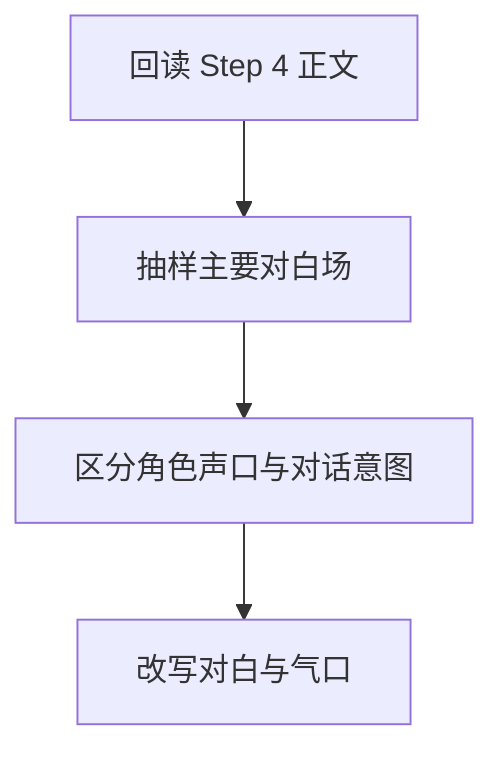

# 3-Drafting / 5-对白个性化和声口优化

## Context Loading Contract

- 每次调用本技能时，必须同时加载同目录 `CONTEXT.md`。
- 必须回读父层 `3-Drafting/SKILL.md` 与 `../_shared/drafting-child-output-contract.md`。
- 正式处理前，必须读取 Step 4 已写回后的当前 `第N集.md`。

## Parent Positioning

本 child 负责：

- 区分角色对白声口
- 强化潜台词、试探、回避、施压等对话意图
- 处理断句、气口和自然感

它不负责：

- 大范围重写剧情结构
- 纯环境描写强化
- 最终整篇文笔终修

## Canonical Sources

- `../SKILL.md`
- `../CONTEXT.md`
- `../_shared/drafting-child-output-contract.md`
- `../../_shared/context-loading-contract.md`
- `../../1-Cards/角色卡/`

## Business Requirement Analysis Contract

| analysis_slot | 当前结论 |
| --- | --- |
| `business_goal` | 让不同角色一开口就有差异，让对白既自然又带动作与潜台词。 |
| `business_object` | Step 4 后正文、角色卡、关系变化上下文。 |
| `constraint_profile` | 对白必须服务人物与关系，而不是变成说明渠道；声口差异必须建立在角色设定上。 |
| `success_criteria` | 对手戏读起来能分辨谁是谁、谁在试探谁、谁在回避什么。 |
| `topology_fit` | `root reread -> dialogue sampling -> voice split -> subtext rewrite` |

## Total Input Contract

- 必需输入：
  - 当前 `第N集.md`
  - `1-Cards/2-角色卡/**/*.json`
  - `写作日志.yaml`
- 硬规则：
  - 对白不能替代动作与场景独自承担全部信息。
  - 声口优化必须避免所有角色都说“作者的普通话”。

## Output Contract

- `manuscript_patch`
  - 对白与声口优化后的正文
- `process_log_entry`
  - `step_id: 5`
  - `focus_dimension: dialogue_and_voice`
- owned manuscript dimension：
  - 对白个性化
  - 断句与气口
  - 潜台词与意图层

## Immediate Validation Hook Contract

- 本 step 写回后，父层必须按 `../../4-Validation/_shared/validation-dimension-registry.yaml` 触发当前 step 登记的 inline validators。
- 若 hook 失败，不得直接进入 Step 6；必须在当前 step 本地重写，或回退到 registry 指向的更早受影响 step。

## Visual Map

## Thinking-Action Network

| node_id | field_id | objective | actions | evidence | route_out | gate |
| --- | --- | --- | --- | --- | --- | --- |
| `N1-ROOT-REREAD` | `FIELD-DR5-01` | 回读当前正文 | 读取 Step 4 结果与角色卡 | `input_note` | -> `N2` | 正文最新 |
| `N2-DIALOGUE-SAMPLE` | `FIELD-DR5-02` | 抽出关键对白场 | 标记对手戏、试探场、冲突场 | `sample_note` | -> `N3` | 场次明确 |
| `N3-VOICE-SPLIT` | `FIELD-DR5-03` | 区分角色声口与潜台词 | 为主要角色建立语言差异 | `voice_note` | -> `N4` | 角色可分 |
| `N4-DIALOGUE-REWRITE` | `FIELD-DR5-04` | 改写对白 | 优化句长、停顿、潜台词与自然感 | `rewrite_note` | done | 对白自然 |

## Lite Field Contract

| field_id | output_slot | pass_standard | fail_code | rework_entry |
| --- | --- | --- | --- | --- |
| `FIELD-DR5-01` | 当前正文 | 已回读角色强化版正文 | `FAIL-DR5-01` | `N1` |
| `FIELD-DR5-02` | 对白焦点场 | 关键对白场已抽出 | `FAIL-DR5-02` | `N2` |
| `FIELD-DR5-03` | 声口差异表 | 角色语言差异明确 | `FAIL-DR5-03` | `N3` |
| `FIELD-DR5-04` | 对白优化版正文 | 对白自然且有意图层 | `FAIL-DR5-04` | `N4` |

## Completion Contract

- 当前正文中的关键对白已经具备角色差异与潜台词。
- `process_log_entry` 已说明本步重点处理了哪些对手戏或对白场。
