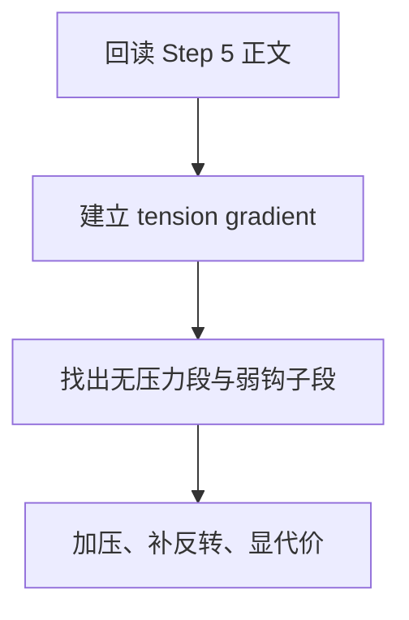

# 3-Drafting / 6-叙事张力强化

## Context Loading Contract

- 每次调用本技能时，必须同时加载同目录 `CONTEXT.md`。
- 必须回读父层 `3-Drafting/SKILL.md` 与 `_shared/drafting-child-output-contract.md`。
- 正式处理前，必须读取 Step 5 已写回后的当前 `第N集.md`。

## Parent Positioning

本 child 负责：

- 强化悬念、压力、风险、反转和代价显影
- 提升“还想继续看”的牵引力
- 让章节摆脱记账式平推

它不负责：

- 重新制定题材和剧情主干
- 取代润色工序做最后文风统一

## Canonical Sources

- `../SKILL.md`
- `../CONTEXT.md`
- `../_shared/drafting-child-output-contract.md`
- `../../references/reading-power-taxonomy.md`
- `../../references/shared/core-constraints.md`

## Business Requirement Analysis Contract

| analysis_slot | 当前结论 |
| --- | --- |
| `business_goal` | 让本集不只“说完了事情”，而是持续制造阅读压力与追读欲。 |
| `business_object` | Step 5 后正文、reader signal、chapter board 的冲突/任务/伏笔债务。 |
| `constraint_profile` | 张力必须源于既有规划与角色选择，不能靠硬塞事故。 |
| `success_criteria` | 本集至少存在清晰压力梯度、风险感和章末牵引。 |
| `topology_fit` | `root reread -> tension gradient map -> weak spot diagnosis -> pressure rewrite` |

## Total Input Contract

- 必需输入：
  - 当前 `第N集.md`
  - `Planning/全息地图.json`
  - `写作日志.yaml`
- 硬规则：
  - 张力强化不能违背已建立的因果。
  - 不能只靠提高措辞强度冒充张力。

## Output Contract

- `manuscript_patch`
  - 张力强化后的正文
- `process_log_entry`
  - `step_id: 6`
  - `focus_dimension: narrative_tension`
- owned manuscript dimension：
  - 压力梯度
  - 悬念与反转
  - 代价与钩子

## Visual Map

## Thinking-Action Network

| node_id | field_id | objective | actions | evidence | route_out | gate |
| --- | --- | --- | --- | --- | --- | --- |
| `N1-ROOT-REREAD` | `FIELD-DR6-01` | 回读当前正文 | 读取 Step 5 结果与 thread 债务 | `input_note` | -> `N2` | 正文最新 |
| `N2-GRADIENT-MAP` | `FIELD-DR6-02` | 建立张力梯度图 | 标记风险、阻力、局面变化 | `gradient_note` | -> `N3` | 梯度清楚 |
| `N3-WEAK-SPOT` | `FIELD-DR6-03` | 定位张力弱点 | 找出平段、弱钩子、代价不显段 | `diagnosis_note` | -> `N4` | 弱点具体 |
| `N4-PRESSURE-REWRITE` | `FIELD-DR6-04` | 重写压力与牵引 | 补风险、悬念、反转或代价 | `rewrite_note` | done | 牵引增强 |

## Lite Field Contract

| field_id | output_slot | pass_standard | fail_code | rework_entry |
| --- | --- | --- | --- | --- |
| `FIELD-DR6-01` | 当前正文 | 已回读对白版正文 | `FAIL-DR6-01` | `N1` |
| `FIELD-DR6-02` | 张力梯度图 | 压力节点与变化节点明确 | `FAIL-DR6-02` | `N2` |
| `FIELD-DR6-03` | 弱点诊断表 | 已找出弱钩子/平段/无代价段 | `FAIL-DR6-03` | `N3` |
| `FIELD-DR6-04` | 张力强化版正文 | 追读牵引明显增强 | `FAIL-DR6-04` | `N4` |

## Completion Contract

- 当前正文已形成更清晰的压力梯度与章末牵引。
- `process_log_entry` 已记录本次强化了哪些张力节点。
