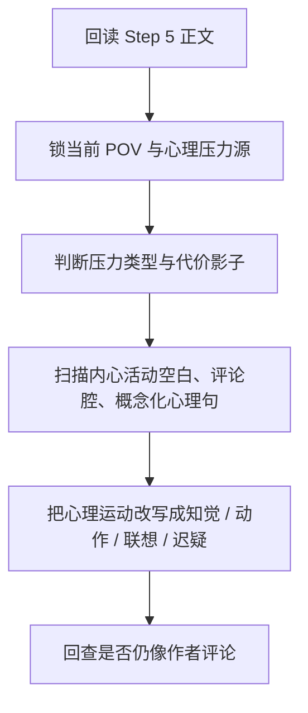
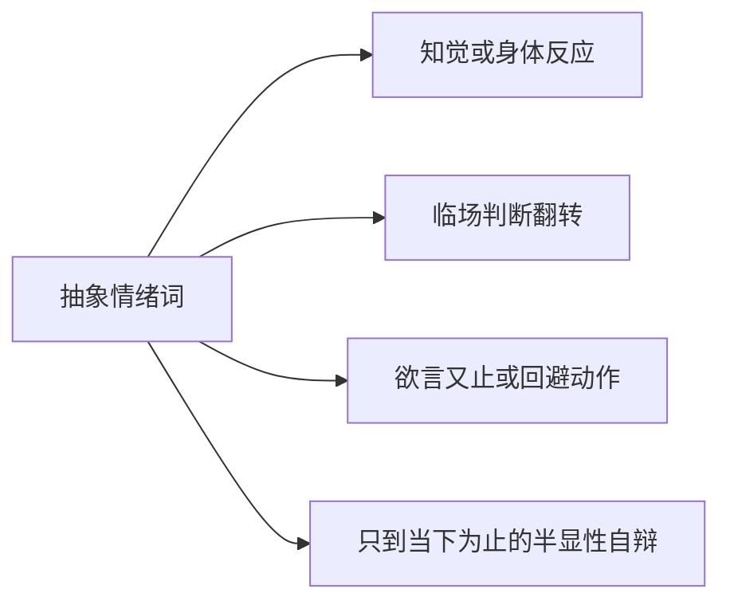
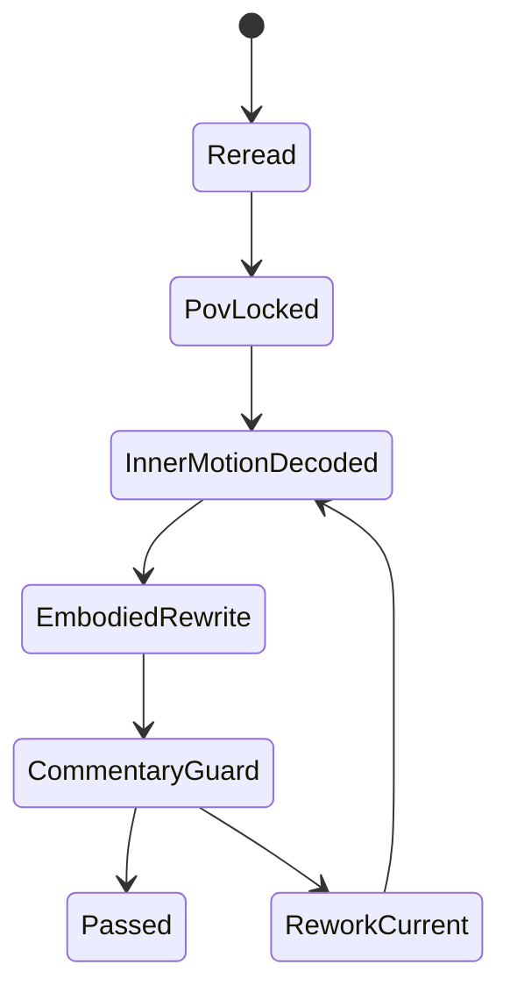

# 3-Drafting / 6-心理活动描写

## Context Loading Contract

- 每次调用本技能时，必须同时加载同目录 `CONTEXT.md`。
- 必须回读父层 `3-Drafting/SKILL.md`、`../_shared/drafting-child-output-contract.md`、`../_shared/drafting-instant-validation-contract.md`。
- 正式处理前，必须读取 Step 5 已写回后的当前 `第N集.md`。
- 必须按需读取本地执行细则 `references/inner-life-execution-playbook.md`。

## Parent Positioning

本 child 负责：

- 把人物心理活动写成戏内可感的知觉、身体反应、联想、迟疑和半显性自辩
- 强化 POV 锚定，让内心段落像“这个人物正在经历”，而不是作者站在外面评论
- 处理情绪涌动、判断翻转、羞耻/欲望/恐惧等微运动的落地方式
- 在涉及亲密、禁忌、熟年关系、医疗观察等场面时，把内心层补成“触发点 -> 身体信号 -> 自我约束/自辩 -> 关系代价影子”的完整链路
- 对主角已启用的成长系统，优先把心路与情感层的变化提纯成 `growth_axis_evidence`

它不负责：

- 改写对白声口的基本分工
- 越权制造新设定、新事故或新主线
- 取代 Step 7 的章内追读结构设计
- 取代 Step 8 的整篇终修去味

## Canonical Sources

- `../SKILL.md`
- `../CONTEXT.md`
- `../_shared/drafting-child-output-contract.md`
- `../_shared/drafting-instant-validation-contract.md`
- `../../_shared/core-constraints.md`
- `./references/inner-life-execution-playbook.md`

## Business Requirement Analysis Contract

| analysis_slot | 当前结论 |
| --- | --- |
| `business_goal` | 让内心活动读起来像人物当场正在承受的心理运动，而不是事后总结、主题点评或 AI 味解释。 |
| `business_object` | Step 5 后正文、当前 POV 焦点、角色卡与关系压力上下文，以及当前项目的 `type-pack drafting projection`（若存在）。 |
| `constraint_profile` | 内心描写必须服从场面、人物和视角边界；不能上帝视角串评，不能把尚未发生的理解提前判完，不能把解释性心理旁白写成概念摘要；若场面核心压力来自羞耻、欲望、恐惧、禁忌或职业伦理，必须写出至少一层身体或行动影子。 |
| `success_criteria` | 读者能感到人物“此刻怎么被这件事压到、拉住、诱发或刺痛”，并能分清这是人物自己在经历，而不是作者替人物说明；复杂心理不再只剩抽象词，而有触发点、身体信号与未说出口的判断。 |
| `topology_fit` | `root reread -> POV lock -> pressure typing -> inner-motion scan -> embodiment rewrite -> commentary guard -> packet write` |

## Total Input Contract

- 必需输入：
  - 当前 `第N集.md`
  - `1-Cards/2-角色卡/**/*.json`
  - `第V卷.写作日志.yaml`
- 硬规则：
  - 心理活动不能只写抽象词，例如“复杂、痛苦、震惊、委屈”，必须至少投影到知觉、动作、联想、判断或欲言又止中的一项。
  - 内心段落不能替代剧情推进本身；它只能贴着当前场面长出来，不能脱离现场做总结报告。
  - 若人物尚未真正想明白，就不能提前写出清醒结论式内心独白。
  - 心理活动不能把叙述推回评论腔；凡句子主要作用是替读者解释“这意味着什么”，默认优先重写或删减。
  - 若当前场面的心理张力来自羞耻、欲望、嫉妒、恐惧、心虚、禁忌或身体吸引，必须至少补一处身体信号、回避/趋近动作或半显性自辩；不得只保留概念判断。
  - 若当前场面含有明确的关系风险、社会身份压力或职业伦理压力，内心层必须让人物感到“代价正在逼近”，哪怕只是一闪而过；不得把关系写成悬浮真空。
  - 若 POV 本身带有医生、护理者、调查者等观察者视角，允许使用冷静观察，但不得伪装专业事实或让术语替代心理。
  - 若主角启用了成长系统，本 step 应优先留下 `心路 / 情感` 相关的结构化 `growth_axis_evidence`，而不是只写一句“他成熟了”。

## Output Contract

- `manuscript_patch`
  - 心理活动描写强化后的正文
- `process_log_entry`
  - `step_id: 6`
  - `focus_dimension: inner_life`
  - 若启用 `type-pack`，必须补 `type_pack_rules_applied`
  - 若启用成长系统，优先补 `growth_axis_evidence`
- owned manuscript dimension：
  - POV 锚定
  - 内心波动
  - 身体化知觉
  - 半显性自辩与反评论腔心理层

## Immediate Validation Hook Contract

- 本 child 在正式 runtime 中只占据 `start-step -> complete-step -> inline validation` 这一个 step 区段；整条链由父层按 `start-task -> start-step -> complete-step -> inline validation -> pass or block` 驱动。
- 当前 step 写回后，父层必须立刻按 `../../4-Validation/_shared/validation-dimension-registry.yaml` 触发当前 step 登记的 inline validators。
- 只有当前 gate 明确 `pass`，Step 7 的 `start-step` 才成立。
- 若 hook 失败且 `rework_target_step == Step 6`，必须留在 Step 6 重写并重跑 gate。
- 若 hook 指向更早受影响 drafting step 或上游 `source_layer_owner`，必须按 shared contract 回卷或停止 drafting 转 source fix；不得把 block 态伪装成“已自然进入 Step 7”。

## Visual Map

## Thinking-Action Network

| node_id | field_id | objective | actions | evidence | route_out | gate |
| --- | --- | --- | --- | --- | --- | --- |
| `N1-ROOT-REREAD` | `FIELD-IL6-01` | 回读当前正文 | 读取 Step 5 结果、角色卡、写作日志 | `input_note` | -> `N2` | 正文最新 |
| `N2-POV-LOCK` | `FIELD-IL6-02` | 锁当前 POV 与心理压力源 | 判断这一场谁在感、因何而感、可感到哪里为止，并判断压力更像恐惧、羞耻、欲望、心虚还是关系/身份代价 | `pov_note` | -> `N3` | 视角不漂 |
| `N3-INNER-MOTION-SCAN` | `FIELD-IL6-03` | 找出抽象心理句与空白位 | 标记解释腔、自我总结腔、情绪只报词不落地的位置；若场面含禁忌/熟年/医疗压力，额外标记身体信号和代价影子是否缺席 | `scan_note` | -> `N4` | 缺口具体 |
| `N4-EMBODIED-REWRITE` | `FIELD-IL6-04` | 把心理运动改写成戏内体验 | 补知觉、身体反应、联想、迟疑、半显性自辩；必要时补“身体信号 -> 关系风险/职业压力影子”；若启用成长系统，同时提纯 `growth_axis_evidence` | `rewrite_note` | -> `N5` | 心理层贴场面 |
| `N5-COMMENTARY-GUARD` | `FIELD-IL6-05` | 防评论腔与过判 | 检查是否越过 POV、是否像作者代答、是否提前写出终局判断、是否把复杂关系写成无代价悬浮心理 | `guard_note` | done | 心理层自然 |

## Lite Field Contract

| field_id | output_slot | pass_standard | fail_code | rework_entry |
| --- | --- | --- | --- | --- |
| `FIELD-IL6-01` | 当前正文 | 已回读 Step 5 正文与角色上下文 | `FAIL-IL6-01` | `N1` |
| `FIELD-IL6-02` | POV 锚点 | 当前场面由谁感、能感到哪里已明确 | `FAIL-IL6-02` | `N2` |
| `FIELD-IL6-03` | 心理缺口扫描 | 抽象心理句、空白位以及必要的身体/代价缺口已定位 | `FAIL-IL6-03` | `N3` |
| `FIELD-IL6-04` | 心理强化版正文 | 心理活动已落成戏内体验；高压场面能看到触发点、身体信号或行动影子；成长系统启用时可提纯 `growth_axis_evidence` | `FAIL-IL6-04` | `N4` |
| `FIELD-IL6-05` | 反评论腔 guard | 无明显作者评论口吻、无提前判完的结论腔、无悬浮无代价的复杂心理 | `FAIL-IL6-05` | `N5` |

## Completion Contract

- 当前正文中的关键内心段落已具备 POV、身体感与心理波动。
- 涉及羞耻、欲望、禁忌、熟年关系或职业伦理的关键场面，内心层已具备触发点、身体信号和至少一层代价影子。
- `process_log_entry` 已说明本步重点修了哪些心理活动失真点。
- 若主角启用了成长系统，`growth_axis_evidence` 已至少覆盖心路或情感轴的一项。
