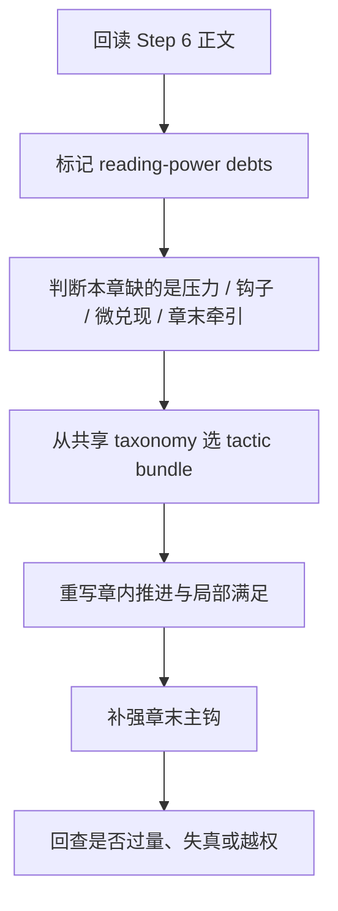
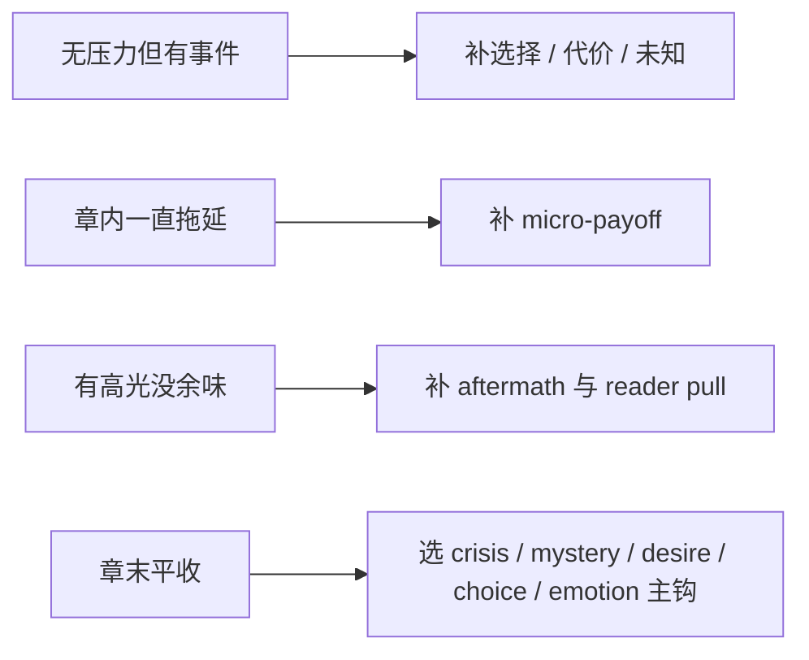
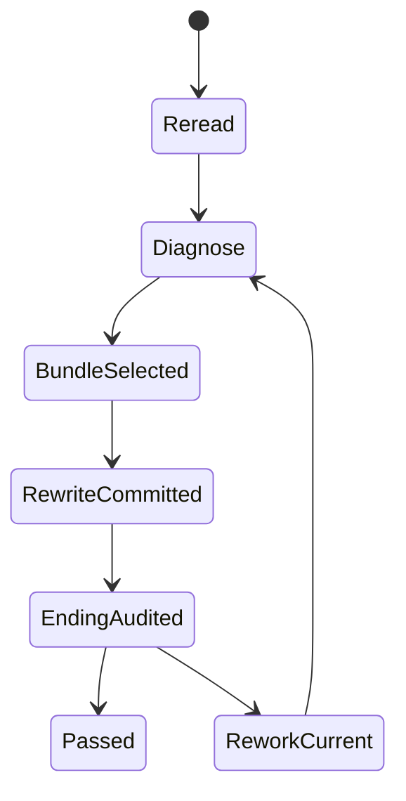

# 3-Drafting / 7-追读力强化

## Context Loading Contract

- 每次调用本技能时，必须同时加载同目录 `CONTEXT.md`。
- 必须回读父层 `3-Drafting/SKILL.md`、`../_shared/drafting-child-output-contract.md`、`../_shared/drafting-instant-validation-contract.md`。
- 若当前 step 要引用本集 chapter board 债务，必须先读取 `../_shared/chapter-board-locating-contract.md`，禁止靠数组顺序猜本集 board。
- 正式处理前，必须读取 Step 6 已写回后的当前 `第N集.md`。
- 必须按需读取根级共享真源 `../../_shared/reading-power-taxonomy.md`。
- 必须按需读取根级共享工程指南 `../../_shared/cool-points-guide.md`。
- 必须读取本地执行细则 `references/reading-power-execution-playbook.md`。

## Parent Positioning

本 child 负责：

- 把“张力”升级成可操作的“追读力”设计
- 同时处理压力、钩子、微兑现、爽点与章末续读牵引
- 让本章既有局部满足，也保留下一章的继续阅读冲动
- 对偏文学、偏人物高压的章节，把假面裂口、羞耻暴露、欲望逼近、身体兑现与公开场面转成可读的 reader pull
- 对主角已启用的成长系统，把本集的压力、选择、代价与章末牵引提纯成 `技能 / 心路 / 情感` 三轴的结构化追读证据

它不负责：

- 重写 chapter board 主干义务
- 越权新增脱离规划的新主线
- 取代 Step 8 统一文风

## Canonical Sources

- `../SKILL.md`
- `../CONTEXT.md`
- `../_shared/chapter-board-locating-contract.md`
- `../_shared/drafting-child-output-contract.md`
- `../_shared/drafting-instant-validation-contract.md`
- `../../_shared/core-constraints.md`
- `../../_shared/reading-power-taxonomy.md`
- `../../_shared/cool-points-guide.md`
- `./references/reading-power-execution-playbook.md`

## Canonical Source Governance

- `../../_shared/reading-power-taxonomy.md` 是钩子类型、爽点模式、微兑现分类和题材投影的唯一 taxonomy 真源。
- `../../_shared/cool-points-guide.md` 是爽点强度、组合技、疲劳防控与虐爽配合的唯一工程指南真源。
- 本 child 只拥有“如何把 taxonomy 投影到当前正文重写”的执行权，不再局部复制一份分类体系。
- 本 child 也只消费爽点工程指南，不在本地再复制一份共享爽点手册。
- 本 child 可以在本地 execution playbook 中维护“pressure-core 投影语法”，用于把通用 taxonomy 投影到偏文学、偏人物高压的章内推进；该语法不是平行 taxonomy，也不得绕过共享 hook / payoff / cool-point 真源。
- 若当前项目未显式启用 `type-pack` 或没有题材型投影输入，则仅使用 taxonomy 的通用部分，不强行套题材偏好。

## Business Requirement Analysis Contract

| analysis_slot | 当前结论 |
| --- | --- |
| `business_goal` | 让本集在章内持续给读者“小收获 + 新风险 + 续读牵引”，而不是只在语气上显得激烈；对偏文学章节，也要把羞耻、欲望、美感压力和公开暴露翻译成真实追读力。 |
| `business_object` | Step 6 后正文、chapter board 债务、写作日志、当前项目的 reader signal / type-pack 投影（若存在），以及根级追读力 taxonomy。 |
| `constraint_profile` | 追读力必须来自既有规划、角色选择和局势推进，不能靠硬插事故、滥用悬念或无兑现钩子。 |
| `success_criteria` | 本章至少形成清晰推进梯度、可感知局部兑现、有效章末牵引，并能说清当前主要 hook / payoff / pressure core 是什么；若主角启用了成长系统，本 step 还能明确说出三轴分别被什么压力、选择或章末 pull 推进。 |
| `topology_fit` | `root reread -> reading-power debt scan -> tactic bundle select -> rewrite -> ending pull audit -> regression guard` |

## Total Input Contract

- 必需输入：
  - 当前 `第N集.md`
  - `2-Planning/全息地图.json`
  - `第V卷.写作日志.yaml`
- 可选增强输入：
  - `reader signal`
  - `type-pack` 对 drafting stage 的当前投影
  - 最近章节的 hook / cool-point 使用情况
- 硬规则：
  - 追读力强化不能违背已建立的因果。
  - 不能只靠激烈措辞、感叹句或突然出事冒充追读力。
  - 章内必须兼顾“即时满足”与“后续牵引”，不能只留坑不兑现。
  - 同一章末不得堆叠多个互相打架的主钩子。
  - 若当前章主要靠人物高压、羞耻、欲望或美感施压推进，必须把它们翻译成可见的动作、代价、被看见后果或临界场面，不能只保留余韵和抒情。
  - 主角若启用成长系统，至少要留下可写入 `growth_axis_evidence` 的压力/选择/代价证据，不得只在章末总结“他更成熟了”。

## Output Contract

- `manuscript_patch`
  - 追读力强化后的正文
- `process_log_entry`
  - `step_id: 7`
  - `focus_dimension: reading_power`
  - 优先记录 `dominant_hook / dominant_payoff / pressure_core`
  - 若主角启用成长系统，优先补 `growth_axis_evidence`
- owned manuscript dimension：
  - 压力梯度
  - 钩子与续读牵引
  - 微兑现与爽点着陆
  - 章末 pull
  - 主角成长系统的压力/牵引证据

## Immediate Validation Hook Contract

- 本 child 在正式 runtime 中只占据 `start-step -> complete-step -> inline validation` 这一个 step 区段；整条链由父层按 `start-task -> start-step -> complete-step -> inline validation -> pass or block` 驱动。
- 当前 step 写回后，父层必须立刻按 `../../4-Validation/_shared/validation-dimension-registry.yaml` 触发当前 step 登记的 inline validators。
- 只有当前 gate 明确 `pass`，Step 8 的 `start-step` 才成立。
- 若 hook 失败且 `rework_target_step == Step 7`，必须留在 Step 7 重写并重跑 gate。
- 若 hook 指向更早受影响 drafting step 或上游 `source_layer_owner`，必须按 shared contract 回卷或停止 drafting 转 source fix；不得把 block 态伪装成“已自然进入 Step 8”。

## Reference Loading Guide

1. 先读 `../../_shared/reading-power-taxonomy.md` 的通用 taxonomy。
2. 再读 `../../_shared/cool-points-guide.md`，判断强度梯度、主副爽点组合与防疲劳策略。
3. 判断当前章的 reader pull 主要来自“事件/信息推进”还是“人物高压/公开暴露/身体兑现”。
4. 若当前项目存在明确题材 / type-pack 投影，再读对应 genre section。
5. 最后按 `references/reading-power-execution-playbook.md` 把分类映射为本章可执行的重写动作。

## Pressure-Core Projection Contract

- 当当前章不是“没事件”，而是“有人物压强但不够抓人”时，允许启用 pressure-core 投影。
- pressure-core 只负责回答“这章最该让读者担心哪一种临界失控”，不替代共享 taxonomy 的 hook / payoff / cool-point 选择。
- 默认一次只启用一个 dominant pressure core；若再叠加第二个，只能作为副轴服务主钩，不能抢走章末问题。

| pressure_core | reader question | rewrite handle | misuse |
| --- | --- | --- | --- |
| `mask_exposure` | 谁会先看见这层假面裂开？ | 显影被看见的风险、体面代价和遮掩动作 | 只有独白，没有暴露后果 |
| `desire_pressure` | 他会不会承认、越界或失手？ | 把欲望推进到选择、靠近、试探、失控边缘 | 只有暧昧或抒情，没有动作 |
| `beauty_pressure` | 他会保护、亵渎还是毁掉这个对象？ | 给单一物象/理想加嫉妒、失格或失去压力 | 只堆气氛和象征，不改变局势 |
| `body_commitment` | 他愿意拿身体付出到什么程度？ | 把判断翻译成训练、站姿、伤口、节制、触碰或后果 | 人物只会说，不会承受 |
| `public_staging` | 这件私事会不会在众目下失控？ | 引入观众、礼仪、登台、对峙、演说或被围观后果 | 只有仪式词汇，没有场面压力 |

## Visual Map

## Thinking-Action Network

| node_id | field_id | objective | actions | evidence | route_out | gate |
| --- | --- | --- | --- | --- | --- | --- |
| `N1-ROOT-REREAD` | `FIELD-RP7-01` | 回读当前正文与 chapter 债务 | 读取 Step 6 结果、chapter board、写作日志 | `input_note` | -> `N2` | 正文最新 |
| `N2-DEBT-SCAN` | `FIELD-RP7-02` | 扫描追读力缺口 | 标记平段、弱钩、无兑现段、收束过平段，并区分当前主要缺口是“事件推进不足”还是“pressure core 未显影” | `debt_scan` | -> `N3` | 缺口具体 |
| `N3-BUNDLE-SELECT` | `FIELD-RP7-03` | 选择重写策略包 | 从共享 taxonomy 选择 hook / payoff / cool-point 组合，并在必要时选择单一 dominant pressure core | `bundle_note` | -> `N4` | 组合不过载、主牵引单一 |
| `N4-INNER-REWRITE` | `FIELD-RP7-04` | 重写章内推进 | 补压力梯度、微兑现、场面推进和转折落点；必要时把羞耻、欲望、美感或信念翻译成动作、身体代价、物象风险或公开场面；若主角启用成长系统，同时定位三轴在哪些压力点被推进 | `rewrite_note` | -> `N5` | 章内不再平推 |
| `N5-ENDING-PULL` | `FIELD-RP7-05` | 审核并补强章末牵引 | 选主钩、显代价、留后续欲望；若当前章走文学高压型，优先收束为“即将暴露 / 即将说破 / 即将亵渎 / 即将登台 / 即将付出身体代价”之一；若主角启用成长系统，同时提纯可回写的 `growth_axis_evidence` | `ending_pull_note` | -> `N6` | 章末有单一主牵引 |
| `N6-REGRESSION-GUARD` | `FIELD-RP7-06` | 防失真与防过量 | 检查越权加戏、钩子过载、只留坑不兑现、象征堆叠替代推进，以及成长证据是否只是抽象总结 | `guard_note` | done | 不违背因果 |

## Lite Field Contract

| field_id | output_slot | pass_standard | fail_code | rework_entry |
| --- | --- | --- | --- | --- |
| `FIELD-RP7-01` | 当前正文与债务输入 | 已回读 Step 6 正文与当前 chapter 债务 | `FAIL-RP7-01` | `N1` |
| `FIELD-RP7-02` | 追读力缺口扫描 | 已定位平段 / 弱钩 / 无兑现 / 平收位置 | `FAIL-RP7-02` | `N2` |
| `FIELD-RP7-03` | tactic bundle | 已选出适配当前章的 hook / payoff / pattern 组合；若章内主要靠人物高压推进，已明确 dominant pressure core | `FAIL-RP7-03` | `N3` |
| `FIELD-RP7-04` | 章内强化版正文 | 章内至少有清晰推进与局部满足；若走文学高压型，压强已被翻译成动作、身体、物象风险或公开场面；主角启用成长系统时，能指出三轴被哪些压力点推进 | `FAIL-RP7-04` | `N4` |
| `FIELD-RP7-05` | 章末 pull | 章末存在单一主钩且能拉向下一章；若走文学高压型，续读牵引不是空泛余韵而是明确临界失控；主角启用成长系统时，可提纯 `growth_axis_evidence` | `FAIL-RP7-05` | `N5` |
| `FIELD-RP7-06` | regression guard | 无越权加戏、无钩子过载、无纯口号式激烈、无象征代替推进、无只靠抽象总结的成长假象 | `FAIL-RP7-06` | `N6` |

## Completion Contract

- 当前正文已从“张力修辞”升级为“追读力结构”。
- 本章能明确说出当前主钩、主要微兑现、dominant pressure core 和章末续读牵引。
- `process_log_entry` 已记录本次选择了哪些 tactic bundle。
- 若当前章走人物高压型 reader pull，已能说明是哪一处假面/欲望/身体/公开场面在牵引读者续读。
- 若主角启用成长系统，`process_log_entry` 应能给出 `growth_axis_evidence`。
