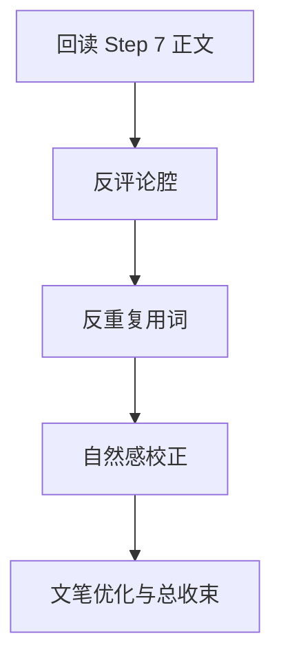

# 3-Drafting / 8-润色

## Context Loading Contract

- 每次调用本技能时，必须同时加载同目录 `CONTEXT.md`。
- 必须回读父层 `3-Drafting/SKILL.md` 与 `../_shared/drafting-child-output-contract.md`。
- 必须同时读取 `../_shared/drafting-instant-validation-contract.md`，把本 child 放回父层的 `start-step -> complete-step -> inline validation -> pass or block` 正式链位中理解。
- 正式处理前，必须读取 Step 7 已写回后的当前 `第N集.md`。
- 必须同时按需读取以下局部子模块：
  - `反评论腔/module-spec.md`
  - `反重复用词/module-spec.md`
  - `自然感/module-spec.md`
  - `文笔优化/module-spec.md`

## Parent Positioning

本 child 负责：

- 统一做去评论腔、去机械重复、去 AI 工业感、文笔收束
- 把前 7 道工序的成果真正融成一篇“像真人写的小说”

它不负责：

- 推翻前 7 步的剧情主干
- 越权给出 validation 通过与否判定

## Canonical Sources

- `../SKILL.md`
- `../CONTEXT.md`
- `../_shared/drafting-child-output-contract.md`
- `../_shared/drafting-instant-validation-contract.md`
- `反评论腔/module-spec.md`
- `反重复用词/module-spec.md`
- `自然感/module-spec.md`
- `文笔优化/module-spec.md`
- `../../_shared/core-constraints.md`

## Business Requirement Analysis Contract

| analysis_slot | 当前结论 |
| --- | --- |
| `business_goal` | 把已有的故事、节奏、氛围、人物、对白、张力成果收束成自然、克制、有人味的最终正文。 |
| `business_object` | Step 7 后正文、风格卡、team 确定的监制/评审偏向。 |
| `constraint_profile` | 润色不能抹平角色和节奏差异；允许风格强化，但不允许变成大师桥段模仿秀。 |
| `success_criteria` | 正文明显减少 AI 评语腔、机械重复和工业平滑感，同时文笔更稳、更自然。 |
| `topology_fit` | `root reread -> anti-commentary -> anti-repetition -> naturalness -> prose finish` |

## Total Input Contract

- 必需输入：
  - 当前 `第N集.md`
  - `写作日志.yaml`
- 条件必需输入：
  - `1-Cards/1-风格卡/**/*.json`
  - `team.yaml`（若项目已锁监制/评审偏好）
- 硬规则：
  - 润色是终修，不是再起一篇。
  - 模仿只能借“文笔判断和气质控制”，不能复制已知固定桥段。
  - 润色阶段必须专门清扫破次元语句；凡出现“第几卷 / 阶段 / 节点 / 时间压力落锁 / 任务完成”这类作品外术语，必须改写成人物能感觉到的风险、余波、局势或预感。
  - 润色阶段不得用提纲式发问替代章末牵引；诸如“问题只剩一个”这类外部点题句默认视为不合格 hook，应改成危险逼近、声音将至、消息未到先压人等戏内收束。
  - 若某句的主要作用是替读者总结“这一切意味着什么”，而不是让场面或人物自己成立，则该句默认优先删除或改写。

## Output Contract

- `manuscript_patch`
  - 候选终稿正文
- `process_log_entry`
  - `step_id: 8`
  - `focus_dimension: integrated_polish`
- owned manuscript dimension：
  - 反评论腔
  - 反重复用词
  - 自然感
  - 文笔优化

## Immediate Validation Hook Contract

- 本 child 在正式 runtime 中只占据 `start-step -> complete-step -> inline validation` 这一个 step 区段；整条链由父层按 `start-task -> start-step -> complete-step -> inline validation -> pass or block` 驱动。
- 当前 step 写回后，父层必须立刻按 `../../4-Validation/_shared/validation-dimension-registry.yaml` 触发当前 step 登记的 inline validators。
- 只有当前 gate 明确 `pass`，本集才获得 `candidate_final_draft`；这仍不等于最终 PASS。
- 若 hook 失败且 `rework_target_step == Step 8`，必须留在 Step 8 重写并重跑 gate。
- 若 hook 指向更早受影响 drafting step 或上游 `source_layer_owner`，必须按 shared contract 回卷或停止 drafting 转 source fix；不得把 block 态伪装成“已自然进入 4-Validation”。

## Visual Map

## Thinking-Action Network

| node_id | field_id | objective | actions | evidence | route_out | gate |
| --- | --- | --- | --- | --- | --- | --- |
| `N1-ROOT-REREAD` | `FIELD-DR8-01` | 回读当前正文 | 读取 Step 7 结果、风格卡、team 偏向 | `input_note` | -> `N2` | 正文最新 |
| `N2-ANTI-COMMENTARY` | `FIELD-DR8-02` | 去评论腔与上帝评语口吻 | 清理直白点评与代替读者作答 | `commentary_note` | -> `N3` | 叙述不过界 |
| `N3-ANTI-REPETITION` | `FIELD-DR8-03` | 减少机械复用 | 检查重复词、重复句式、重复表达路径 | `repeat_note` | -> `N4` | 用词不机械 |
| `N4-NATURALNESS` | `FIELD-DR8-04` | 去 AI 工业感 | 调整衔接、留白、轻微不规则感 | `natural_note` | -> `N5` | 真人感成立 |
| `N5-PROSE-FINISH` | `FIELD-DR8-05` | 做文笔总收束 | 统一句法、韵律、风格气质 | `finish_note` | done | 最终版成立 |

## Lite Field Contract

| field_id | output_slot | pass_standard | fail_code | rework_entry |
| --- | --- | --- | --- | --- |
| `FIELD-DR8-01` | 当前正文 | 已回读追读力强化版正文 | `FAIL-DR8-01` | `N1` |
| `FIELD-DR8-02` | 评论腔修正 | 明显减少上帝评语与直白代答 | `FAIL-DR8-02` | `N2` |
| `FIELD-DR8-03` | 重复修正 | 机械重复词/句显著减少 | `FAIL-DR8-03` | `N3` |
| `FIELD-DR8-04` | 自然感修正 | 工业平滑感明显下降 | `FAIL-DR8-04` | `N4` |
| `FIELD-DR8-05` | 最终润色版正文 | 文笔稳定、自然、可交接 | `FAIL-DR8-05` | `N5` |

## Completion Contract

- 当前正文已通过四个局部子模块的终修。
- 当前正文只达到 `candidate_final_draft` 边界，而不是最终 `validated_final_draft`。
- `process_log_entry` 已记录终修聚焦点与留给 validation 的注意事项。
