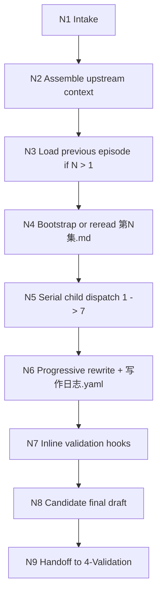
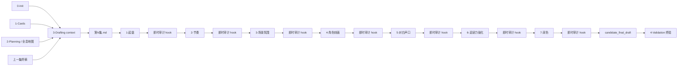
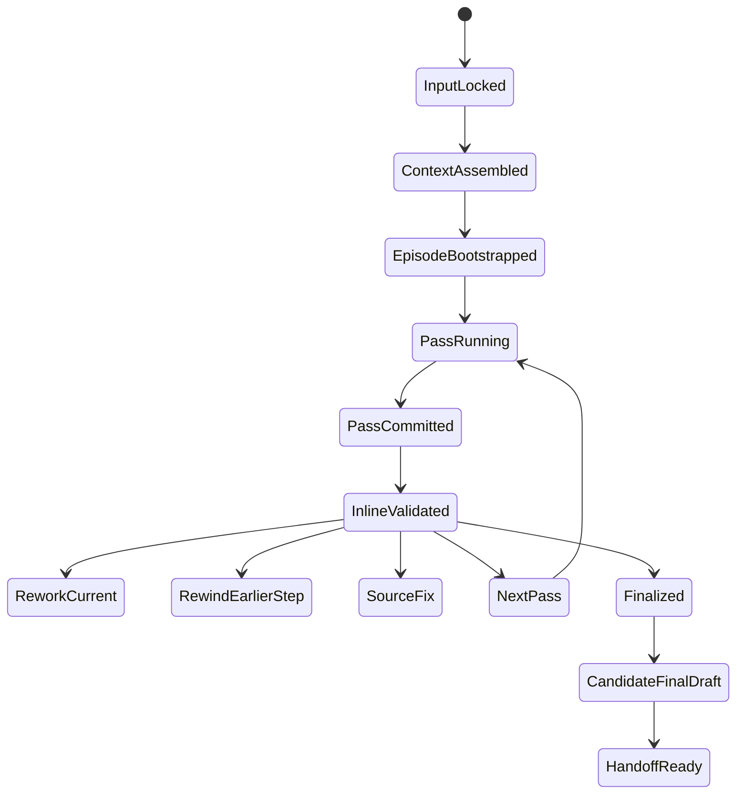

# 3-Drafting

## Context Loading Contract

- 每次调用本技能时，必须同时加载同目录 `CONTEXT.md`。
- 本阶段采用“父 skill + 7 个受治理子技能包 + `_shared` 单一落盘合同”的结构，不再沿用 `Drafting/ch0007/chapter-root.md` 模式作为 drafting 真源。
- 正式写作根文件固定为 `projects/story/<项目名>/3-Drafting/第N集.md`；同目录 `写作日志.yaml` 是唯一工序账本。
- 所有子技能正式处理前，都必须先回读当前 `第N集.md` 与 `写作日志.yaml`；若 `第N集.md` 不存在，由父层先用 `_shared/episode-root.template.md` 初始化。
- 每个子技能写回后，父层必须按照 `../4-Validation/_shared/validation-dimension-registry.yaml` 触发对应的即时审计 hook；未通过则不得进入下一步。
- runtime 默认先尝试调用 `.agents/skills/story/scripts/validation_runner.py` 自动执行当前 step 的 inline validators；只有当 manuscript / context 不足时，才降级为 pending batch，等待显式回填或手动重跑。
- 本阶段的正式执行模式固定为“真正串行版”：`Step 1` 单独起盘并写回 `第N集.md`，随后立即跑 `Step 1` 对应 hook；只有 hook 通过，才允许开始 `Step 2`。同理一直执行到 `Step 7`。
- 禁止把 `Step 1-7` 合并成一次大改稿、一次总生成、预先产出多步结果后再统一写回，或跳过中间 hook 直到最后统一审计。

## Overview

`3-Drafting` 是 `story2026` 的章节创作父 skill。

它继承 `0-Init / 1-Cards / 2-Planning` 的配置机制，但输出形态不是再落第二份规划 JSON，而是把同一集的正文反复加工到一个 Markdown 根文件里：

1. 父层锁输入、组装上下文、裁决固定顺序 `1 -> 7`。
2. 每个子技能只拥有自己的“复合加工维度”，并返回 `manuscript_patch + process_log_entry`。
3. 父层按顺序 progressive rewrite 到 `projects/story/<项目名>/3-Drafting/第N集.md`。
4. 每一步写回后，父层立即运行 registry 声明的 inline validation hooks。
5. 若当前 hook 失败，立即在当前 step、最早受影响 step、或 source-contract 层修复，不允许把问题累积到最后。
6. `7-润色` + 其 inline hooks 通过后，只形成 `candidate_final_draft`，随后仍必须进入 `4-Validation` 终验层。
7. `写作日志.yaml` 记录当前集已经过哪些工序、每步摘要、即时审计结果、可恢复位置与连续性证据。
8. 每个 step 都是独立执行单元：`start current step -> 读取当前 root -> 仅做本 step 改动 -> 写回 root/log -> 跑当前 step hook -> 决定进入下一步或回退`。

本阶段对 `2-Planning/全息地图.json` 的核心理解必须固定：

- 它不是“写作灵感参考”，而是规划真源。
- `chapter_boards` 决定本集承担什么功能、容器和兑现义务。
- `story_spine` 决定主干事件次序。
- `conflict / mission / clue / foreshadow threads` 决定本集必须承接哪些张力、任务、线索和伏笔债务。
- `navigation_rules / genre_corridor / story_promise` 决定叙事风格边界和禁飞区。
- `3-Drafting` 的工作不是改写上述规划真源，而是把这些规划义务翻译成可读的、连续的、具文学质感的章节正文。

从第 2 集开始，连续性合同固定追加一层：

- 除 `0-Init / 1-Cards / 2-Planning` 产物外，必须额外加载上一集最终加工完成的正文 `projects/story/<项目名>/3-Drafting/第N-1集.md`。
- 目的不是复述上一集，而是明确上一集停在什么情绪、关系、信息和动作位置，再继续当前集。

## Parent Positioning

### 父层拥有

- `episode scope` 锁定与输入齐备判定
- `story_map -> prose` 的总装配策略
- 上一集连续性加载与缺口裁决
- `1 -> 7` 固定串行门
- 每个 step 写回后的 inline validation hook 调度与回退裁决
- `第N集.md + 写作日志.yaml` 的唯一正式写回
- 子技能 ownership gate、断点恢复入口与 handoff 说明

### 父层不拥有

- 替任一子技能重复做本地强化判断
- 越权修改 `Cards`、`2-Planning/全息地图.json`、`validation_status`
- 在根层再制造第二份 episode 草稿、第二份 phase report、第二份“局部正文真源”
- 把 7 道工序重新压成“先写完再统一润色”的单次生成

## Governed Child Skills

| order | child skill | 复合加工目标 | owned manuscript dimension |
| --- | --- | --- | --- |
| 1 | `1-单集叙事起盘` | 建立本集叙事结构、段落主干、初稿 | 情节骨架、场景序列、首轮正文 |
| 2 | `2-节奏优化` | 建立章内节奏矩阵与脉冲 | 段落密度、推进点、收放节奏 |
| 3 | `3-场景和氛围渲染` | 强化写景、空间、感官与情景交融 | 场景质感、气氛、环境叙事 |
| 4 | `4-角色形象刻画` | 强化人物鲜活度与行为细节 | 人物动作、习惯、反应、个性落点 |
| 5 | `5-对白个性化和声口优化` | 区分角色声口与对白潜台词 | 对话、断句、气口、语言差异 |
| 6 | `6-追读力强化` | 强化章内牵引、微兑现与章末续读 pull | 压力梯度、钩子、微兑现、章末牵引 |
| 7 | `7-润色` | 统一去 AI 味、去评语腔、去机械复写、文笔收束 | 全文终修、风格统一、自然感校正 |

## Shared Canonical Sources

- `./_shared/episode-root-contract.md`
- `./_shared/episode-root.template.md`
- `./_shared/process-log.template.yaml`
- `./_shared/drafting-child-output-contract.md`
- `./_shared/drafting-instant-validation-contract.md`
- `../4-Validation/_shared/validation-dimension-registry.yaml`
- `../_shared/context-loading-contract.md`
- `../_shared/core-constraints.md`

## Template Layering Contract

1. `3-Drafting` 根层不维护平行 `templates/`；共用结构统一落在 `_shared/`。
2. 各子技能只保留自己的 `SKILL.md + CONTEXT.md`，不再重复定义 episode root 模板。
3. 若某条约束被多个子技能复用，优先提升到 `_shared/`，而不是在兄弟子技能间静默复制。
4. 旧 `story/_shared/chapter-root-*.md` 只保留迁移回指，不再作为 drafting 真源。
5. 题材资料、读者牵引 taxonomy、爽点工程 guide 等类型化知识默认属于可选增强材料；只有在当前项目显式启用相关类型化处理包，或当前 step 明确需要时，才应进入 `3-Drafting` 的额外上下文装配。

## Business Requirement Analysis Contract

| analysis_slot | 当前结论 |
| --- | --- |
| `business_goal` | 以“单集单根文件 + 七道工序复合加工 + 每步即时审计”的方式，把规划真源翻译成可连读的章节正文，并尽早阻断早期错误向后累积。 |
| `business_object` | `0-Init/*.yaml`、`1-Cards/0-全局卡/**/*.json`、`1-Cards/**/*.json`、`2-Planning/全息地图.json`、上一集最终正文、`projects/story/<项目名>/3-Drafting/第N集.md`、`写作日志.yaml`、`validation-dimension-registry.yaml`。 |
| `constraint_profile` | `story_map` 是法律不是灵感；第 2 集起必须加载上一集终稿；7 道工序必须固定串行；每步写回后必须过对应 inline hooks；正式真源只有一个 episode markdown。 |
| `success_criteria` | 当前集正文已通过 1-7 全链加工与每步即时审计；日志可说明每步与每轮 hook 是否完成；`7-润色` 后产出的是可送 `4-Validation` 的候选终稿。 |
| `non_goals` | 不在 drafting 阶段越权改 Cards / MAP；不再维护 `Drafting/chNNNN/chapter-root.md`；不让每个子技能各自产出一份平行完整版。 |
| `complexity_source` | 复杂度来自规划翻译、跨集连续性、同一根文件的渐进式复写、7 个加工维度的 ownership 协同，以及 step-after-write 即时审计的回退裁决。 |
| `topology_fit` | `input lock -> context assembly -> serial child dispatch -> progressive rewrite -> inline validation hooks -> candidate final draft -> final acceptance handoff` |
| `step_strategy` | 先起盘，再逐层加工，再由终修收束；每一步都必须以前一步写回后的当前正文为输入，并在写回后立即通过该 step 对应的 inline validators。 |

## Context Preload

1. 根 `AGENTS.md`
2. `.agents/skills/story/SKILL.md + CONTEXT.md`
3. 本 `SKILL.md + CONTEXT.md`
4. `./_shared/episode-root-contract.md`
5. `./_shared/drafting-child-output-contract.md`
6. `./_shared/drafting-instant-validation-contract.md`
7. `../4-Validation/_shared/validation-dimension-registry.yaml`
8. `../_shared/context-loading-contract.md`
9. `../_shared/core-constraints.md`
10. `0-Init/north_star.yaml`
11. `0-Init/init_handoff.yaml`
12. `1-Cards/0-全局卡/**/*.json`
13. `1-Cards/**/*.json`
14. `2-Planning/全息地图.json`
15. 若 `N > 1`：上一集最终正文 `projects/story/<项目名>/3-Drafting/第N-1集.md`
16. 当前 `projects/story/<项目名>/3-Drafting/第N集.md`（若存在）
17. 当前 `projects/story/<项目名>/3-Drafting/写作日志.yaml`（若存在）
18. `1-单集叙事起盘/SKILL.md + CONTEXT.md`
19. `2-节奏优化/SKILL.md + CONTEXT.md`
20. `3-场景和氛围渲染/SKILL.md + CONTEXT.md`
21. `4-角色形象刻画/SKILL.md + CONTEXT.md`
22. `5-对白个性化和声口优化/SKILL.md + CONTEXT.md`
23. `6-追读力强化/SKILL.md + CONTEXT.md`
24. `7-润色/SKILL.md + CONTEXT.md`

## Total Input Contract

### 必需输入

- `0-Init/north_star.yaml`
- `0-Init/init_handoff.yaml`
- `1-Cards/0-全局卡/**/*.json`
- `1-Cards/**/*.json`
- `2-Planning/全息地图.json`
- 当前 episode id / 集号

### 条件必需输入

- 当 `episode_num > 1` 时，必须加载上一集最终正文 `projects/story/<项目名>/3-Drafting/第N-1集.md`

### 硬规则

1. `2-Planning/全息地图.json` 必须优先于任何兼容大纲或临时摘要。
2. `第N集.md` 是单一章节业务真源；不得再并行维护 second draft、pass-2 draft、chapter-root 等第二正文根文件。
3. `写作日志.yaml` 是唯一工序日志；不得把 step 状态散落到多个 sidecar。
4. 每个子技能开始前都必须回读当前 `第N集.md` 与 `写作日志.yaml`。
5. 第 2 集及之后若上一集终稿缺失，必须阻塞当前集正式写作。
6. 未经 `4-Validation` 通过前，drafting 不得回写 `Cards.current_state/history` 或 `story_map.actualization`。
7. 每个 step 写回后，必须立即运行 registry 声明的 inline validation hooks。
8. `7-润色` 后即使 inline hooks 全部通过，也只获得 `candidate_final_draft` 状态，不得视为最终 PASS。
9. 世界观、规则体系、年代约束、文化艺术、科技/武功与金手指的长期约束，默认优先取自 `1-Cards/0-全局卡/**/*.json`；不得由正文工序自行补发明。
10. `Step 2-7` 的正式输入，必须是“上一 step 已写回且已通过 hook 的当前 `第N集.md`”；不得读取未过 gate 的临时版本当作正式输入。
11. 单个 step 的正式执行边界固定为“一次 step，一次写回，一次 hook gate”；不得把多个 step 的正文改动累积到一次统一写回中。
12. 若当前环境只能做候选比较、草稿实验或 reviewer 会诊，这些内容必须停留在 step 内部，不得冒充已完成的正式 step 写回。

## Dispatch Order Contract

### 固定顺序

`1-单集叙事起盘 -> inline hooks -> 2-节奏优化 -> inline hooks -> 3-场景和氛围渲染 -> inline hooks -> 4-角色形象刻画 -> inline hooks -> 5-对白个性化和声口优化 -> inline hooks -> 6-追读力强化 -> inline hooks -> 7-润色 -> inline hooks -> candidate_final_draft -> 4-Validation`

### Progressive Rewrite 规则

1. 父层初始化或回读 `第N集.md`。
2. 子技能只在自己的加工维度上做强化，但输出必须体现为新一版完整正文或明确 patch。
3. 父层把该结果写回同一 `第N集.md` 后，必须立刻运行当前 step 对应的 inline validation hooks。
4. 只有当前 step 的 inline hooks 通过，下一子技能才能开始。
5. 任意时刻只允许一个子技能对正式正文执行写回。
6. 不允许在 `Step 1` 写回前提前生成 `Step 2-7` 的正式 patch，也不允许在 `Step N` hook 未通过前提前执行 `Step N+1` 的正式写回。

### Inline Validation 回退规则

1. 若 hook 失败且问题仍属于当前 step，可在当前 step 即刻重写并重跑 hook。
2. 若 hook 指向更早 drafting step，必须回退到最早受影响 step，并从该 step onward 继续。
3. 若 hook 指向 `0-Init / 1-Cards / 2-Planning` 的 source owner，必须立即停止 drafting 主链并转 source fix。

### 并发规则

- 正式写回：禁止并发。
- 允许并发的只有子技能内部的候选比较、句式实验、风格备选或 reviewer 会诊。
- 工序日志写入必须与对应正文写回成对完成。

## Output Contract

### canonical runtime

- `projects/story/<项目名>/3-Drafting/第N集.md`
- `projects/story/<项目名>/3-Drafting/写作日志.yaml`

### hard rules

1. 父层最终交付的是当前集正式正文与工序日志，而不是一组未收束的中间稿。
2. 子技能只返回 `manuscript_patch + process_log_entry`，不独立落盘 sibling manuscript。
3. `写作日志.yaml` 必须记录：
   - 当前集号
   - 当前正式正文路径
   - 已完成工序
   - 每步摘要
   - 即时审计摘要与引用
   - 下一步建议/断点恢复指针
4. `7-润色` 后的产物只应声明为 `candidate_final_draft`。
5. 若本轮未完成 1-7 全链，或任何一步 inline hook 未通过，日志必须能说明精确停在何处。

## Visual Maps

## Thinking-Action Network

| node_id | field_id | objective | actions | evidence | route_out | gate |
| --- | --- | --- | --- | --- | --- | --- |
| `N1-INTAKE` | `FIELD-DR-01` | 锁定集号与任务模式 | 判定当前是新写、续写、返工还是断点续跑 | `episode_scope_note` | -> `N2` | episode 唯一 |
| `N2-CONTEXT-ASSEMBLY` | `FIELD-DR-02` | 收束上游真源 | 读取 `0-Init / Cards / Planning` | `context_stack_note` | -> `N3` | 上游齐备 |
| `N3-CONTINUITY-LOAD` | `FIELD-DR-03` | 装配跨集连续性 | `N>1` 时回读上一集终稿 | `continuity_note` | -> `N4` | 连续性证据在手 |
| `N4-EPISODE-BOOTSTRAP` | `FIELD-DR-04` | 初始化或回读本集根文件与日志 | 创建或读取 `第N集.md + 写作日志.yaml` | `bootstrap_note` | -> `N5` | 真源唯一 |
| `N5-SERIAL-DISPATCH` | `FIELD-DR-05` | 固定顺序调度 1-7 子技能 | 每步前回读当前 root，再进入 child | `dispatch_log` | -> `N6` | 顺序稳定 |
| `N6-PROGRESSIVE-REWRITE` | `FIELD-DR-06` | 把 child patch 写回同一正文 | 更新 `第N集.md` 与 `写作日志.yaml` | `rewrite_trace` | -> `N7` | 无平行正文 |
| `N7-INLINE-VALIDATION` | `FIELD-DR-07` | 运行当前 step 对应的即时审计 hook | 读取 registry，执行 dimensions，决定前进/重写/回退 | `inline_validation_note` | -> `N8` | 当前 step 通过 |
| `N8-HANDOFF-READY` | `FIELD-DR-08` | 输出候选终稿并交接终验 | 生成 `candidate_final_draft` note 与下一跳建议 | `handoff_note` | done | 可交给 4-Validation |

## Field Master

| field_id | output_slot | 内容要求 | default_step | quality_dimension | fail_code |
| --- | --- | --- | --- | --- | --- |
| `FIELD-DR-01` | episode scope | 当前写的是哪一集、何种模式 | `S1` | 目标稳定性 | `FAIL-DR-01` |
| `FIELD-DR-02` | upstream context pack | Init/1-Cards/Planning 已装配 | `S1` | 输入完整性 | `FAIL-DR-02` |
| `FIELD-DR-03` | continuity pack | 第 2 集起已读取上一集终稿 | `S2` | 连续性 | `FAIL-DR-03` |
| `FIELD-DR-04` | episode root + process log | 根文件与日志唯一 | `S2` | 真源唯一性 | `FAIL-DR-04` |
| `FIELD-DR-05` | serial pass plan | 1-7 固定顺序成立 | `S3` | 工序完整性 | `FAIL-DR-05` |
| `FIELD-DR-06` | rewritten manuscript | 同一正文被渐进式复写 | `S4-S10` | 复合加工质量 | `FAIL-DR-06` |
| `FIELD-DR-07` | inline validation result | 当前 step 对应 hook 已通过或已明确回退位置 | `S4-S10` | 过程内验收稳定性 | `FAIL-DR-07` |
| `FIELD-DR-08` | candidate final draft | 已形成候选终稿，可进入 `4-Validation` 终验 | `S11` | 可交付性 | `FAIL-DR-08` |

## Thought Pass Map

| step_id | 聚焦字段 | 核心问题 | 生成动作 | 未达标信号 |
| --- | --- | --- | --- | --- |
| `S1` | `FIELD-DR-01~02` | 当前集与上游上下文锁定了吗 | 锁定 scope 并组装 context | 上游缺失或 episode 漂移 |
| `S2` | `FIELD-DR-03~04` | 连续性与根文件唯一性成立了吗 | 读上一集并 bootstrap 当前集 | 缺上一集终稿或多真源 |
| `S3` | `FIELD-DR-05` | 7 道工序顺序是否稳定 | 生成 serial run list | 仍想并发正式写回 |
| `S4-S10` | `FIELD-DR-06~07` | 当前 child 是否只增强自己的维度，并通过当前 step hook | progressive rewrite 到同一正文，再执行 inline hooks | 产出第二正文、未写日志、hook 失败仍硬推进 |
| `S11` | `FIELD-DR-08` | 当前正文是否已经达到候选终稿状态 | 输出 `candidate_final_draft` handoff note | 仍是半成品或越权宣称最终 PASS |

## Pass Table

| field_id | pass_standard | fail_code | rework_entry |
| --- | --- | --- | --- |
| `FIELD-DR-01` | 集号、模式、目标明确 | `FAIL-DR-01` | `S1` |
| `FIELD-DR-02` | Init/1-Cards/Planning 已齐备 | `FAIL-DR-02` | `S1` |
| `FIELD-DR-03` | `N>1` 时上一集终稿已加载 | `FAIL-DR-03` | `S2` |
| `FIELD-DR-04` | `第N集.md + 写作日志.yaml` 唯一 | `FAIL-DR-04` | `S2` |
| `FIELD-DR-05` | 1-7 顺序成立 | `FAIL-DR-05` | `S3` |
| `FIELD-DR-06` | 同一正文完成渐进式复写 | `FAIL-DR-06` | 对应 child |
| `FIELD-DR-07` | 当前 step 已通过 inline hooks 或已明确回退目标 | `FAIL-DR-07` | 当前 step 或最早受影响 step |
| `FIELD-DR-08` | 仅形成候选终稿并交给 `4-Validation` | `FAIL-DR-08` | `S11` |

## Root-Cause Execution Contract

出现以下任一情况，必须先修源层：

- drafting 仍把 `Drafting/chNNNN/chapter-root.md` 当正式正文根文件
- 第 2 集之后未读取上一集终稿就直接开写
- `story_map` 被当成“可以随手改的灵感池”
- 子技能各自产出一份完整正文，父层没有统一 progressive rewrite
- `写作日志.yaml` 缺失，导致无法判断断点或已完成工序
- drafting 写完 step 却没有立即跑对应 inline validation hook
- `7-润色` 被误当成最终 PASS，而不是候选终稿

## Completion Contract

只有同时满足以下条件，`3-Drafting` 才允许宣布当前集完成：

1. 当前集正文已收束到 `projects/story/<项目名>/3-Drafting/第N集.md`。
2. `写作日志.yaml` 已明确记录 1-7 工序完成情况与每步 inline validation 结果。
3. 第 2 集起，连续性证据已引用上一集终稿。
4. `7-润色` 后的当前正文只可声明为 `candidate_final_draft`。
5. 当前正文可明确 handoff 到 `4-Validation`，或日志能精准说明待续工序 / 回退节点。
