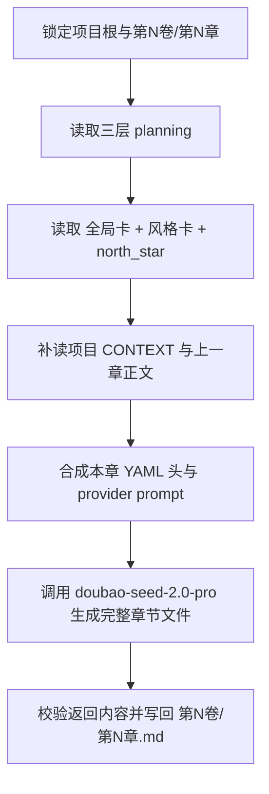
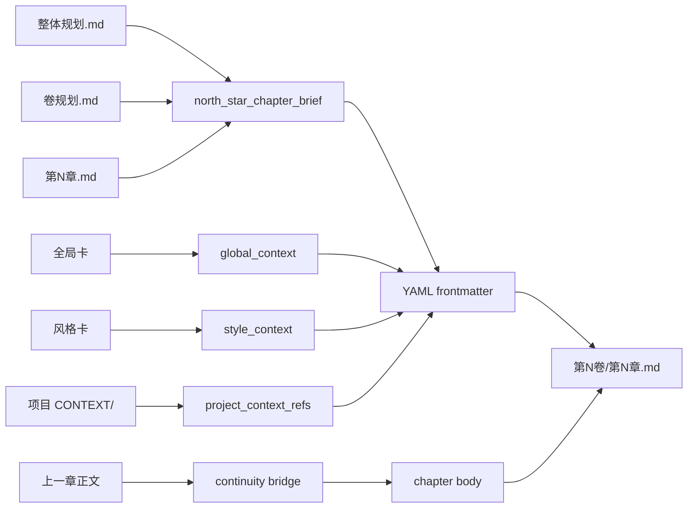

# 3-Drafting

## Context Loading Contract

- 每次调用本技能时，必须同时加载同目录 `CONTEXT.md`。
- 必须回读父层 `../SKILL.md` 与 `../CONTEXT.md`，先锁定 `story` 总线边界，再进入当前 chapter-native 正文创作。
- 必须同时读取 `../_shared/context-loading-contract.md` 与 `../_shared/core-constraints.md`。
- 必须读取当前项目的三层 planning 真源：
  - `2-Planning/整体规划.md`
  - `2-Planning/第N卷/卷规划.md`
  - `2-Planning/第N卷/第N章.md`
- 必须读取当前项目的对象/风格真源：
  - `1-Cards/0-全局卡/**/*.json`
  - `1-Cards/1-风格卡/**/*.json`
  - `0-Init/north_star.yaml`
- 若 `projects/story/<项目名>/CONTEXT/` 存在，必须按当前卷/章任务相关性加载对应上下文文件，不得整目录盲读后直接忽略。
- 若上一章正文 `projects/story/<项目名>/3-Drafting/第N卷/第N-1章.md` 已存在，必须读取它作为连续性增强输入；若不存在，不得因此阻塞本章起稿。
- 若目标文件已存在，必须先回读现有 `第N卷/第N章.md`，再决定是续写、重写还是局部重构。
- 正式 bootstrap 时，优先参照 `templates/chapter-root.template.md` 生成 YAML 头与正文骨架。
- 正文的实际创作步骤必须走 `scripts/write_chapter_via_doubao.py -> .agents/skills/api/anyfast/llm/doubao-seed-2.0-pro/scripts/doubao_seed_chat.py`；不得把本地 GPT 直写当作默认执行路径。

## Purpose

`3-Drafting` 现在直接承担 chapter-native 正文主技能职责。

它负责：

- 以章为单位，把当前章 planning 义务翻译成完整小说正文。
- 把全局卡、风格卡与 `north_star.yaml` 压成可回读的 YAML 头。
- 在正文前显式记录本章依赖的 global/style/north-star/project-context/previous-chapter 约束。
- 把正式落点固定到 `projects/story/<项目名>/3-Drafting/第N卷/第N章.md`。
- 把“实际写正文”交给 AnyFast `doubao-seed-2.0-pro` 执行，脚本只负责上下文装配、prompt 收束、结果校验与正式写回。

它不负责：

- 改写 `2-Planning` 或 `1-Cards` 真源。
- 代替 `4-Review` 做 PASS/FAIL 判定。
- 代替 `5-Loopback` 回写 validated actualization。
- 把上一章缺失伪装成“无法开写”的硬失败。

## Stage Position

- 当前技能是 `story` 主链上的 `3-Drafting` 正式主技能，不再通过 `正文/` child 承接。
- 当前技能拥有当前章正文根文件与其 YAML 头的写权。
- `projects/story/<项目名>/3-Drafting/第V卷.写作日志.yaml` 等批次/恢复工件如仍存在，只视为 runtime 兼容载体，不再定义本技能的主创拓扑。

## Canonical Sources

- `../SKILL.md`
- `../CONTEXT.md`
- `../_shared/context-loading-contract.md`
- `../_shared/core-constraints.md`
- `./templates/chapter-root.template.md`
- `./templates/doubao-system-prompt.md`
- `./scripts/write_chapter_via_doubao.py`
- `../../api/anyfast/llm/doubao-seed-2.0-pro/SKILL.md`
- `../../api/anyfast/llm/doubao-seed-2.0-pro/CONTEXT.md`

## Actual Creative Engine

当前技能的执行语义固定为：

1. 本地脚本负责锁路径、读 context、整理模板与约束。
2. AnyFast `doubao-seed-2.0-pro` 负责实际生成完整章节 Markdown 文件。
3. 本地脚本负责校验返回内容是否满足 frontmatter / heading / 输出路径合同，再写回 `第N卷/第N章.md`。

硬边界：

- “LLM-first creative authorship” 在本技能上的 owning provider 固定为 `doubao-seed-2.0-pro`。
- 未经用户显式改口，不得把本地 GPT 直写、手工改写或其他 provider 伪装成当前技能的正常主路径。
- 若豆包 provider 因认证、网络、返回格式不合法或上层策略阻断而不可用，必须硬失败并报告阻断来源；不得静默回退为本地直写。

## Business Requirement Analysis Contract

| analysis_slot | 当前结论 |
| --- | --- |
| `business_goal` | 让当前章直接形成可交付的章节级小说正文，并把影响写作判断的 global/style/north-star/project-context 显式挂进 YAML 头。 |
| `business_object` | 当前章 planning、上游卷/整书规划、全局卡、风格卡、`north_star.yaml`、项目级 `CONTEXT/`、上一章正文。 |
| `constraint_profile` | planning 只给义务和约束，不能原样照抄进正文；global/style 摘要必须短而可用；`north_star` 只提炼本章相关摘要；上一章是增强输入不是阻塞门。 |
| `success_criteria` | 目标文件成功落到 `projects/story/<项目名>/3-Drafting/第N卷/第N章.md`，YAML 头完整，正文具备章节级小说密度，并能读出承接、推进、章末牵引。 |
| `topology_fit` | `source lock -> context pack -> frontmatter synthesis -> continuity bridge -> doubao chapter generation -> final writeback` |

## Visual Maps





## Total Input Contract

### 必需输入

- `projects/story/<项目名>/0-Init/north_star.yaml`
- `projects/story/<项目名>/1-Cards/0-全局卡/**/*.json`
- `projects/story/<项目名>/1-Cards/1-风格卡/**/*.json`
- `projects/story/<项目名>/2-Planning/整体规划.md`
- `projects/story/<项目名>/2-Planning/第N卷/卷规划.md`
- `projects/story/<项目名>/2-Planning/第N卷/第N章.md`
- `volume_num / chapter_num`
- 当前项目名与目标输出路径

### 条件必需输入

- `projects/story/<项目名>/CONTEXT/**/*.md`：若存在，必须按当前章主题与卷任务相关性加载。
- `projects/story/<项目名>/3-Drafting/第N卷/第N-1章.md`：若存在，必须读取。
- 当前 `projects/story/<项目名>/3-Drafting/第N卷/第N章.md`：若已存在，必须先回读。

### 硬规则

1. 当前技能的最小业务单元是“章”，不是“集”或“卷批次”。
2. 必须先锁定当前章 planning，再读取 global/style/north-star；不得反过来凭风格或世界观猜当前章该写什么。
3. YAML 头必须显式包含 `global_context`、`style_context` 与 `north_star_chapter_brief`，三者缺一不可。
4. `global_context` 只保留会直接影响本章判断的世界规则、势力压力或舞台约束；禁止整份全局卡照抄。
5. `style_context` 只保留本章落笔需要的语体、气压、叙事/对白/画面抓手；禁止整份风格卡照抄。
6. `north_star_chapter_brief` 必须是“`north_star.yaml` + 当前章 planning”的压缩摘要，不得伪装成 `north_star.yaml` 原文摘录。
7. 若项目级 `CONTEXT/` 存在，不能只在 YAML 头里留空数组；必须留下真实命中的 `project_context_refs`，或显式写 `[]` 并说明无相关文件。
8. 若上一章不存在，`previous_chapter_ref` 可为空，但不得因此停止本章写作。
9. 正文主体必须是小说 prose，不得把 `本章冲突 / 本章任务线 / 章末达成 / 规避` 原样复制成正文段落。
10. planning 中的“建议写法”只能转译成叙事动作、段落重心和章末牵引，不能原句粘贴。
11. 输出路径固定为 `projects/story/<项目名>/3-Drafting/第N卷/第N章.md`；不得降格写到 `第N章.md`、`正文/` 或临时 sibling 文件。
12. 当前技能的 actual creative step 必须调用 `scripts/write_chapter_via_doubao.py`，并由它继续调用 `doubao_seed_chat.py`；不得把“本地会话直接写正文”当作等价执行。
13. 若豆包返回内容不含完整 YAML frontmatter、缺少必需字段、缺少 `# 第N章｜章标题` 标题行，必须判定为 provider output invalid，禁止直接写回业务真源。
14. provider 失败时只允许：修 provider 输入、缩减 context、重试 provider、或向用户显式报告阻断；不允许静默回退到本地 GPT 直写。

## Frontmatter Contract

YAML 头至少包含：

- `story_name`
- `volume_num`
- `chapter_num`
- `chapter_title`
- `planning_global_ref`
- `planning_volume_ref`
- `planning_chapter_ref`
- `global_card_refs`
- `style_card_refs`
- `north_star_ref`
- `project_context_refs`
- `previous_chapter_ref`
- `global_context`
- `style_context`
- `north_star_chapter_brief`

其中关键槽位固定如下：

- `global_context`
  - `worldview_summary`
  - `rule_pressure`
  - `faction_or_system_pressure`
- `style_context`
  - `tone_summary`
  - `prose_summary`
  - `dialogue_summary`
- `north_star_chapter_brief`
  - 用一段 2-4 句中文，说明“这一章在整书承诺里为什么成立、要把哪种压力从 planning 推进成戏内动作、章末应把什么牵到下一章”

## Thinking-Action Network

| node_id | field_id | objective | actions | evidence | route_out | gate |
| --- | --- | --- | --- | --- | --- | --- |
| `N1-SOURCE-LOCK` | `FIELD-MT-01` | 锁定唯一卷章范围 | 定位 `第N卷/第N章.md` 与目标输出路径 | `source_lock_note` | -> `N2` | 章范围唯一 |
| `N2-CONTEXT-PACK` | `FIELD-MT-02` | 组装写作上下文包 | 读取 planning、global/style、`north_star`、项目 `CONTEXT/`、上一章 | `context_pack_note` | -> `N3` | 输入齐备 |
| `N3-FRONTMATTER-SYNTHESIS` | `FIELD-MT-03` | 生成 YAML 头 | 压缩 global/style 约束并生成 `north_star_chapter_brief` | `frontmatter_note` | -> `N4` | YAML 头成立 |
| `N4-CONTINUITY-BRIDGE` | `FIELD-MT-04` | 接上本章承接 | 从上一章与当前 planning 抽取开章承接与章末目标 | `continuity_note` | -> `N5` | 承接明确 |
| `N5-CHAPTER-DRAFT` | `FIELD-MT-05` | 通过豆包生成完整章节文件 | 把 context pack 收束成 provider prompt，调用 `write_chapter_via_doubao.py` 生成完整 Markdown 文件 | `draft_note` | -> `N6` | provider 返回完整文件 |
| `N6-WRITEBACK` | `FIELD-MT-06` | 写回正式根稿 | 校验 frontmatter / heading / 正文完整度后，再以单文件写回 `第N卷/第N章.md` | `writeback_note` | done | 正式落盘 |

## Field Contract

| field_id | output_slot | pass_standard | fail_code | rework_entry |
| --- | --- | --- | --- | --- |
| `FIELD-MT-01` | 卷章定位 | 已命中唯一 `第N卷/第N章.md` 与输出路径 | `FAIL-MT-01` | `N1` |
| `FIELD-MT-02` | 上下文包 | 已读取三层 planning、global/style、`north_star`、项目 `CONTEXT`（若有）、上一章（若有） | `FAIL-MT-02` | `N2` |
| `FIELD-MT-03` | YAML 头 | `global_context + style_context + north_star_chapter_brief` 已齐备且非照抄 | `FAIL-MT-03` | `N3` |
| `FIELD-MT-04` | 承接桥 | 开章承接与章末牵引已明确，上一章缺失时也有 planning 替代承接 | `FAIL-MT-04` | `N4` |
| `FIELD-MT-05` | provider 创作结果 | 豆包已返回完整章节 Markdown 文件，正文不是摘要式压缩稿或 planning 改写稿 | `FAIL-MT-05` | `N5` |
| `FIELD-MT-06` | 正式落盘 | 文件已写到 `projects/story/<项目名>/3-Drafting/第N卷/第N章.md` | `FAIL-MT-06` | `N6` |

## Output Contract

### Canonical output

- `projects/story/<项目名>/3-Drafting/第N卷/第N章.md`

### 文件结构

1. YAML frontmatter
2. 空行
3. `# 第N章｜章标题`
4. 正文章节内容

### 文件级硬规则

- frontmatter 只记录写作约束与引用，不在正文段落中重复解释。
- 正文主体不得保留“本章故事概要 / 本章冲突 / 规避”之类 planning 标题。
- 章末必须对齐当前章 planning 的 `exit_hook / 对下章的直接推动 / 章末达成` 中至少一项强义务。
- 当前技能的 provider artifacts（messages pack、raw model output、provider report）可落到项目 `reports/3-Drafting/doubao/.../`，但它们不是业务真源。

## Standard Invocation

```bash
python3 .agents/skills/story/3-Drafting/scripts/write_chapter_via_doubao.py \
  --project-root "projects/story/<项目名>" \
  --chapter 12
```

Dry run:

```bash
python3 .agents/skills/story/3-Drafting/scripts/write_chapter_via_doubao.py \
  --project-root "projects/story/<项目名>" \
  --chapter 12 \
  --dry-run
```

## Completion Contract

- 当前章正文已按 `projects/story/<项目名>/3-Drafting/第N卷/第N章.md` 正式落盘。
- YAML 头已显式包含 global/style 约束与 `north_star` 本章摘要。
- 若项目级 `CONTEXT/` 存在，当前文件已能追溯命中的上下文引用。
- 若上一章存在，当前开章已体现承接；若不存在，也已明确用 planning 补齐开章条件。
- 当前正文已是可通读的小说章节，而不是摘要、提纲或说明稿。
- 本次正文的实际创作 provider 已真实命中 `doubao-seed-2.0-pro`；若未命中，不得宣称当前技能已按合同完成。
