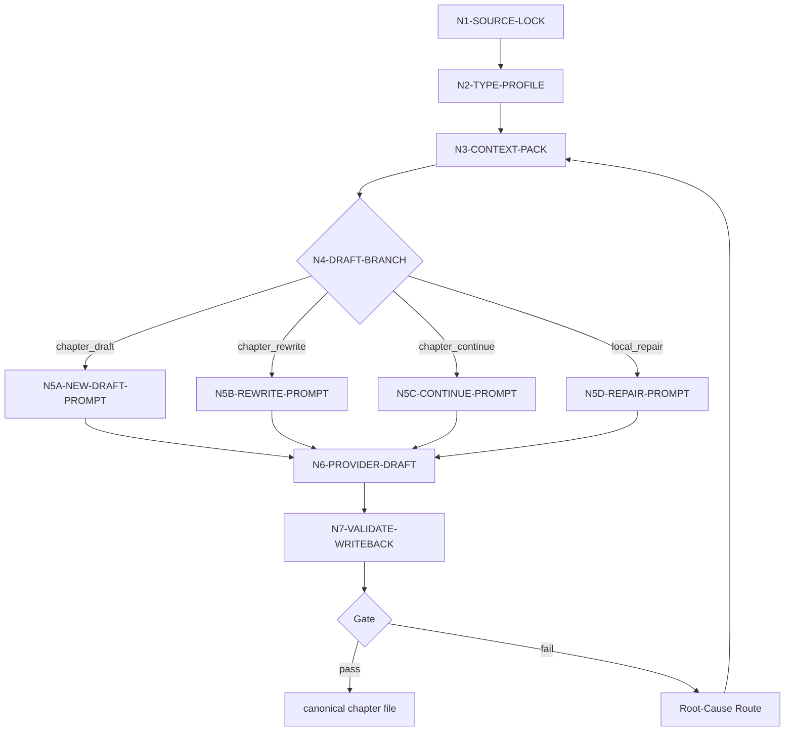

# Chapter Drafting Workflow

本文件承载 `story-drafting` 的思行网络。节点必须同时表达判断、动作、证据、路由和 gate。

## Topology

当前技能采用 hybrid 拓扑：前段串行锁源与判型，中段按起草/续写/重写/修复分支，后段统一汇流到 provider 与 review gate。

## Node Network

| node_id | objective | inputs | actions | evidence | route_out | gate |
| --- | --- | --- | --- | --- | --- | --- |
| `N1-SOURCE-LOCK` | 锁定唯一项目根、卷号、章号与输出路径 | 用户请求、项目根、chapter 参数 | 定位 `projects/story/<项目名>/` 与 `第N卷/第N章.md` | `source_lock_note`、canonical output path | `N2-TYPE-PROFILE` | 项目根与卷章唯一 |
| `N2-TYPE-PROFILE` | 判定起草、续写、重写、修复或 dry-run | 目标章是否存在、用户意图、`types/drafting-type-map.md` | 生成 `type_profile` | `type_profile` | `N3-CONTEXT-PACK` | mode 唯一且不冲突 |
| `N3-CONTEXT-PACK` | 组装写作上下文包 | 三层 planning、global/style cards、`north_star`、`MEMORY.md`、项目 `CONTEXT/`、上一章 | 读取并压缩为 provider 可消费上下文 | messages pack、context refs | `N4-DRAFT-BRANCH` | 必需输入齐备 |
| `N4-DRAFT-BRANCH` | 按类型选择 prompt 约束 | `type_profile`、现稿状态、用户约束 | 路由到新章、重写、续写或修复分支 | branch decision | `N5A/B/C/D` | 分支与用户请求一致 |
| `N5A-NEW-DRAFT-PROMPT` | 为新章起稿生成 provider prompt | context pack、输出模板 | 保持 planning 义务，生成完整章请求 | prompt section | `N6-PROVIDER-DRAFT` | 没有依赖现稿 |
| `N5B-REWRITE-PROMPT` | 为重写生成 provider prompt | context pack、现有正文、用户重写约束 | 保留成立事实，重构正文 | prompt section | `N6-PROVIDER-DRAFT` | 已回读现稿 |
| `N5C-CONTINUE-PROMPT` | 为续写/补全生成 provider prompt | context pack、现有正文、章末目标 | 延续既有文气并补足未完成义务 | prompt section | `N6-PROVIDER-DRAFT` | 承接点明确 |
| `N5D-REPAIR-PROMPT` | 为局部修复生成 provider prompt | review finding、现稿、源层约束 | 定位问题层并限制修复范围 | rework route note | `N6-PROVIDER-DRAFT` | 不越权改 planning |
| `N6-PROVIDER-DRAFT` | 通过豆包生成完整章节文件 | provider prompt、系统提示、输出模板 | 调用 `write_chapter_via_doubao.py` 及豆包 bridge | provider report、raw output | `N7-VALIDATE-WRITEBACK` | provider 真实命中 |
| `N7-VALIDATE-WRITEBACK` | 校验并写回 canonical 章节 | provider output、frontmatter contract、heading contract | 校验 YAML、必需字段、标题、正文完整度；写回目标路径 | final chapter file、sidecar refs | done 或 Root-Cause Route | 校验通过且路径正确 |

## Failure Routing

| fail_code | symptom | rework_entry |
| --- | --- | --- |
| `FAIL-DRAFT-SOURCE` | 项目根、卷章或输出路径不唯一 | `N1-SOURCE-LOCK` |
| `FAIL-DRAFT-TYPE` | 起草/续写/重写/修复误判 | `N2-TYPE-PROFILE` |
| `FAIL-DRAFT-CONTEXT` | planning、cards、`north_star`、项目记忆或上下文缺失 | `N3-CONTEXT-PACK` |
| `FAIL-DRAFT-PROMPT` | prompt 未对齐分支或照搬 planning 语言 | `N4-DRAFT-BRANCH`、`N5*` |
| `FAIL-DRAFT-PROVIDER` | 豆包调用失败或返回无效 | `N6-PROVIDER-DRAFT` |
| `FAIL-DRAFT-WRITEBACK` | frontmatter、标题或输出路径不合规 | `N7-VALIDATE-WRITEBACK` |

## Evidence Gate

- dry-run 至少应产生 messages pack 与上下文引用摘要。
- 正式创作至少应产生 messages pack、provider output、provider report 或等价 sidecar，以及 canonical chapter file。
- 任何没有 provider 证据链的正文不得宣称按 `story-drafting` 完成。
