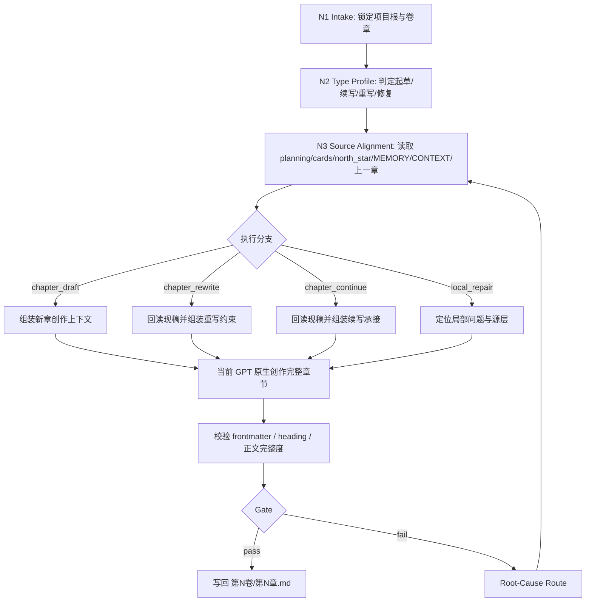
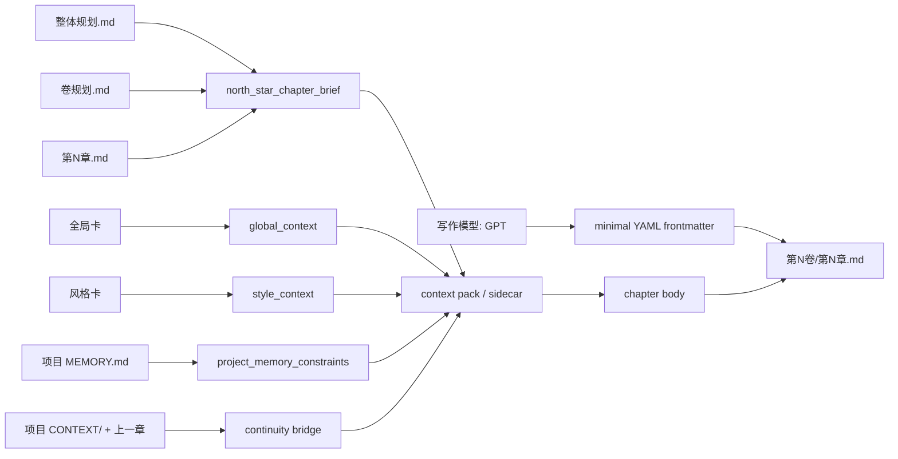

# 3-初稿 / A-GPT原生

## Context Loading Contract

- 每次调用本技能时，必须同时加载同目录 `CONTEXT.md`。
- 每次调用本技能时，必须同时识别并加载同目录 `types/` 中选中的类型包（单选或多选）。
- 必须回读 story 根层 `../../SKILL.md` 与 `../../CONTEXT.md`，先锁定 `story2026` 总线边界，再进入当前 chapter-native 正文创作。
- 若 `../SKILL.md` 与 `../CONTEXT.md` 非空，必须同时读取作为 `3-初稿` 阶段路由层。
- 必须同时读取 `../../_shared/context-loading-contract.md` 与 `../../_shared/core-constraints.md`。
- 正式写作调用必须读取 `../_shared/supervised-drafting-review-loop-contract.md`，并默认启动 team supervision subagents；若上层策略阻断真实 subagents，必须按共享合同报告降级。
- 启动监制 subagents 前必须读取 `.agents/skills/team/SKILL.md + CONTEXT.md`，再只加载被选中的 team 成员技能 `SKILL.md + CONTEXT.md`。
- 若当前任务已绑定 `projects/story/<项目名>/`，必须先加载项目根 `MEMORY.md`，再按当前卷/章相关性加载项目根 `CONTEXT/` 中的上下文文件。
- 必须读取当前项目的三层 planning 真源、对象/风格真源与 `north_star.yaml`；具体清单见 `references/chapter-drafting-contract.md`。
- 若上一章正文已存在，必须读取它作为连续性增强输入；若不存在，不得因此阻塞本章起稿。
- 若目标文件已存在，必须先回读现有 `第N卷/第N章.md`，再决定是续写、重写还是局部重构。
- `CONTEXT.md` 只承载经验层 Type Map、Repair Playbook 与 Reusable Heuristics，不得重定义本入口合同。

## Purpose

`A-GPT原生` 是 `story2026` 主链 `3-初稿` 阶段的 GPT 原生路径。它负责根据 `projects/story/<项目名>/2-卷章规划` 中已经规划好的章级资料，结合整书/卷级规划、全局卡、风格卡、`north_star.yaml`、项目记忆、项目上下文与上一章承接，由当前 GPT/LLM 会话直接创作为中文小说章节。

它拥有：

- 当前章正文根文件写权：`projects/story/<项目名>/3-初稿/第N卷/第N章.md`
- 当前章 YAML frontmatter 的写权
- GPT-native artifacts 的辅助落盘权

它不拥有：

- `0-初始化`、`1-设定`、`2-卷章规划` 的真源改写权
- `review` 的 PASS/FAIL 判定权
- `5-上下文回流` 的 validated actualization 写回权

## Mode Selection

| mode | 触发信号 | 主路径 |
| --- | --- | --- |
| `chapter_draft` | 当前章尚无正文，用户要求起草/写正文 | 读取上游真源后由当前 GPT 原生创作完整章节 |
| `chapter_rewrite` | 目标章已存在，用户要求重写/大修 | 先回读现有正文，再按当前 planning 与用户约束重写 |
| `chapter_continue` | 目标章已存在，用户要求续写或补全 | 保留已成立承接，补足未完成正文 |
| `local_repair` | 审查或用户指出局部问题 | 定位问题层，生成局部修复稿，仍不得由脚本主创正文 |
| `dry_run` | 用户或调试要求只装配上下文包 | 只生成 GPT-native context pack 与报告，不写正文真源 |

## Reference Loading Guide

| 场景 | 读取文件 |
| --- | --- |
| 需要章节输入、frontmatter、GPT 原生主创与输出细则 | `references/chapter-drafting-contract.md` |
| 需要默认 subagents 监制、team 视角、code-reviewer 卷级返工闭环 | `../_shared/supervised-drafting-review-loop-contract.md` |
| 需要兼容旧 step-after-write 即时审计链路 | `../_shared/drafting-instant-validation-contract.md` |
| 需要执行拓扑、分支、汇流、失败回路 | `steps/chapter-drafting-workflow.md` |
| 需要识别并加载网文题材类型包、判定起草/重写/续写/修复/dry-run 类型 | `types/type-map.md` 与命中的 `types/网文/<题材>/` |
| 需要质量门禁、GPT-native 证据与 reviewer 规则 | `review/review-contract.md` |
| 需要可复用写作与迁移经验 | `CONTEXT.md` 与 `knowledge-base/drafting-heuristics.md` |
| 需要章节文件骨架或 GPT 原生系统提示 | `templates/chapter-root.template.md`、`templates/gpt-native-system-prompt.md`、`templates/output-template.md` |
| 需要执行机械辅助 | `scripts/write_chapter_gpt_native.py` |
| 需要产品侧入口元数据 | `agents/openai.yaml` |

## Input Contract

### Required Input

- 项目根：`projects/story/<项目名>/`
- 当前卷章定位：`volume_num / chapter_num` 或可由 `chapter_num` 推导的卷号
- 三层 planning：`2-卷章规划/整体规划.md`、`2-卷章规划/第N卷/卷规划.md`、`2-卷章规划/第N卷/第N章.md`
- 对象/风格真源：`0-初始化/north_star.yaml.global_contract`、`0-初始化/north_star.yaml.style_contract`
- 北极星：`0-初始化/north_star.yaml`

### Conditional Input

- `projects/story/<项目名>/MEMORY.md`：项目存在时必须加载。
- `projects/story/<项目名>/CONTEXT/**/*.md`：存在时按当前卷/章相关性加载。
- `projects/story/<项目名>/3-初稿/第N卷/第N-1章.md`：存在时作为承接增强。
- 当前目标章正文：存在时必须回读后再续写、重写或修复。

### Reject Or Block

- 缺少任一必需 planning、全局卡、风格卡或 `north_star.yaml`。
- 用户要求脚本、模板或规则拼接替代 GPT/LLM 主创正文。
- GPT 原生输出缺完整 YAML frontmatter、必需字段或标题行，却要求静默写回。
- 输出路径被要求降格到平铺 `3-初稿/第N章.md`、`正文/` 或临时 sibling 文件。

## Actual Creative Engine

正式创作路径固定为：

1. 本地脚本或执行者锁路径、读 context、整理模板与约束。
2. 启动 team supervision subagents，按项目题材和当前章问题代入相关监制角色，产出 `supervision_packet`。
3. 当前 GPT/LLM 会话负责实际生成完整章节 Markdown 文件，并吸收 `supervision_packet`；监制 subagents 与主写作者必须保持隔离上下文。
4. `scripts/write_chapter_gpt_native.py` 只做 context pack 输出、监制包注入、草稿校验、sidecar 记录与 canonical writeback。
5. 当前卷完成后进入 `review/final_acceptance`，默认以 10 章为卷单位调用 `code-reviewer` 与 mandatory 维度；失败后按共享合同回到本 lane 的 `local_repair`、`chapter_rewrite` 或整卷重写。

执行边界：

- 本路径默认由当前 GPT/LLM 会话完成正文主创；若需要外部 provider，应显式路由到对应 provider skill。
- GPT 同时承担写作模型与监制模型时，监制层必须使用后台隔离 subagents；不得把主写作者自评当成独立评审。
- `scripts/write_chapter_gpt_native.py` 只能装配上下文、校验 LLM 已创作 Markdown、写 sidecar 与落盘，不得以规则拼接、模板灌字或启发式扩写替代正文主创。
- 若当前会话因权限、上下文缺失或输出格式无法完成主创，必须硬失败并报告阻断来源。

## Visual Maps





## Core Gates

- 必须先锁定当前章 planning，再读取 global/style/north-star；不得凭风格或世界观反推当前章义务。
- YAML 头只保留 `写作模型: GPT`；上下文引用、global/style/north-star 摘要与上一章路径由强加载和 sidecar 追溯。
- 正文主体必须是小说 prose，不得把 planning 中的标题、任务线或规避条目原样复制成正文段落。
- 正式写作必须有 `supervision_packet` 或明确的 subagent 降级报告；该包作为执行约束进入 GPT-native messages，不写入正文 frontmatter。
- 输出路径固定为 `projects/story/<项目名>/3-初稿/第N卷/第N章.md`。
- GPT 原生输出缺完整 YAML frontmatter、`写作模型: GPT` 或 `# 第N章｜章标题` 标题行时，禁止写回业务真源。
- GPT-native artifacts 可落到项目 `reports/3-初稿/gpt-native/.../`，但它们不是业务真源。
- 单章 writeback 只代表 candidate draft；当前卷通过 `review` 的卷级 aggregate PASS 后，才可称为 validated final draft。

## Root-Cause Execution Contract

失败追溯链固定为：

`Symptom -> Direct Cause -> Section Owner -> Source Contract -> Meta Rule Source`

| symptom | direct owner | rework target |
| --- | --- | --- |
| 草稿跑偏或 planning 语言直贴 | 章节正文细则层 | `references/chapter-drafting-contract.md` |
| 章节结构断裂、分支/汇流不清 | 思行网络层 | `steps/chapter-drafting-workflow.md` |
| 起草/续写/重写/修复误判，或题材类型包未加载 | 类型包层 | `types/type-map.md` 与命中的 `types/网文/<题材>/` |
| 监制 subagents 未启动、未降级说明或监制包未进入 messages | 监制调度层 | `../_shared/supervised-drafting-review-loop-contract.md` |
| 审查口号化或无法给 verdict | 质量门禁层 | `review/review-contract.md` |
| 卷级 `code-reviewer` 审计未触发或 findings 未回流 | review 汇流层 | `.agents/skills/story/review/SKILL.md` + `review/review-contract.md` |
| 输出路径、命名或模板冲突 | 入口与模板层 | `SKILL.md` Output Contract + `templates/output-template.md` |
| 脚本越权生成正文 | 自动化辅助层 | `scripts/write_chapter_gpt_native.py` + AGENTS.md LLM-first 规则 |
| 可复用失败模式再次出现 | 经验层 | `CONTEXT.md` |

## Field Mapping

### Directory Ownership Table

| field_id | directory_or_file | owner_role | must_contain | fail_code |
| --- | --- | --- | --- | --- |
| `FIELD-GPTDRAFT-01` | `SKILL.md` | 入口与裁决层 | trigger、loading、mode、reference guide、root-cause、Output Contract | `FAIL-GPTDRAFT-ENTRY` |
| `FIELD-GPTDRAFT-02` | `references/` | 章节细则层 | input、frontmatter、GPT 原生主创、正文硬规则 | `FAIL-GPTDRAFT-REFERENCE` |
| `FIELD-GPTDRAFT-03` | `steps/` | 思行网络层 | node network、branch、merge、failure route | `FAIL-GPTDRAFT-STEPS` |
| `FIELD-GPTDRAFT-04` | `types/` | 类型包层 | `types/type-map.md`、网文题材包、固定上下文加载规则 | `FAIL-GPTDRAFT-TYPES` |
| `FIELD-GPTDRAFT-05` | `review/` | 质量门禁层 | verdict model、finding shape、GPT-native evidence gate、review/code-reviewer handoff | `FAIL-GPTDRAFT-REVIEW` |
| `FIELD-GPTDRAFT-06` | `templates/` | 模板层 | chapter skeleton、system prompt、Output Contract Alignment | `FAIL-GPTDRAFT-TEMPLATE` |
| `FIELD-GPTDRAFT-07` | `scripts/` | 自动化辅助层 | context assembly、validation、writeback | `FAIL-GPTDRAFT-SCRIPT` |
| `FIELD-GPTDRAFT-08` | `CONTEXT.md` | 经验层 | Type Map、Repair Playbook、Reusable Heuristics | `FAIL-GPTDRAFT-CONTEXT` |
| `FIELD-GPTDRAFT-09` | `agents/openai.yaml` | 入口元数据层 | display name、short description、default prompt | `FAIL-GPTDRAFT-AGENT` |

### Node Handoff Table

| node_id | input | action | output | next_gate |
| --- | --- | --- | --- | --- |
| `N1-SOURCE-LOCK` | 用户请求与项目根 | 锁定卷章与 canonical output | `source_lock_note` | `N2-TYPE-PROFILE` |
| `N2-TYPE-PROFILE` | 目标章状态与用户意图 | 判定 drafting mode | `type_profile` | `N3-CONTEXT-PACK` |
| `N3-CONTEXT-PACK` | planning/cards/north_star/MEMORY/CONTEXT/上一章 | 组装 GPT 原生创作上下文并准备监制输入 | `context_pack` | `N3S-SUPERVISION-PACKET` |
| `N3S-SUPERVISION-PACKET` | context pack、team root、被选 team 技能 | 启动隔离 subagents 并汇流监制包 | `supervision_packet` | `N4-DRAFT-BRANCH` |
| `N4-DRAFT-BRANCH` | `type_profile` 与 context pack | 选择新章/重写/续写/修复分支 | `branch_prompt` | `N6-GPT-NATIVE-DRAFT` |
| `N6-GPT-NATIVE-DRAFT` | branch prompt、完整上下文、`supervision_packet` | 当前 GPT 原生生成完整章节 | `gpt_native_output` | `N7-VALIDATE-WRITEBACK` |
| `N7-VALIDATE-WRITEBACK` | GPT 原生输出 | 校验并写回 canonical path | `chapter_file` | `N8-REVIEW-HANDOFF` |
| `N8-REVIEW-HANDOFF` | 当前卷 chapter set、sidecars、写作日志 | 卷完成时移交 `review/final_acceptance` | `review_handoff` | done |

### Failure Routing Table

| fail_code | symptom | rework_target |
| --- | --- | --- |
| `FAIL-GPTDRAFT-ENTRY` | 入口缺 loading、mode、Output Contract 或 root-cause 合同 | `SKILL.md` |
| `FAIL-GPTDRAFT-REFERENCE` | 输入、frontmatter 或 GPT 原生硬规则缺失 | `references/chapter-drafting-contract.md` |
| `FAIL-GPTDRAFT-STEPS` | 流程只有 checklist，没有分支、汇流或 gate | `steps/chapter-drafting-workflow.md` |
| `FAIL-GPTDRAFT-TYPES` | 起草、续写、重写、修复误判，或题材类型包未加载 | `types/type-map.md` 与命中的 `types/网文/<题材>/` |
| `FAIL-GPTDRAFT-REVIEW` | 无法给出可执行 verdict 或 GPT-native evidence gate | `review/review-contract.md` |
| `FAIL-GPTDRAFT-TEMPLATE` | 模板与 Output Contract 不一致 | `templates/output-template.md` |
| `FAIL-GPTDRAFT-SCRIPT` | 脚本越权主创或未校验 GPT 原生输出 | `scripts/write_chapter_gpt_native.py` |

## Standard Invocation

Dry run context pack:

```bash
python3 .agents/skills/story/3-初稿/A-GPT原生/scripts/write_chapter_gpt_native.py \
  --project-root "projects/story/<项目名>" \
  --chapter 12 \
  --supervision-packet "projects/story/<项目名>/reports/3-初稿/supervision/第2卷/第12章.yaml" \
  --dry-run
```

Validate and write a GPT-authored chapter:

```bash
python3 .agents/skills/story/3-初稿/A-GPT原生/scripts/write_chapter_gpt_native.py \
  --project-root "projects/story/<项目名>" \
  --chapter 12 \
  --supervision-packet "projects/story/<项目名>/reports/3-初稿/supervision/第2卷/第12章.yaml" \
  --draft-file /path/to/gpt-authored-chapter.md
```

## Output Contract

| field | contract |
| --- | --- |
| Required output | 当前章完整中文小说 Markdown 文件，以及必要的 GPT-native sidecar artifacts。 |
| Output format | YAML frontmatter、空行、`# 第N章｜章标题`、章节正文；frontmatter schema 见 `references/chapter-drafting-contract.md`。 |
| Output path | 业务真源固定写入 `projects/story/<项目名>/3-初稿/第N卷/第N章.md`；GPT-native artifacts 可写入 `projects/story/<项目名>/reports/3-初稿/gpt-native/.../`。 |
| Naming convention | 卷目录使用 `第N卷`，章节文件使用 `第N章.md`；不得降格为平铺旧路径、`正文/` 或临时 sibling 文件。 |
| Completion gate | team supervision subagents 已真实启动并产出 `supervision_packet`，或有上层阻断降级报告；当前 GPT/LLM 会话完成正文主创；输出通过 frontmatter、必需字段、标题行与正文完整度校验；正式正文已写回 canonical path；必要 sidecar 能追溯 context pack、supervision packet、GPT-authored draft 与 writeback；卷完成后已进入 `review` 或留下明确 handoff。 |
