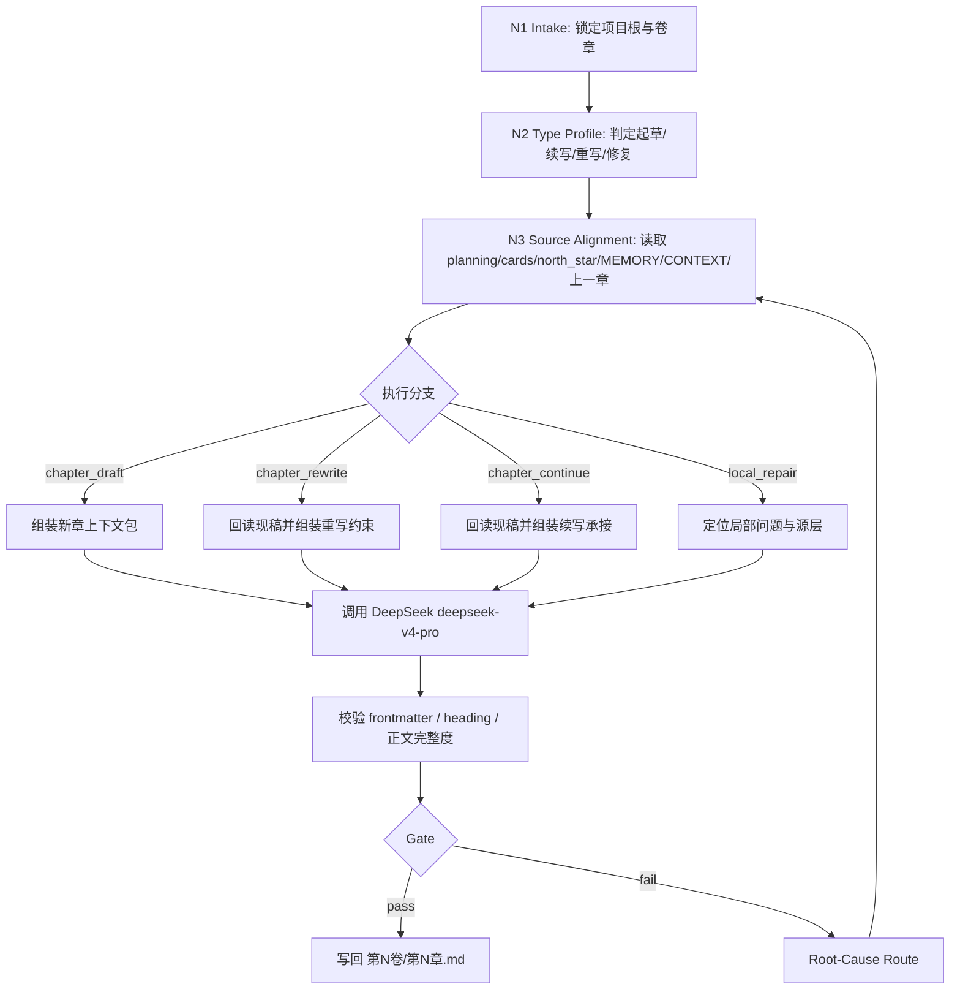

# 3-初稿 / C-Deepseek流

## Context Loading Contract

- 每次调用本技能时，必须同时加载同目录 `CONTEXT.md`。
- 每次调用本技能时，必须同时识别并加载同目录 `types/` 中选中的类型包（单选或多选）。
- 必须回读 story 根层 `../../SKILL.md` 与 `../../CONTEXT.md`，先锁定 `story2026` 总线边界，再进入当前 chapter-native 正文创作。
- 若 `../SKILL.md` 与 `../CONTEXT.md` 非空，必须同时读取作为 `3-初稿` 阶段路由层。
- 必须同时读取 `../../_shared/context-loading-contract.md` 与 `../../_shared/core-constraints.md`。
- 必须同时读取 `.agents/skills/api/deepseek/SKILL.md` 与 `.agents/skills/api/deepseek/CONTEXT.md`，确认 DeepSeek provider 固定 `deepseek-v4-pro`、默认 `thinking=enabled`、`reasoning_effort=high`。
- 正式写作调用必须读取 `../_shared/supervised-drafting-review-loop-contract.md`，并默认启动 team supervision subagents；若上层策略阻断真实 subagents，必须按共享合同报告降级。
- 启动监制 subagents 前必须读取 `.agents/skills/team/SKILL.md + CONTEXT.md`，再只加载被选中的 team 成员技能 `SKILL.md + CONTEXT.md`。
- 若当前任务已绑定 `projects/story/<项目名>/`，必须先加载项目根 `MEMORY.md`，再按当前卷/章相关性加载项目根 `CONTEXT/` 中的上下文文件。
- 必须读取当前项目的三层 planning 真源、对象/风格真源与 `north_star.yaml`；具体清单见 `references/chapter-drafting-contract.md`。
- 若上一章正文已存在，必须读取它作为连续性增强输入；若不存在，不得因此阻塞本章起稿。
- 若目标文件已存在，必须先回读现有 `第N卷/第N章.md`，再决定是续写、重写还是局部重构。
- `CONTEXT.md` 只承载经验层 Type Map、Repair Playbook 与 Reusable Heuristics，不得重定义本入口合同。

## Purpose

`C-Deepseek流` 是 `story2026` 主链 `3-初稿` 阶段的 DeepSeek provider 路径。它负责在路由选择 DeepSeek 流时，把当前章 planning 义务、全局卡、风格卡、`north_star.yaml`、项目记忆、项目上下文与上一章承接，转成可落盘的中文小说章节。

它拥有：

- 当前章正文根文件写权：`projects/story/<项目名>/3-初稿/第N卷/第N章.md`
- 当前章 YAML frontmatter 的写权
- DeepSeek provider artifacts 的辅助落盘权

它不拥有：

- `0-初始化`、`1-设定`、`2-卷章规划` 的真源改写权
- `review` 的 PASS/FAIL 判定权
- `context-return` 的 validated actualization 写回权

## Mode Selection

| mode | 触发信号 | 主路径 |
| --- | --- | --- |
| `chapter_draft` | 当前章尚无正文，用户要求起草/写正文 | 读取上游真源后调用 DeepSeek 生成完整章节 |
| `chapter_rewrite` | 目标章已存在，用户要求重写/大修 | 先回读现有正文，再按当前 planning 与用户约束重写 |
| `chapter_continue` | 目标章已存在，用户要求续写或补全 | 保留已成立承接，补足未完成正文 |
| `local_repair` | 审查或用户指出局部问题 | 定位问题层，生成局部修复输入，由 DeepSeek 执行正文修复 |
| `dry_run` | 用户或调试要求只装配上下文包 | 只生成 messages pack 与报告，不调用 provider、不写正文真源 |

## Reference Loading Guide

| 场景 | 读取文件 |
| --- | --- |
| 需要章节输入、frontmatter、provider 与输出细则 | `references/chapter-drafting-contract.md` |
| 需要默认 subagents 监制、team 视角、code-reviewer 卷级返工闭环 | `../_shared/supervised-drafting-review-loop-contract.md` |
| 需要兼容旧 step-after-write 即时审计链路 | `../_shared/drafting-instant-validation-contract.md` |
| 需要执行拓扑、分支、汇流、失败回路 | `steps/chapter-drafting-workflow.md` |
| 需要识别并加载网文题材类型包、判定起草/重写/续写/修复/dry-run 类型 | `types/type-map.md` 与命中的 `types/网文/<题材>/` |
| 需要质量门禁、provider 证据与 reviewer 规则 | `review/review-contract.md` |
| 需要可复用写作与迁移经验 | `CONTEXT.md` 与 `knowledge-base/drafting-heuristics.md` |
| 需要章节文件骨架或 DeepSeek 系统提示 | `templates/chapter-root.template.md`、`templates/deepseek-system-prompt.md`、`templates/output-template.md` |
| 需要执行机械辅助 | `scripts/write_chapter_via_deepseek.py` |

## Input Contract

### Required Input

- 项目根：`projects/story/<项目名>/`
- 当前卷章定位：`volume_num / chapter_num` 或可由 `chapter_num` 推导的卷号
- 三层 planning：`2-卷章规划/整体规划.md`、`2-卷章规划/第N卷/卷规划.md`、`2-卷章规划/第N卷/第N章.md`
- 对象/风格真源：`0-初始化/north_star.yaml.global_contract`、`0-初始化/north_star.yaml.style_contract`
- 北极星：`0-初始化/north_star.yaml`
- DeepSeek provider：`.agents/skills/api/deepseek/scripts/deepseek_chat.py` 可运行且 `.env` 中有 `DEEPSEEK_API_KEY`

### Conditional Input

- `projects/story/<项目名>/MEMORY.md`：项目存在时必须加载。
- `projects/story/<项目名>/CONTEXT/**/*.md`：存在时按当前卷/章相关性加载。
- `projects/story/<项目名>/3-初稿/第N卷/第N-1章.md`：存在时作为承接增强。
- 当前目标章正文：存在时必须回读后再续写、重写或修复。

### Reject Or Block

- 缺少任一必需 planning、全局卡、风格卡或 `north_star.yaml`。
- 用户要求脚本、模板或本地会话直接替代实际 LLM 主创正文。
- DeepSeek provider 失败、认证失败、返回格式不合法，却要求静默写回。
- 输出路径被要求降格到平铺 `3-初稿/第N章.md`、`正文/` 或临时 sibling 文件。

## Actual Creative Engine

正式创作路径固定为：

1. 本地脚本锁路径、读 context、整理模板与约束。
2. 启动 team supervision subagents，按项目题材和当前章问题代入相关监制角色，产出 `supervision_packet`。
3. `.agents/skills/api/deepseek/scripts/deepseek_chat.py` 调用固定 `deepseek-v4-pro`，默认 `thinking=enabled` 与 `reasoning_effort=high`，负责实际生成完整章节 Markdown 文件，并吸收 `supervision_packet`。
4. 本地脚本校验返回内容是否满足 frontmatter / heading / 输出路径合同，再写回 `第N卷/第N章.md`。
5. 当前卷完成后进入 `review/final_acceptance`，默认以 10 章为卷单位调用 `code-reviewer` 与 mandatory 维度；失败后由 GPT/subagents 生成返工 brief，再回到本 lane 的 `local_repair`、`chapter_rewrite` 或整卷重写。
6. 返工优化时，若原稿属于本 lane，正文主创修复仍固定由 DeepSeek provider 执行；GPT/subagents 只负责拆解 review issues、生成 `repair_brief`、注入 prompt 约束、复核和聚合。

硬边界：

- “LLM-first creative authorship” 在本技能上的 owning provider 固定为 `.agents/skills/api/deepseek`。
- GPT/subagents 是监制层，DeepSeek 是正文执行层；不得把 GPT 手写正文冒充本 lane 的正常输出。
- `local_repair`、`chapter_rewrite` 与卷级返工同样适用本边界；“修复优化”不是切换到 GPT 直写的隐含许可。
- `scripts/write_chapter_via_deepseek.py` 只能装配上下文、调用 provider、校验返回与落盘，不得以规则拼接、模板灌字或启发式扩写替代正文主创。
- 未经用户显式改口，不得把本地 GPT 直写、手工改写或其他 provider 伪装成当前技能的正常主路径。
- 若 DeepSeek provider 因认证、网络、返回格式不合法或上层策略阻断而不可用，必须硬失败并报告阻断来源。

## Visual Maps



## Core Gates

- 必须先锁定当前章 planning，再读取 global/style/north-star；不得凭风格或世界观反推当前章义务。
- YAML 头只保留 `写作模型: Deepseek`；上下文引用、global/style/north-star 摘要与上一章路径由强加载和 sidecar 追溯。
- 正文主体必须是小说 prose，不得把 planning 中的标题、任务线或规避条目原样复制成正文段落。
- 正式写作必须有 `supervision_packet` 或明确的 subagent 降级报告；该包作为执行约束进入 DeepSeek messages，不写入正文 frontmatter。
- 输出路径固定为 `projects/story/<项目名>/3-初稿/第N卷/第N章.md`。
- provider 返回内容缺完整 YAML frontmatter、`写作模型: Deepseek` 或 `# 第N章｜章标题` 标题行时，禁止写回业务真源。
- DeepSeek provider artifacts 可落到项目 `reports/3-初稿/deepseek/.../`，但它们不是业务真源。
- 单章 writeback 只代表 candidate draft；当前卷通过 `review` 的卷级 aggregate PASS 后，才可称为 validated final draft。

## Root-Cause Execution Contract

失败追溯链固定为：

`Symptom -> Direct Cause -> Section Owner -> Source Contract -> Meta Rule Source`

| symptom | direct owner | rework target |
| --- | --- | --- |
| 草稿跑偏或 planning 语言直贴 | 章节正文细则层 | `references/chapter-drafting-contract.md` |
| 章节结构断裂、分支/汇流不清 | 思行网络层 | `steps/chapter-drafting-workflow.md` |
| 起草/续写/重写/修复误判，或题材类型包未加载 | 类型包层 | `types/type-map.md` 与命中的 `types/网文/<题材>/` |
| 监制 subagents 未启动、未降级说明或监制包未进入 messages | 监制调度层 | `../_shared/supervised-drafting-review-loop-contract.md` |
| 审查口号化或无法给 verdict | 质量门禁层 | `review/review-contract.md` |
| 卷级 `code-reviewer` 审计未触发或 findings 未回流 | review 汇流层 | `.agents/skills/story/review/SKILL.md` + `review/review-contract.md` |
| review 后 GPT/subagents 直接改写正文，导致 `写作模型: Deepseek` 与实际主创不一致 | lane ownership 层 | 本 `Actual Creative Engine` + `../_shared/supervised-drafting-review-loop-contract.md` |
| 输出路径、命名或模板冲突 | 入口与模板层 | `SKILL.md` Output Contract + `templates/output-template.md` |
| 脚本越权生成正文 | 自动化辅助层 | `scripts/write_chapter_via_deepseek.py` + AGENTS.md LLM-first 规则 |
| DeepSeek 参数或模型漂移 | provider 层 | `.agents/skills/api/deepseek/SKILL.md` |
| 可复用失败模式再次出现 | 经验层 | `CONTEXT.md` |

## Field Mapping

| field_id | directory_or_file | owner_role | must_contain | fail_code |
| --- | --- | --- | --- | --- |
| `FIELD-DSD-01` | `SKILL.md` | 入口与裁决层 | trigger、loading、mode、reference guide、root-cause、Output Contract | `FAIL-DSD-ENTRY` |
| `FIELD-DSD-02` | `references/` | 章节细则层 | input、frontmatter、provider、正文硬规则 | `FAIL-DSD-REFERENCE` |
| `FIELD-DSD-03` | `steps/` | 思行网络层 | node network、branch、merge、failure route | `FAIL-DSD-STEPS` |
| `FIELD-DSD-04` | `types/` | 类型包层 | `types/type-map.md`、网文题材包、固定上下文加载规则 | `FAIL-DSD-TYPES` |
| `FIELD-DSD-05` | `review/` | 质量门禁层 | verdict model、finding shape、provider evidence gate、review/code-reviewer handoff | `FAIL-DSD-REVIEW` |
| `FIELD-DSD-06` | `templates/` | 模板层 | chapter skeleton、system prompt、Output Contract Alignment | `FAIL-DSD-TEMPLATE` |
| `FIELD-DSD-07` | `scripts/` | 自动化辅助层 | context assembly、provider bridge、validation、writeback | `FAIL-DSD-SCRIPT` |
| `FIELD-DSD-08` | `CONTEXT.md` | 经验层 | Type Map、Repair Playbook、Reusable Heuristics | `FAIL-DSD-CONTEXT` |
| `FIELD-DSD-09` | `agents/openai.yaml` | 入口元数据层 | display name、short description、default prompt | `FAIL-DSD-AGENT` |

## Standard Invocation

```bash
python3 .agents/skills/story/3-初稿/C-Deepseek流/scripts/write_chapter_via_deepseek.py \
  --project-root "projects/story/<项目名>" \
  --chapter 12 \
  --supervision-packet "projects/story/<项目名>/reports/3-初稿/supervision/第2卷/第12章.yaml"
```

Dry run:

```bash
python3 .agents/skills/story/3-初稿/C-Deepseek流/scripts/write_chapter_via_deepseek.py \
  --project-root "projects/story/<项目名>" \
  --chapter 12 \
  --supervision-packet "projects/story/<项目名>/reports/3-初稿/supervision/第2卷/第12章.yaml" \
  --dry-run
```

## Output Contract

| field | contract |
| --- | --- |
| Required output | 当前章完整中文小说 Markdown 文件，以及必要的 DeepSeek provider sidecar artifacts。 |
| Output format | YAML frontmatter、空行、`# 第N章｜章标题`、章节正文；frontmatter schema 见 `references/chapter-drafting-contract.md`。 |
| Output path | 业务真源固定写入 `projects/story/<项目名>/3-初稿/第N卷/第N章.md`；provider artifacts 可写入 `projects/story/<项目名>/reports/3-初稿/deepseek/.../`。 |
| Naming convention | 卷目录使用 `第N卷`，章节文件使用 `第N章.md`；不得降格为平铺旧路径、`正文/` 或临时 sibling 文件。 |
| Completion gate | DeepSeek provider 真实命中；返回内容通过 frontmatter、必需字段、标题行与正文完整度校验；正式正文已写回 canonical path；必要 sidecar 能追溯 messages pack、raw output 与 writeback。 |
