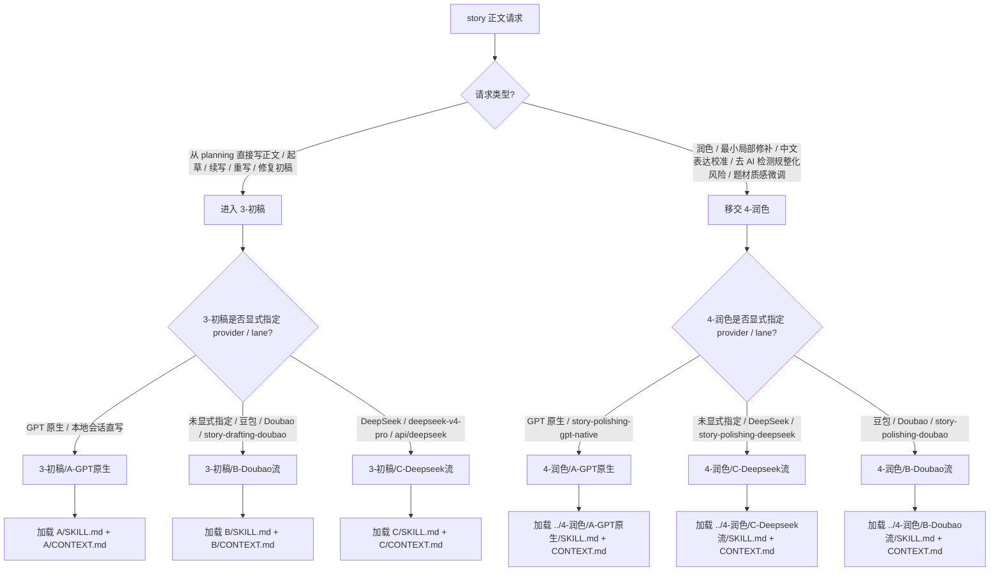

# 3-初稿

`3-初稿` 是 `story2026` 主链的章节正文阶段导引层。它不直接承载某个 provider 的长执行细则，而是负责把“写章节、续写、重写、局部修复、dry-run context pack”类请求路由到当前可执行子路径，并统一守住正文真源、加载顺序和输出门禁。

## Context Loading Contract

- 每次调用本技能时，必须同时加载同目录 `CONTEXT.md`。
- 必须回读 story 根层 `../SKILL.md` 与 `../CONTEXT.md`，先锁定 `story2026` 总线边界，再进入 `3-初稿` 阶段路由。
- 必须同时读取 `../_shared/context-loading-contract.md` 与 `../_shared/core-constraints.md`。
- 正式写作调用必须读取 `_shared/supervised-drafting-review-loop-contract.md`，并把当前项目 `team.yaml -> roles.production.members` 监制组、按领域“请教”顾问模式、`supervision_packet` 额外上下文和卷级 `review + code-reviewer` 返工闭环传递给被选 lane。
- 若当前任务已绑定 `projects/story/<项目名>/`，必须先加载项目根 `MEMORY.md`，再按当前卷/章相关性加载项目根 `CONTEXT/` 中的上下文文件。
- 路由到具体执行路径后，必须继续加载该子路径同目录 `SKILL.md + CONTEXT.md`；子路径采用 Skill 2.0 分区时，再按其 `Reference Loading Guide` 动态读取 `references/`、`steps/`、`types/`、`review/`、`templates/`、`scripts/` 与 `agents/`。
- `CONTEXT.md` 只承载阶段导引经验，不得重定义本入口合同或子路径执行合同。

## Purpose

本导引层只回答五件事：

1. 当前 drafting 请求是否属于 `3-初稿`。
2. 当前请求应该进入哪个可执行 lane。
3. 当前章正文 canonical truth 是否仍是 `projects/story/<项目名>/3-初稿/第N卷/第N章.md`。
4. 进入子路径前必须先加载哪些上游 truth。
5. 子路径完成后如何把结果回接到 story 主链与 `review`。

它拥有：

- `3-初稿` 阶段路由裁决权
- 当前章正文业务真源路径裁决权
- 子路径执行结果的回接与门禁解释权

它不拥有：

- `0-初始化`、`1-设定`、`2-卷章` 的真源改写权
- 具体 provider / GPT-native 的执行细则所有权
- `review` 的 PASS/FAIL 判定权
- `return` 的 validated actualization 写回权

## Lane Selection

| lane | 状态 | 触发信号 | 入口 |
| --- | --- | --- | --- |
| `B-Doubao流` | default active | 用户只说 `$story-drafting`、章节正文、按章创作、从 planning 直接写小说正文、强调中文网文气口、人话或没有点名其它 provider | `B-Doubao流/SKILL.md` |
| `A-GPT原生` | active explicit | 用户明确要求 GPT 原生、本地会话直写、不要外部 provider，或需要先由当前 GPT/LLM 产出 canonical draft 再由脚本校验落盘 | `A-GPT原生/SKILL.md` |
| `C-Deepseek流` | active explicit | 用户明确要求 DeepSeek、deepseek-v4-pro、高推理起草，或需要用 DeepSeek 直接生成初稿 | `C-Deepseek流/SKILL.md` |

分流图：

默认规则：

- 未明确 provider / lane 时，默认选择 `B-Doubao流`。
- 明确 GPT 原生时，选择 `A-GPT原生`。
- 明确豆包 / Doubao / doubao-seed-2.0-pro / `$story-drafting-doubao` 时，选择 `B-Doubao流`。
- 明确 DeepSeek / deepseek-v4-pro / `.agents/skills/api/deepseek` 时，选择 `C-Deepseek流`。
- 若用户诉求是“润色 / 最小局部修补 / 中文表达校准 / 去 AI 检测规整化风险 / 题材质感微调”，则不在 `3-初稿` 内部执行正文生成，而是移交 `4-润色`。
- 润色请求未显式指定 provider / lane 时，默认选择 `../4-润色/C-Deepseek流`，并采用最小局部修补策略。
- 润色请求显式点名 GPT 原生、DeepSeek 或 Doubao 时，分别移交 `../4-润色/A-GPT原生`、`../4-润色/C-Deepseek流`、`../4-润色/B-Doubao流`。
- 若用户点名的 lane 不存在、未激活或缺少 `SKILL.md + CONTEXT.md`，必须阻断并报告缺口，不得静默回退。

### Repair Lane Preservation

- 对 `review/final_acceptance`、`code-reviewer` 或用户反馈触发的初稿返工，默认必须回到原始起稿 lane 执行正文主创修复。
- 若原正文 `frontmatter` 为 `写作模型: Deepseek` 或本阶段记录的 `original_drafting_lane=C-Deepseek流`，则修复优化的正文改写仍必须进入 `C-Deepseek流` 的 `local_repair`、`chapter_rewrite` 或逐章重写路径。
- subagents 在返工中默认只拥有拆单、诊断、repair brief、prompt 约束、复核和聚合权；不得直接把 GPT worker 改写正文当作 B/C provider lane 的正常修复输出。
- 只有用户显式要求切换写作模型、改走 GPT 原生、本地直写或其它 provider 时，才允许改选 lane；此时必须同步更新正文 `写作模型`、sidecar 证据与最终报告，不得继续标记为原 provider 输出。
- 若原 lane provider 不可用，必须硬失败并报告 provider、权限、网络或认证阻断；不得静默降级为 GPT 直写。

## Input Contract

### Required Input

- 项目根：`projects/story/<项目名>/`
- 当前卷章定位：`volume_num / chapter_num`，或可由 `chapter_num` 推导卷号
- 三层 planning 真源：
  - `2-卷章/整体规划.md`
  - `2-卷章/第N卷/卷规划.md`
  - `2-卷章/第N卷/第N章.md`
- 对象/风格真源：
  - `0-初始化/north_star.yaml.global_contract`
  - `0-初始化/north_star.yaml.style_contract`
  - `0-初始化/north_star.yaml.genre_contract`
  - `1-设定/2-角色卡/**/*.json`
  - `1-设定/2-角色卡/角色关系图谱.md`
  - `1-设定/3-场景卡/**/*.json`
  - `1-设定/4-物品卡/**/*.json`
  - `1-设定/5-技能卡/**/*.json`
- 北极星：`0-初始化/north_star.yaml`

### Conditional Input

- `projects/story/<项目名>/MEMORY.md`：项目存在时必须加载。
- `projects/story/<项目名>/CONTEXT/**/*.md`：存在时按当前卷/章相关性加载。
- `projects/story/<项目名>/1-设定/2-角色卡/角色关系图谱.md`：存在时必须加载进 context pack，用于关系压力、联系方式、信息流、物件流和传导边；不得写入正文 frontmatter。
- `projects/story/<项目名>/3-初稿/第V卷/<本卷起始章>.md ... 第N-1章.md`：当前卷内早于目标章且已存在的所有前序章必须加载为同卷前文上下文；最近前章用于开章承接重点，其余前序章用于既成事实、线索状态、关系推进、道具流向、卷目标完成度、任务连续性、悬疑节奏把控性、任务余波和文气连续性。若当前卷无前序章，不得阻塞起稿。
- 当前目标章正文：若已存在，必须先回读，再进入续写、重写或局部修复。
- 章节正文字数目标：默认 `2500-4000字`；优先级为用户本轮明确指定 > 章级 planning 指定 > 卷级 planning 指定 > `north_star.yaml.project_identity.target_words / target_chapters` 推导 > 本默认区间。

### Reject Or Block

- 缺少任一必需 planning、全局卡、风格卡或 `north_star.yaml`。
- 用户要求把脚本、模板、规则拼接或启发式补写当成章节正文主创。
- 输出路径被要求降格到平铺 `3-初稿/第N章.md`、`正文/`、`Drafting/chNNNN/chapter-root.md` 或临时 sibling 文件。
- 用户点名某 lane，但该 lane 缺少可执行合同、脚本、模板或 provider key。
- 子路径生成内容缺完整 YAML frontmatter、`写作模型`、`字数` 或 `# 第N章｜章标题` 标题行，却要求静默写回。

## Reference Loading Guide

| 场景 | 读取文件 |
| --- | --- |
| 需要默认 provider 执行 | `B-Doubao流/SKILL.md` + `B-Doubao流/CONTEXT.md` |
| 需要 GPT 原生执行 | `A-GPT原生/SKILL.md` + `A-GPT原生/CONTEXT.md` |
| 需要豆包 provider 执行 | `B-Doubao流/SKILL.md` + `B-Doubao流/CONTEXT.md` |
| 需要 DeepSeek provider 执行 | `C-Deepseek流/SKILL.md` + `C-Deepseek流/CONTEXT.md` |
| 需要润色且未显式指定 provider | `../4-润色/SKILL.md` + `../4-润色/CONTEXT.md`，再加载 `../4-润色/C-Deepseek流/SKILL.md` + `../4-润色/C-Deepseek流/CONTEXT.md` |
| 需要润色且显式指定 GPT 原生 / Doubao / DeepSeek | `../4-润色/SKILL.md` + `../4-润色/CONTEXT.md`，再加载对应 `../4-润色/<lane>/SKILL.md` + `CONTEXT.md` |
| 需要默认 subagents 监制、项目 `team.yaml` 监制组请教模式与卷级审计返工闭环 | `_shared/supervised-drafting-review-loop-contract.md` |
| 需要兼容旧 step-after-write 即时审计链路 | `_shared/drafting-instant-validation-contract.md` |
| 需要确认 story 总线路由 | `../SKILL.md` + `../CONTEXT.md` |
| 需要确认共享加载与核心创作约束 | `../_shared/context-loading-contract.md`、`../_shared/core-constraints.md` |
| 需要查询 registry 当前入口 | `.codex/registry/routes.yaml`、`.codex/registry/skills.yaml` |
| 父级导引最小结构 | 本父级导引 skill 只要求同目录 `SKILL.md + CONTEXT.md`；provider lane 的 types、templates、review、scripts 与主创合同归 A/B/C 子路径 |

## Execution Flow

1. 锁定项目根、卷号、章号与用户意图。
2. 读取 story 根层与本目录 `CONTEXT.md`，确认 canonical output 仍是 `3-初稿/第N卷/第N章.md`。
3. 检查上游 truth 是否齐备：三层 planning、全局卡、风格卡、`north_star.yaml`、项目 `MEMORY.md`、相关项目 `CONTEXT/`、同卷全部前序章或现有目标章。
4. 按 `Lane Selection` 选择唯一 lane。
   - 若请求实际属于润色，停止 `3-初稿` 写作流程，按分流图移交 `4-润色`；润色未显式指定 provider 时默认进入 `4-润色/C-Deepseek流`，并保持最小局部修补。
5. 加载该 lane 的 `SKILL.md + CONTEXT.md`，继续由子路径完成具体 context pack、主创、校验、sidecar 与 writeback。
6. 正式写作时，要求子路径按共享合同读取项目 `team.yaml`，优先调用 `roles.production.members` 中已指定的监制组成员作为资深创作顾问；主 agent 按当前章需要向不同领域大师提出具体类型问题，汇流创意脑洞、个人风格判断和可执行指导，形成 `supervision_packet` 作为额外重要上下文。若真实 subagents 被阻断，子路径必须留下降级报告。
7. 子路径完成后，确认业务真源写回 `projects/story/<项目名>/3-初稿/第N卷/第N章.md`；默认不生成项目级过程产物。
8. 无论本轮是父技能路由还是 A/B/C lane 单独调用，完成或失败后都必须调用 `workflow_manager.py record-skill-completion` 写入项目状态；普通 skill 执行不得只落正文文件。
9. 单章完成只标记 candidate draft；当前卷默认 10 章完成后，进入 `review/final_acceptance` 并汇流 `code-reviewer` findings；失败按 aggregate 的 `rework_targets` 回到原 lane。
10. 返工闭环必须保持 lane ownership：A lane 可由 GPT 原生修复；B/C lane 必须由对应 provider 执行正文修复，GPT/subagents 只生成 repair brief 与复核结果。

## Core Gates

- `3-初稿` 只能消费 planning、cards、north-star、项目记忆与项目上下文，不得替上游真源补写设定。
- YAML frontmatter 只要求包含 `写作模型` 与 `字数`；`写作模型` 取值只能为 `GPT`、`Doubao`、`Deepseek`，并必须与所选 lane 一致；`字数` 必须写作 `XXX字` 格式。planning、cards、north-star、项目上下文和同卷前文引用由强上下文加载与 sidecar 承载，不重复写入正文头部。
- 默认章节正文必须落在 `2500-4000字`；若用户或上游 planning 明确给出其它区间，子路径必须把最终生效区间写入 context pack / messages pack / dry-run summary，并按该区间校验最终正文实际长度。
- 正文主体必须是中文小说 prose，不得把 planning 标题、任务线或规避条目原样贴成正文。
- 正文不得用脸部颜色变化作为惊吓、羞窘、愤怒或震动的默认表达捷径，尤其避免“吓得脸都白了 / 脸红了 / 脸白了 / 脸黄了 / 脸绿了 / 脸色惨白 / 脸色大变”等模板化措辞；必须改用动作停顿、呼吸、手部细节、步伐、视线、物件误触、话语断裂、空间退让或角色身份相关反应来呈现情绪。
- 业务真源路径固定为 `projects/story/<项目名>/3-初稿/第N卷/第N章.md`。
- 本阶段正式产物只写入 `projects/story/<项目名>/3-初稿/`，默认不生成额外项目产物。
- `review` 以前的 drafting 完成只表示 candidate draft 完成，不等于 validated final draft。
- 正式写作的 lane handoff 必须携带 `supervision_packet` 路径或 subagent 降级报告；有效 `supervision_packet` 必须能追溯项目 `team.yaml` roster、请教问题、顾问回答摘要和最终可执行指导。A 是 GPT 隔离监制 + GPT 主写作，B/C 是 GPT 监制层 + 外部 provider 执行层。

## Root-Cause Execution Contract

失败追溯链固定为：

`Symptom -> Direct Cause -> Section Owner -> Source Contract -> Meta Rule Source`

| symptom | direct owner | rework target |
| --- | --- | --- |
| 未明确 provider 却误走非默认 lane | 阶段导引层 | 本 `Lane Selection` |
| GPT 原生或豆包执行细则缺失 | 子路径入口层 | 对应 lane 的 `SKILL.md` |
| `B-Doubao流` 缺 registry 或 provider 证据链 | 子路径 provider 层 | `B-Doubao流/SKILL.md` + `.agents/skills/api/anyfast/llm/doubao-seed-2.0-pro/SKILL.md` |
| `C-Deepseek流` 缺 provider 或证据链 | 子路径 provider 层 | `C-Deepseek流/SKILL.md` + `.agents/skills/api/deepseek/SKILL.md` |
| 输出漂到旧路径、平铺路径或临时文件 | 阶段导引层 + 子路径 Output Contract | 本 `Core Gates` + 子路径 `Output Contract` |
| 草稿跑偏或 planning 语言直贴 | 子路径章节细则层 | 对应 lane 的 `references/chapter-drafting-contract.md` |
| 起草/续写/重写/修复误判 | 子路径类型策略层 | 对应 lane 的 `types/drafting-type-map.md` |
| 脚本越权主创正文 | 子路径脚本层 | 对应 lane 的 `scripts/` + AGENTS.md LLM-first 规则 |
| 监制 subagents 或卷级 `code-reviewer` 闭环缺失 | 共享监制/审计合同层 | `_shared/supervised-drafting-review-loop-contract.md` + `review/SKILL.md` |
| review 失败后 GPT/subagents 直接修复 B/C 正文并继续标记原 provider | lane ownership 层 | 本 `Repair Lane Preservation` + `_shared/supervised-drafting-review-loop-contract.md` |
| 审查或恢复链仍依赖旧八步 runtime | 兼容合同层 | `_shared/drafting-instant-validation-contract.md` |

## Lite Tier Field Mapping

| field_id | step_id | intent | required_output | fail_code | rework_entry |
| --- | --- | --- | --- | --- | --- |
| `FIELD-DRAFT-ROUTE-01` | `N1-LANE` | 判断当前 drafting 请求进入哪个 lane | `selected_lane`、`selection_reason` | `FAIL-DRAFT-ROUTE` | 回到 `Lane Selection` |
| `FIELD-DRAFT-LOAD-02` | `N2-LOAD` | 固定 story 根层、项目记忆、项目上下文与子路径上下文加载 | `loading_plan` | `FAIL-DRAFT-LOAD` | 回到 `Context Loading Contract` |
| `FIELD-DRAFT-TRUTH-03` | `N3-TRUTH` | 锁定当前章正文唯一业务真源 | `canonical_output_path` | `FAIL-DRAFT-TRUTH` | 回到 `Core Gates` |
| `FIELD-DRAFT-HANDOFF-04` | `N4-HANDOFF` | 把执行移交到唯一子路径 | `lane_handoff` | `FAIL-DRAFT-HANDOFF` | 加载对应 lane `SKILL.md + CONTEXT.md` |
| `FIELD-DRAFT-CLOSE-05` | `N5-CLOSE` | 确认 writeback、sidecar 与下一跳 | `completion_summary`、`next_stage` | `FAIL-DRAFT-CLOSE` | 回到 `Execution Flow` |

## Output Contract

| field | contract |
| --- | --- |
| Required output | 对本阶段而言，必须产生唯一 lane 选择、加载计划、canonical output 路径确认，并由被选 lane 产出当前章完整中文小说 Markdown 文件。 |
| Output format | 阶段导引输出为路由与门禁说明；正文输出格式由被选 lane 的 `Output Contract` 定义，最低要求为 YAML frontmatter（含 `写作模型`、`字数`）、空行、`# 第N章｜章标题`、章节正文。 |
| Output path | 业务真源固定写入 `projects/story/<项目名>/3-初稿/第N卷/第N章.md`。 |
| Naming convention | 卷目录使用 `第N卷`，章节文件使用 `第N章.md`；不得回退到 `第N集.md`、`Drafting/chNNNN/chapter-root.md`、`正文/` 或临时 sibling 文件。 |
| Completion gate | 已选择唯一可执行 lane；已加载 lane `SKILL.md + CONTEXT.md`；上游 truth 与项目上下文加载齐备；被选 lane 完成 LLM-first 主创、校验与 writeback；最终章节已落盘到 `3-初稿/第N卷/第N章.md`。 |
| State gate | 父技能使用 `--skill-id story-drafting`；lane 单独调用时分别使用 `story-drafting-gpt-native / story-drafting-doubao / story-drafting-deepseek`，并在 `--chapter`、`--volume` 与 `--artifacts` 中记录当前章、当前卷和正文路径。 |
