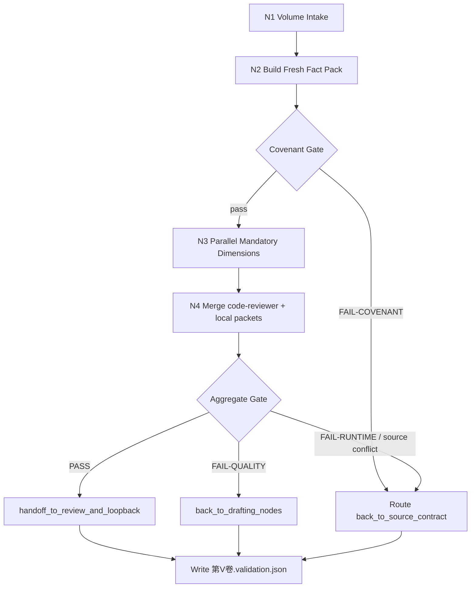
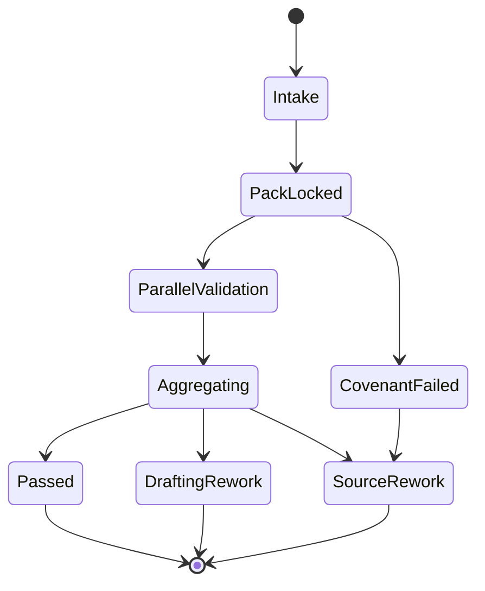

# 4-Review

`4-Review` 是 `story2026` 的卷级终验父 skill。它不直接修改正文，不替代 `review/` 写业务审查报告，也不替代 `5-Loopback` 回写 validated truth；它只锁定同一轮卷级事实包，调度 mandatory 维度审查，聚合唯一 gate JSON，并裁决返工或下游交接。

## Context Loading Contract

- 每次调用本技能时，必须同时加载同目录 `CONTEXT.md`。
- 若当前任务绑定 `projects/story/<项目名>/`，先加载项目根 `MEMORY.md`，再加载项目根 `CONTEXT/` 中与终验相关的材料。
- 进入任一子技能前，必须先回读本 `SKILL.md`、`references/root-runtime-contract.md`、`references/shared-runtime-carrier.md`、`_shared/validation-root-contract.md`、`_shared/validation-child-output-contract.md`。
- `_shared/` 仍是当前运行时兼容载体；Skill 2.0 的入口、路由、迁移矩阵与维护说明统一从 `references/`、`steps/`、`review/`、`types/`、`templates/` 进入。
- 冲突优先级：用户显式请求 > 根 `AGENTS.md` / meta 规则 > `.agents/skills/story/SKILL.md` > 本 `SKILL.md` > 当前分区合同 > 子技能 `SKILL.md` > `CONTEXT.md`。

## Input Contract

- Accepted input:
  - 对某个小说项目执行卷级终验、隔离评估、validation 聚合或返工路由。
  - 修复 `4-Review` 的维度 registry、fact pack、aggregate JSON、child sidecar 或 reviewer 汇流问题。
  - 升级或维护本阶段的 Skill 2.0 结构、动态引用、模板与审计门禁。
- Required input:
  - `project_root`
  - `volume_ref`
  - 当前卷正文快照：`projects/story/<项目名>/3-Drafting/第V卷/第N章.md`
  - 当前卷写作日志：`projects/story/<项目名>/3-Drafting/第V卷.写作日志.yaml`
  - `0-Init`、`1-Cards`、`2-Planning` 对应真源切片
  - 当前轮动态生成的 `validation_fact_pack`
- Optional input:
  - 指定审查维度、指定 reviewer sidecar、指定重跑策略、历史 aggregate JSON、项目级补充上下文。
- Reject or clarify when:
  - 没有可定位项目根或卷号。
  - 用户要求跳过 mandatory 维度并仍宣称正式 PASS。
  - `validation_fact_pack` 缺 required slice，或试图复用旧轮残包。
  - 用户要求本阶段直接改写 `3-Drafting` 正文、`review/` 报告真源或 `5-Loopback` actualization。

## Mode Selection

| mode | trigger | route |
| --- | --- | --- |
| `final_acceptance` | 对当前卷做正式终验 | 读取 `types/review-type-map.md`，执行 `steps/review-workflow.md` 的卷级主干 |
| `repair_validation` | aggregate、sidecar、fact pack、registry 或 source trace 异常 | 读取 `references/root-runtime-contract.md` 与 `review/review-gate.md` |
| `dimension_maintenance` | 新增、停用、改名或改路由某个维度 | 读取 `references/shared-runtime-carrier.md`、`扩维与调整指南.md`、registry |
| `skill_upgrade_repair` | 修复本阶段 Skill 2.0 分区、模板、agent metadata 或文档漂移 | 读取 `references/legacy-upgrade-matrix.md` 与本包 canonical 分区 |

## Reference Loading Guide

| 场景 | 读取文件 |
| --- | --- |
| 锁定父层拥有/不拥有、runtime 路径、aggregate 单一真源 | `references/root-runtime-contract.md` |
| 理解 `_shared/` 与 Skill 2.0 canonical 分区的兼容边界 | `references/shared-runtime-carrier.md` |
| 追溯本次旧包升级的去向、风险和验证门 | `references/legacy-upgrade-matrix.md` |
| 执行正式终验主干、并行维度、聚合与返工路由 | `steps/review-workflow.md` |
| 判定任务类型、输入形态、执行模式与审查方式 | `types/review-type-map.md` |
| 执行质量门禁、provider 接入和 verdict 汇总 | `review/review-gate.md` |
| 复用终验经验、失败模式和维护打法 | `knowledge-base/review-heuristics.md` 与 `CONTEXT.md` |
| 生成或核对交付样式 | `templates/output-template.md` |
| 使用本地 runner 或维护脚本边界 | `scripts/README.md` 与 `.agents/skills/story/scripts/review_runner.py` |
| 产品侧入口元数据 | `agents/openai.yaml` |

## Visual Maps

## Core Execution Contract

1. 锁定 `project_root`、`volume_ref`、`chapter_refs`、正文快照和当前卷写作日志。
2. 动态生成本轮 `validation_fact_pack`；不得复用旧包。
3. 按 `_shared/validation-dimension-registry.yaml` 中 `final_acceptance.mandatory = true` 的维度集合并发调度子技能或 provider。
4. 默认以 `code-reviewer` 作为独立审计 provider；其 findings 必须映射回 `issues / severity_counts / rework_targets / source_trace`。
5. 子技能只产出 `dimension_packet + dimension_report_ref`；父层独占 `validation_status / routing_decision / handoff_targets`。
6. 聚合结果只落到 `projects/story/<项目名>/4-Review/第V卷.validation.json`；维度 sidecar 只落到 `projects/story/<项目名>/4-Review/第V卷/`。
7. 若上游 truth 自相矛盾，优先走 `back_to_source_contract`，不得要求 `3-Drafting` 替上游冲突背锅。
8. 若聚合 PASS，交给 `review/` 与 `5-Loopback`；若失败，输出精确到章节、worker 或 source owner 的返工入口。

## Root-Cause Execution Contract

遇到失败时按以下链路上溯：

`Symptom -> Direct Cause -> Section Owner -> Source Contract -> Meta Rule Source`

| symptom | direct cause | section owner | source contract | rework target |
| --- | --- | --- | --- | --- |
| 缺卷级 aggregate 或下游消费 sidecar | gate truth 漂移 | `references/root-runtime-contract.md` | `_shared/validation-root-contract.md` | 修 aggregate sink 与下游引用 |
| 子技能并发读取不同事实包 | pack 锁定失败 | `steps/review-workflow.md` | `_shared/validation-fact-pack-spec.md` | 重建当前轮 pack 后重跑 |
| `code-reviewer` findings 没进入 JSON | provider 汇流缺口 | `review/review-gate.md` | `_shared/checker-output-schema.md` | 映射 findings 到 issues |
| mandatory 维度被跳过 | registry 调度失效 | `references/shared-runtime-carrier.md` | `_shared/validation-dimension-registry.yaml` | 修 registry / runner |
| 返工错误打回 drafting | source trace 缺失 | `review/review-gate.md` | `_shared/validation-child-output-contract.md` | 补 `source_layer_owner` |
| Skill 2.0 分区断链 | 动态引用或目录漂移 | 本 `SKILL.md` | `references/legacy-upgrade-matrix.md` | 修 canonical 分区并跑 validator |

## Field Mapping

| field_id | owner | required_output | fail_code | validation_gate |
| --- | --- | --- | --- | --- |
| `FIELD-REV-01` | `SKILL.md` | 输入边界、模式路由、动态引用、输出验收 | `FAIL-REVIEW-ENTRY` | `validate_skill_2_0.py` |
| `FIELD-REV-02` | `references/` | 父层边界、共享载体、迁移矩阵 | `FAIL-REVIEW-REFERENCE` | 链接与语义检查 |
| `FIELD-REV-03` | `steps/` | 卷级 intake、pack、并发、聚合、route 主干 | `FAIL-REVIEW-STEPS` | workflow gate |
| `FIELD-REV-04` | `types/` | 任务类型与审查 profile | `FAIL-REVIEW-TYPES` | type profile gate |
| `FIELD-REV-05` | `review/` | provider 接入、verdict model、质量门禁 | `FAIL-REVIEW-GATE` | review verdict |
| `FIELD-REV-06` | `templates/` | aggregate 输出模板对齐 | `FAIL-REVIEW-TEMPLATE` | Output Contract Alignment |
| `FIELD-REV-07` | `scripts/` | 机械 runner 与维护说明 | `FAIL-REVIEW-SCRIPT` | runner smoke / path check |
| `FIELD-REV-08` | `knowledge-base/` | 复用经验与维护打法 | `FAIL-REVIEW-KB` | context health check |
| `FIELD-REV-09` | `agents/` | 产品侧入口元数据 | `FAIL-REVIEW-AGENT` | metadata validator |

## Output Contract

- Required output:
  - 正式运行时交付唯一卷级聚合 JSON：`第V卷.validation.json`。
  - 维护或升级任务交付本 Skill 2.0 包的 canonical 分区、迁移记录、验证结果与残余风险。
- Output format:
  - 运行时：JSON aggregate + 维度 MD sidecars + 可追溯 reviewer sidecar。
  - 技能维护：Markdown 合同、YAML metadata、模板、脚本说明与验证报告。
- Output path:
  - 运行时 aggregate：`projects/story/<项目名>/4-Review/第V卷.validation.json`。
  - 运行时 sidecars：`projects/story/<项目名>/4-Review/第V卷/`。
  - 技能维护：原地更新 `.agents/skills/story/4-Review/`。
- Naming convention:
  - aggregate 使用 `第V卷.validation.json`。
  - 维度报告文件名以 `_shared/validation-dimension-registry.yaml -> report_filename` 为准。
  - 技能分区文件使用 kebab-case 英文文件名，既有中文子技能目录保持稳定。
- Completion gate:
  - 运行时：pack、正文快照、mandatory sidecars、provider findings 与 aggregate JSON 均可追溯；aggregate 给出 `validation_status / routing_decision / handoff_targets`。
  - 技能维护：`python3 /Users/vincentlee/.codex/skills/meta/构建/技能/skill-工作车间/scripts/validate_skill_2_0.py .agents/skills/story/4-Review` 通过，并补充必要引用扫描结果。
