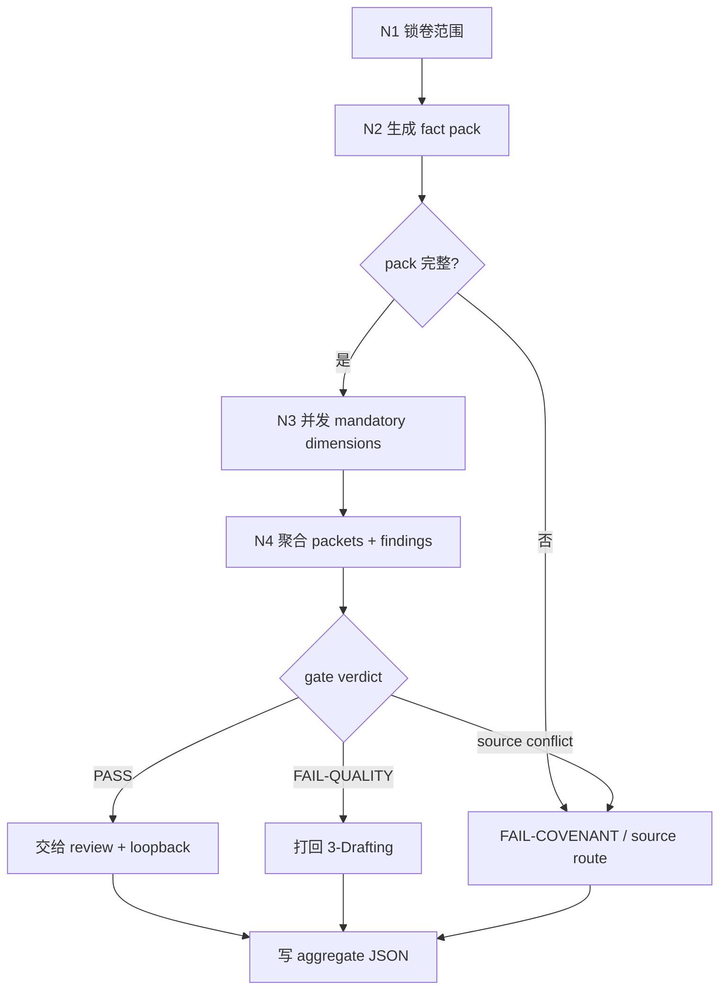

# Review Workflow

本文件是 `4-Review` 的思行网络真源。它描述卷级终验的判断、动作、证据、路由与失败回路。

## Business Requirement Analysis

| slot | conclusion |
| --- | --- |
| `business_goal` | 判断当前卷是否可以作为 validated 创作单元交给 `review/` 与 `5-Loopback`。 |
| `business_object` | 当前卷正文、写作日志、init/cards/planning truth、validation fact pack、维度 sidecars。 |
| `constraint_profile` | 先锁同一轮 pack，再并发维度审查，最后由父层唯一聚合裁决。 |
| `success_criteria` | aggregate JSON 可追溯、可路由、可被下游唯一消费。 |
| `non_goals` | 不改正文、不写正式业务审查报告、不执行 actualization。 |
| `complexity_source` | 并行维度、provider findings、source trace 与卷级汇流。 |
| `topology_fit` | hybrid：前段串行锁包，中段并行审查，后段串行聚合与路由。 |

## Thinking-Action Network

| node_id | objective | inputs | actions | evidence | route_out | gate |
| --- | --- | --- | --- | --- | --- | --- |
| `N1-VOLUME-INTAKE` | 锁定项目、卷、章节与候选正文 | `project_root`、`volume_ref`、draft refs、volume log | 列出 `chapter_refs` 与正文快照引用 | `volume_scope` | `N2-CONTEXT-PACK` | 卷范围明确 |
| `N2-CONTEXT-PACK` | 生成当前轮 fact pack | init/cards/planning/draft/runtime slices | 组装 `validation_fact_pack` 并检查 required slices | `pack_ref`、missing slice list | `N3-PARALLEL-VALIDATION` 或 `N5-ROUTE-HANDOFF` | 缺片直接 `FAIL-COVENANT` |
| `N3-PARALLEL-VALIDATION` | 并发执行 mandatory 维度 | registry、pack、正文快照 | 调度子技能 / provider，收集 packet 与 report refs | `dimension_packets` | `N4-AGGREGATE-GATE` | 所有 mandatory 均有结果 |
| `N4-AGGREGATE-GATE` | 汇流维度与 reviewer findings | dimension packets、code-reviewer findings、schema | 映射 issues、severity、source trace、scores、route | aggregate payload | `N5-ROUTE-HANDOFF` | JSON 字段完整 |
| `N5-ROUTE-HANDOFF` | 裁决 PASS / 返工 / 上溯 | aggregate payload | 写入 `第V卷.validation.json`，给出 handoff targets | validation ref | done | 下游只消费 aggregate |

## Branch And Merge Rules

- `N1` 与 `N2` 必须串行，不能在 pack 未锁定前启动子技能。
- `N3` 必须并发执行 registry 中所有 `final_acceptance.mandatory = true` 的维度。
- 每个子技能只写自己的维度 sidecar，不得写 aggregate JSON。
- `N4` 必须把 provider findings 映射进父层 aggregate，不允许只保留外部 sidecar。
- 任一维度发现 source truth 冲突，`N5` 优先输出 `back_to_source_contract`。

## Failure Loops

| failure | route |
| --- | --- |
| `FAIL-COVENANT` | 回 `N2` 重建 pack；若 source 缺失，route `back_to_source_contract` |
| `FAIL-RUNTIME` | 回 `N3` 重跑缺失维度或修 provider 汇流 |
| `FAIL-QUALITY` | 输出 `back_to_drafting_nodes`，修后重新从 `N1` 进入 |
| source conflict | 输出 `back_to_source_contract`，修 source 后重新从 `N1` 进入 |

## Mermaid Pattern

