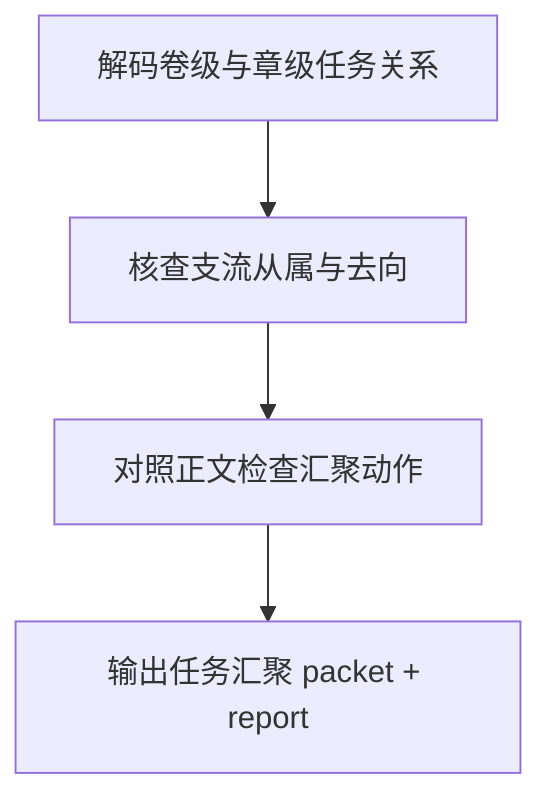

# 4-Review / 任务汇聚

## Context Loading Contract

- 每次调用本技能时，必须同时加载同目录 `CONTEXT.md`。
- 必须回读父层 `4-Review/SKILL.md`、`../_shared/validation-root-contract.md`、`../_shared/validation-child-output-contract.md`。
- 正式审查前，必须读取锁定后的 `validation_fact_pack.volume_planning_summary`、`validation_fact_pack.chapter_planning_packets` 与当前卷正文集合。

## Invocation Modes

- `final_acceptance`
  - 被 `4-Review` 父层在卷级终验中并发调用，参与最终 `validation_status` 聚合。

## Parent Positioning

本 child 负责：

- 检查卷级主线/支线是否明确从属于上游主任务
- 检查章级任务是否明确挂靠卷级任务，而不是游离副本
- 检查支流任务是否在正文中完成 `汇聚 / 转挂 / 显式保留开放`
- 检查 planning truth 是否给出了足够明确的任务去向合同

它不负责：

- 判断任务本身是否已经写成戏
- 替代连续性判断跨章承接
- 替代结构兑现判断事件是否落地
- 替代逻辑自洽判断世界规则是否成立

## Canonical Sources

- `../SKILL.md`
- `../CONTEXT.md`
- `../_shared/validation-root-contract.md`
- `../_shared/validation-child-output-contract.md`
- `../_shared/validation-fact-pack-spec.md`
- `../_shared/checker-output-schema.md`

## Business Requirement Analysis Contract

| analysis_slot | 当前结论 |
| --- | --- |
| `business_goal` | 判断支流任务是否真正服务主任务，而不是写成独立飘走的副本。 |
| `business_object` | `validation_fact_pack.volume_planning_summary`、`chapter_planning_packets`、当前卷正文集合。 |
| `constraint_profile` | 先看 planning 是否显式声明 `从属 / 汇聚 / 转挂 / 保留开放`，再看正文是否兑现；若 planning 自身未声明，优先打回 `2-Planning`。 |
| `success_criteria` | 能明确回答“这条支流在服务什么主任务、在哪里汇、没汇时去哪里、正文是否给了证据”。 |
| `topology_fit` | `task lineage decode -> branch route check -> manuscript convergence check -> report packet` |

## Total Input Contract

- 必需输入：
  - `validation_fact_pack.volume_planning_summary`
  - `validation_fact_pack.chapter_planning_packets`
  - 当前卷正文集合
- 硬规则：
  - 若 planning truth 缺 `上承 / 汇聚 / 去向` 槽位，直接标记 `source_layer_owner=2-Planning`。
  - 允许支流本卷不完全回收，但必须显式写明 `转挂 / 延后 / 保留开放` 去向。
  - 不能把“有支线”默认等同于“已服务主线”。

## Output Contract

- `role_id`:
  - `task-convergence-validator`
- `dimension_packet`:
  - 至少包含 `unanchored_chapter_tasks`、`branch_merge_gaps`、`orphan_branch_count`、`open_branch_without_route`
- `dimension_report_ref`:
  - `4-Review/第V卷/任务汇聚.md`
- 默认返工节点：
  - `source-contract-fix`
  - `1-单章叙事起盘`
  - `7-追读力强化`

## Visual Map

## Thinking-Action Network

| node_id | field_id | objective | actions | evidence | route_out | gate |
| --- | --- | --- | --- | --- | --- | --- |
| `N1-LINEAGE-DECODE` | `FIELD-TC-01` | 锁定主从任务树 | 解码卷级 `上承 / 主线 / 支线` 与章级 `上承 / 主线 / 支线` | `lineage_note` | -> `N2` | 任务从属清楚 |
| `N2-BRANCH-ROUTE-CHECK` | `FIELD-TC-02` | 核查支流去向合同 | 检查每条支流是否标记 `汇聚 / 转挂 / 保留开放` | `route_note` | -> `N3` | 支流去向明确 |
| `N3-MANUSCRIPT-CONVERGENCE` | `FIELD-TC-03` | 对照正文检查汇聚动作 | 核查正文是否给出回主线、转挂或显式保留的证据 | `merge_note` | -> `N4` | 正文证据充分 |
| `N4-PACKET-WRITE` | `FIELD-TC-04` | 输出任务汇聚结论 | 生成 `dimension_packet + report_ref` | `packet_note` | done | 只写本维度 |

## Lite Field Contract

| field_id | output_slot | pass_standard | fail_code | rework_entry |
| --- | --- | --- | --- | --- |
| `FIELD-TC-01` | lineage map | 章级/卷级任务从属可上溯 | `FAIL-TC-01` | `N1` |
| `FIELD-TC-02` | branch route | 每条支流都存在明确去向合同 | `FAIL-TC-02` | `N2` |
| `FIELD-TC-03` | convergence evidence | 正文存在汇聚/转挂/保留开放证据 | `FAIL-TC-03` | `N3` |
| `FIELD-TC-04` | dimension packet | 报告完整、可聚合、可回指 source owner | `FAIL-TC-04` | `N4` |

## Completion Contract

- 已明确指出哪些支流从属于主任务，哪些支流失锚。
- 已区分 `未汇聚但有去向` 与 `未汇聚且无去向`。
- 报告已给出 source route 或正文返工入口。

## Reference Loading Guide

| 场景 | 读取文件 |
| --- | --- |
| 维度审查入口与父层边界 | `../SKILL.md`、`../references/root-runtime-contract.md` |
| 任务汇聚步骤网络 | `steps/validation-flow.md` |
| 维度判据与共享字段 | `references/README.md`、`../_shared/validation-child-output-contract.md` |
| 质量门禁与 reviewer 汇流 | `review/review-gate.md` |
| 类型化输入画像 | `types/type-map.md` |
| 输出样式 | `templates/output-template.md` |
| 脚本边界 | `scripts/README.md` |
| 可复用经验 | `knowledge-base/heuristics.md` 与 `CONTEXT.md` |
| 产品侧入口 | `agents/openai.yaml` |

## Root-Cause Execution Contract

`Symptom -> Direct Cause -> Section Owner -> Source Contract -> Meta Rule Source`

若支流失锚但 planning 未声明去向，优先判 `source_layer_owner=2-Planning`；若正文缺汇聚证据，再打回 drafting 对应 step。

## Field Mapping

| field_id | owner | required_output | fail_code |
| --- | --- | --- | --- |
| `FIELD-TC-ENTRY` | `SKILL.md` | 输入、边界、维度 verdict 与父层回接 | `FAIL-TC-ENTRY` |
| `FIELD-TC-STEPS` | `steps/` | 任务谱系、支流去向、正文汇聚证据 | `FAIL-TC-STEPS` |
| `FIELD-TC-REVIEW` | `review/` | 维度门禁与 packet 可聚合性 | `FAIL-TC-REVIEW` |

## Skill 2.0 Output Contract

- Required output: 任务汇聚 `dimension_packet` 与 `dimension_report_ref`。
- Output format: Markdown 维度报告 + 父层可聚合结构化 packet。
- Output path: `projects/story/<项目名>/4-Review/第V卷/任务汇聚.md`。
- Naming convention: report filename 以父层 registry 的 `report_filename` 为准。
- Completion gate: packet 区分 source route 与正文返工入口，且不写父层 gate 字段。
