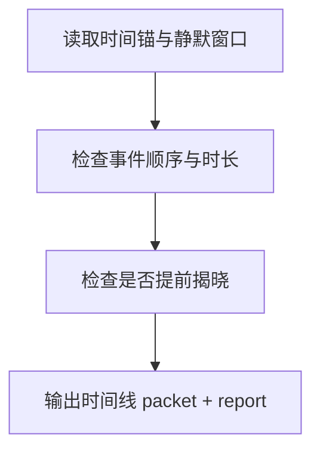

# 4-Review / 时间线

## Context Loading Contract

- 每次调用本技能时，必须同时加载同目录 `CONTEXT.md`。
- 必须回读父层 `4-Review/SKILL.md`、`../_shared/validation-root-contract.md`、`../_shared/validation-child-output-contract.md`。
- 正式审查前，必须读取 `volume_planning_summary / chapter_planning_packets`、`foreshadow_silence_slice`、当前卷正文集合与必要的前序章节快照。

## Invocation Modes

- `drafting_inline`
  - 被 `3-Drafting` 在 registry 指定 step 写回后立即调用，用于尽早阻断时间锚错位和伏笔窗口越线。
- `final_acceptance`
  - 被 `4-Review` 父层在卷级终验中并发调用，参与最终 `validation_status` 聚合。

## Parent Positioning

本 child 负责：

- 检查时间锚、先后顺序、持续时长是否成立
- 检查伏笔静默窗口与揭晓时机是否越线
- 检查本章的事件时间排布是否与上游规划一致

它不负责：

- 角色行为动机判断
- 世界规则与对象状态逻辑
- 章节结构是否戏剧化
- 关系线与情绪线的整体承接

## Canonical Sources

- `../SKILL.md`
- `../CONTEXT.md`
- `../_shared/validation-root-contract.md`
- `../_shared/validation-child-output-contract.md`
- `../_shared/validation-fact-pack-spec.md`
- `../_shared/checker-output-schema.md`
- `../../_shared/context-loading-contract.md`

## Business Requirement Analysis Contract

| analysis_slot | 当前结论 |
| --- | --- |
| `business_goal` | 判断这集的时间线是否能站住脚，以及是否提前越过了不该揭开的时间窗口。 |
| `business_object` | `chapter_planning_packet` 的时间锚、`foreshadow_silence_slice`、当前正文。 |
| `constraint_profile` | 先锁时间锚，再判顺序和时长；凡是提前揭晓伏笔窗口的，直接计入 spoiler risk。 |
| `success_criteria` | 能指出时间冲突、顺序错位、时长不合理和伏笔时机越线。 |
| `topology_fit` | `time anchor read -> sequence/duration check -> silence window check -> report packet` |

## Total Input Contract

- 必需输入：
  - `validation_fact_pack.chapter_planning_packet`
  - `validation_fact_pack.foreshadow_silence_slice`
  - 当前卷正文集合
- 硬规则：
  - 时间线判断不能只凭模糊阅读感受，必须回指时间锚或明确时序证据。
  - 伏笔窗口提前揭晓必须单独出 issue，不得埋进 notes。

## Output Contract

- `role_id`:
  - `timeline-validator`
- `dimension_packet`:
  - 至少包含 `time_anchor_conflicts`、`sequence_breaks`、`duration_conflicts`、`spoiler_risk`
- `dimension_report_ref`:
  - `4-Review/第V卷/时间线.md`
- 默认返工节点：
  - `1-单章叙事起盘`
  - `2-节奏优化`

## Visual Map

## Thinking-Action Network

| node_id | field_id | objective | actions | evidence | route_out | gate |
| --- | --- | --- | --- | --- | --- | --- |
| `N1-TIME-ANCHOR-READ` | `FIELD-TM-01` | 锁本章时间锚与窗口 | 读取 `chapter_planning_packet` 和静默窗口 | `anchor_note` | -> `N2` | 时间锚明确 |
| `N2-SEQUENCE-CHECK` | `FIELD-TM-02` | 检查先后顺序与持续时长 | 识别逆序、跳时、时长不合理 | `sequence_note` | -> `N3` | 时序成立 |
| `N3-WINDOW-CHECK` | `FIELD-TM-03` | 检查伏笔静默区是否越线 | 标记提前揭晓与剧透风险 | `window_note` | -> `N4` | 窗口未破 |
| `N4-PACKET-WRITE` | `FIELD-TM-04` | 输出时间线维度结论 | 生成 `dimension_packet + report_ref` | `packet_note` | done | 只写本维度 |

## Lite Field Contract

| field_id | output_slot | pass_standard | fail_code | rework_entry |
| --- | --- | --- | --- | --- |
| `FIELD-TM-01` | time anchors | 时间锚与窗口已锁定 | `FAIL-TM-01` | `N1` |
| `FIELD-TM-02` | sequence verdict | 关键事件无硬性时序冲突 | `FAIL-TM-02` | `N2` |
| `FIELD-TM-03` | window verdict | 伏笔窗口未被提前揭开 | `FAIL-TM-03` | `N3` |
| `FIELD-TM-04` | dimension packet | 报告完整、可聚合 | `FAIL-TM-04` | `N4` |

## Completion Contract

- 已明确给出时间锚、顺序、时长与伏笔窗口问题。
- `spoiler_risk` 已可被父层直接聚合。
