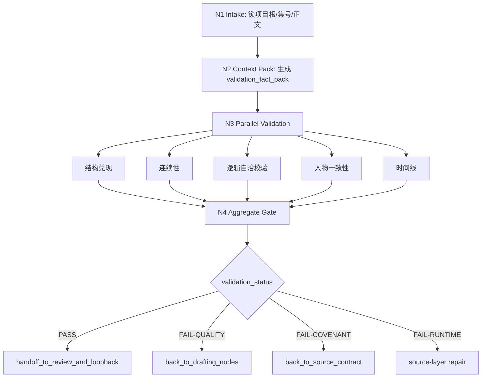
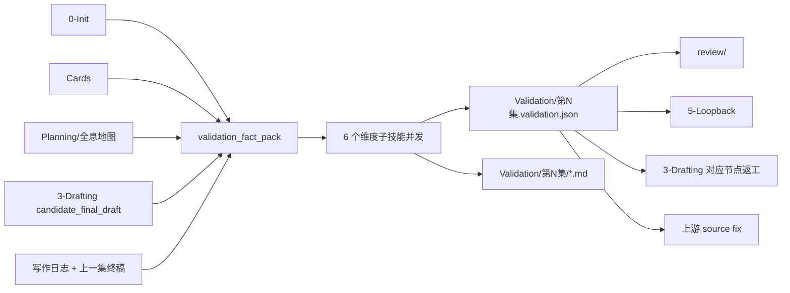
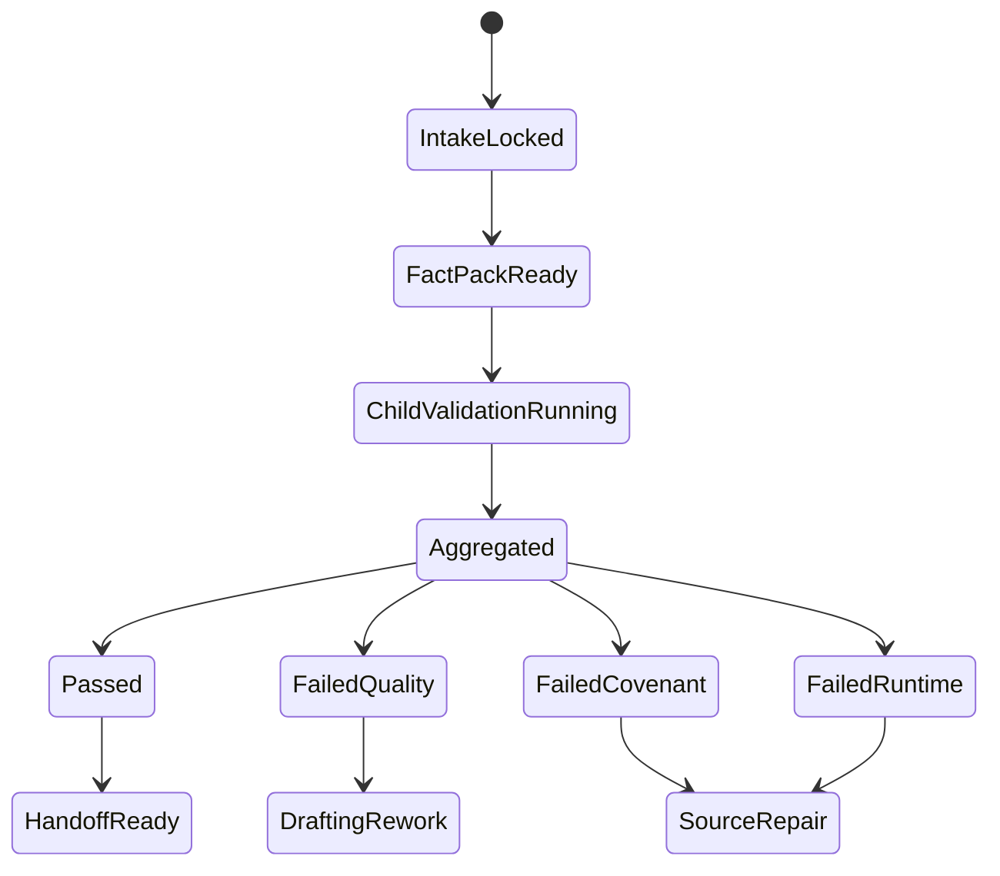

# 4-Validation

## Context Loading Contract

- 每次调用本技能时，必须同时加载同目录 `CONTEXT.md`。
- 在进入任一子技能前，必须先回读本 `SKILL.md`、`_shared/validation-root-contract.md`、`_shared/validation-child-output-contract.md`。
- 若 `validation_fact_pack`、共享 schema 与当前阶段合同冲突，先修 pack / schema / 合同，再决定是否进入子技能审查。

## Overview

`4-Validation` 现在是 `story2026` 的章节终验父 skill。

它的 canonical 结构固定为：

1. 父层先锁项目根、集号、正文快照与 `validation_fact_pack`
2. 六个受治理子技能并发执行终验维度审查
3. 父层聚合为唯一 gate 结论 JSON
4. 通过后交给 `review/` 与 `5-Loopback`
5. 未通过时按 issue 级别打回 `3-Drafting` 对应节点，或上溯到 `0-Init / 1-Cards / 2-Planning` 的源层修复

补充定位：

- 同一批 validator 也会被 `3-Drafting` 在每个 step 写回后当作即时审计 hook 调用。
- 但只有在本阶段聚合后的结果，才拥有正式 `validation_status` 与最终放行权。

本阶段的单一真源裁决固定为：

- 父层正式 gate truth：
  - `projects/story/<项目名>/Validation/第N集.validation.json`
- 子技能局部证据层：
  - `projects/story/<项目名>/Validation/第N集/{结构兑现,连续性,逻辑自洽校验,人物一致性,时间线,类型兑现}.md`

一句话裁决：

- 子技能可以并发写各自的 MD sidecar。
- 父层只认聚合 JSON 作为 `validation_status` 与 `routing_decision` 的唯一真源。

## Parent Positioning

### 父层拥有

- `project_root / chapter` 锁定
- 当前正文与上游真源的统一上下文装配
- `validation_fact_pack` 组装与 covenant gate
- 六个子技能的并发调度与收束
- `validation_status / routing_decision / handoff_targets` 唯一判定权
- `Validation/第N集.validation.json` 正式落盘
- issue 级 `rework_targets` 与 `source_trace` 汇总
- `candidate_final_draft -> validated_final_draft` 的最终放行裁决

### 父层不拥有

- 直接修改 `第N集.md`
- 代替 `review/` 生成正式业务审查报告
- 代替 `5-Loopback` 回写 `Cards.current_state/history` 或 `story_map.actualization`
- 把六个子技能的局部 verdict 平行堆成第二份 canonical truth

## Governed Child Skills

| child skill | role_id | 审查维度 | 默认回流 |
| --- | --- | --- | --- |
| `结构兑现` | `structure-validator` | 本集是否兑现 `promise_slice + chapter_board` 的结构义务、事件债务与戏剧化落点 | `1-单集叙事起盘`、`6-追读力强化` |
| `连续性` | `continuity-validator` | 与上一集、当前集内部段落、threads 承接是否连续 | `1-单集叙事起盘`、`2-节奏优化` |
| `逻辑自洽校验` | `logic-validator` | 因果、设定、状态、能力边界、例外代价与世界规则是否自洽 | `1-单集叙事起盘`，必要时上溯 `0-Init / 1-Cards / 2-Planning` |
| `人物一致性` | `character-validator` | 角色行为、动机、声口、关系压力是否与 card 真源一致 | `4-角色形象刻画`、`5-对白个性化和声口优化` |
| `时间线` | `timeline-validator` | 时间锚、顺序、持续时长、回收窗口是否成立 | `1-单集叙事起盘`、`2-节奏优化` |
| `类型兑现` | `type-pack-fit-validator` | active `type-pack` 的章级承诺、step hook 与 hard-fail 是否真的被正文兑现 | `2-节奏优化`、`5-对白个性化和声口优化`、`6-追读力强化` |

硬规则：

1. 六个子技能默认并发，但只能读取同一份已锁定的 pack 与正文快照。
2. 子技能只产出局部 `dimension_packet + dimension_report_ref`，不得判定最终 `validation_status`。
3. 父层不得跳过任一必开子技能。

## Shared Canonical Sources

- `.agents/skills/story/SKILL.md`
- 当前 `SKILL.md + CONTEXT.md`
- `./_shared/validation-root-contract.md`
- `./_shared/validation-child-output-contract.md`
- `./_shared/validation-dimension-registry.yaml`
- `./_shared/validation-aggregate.template.json`
- `./_shared/validation-dimension-report.template.md`
- `./_shared/examples/validation.fail-quality.back-to-drafting.example.json`
- `./扩维与调整指南.md`
- `../_shared/context-loading-contract.md`
- `./_shared/validation-fact-pack-spec.md`
- `./_shared/validation-team-contract.md`
- `./_shared/checker-output-schema.md`
- `../_shared/core-constraints.md`
- `../scripts/extract_chapter_context.py`
- `../scripts/validation_runner.py`

## Business Requirement Analysis Contract

| analysis_slot | 当前结论 |
| --- | --- |
| `business_goal` | 用 6 个维度对候选终稿做并发终验，确认它是否真的兑现了 `0-Init / 1-Cards / 2-Planning` 的共同约束与 active `type-pack` 承诺，并形成可被 `review / 5-Loopback` 直接消费的 gate packet。 |
| `business_object` | `projects/story/<项目名>/3-Drafting/第N集.md`、`写作日志.yaml`、`0-Init/*.yaml`、`Cards/0-全局卡/**/*.json`、`Cards/**/*.json`、`Planning/全息地图.json`、`Validation/第N集.validation.json`、6 份维度 MD report。 |
| `constraint_profile` | 子技能必须并发可跑；正式 gate truth 只能是一份聚合 JSON；缺 slice 必须 `FAIL-COVENANT`；源层冲突不得伪装成 drafting 质量问题；`7-润色` 的通过不等于最终 PASS。 |
| `success_criteria` | 六个维度都能给出可追溯 verdict；父层只产出一份 aggregate JSON；失败能精确回流到 drafting 节点或 upstream source；通过后能把 `candidate_final_draft` 升格为 `validated_final_draft` 并稳定 handoff 到 `review/` 与 `5-Loopback`。 |
| `non_goals` | 不在本阶段生成正式审查报告；不做 loopback 写回；不把 6 份局部报告当成平行 canonical truth；不使用旧轮次 validation 包。 |
| `complexity_source` | 复杂度来自 shared pack 锁定、6 子技能并发、issue 级 routing、以及 `PASS / FAIL-QUALITY / FAIL-COVENANT / FAIL-RUNTIME` 的分层 gate。 |
| `topology_fit` | `intake -> context pack -> parallel child validation -> aggregate gate -> route to review/loopback or drafting/source fix` |
| `step_strategy` | 先统一事实，再并发审查，再由父层做唯一裁决；任何返工都以父层聚合路由为准，不由子技能各自拉总线。 |

## Context Preload

1. 根 `AGENTS.md`
2. `.agents/skills/story/SKILL.md + CONTEXT.md`
3. 当前 `SKILL.md + CONTEXT.md`
4. `./_shared/validation-root-contract.md`
5. `./_shared/validation-child-output-contract.md`
6. `../_shared/context-loading-contract.md`
7. `./_shared/validation-fact-pack-spec.md`
8. `./_shared/validation-team-contract.md`
9. `./_shared/checker-output-schema.md`
10. `../_shared/core-constraints.md`
11. `../3-Drafting/_shared/drafting-instant-validation-contract.md`
12. `0-Init/north_star.yaml`
13. `0-Init/init_handoff.yaml`
14. `Cards/0-全局卡/**/*.json`
15. `Cards/**/*.json`
16. `Planning/全息地图.json`
17. 当前 `projects/story/<项目名>/3-Drafting/第N集.md`
18. 当前 `projects/story/<项目名>/3-Drafting/写作日志.yaml`
19. 若 `N > 1`，上一集最终正文 `projects/story/<项目名>/3-Drafting/第N-1集.md`
20. `结构兑现/SKILL.md + CONTEXT.md`
21. `连续性/SKILL.md + CONTEXT.md`
22. `逻辑自洽校验/SKILL.md + CONTEXT.md`
23. `人物一致性/SKILL.md + CONTEXT.md`
24. `时间线/SKILL.md + CONTEXT.md`
25. `类型兑现/SKILL.md + CONTEXT.md`

## Total Input Contract

### 必需输入

- `project_root`
- `chapter`（兼容字段；语义上等于当前 `第N集.md` 的 N）
- 当前集正文 `projects/story/<项目名>/3-Drafting/第N集.md`
- 当前写作日志 `projects/story/<项目名>/3-Drafting/写作日志.yaml`
- `candidate_final_draft` 状态说明（来自写作日志或 handoff note）
- `0-Init/north_star.yaml`
- `Cards/0-全局卡/**/*.json`
- `Cards/**/*.json`
- `Planning/全息地图.json`
- 本轮动态生成的 `validation_fact_pack`

### 条件必需输入

- `N > 1` 时的上一集最终正文
- 高风险或历史复核时的 `STATE.json.workflow_runtime` 相关治理回指

### 硬规则

1. `validation_fact_pack` 的 5 个 slice 任一缺失，直接 `FAIL-COVENANT`。
2. pack 必须由当前轮动态生成；不得复用旧轮 residual 文件。
3. 六个子技能必须消费同一份正文快照与同一份 pack。
4. 子技能局部报告只做 sidecar，不拥有总 gate 判定权。
5. `PASS` 需要同时满足：
   - 无 `critical` 问题
   - 无未解决的 source-layer 冲突
   - 无 `FAIL-COVENANT / FAIL-RUNTIME`
6. 一旦发现上游 truth 自相矛盾，必须优先走 `back_to_source_contract`，而不是要求 `3-Drafting` 瞎改正文。
7. 本阶段输入正文默认应已完成 drafting 的 inline hooks；若不是，必须先回到 drafting 完成即时审计，再进入终验。
8. 世界与规则层 truth 默认优先取自 `Cards/0-全局卡/**/*.json`；若全局卡与 `north_star.yaml.cards` 冲突，应先判定 source owner，而不是直接把矛盾记成正文逻辑错误。

## Dispatch Order Contract

### 固定主干

1. `N1-INTAKE`
2. `N2-CONTEXT-PACK`
3. `N3-PARALLEL-VALIDATION`
4. `N4-AGGREGATE-GATE`
5. `N5-ROUTE-HANDOFF`

### 并发规则

- 必须并发：
  - `结构兑现`
  - `连续性`
  - `逻辑自洽校验`
  - `人物一致性`
  - `时间线`
- 必须串行：
  - pack 组装
  - 聚合裁决
  - aggregate JSON 落盘
  - handoff route 判定

### Aggregate Gate Contract

- 维度权重以 `validation-dimension-registry.yaml` 为准，不在父层平行维护第二张权重表
- 但 `validation_status` 不以均分独裁，必须额外经过 severity / source gate：
  - `FAIL-RUNTIME`
    - pack 装配、路径、脚本或 shared carrier 失效
  - `FAIL-COVENANT`
    - 任一 slice 缺失或 upstream truth 冲突
  - `FAIL-QUALITY`
    - 维度问题主要属于正文本轮创作质量
  - `PASS`
    - 分数达标且无 blocking issue

### Routing Decision Contract

| routing_decision | 适用条件 | handoff_targets |
| --- | --- | --- |
| `back_to_drafting_nodes` | 问题主要落在当前正文质量与工序执行 | `3-Drafting` 对应节点 |
| `back_to_source_contract` | 上游 truth 缺失、冲突或 pack 失效 | `0-Init` / `1-Cards` / `2-Planning` / source-layer fix |
| `handoff_to_review_and_loopback` | `PASS` 且允许进入完整闭环 | `review/`、`5-Loopback` |
| `handoff_to_review_only` | 只需要业务报告 / 历史复核，不进入 actualization | `review/` |

## Output Contract

### Canonical runtime

- 聚合 gate packet：
  - `projects/story/<项目名>/Validation/第N集.validation.json`
- 子技能 evidence sidecars：
  - `projects/story/<项目名>/Validation/第N集/结构兑现.md`
  - `projects/story/<项目名>/Validation/第N集/连续性.md`
  - `projects/story/<项目名>/Validation/第N集/逻辑自洽校验.md`
  - `projects/story/<项目名>/Validation/第N集/人物一致性.md`
  - `projects/story/<项目名>/Validation/第N集/时间线.md`
  - `projects/story/<项目名>/Validation/第N集/类型兑现.md`

### Canonical final output

父层最终只向下游与运行时交付一份聚合 JSON，至少包含：

- `validation_status`
- `validation_mode`
- `selected_agents`
- `dimension_packets`
- `dimension_report_refs`
- `issues`
- `severity_counts`
- `critical_issues`
- `overall_score`
- `dimension_scores`
- `anti_ai_force_check`
- `spoiler_risk`
- `contrivance_risk`
- `cold_commentary_risk`
- `routing_decision`
- `handoff_targets`
- `rework_targets`
- `validation_ref`

说明：

- 6 份 MD 报告更适合作为人工可读证据层。
- 1 份总验收 JSON 更适合作为 `review/5-Loopback` 的机器可消费 gate。
- 因此本阶段采取“两层输出，但一层真源”：JSON 为 canonical，MD 为 sidecar。
- 当前 `_shared/examples/validation.fail-quality.back-to-drafting.example.json` 提供“发现问题 -> 自动生成 rework route -> 指向具体 skill/node”的样例。

## Visual Maps

## Thinking-Action Network

| node_id | field_id | objective | actions | evidence | route_out | gate |
| --- | --- | --- | --- | --- | --- | --- |
| `N1-INTAKE` | `FIELD-VAL-01` | 锁项目根、集号、正文快照 | 解析 `project_root / chapter / manuscript_ref` | `intake_note` | -> `N2` | scope 唯一 |
| `N2-CONTEXT-PACK` | `FIELD-VAL-02` | 组装统一 pack 与 covenant 输入 | 读取 `0-Init / Cards / Planning / Drafting`，生成 `validation_fact_pack` | `fact_pack_note` | -> `N3` | 五个 slice 齐备 |
| `N3-PARALLEL-VALIDATION` | `FIELD-VAL-03` | 并发运行六个子技能 | 分发锁定输入，收回 6 个 `dimension_packet` | `dispatch_log` | -> `N4` | 六维都返回 |
| `N4-AGGREGATE-GATE` | `FIELD-VAL-04` | 聚合 issue、分数、风险与 route | 合并 severity、risk、rework、source trace | `aggregate_packet` | -> `N5` | gate 单一 |
| `N5-ROUTE-HANDOFF` | `FIELD-VAL-05` | 落盘 JSON 并生成下一跳 | 写 `validation.json`，设置 `handoff_targets` | `route_note` | done | 下游明确 |

## Field Master

| field_id | output_slot | 内容要求 | default_step | quality_dimension | fail_code |
| --- | --- | --- | --- | --- | --- |
| `FIELD-VAL-01` | intake lock | 当前是哪个项目、哪一集、哪一版候选终稿 | `N1` | 任务边界稳定 | `FAIL-VAL-01` |
| `FIELD-VAL-02` | validation fact pack | 五个 slice 完整、来源清晰、当前轮生成 | `N2` | 输入完整性 | `FAIL-VAL-02` |
| `FIELD-VAL-03` | child dimension packets | 六个子技能 verdict 与证据都在手 | `N3` | 并发审查完整性 | `FAIL-VAL-03` |
| `FIELD-VAL-04` | aggregate gate packet | 分数、问题、风险、route 单一收束 | `N4` | 验收判定一致性 | `FAIL-VAL-04` |
| `FIELD-VAL-05` | validation ref + handoff | JSON 已落盘，返工或下游目标清楚 | `N5` | 可交付性 | `FAIL-VAL-05` |

## Thought Pass Map

| step_id | 聚焦字段 | 核心问题 | 生成动作 | 未达标信号 |
| --- | --- | --- | --- | --- |
| `S1` | `FIELD-VAL-01~02` | 当前正文与上游 truth 是否被正确装配成一份 pack | 锁 scope 并生成 `validation_fact_pack` | 路径缺失、slice 缺失、旧包复用 |
| `S2` | `FIELD-VAL-03` | 六个维度能否并发但不互相污染 | 分发同一快照并收回局部 verdict | 子技能输出不齐、局部报告抢总线 |
| `S3` | `FIELD-VAL-04` | 问题究竟属于正文质量、source 冲突还是 runtime 失败 | 聚合 severity、source trace、risk | 把 upstream 冲突误打回 drafting |
| `S4` | `FIELD-VAL-05` | 当前轮应交给谁，禁止交给谁 | 生成 `routing_decision + handoff_targets` | PASS/FAIL 与 handoff 不一致 |

## Root-Cause Execution Contract (Mandatory)

当 `4-Validation` 出现验收误判、pack 缺 slice、子技能输出不兼容、返工节点漂移或下游 handoff 错误时，必须按以下链路上溯：

1. `Symptom / Failure`
   - 明确是 `FAIL-COVENANT / FAIL-RUNTIME / FAIL-QUALITY` 误判，还是 child output / route 漂移。
2. `Direct Technical Cause`
   - 确认是 pack 缺失、shared schema 失配、子技能边界不清，还是 aggregate route 规则错误。
3. `Rule Source`
   - 优先检查当前 `SKILL.md`、`_shared/*.md`、`_shared/validation-team-contract.md`、`_shared/checker-output-schema.md`、`_shared/validation-fact-pack-spec.md`。
4. `Meta Rule Source`
   - 继续上溯到仓库 `AGENTS.md` 的 root-cause、canonical source governance 与 composite output 合同。
5. `Fix Landing Points`
   - 先修 shared contract / schema / pack 入口，再决定是否需要修改单个子技能。

收尾必须返回：

- `root cause location`
- `immediate fix`
- `systemic prevention fix`

## Completion Contract

- 当前轮只产生一份 `Validation/第N集.validation.json`。
- 六个子技能都已生成本地 MD sidecar。
- `validation_status / routing_decision / handoff_targets` 已唯一收束。
- 若失败，`rework_targets` 已定位到具体 drafting 节点或 upstream source。
- 若通过，已把当前集从 `candidate_final_draft` 升格为 `validated_final_draft`，并明确 handoff 到 `review/` 与 `5-Loopback`。
