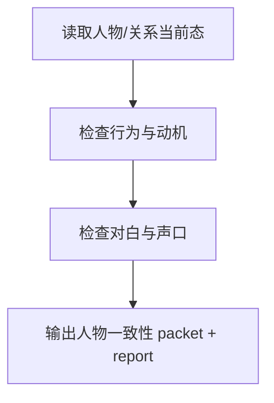

# 4-Validation / 人物一致性

## Context Loading Contract

- 每次调用本技能时，必须同时加载同目录 `CONTEXT.md`。
- 必须回读父层 `4-Validation/SKILL.md`、`../_shared/validation-root-contract.md`、`../_shared/validation-child-output-contract.md`。
- 审查前必须读取 `cards_state_history_slice`、当前正文以及相关关系/人物状态切片。

## Invocation Modes

- `drafting_inline`
  - 被 `3-Drafting` 在 registry 指定 step 写回后立即调用，用于及时拦截人物失声口、OOC 和关系压力塌缩。
- `final_acceptance`
  - 被 `4-Validation` 父层在卷级终验中并发调用，参与最终 `validation_status` 聚合。

## Parent Positioning

本 child 负责：

- 检查角色行为、动机、情绪、关系压力与心理活动是否与 card 真源一致
- 检查对白与角色声口是否仍然像“这个人会说的话”
- 检查重要关系变化是否有前因、触发和后果
- 检查关键角色在当前集里是否仍有可见的人物偏移与个性化存在感，而不是只剩功能性推进
- 当本集存在证词冲突、道德困境或人物自证清白场时，检查人物是否在保护各自不同的体面/利益，而不是共用作者版解释
- 当本集存在世界规则变化、巨型装置、灾难系统或文明压力时，检查人物是否真的在承担这种压力，而不是退化成设定讲解员或旁观者
- 对已启用成长系统的主角，检查 `技能 / 心路 / 情感` 三轴是否仍沿着当前 validated 状态连续推进

它不负责：

- 本集结构义务是否完整兑现
- 世界规则与物理设定的硬逻辑
- 时间锚精算
- 上一集到这一集的整体承接

## Canonical Sources

- `../SKILL.md`
- `../CONTEXT.md`
- `../_shared/validation-root-contract.md`
- `../_shared/validation-child-output-contract.md`
- `../_shared/validation-fact-pack-spec.md`
- `../_shared/checker-output-schema.md`
- `../../_shared/entity-management-spec.md`

## Business Requirement Analysis Contract

| analysis_slot | 当前结论 |
| --- | --- |
| `business_goal` | 判断角色是不是还像自己，人物偏移、自我辩护和系统压力承担是否可追踪，以及关系推进是否建立在已知状态和动机上。 |
| `business_object` | 人物/关系相关 card 切片、当前正文。 |
| `constraint_profile` | 先锁人物当前态与关系压力，再判行为、弧光与对白；不能只凭“感觉像不像”打分。 |
| `success_criteria` | 能指出哪段行为 OOC、哪句对白失声口、哪条关系变化缺乏铺垫、哪个关键角色只剩功能没有个性化偏移、哪个证词场里所有人都在共用作者解释、哪个宏观设定下的人物沦为讲解员；对启用成长系统的主角，能说明当前集是否接住了既有成长轴。 |
| `topology_fit` | `character state read -> behavior/arc check -> dialogue/persona check -> report packet` |

## Total Input Contract

- 必需输入：
  - `validation_fact_pack.cards_state_history_slice`
  - 当前卷正文集合或命中的受审章节集合
- 硬规则：
  - 先看当前态和关系压力，再判行为。
  - 若关键角色承担了关系变化、价值选择或压力升级，必须检查正文里是否存在至少一个可追踪的人物偏移信号；若没有，优先回 Step 4。
  - 若当前集命中证词冲突或人物自证场，必须检查不同角色是否在保护不同的体面/利益；若都像作者统一发言，优先回 Step 4。
  - 若当前集命中世界规则变化或系统性压力，必须检查人物是否把这种压力转成了职责、风险判断或代价承担；若只剩设定说明，优先回 Step 4。
  - 对白问题必须区分“失声口”与“剧情解释过量”。
  - 若主角已启用成长系统，至少要检查当前正文是否仍看得见对应 `growth_state` 的承接信号。

## Output Contract

- `role_id`:
  - `character-validator`
- `dimension_packet`:
  - 至少包含 `severe_ooc`、`motivation_breaks`、`speech_violations`、`relationship_pressure_drops`、`growth_continuity_checked`
- `dimension_report_ref`:
  - `4-Validation/第V卷/人物一致性.md`
- 默认返工节点：
  - `4-角色形象刻画`
  - `5-对白个性化`
  - `6-心理活动描写`

## Visual Map

## Thinking-Action Network

| node_id | field_id | objective | actions | evidence | route_out | gate |
| --- | --- | --- | --- | --- | --- | --- |
| `N1-CHAR-STATE-READ` | `FIELD-CH-01` | 锁人物当前态与关系压力 | 读取相关 `Cards.current_state/history` | `state_note` | -> `N2` | 当前态明确 |
| `N2-BEHAVIOR-CHECK` | `FIELD-CH-02` | 检查行为、动机与弧光是否一致 | 识别 OOC、动机跳跃、关系突变、人物只剩功能推进的空转段落 | `behavior_note` | -> `N3` | 行为成立 |
| `N3-GROWTH-CONTINUITY` | `FIELD-CH-03` | 检查成长三轴承接 | 对照主角 `growth_state` 看技能/心路/情感是否仍连续 | `growth_note` | -> `N4` | 成长没断轴 |
| `N4-DIALOGUE-CHECK` | `FIELD-CH-04` | 检查对白与声口 | 标记失声口、解释过量、角色混声 | `dialogue_note` | -> `N5` | 声口清晰 |
| `N5-PACKET-WRITE` | `FIELD-CH-05` | 输出人物维度结论 | 生成 `dimension_packet + report_ref` | `packet_note` | done | 只写本维度 |

## Lite Field Contract

| field_id | output_slot | pass_standard | fail_code | rework_entry |
| --- | --- | --- | --- | --- |
| `FIELD-CH-01` | character state slice | 当前态与关系压力已锁定 | `FAIL-CH-01` | `N1` |
| `FIELD-CH-02` | behavior verdict | 关键行为无严重 OOC 或动机断裂 | `FAIL-CH-02` | `N2` |
| `FIELD-CH-03` | growth verdict | 已启用成长系统时，主角三轴没有突然断线 | `FAIL-CH-03` | `N3` |
| `FIELD-CH-04` | dialogue verdict | 关键对白没有明显失声口 | `FAIL-CH-04` | `N4` |
| `FIELD-CH-05` | dimension packet | 报告完整、可聚合 | `FAIL-CH-05` | `N5` |

## Completion Contract

- 已给出行为、成长连续性、对白三类人物问题。
- 报告已定位返工应回到角色刻画还是对白优化。
