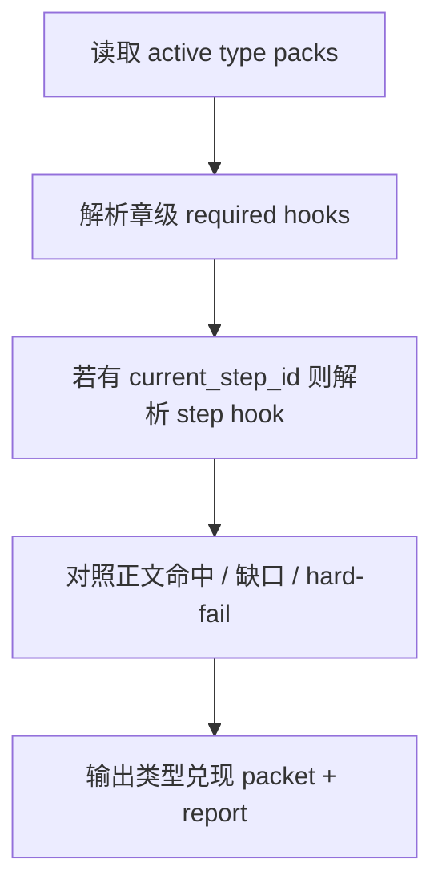

# 4-Validation / 类型兑现

## Context Loading Contract

- 每次调用本技能时，必须同时加载同目录 `CONTEXT.md`。
- 必须回读父层 `4-Validation/SKILL.md`、`../_shared/validation-root-contract.md`、`../_shared/validation-child-output-contract.md`。
- 审查前必须读取当前 `type_pack_profile`、`validation_fact_pack` 与 `第N集.md`。

## Invocation Modes

- `drafting_inline`
  - 被 `3-Drafting` 在 registry 指定 step 写回后立即调用，重点检查当前工序是否兑现 step-specific pack hook。
- `final_acceptance`
  - 被 `4-Validation` 父层并发调用，判断整章是否兑现 active `type_stack` 的类型承诺。

## Parent Positioning

本 child 负责：

- 检查 `type_stack` 激活后的类型承诺是否真的落到正文
- 检查 pack 的 `required_hooks / hard_fail_signals`
- 检查当前 drafting step 是否兑现了该 step 对应的类型化 hook

它不负责：

- 代替 `0-Init` 重新选择 `type_stack`
- 代替 `2-Planning` 重写 `story_promise`
- 代替 `结构兑现` 审 chapter board 的通用结构债

## Canonical Sources

- `../SKILL.md`
- `../CONTEXT.md`
- `../_shared/validation-root-contract.md`
- `../_shared/validation-child-output-contract.md`
- `../_shared/validation-dimension-registry.yaml`
- `../_shared/checker-output-schema.md`
- `../../_shared/type-pack-loading-contract.md`
- `../../type-packs/网文/`
- `../../_shared/type-pack-loading-contract.md`

## Business Requirement Analysis Contract

| analysis_slot | 当前结论 |
| --- | --- |
| `business_goal` | 判断“当前写得通不通用”之外，再判断“像不像当前项目声明要写的那一类东西”。 |
| `business_object` | `type_pack_profile`、当前 `第N集.md`、必要时 `current_step_id`。 |
| `constraint_profile` | 无显式 pack 时本维度降级为观察态；有 pack 时必须检查 active packs、章级兑现与 step hook。 |
| `success_criteria` | 能回答 active packs 是什么、当前 step 该兑现什么、正文到底有没有做到。 |
| `topology_fit` | `load type_stack -> resolve pack promise -> compare manuscript -> emit fit packet` |

## Total Input Contract

- 必需输入：
  - `validation_fact_pack.promise_slice.type_pack_profile`
  - 当前 `第N集.md`
- 条件必需输入：
  - `current_step_id`（在 drafting inline 模式下）
- 硬规则：
  - 无 pack 时不伪造类型问题。
  - 类型兑现问题不得静默并入 `结构兑现`；本维度单独出 packet。

## Output Contract

- `role_id`:
  - `type-pack-fit-validator`
- `dimension_packet`:
  - 至少包含 `type_pack_enabled`、`active_packs`、`required_hooks`、`drafting_required_hooks`、`hard_fail_signals`
- `dimension_report_ref`:
  - `Validation/第N集/类型兑现.md`
- 默认返工节点：
  - `2-节奏优化`
  - `5-对白个性化和声口优化`
  - `6-追读力强化`

## Visual Map

## Thinking-Action Network

| node_id | field_id | objective | actions | evidence | route_out | gate |
| --- | --- | --- | --- | --- | --- | --- |
| `N1-PACK-RESOLVE` | `FIELD-TP-01` | 锁定当前项目 active packs | 读取 `type_pack_profile`、`type_stack`、`active_packs` | `pack_note` | -> `N2` | packs 清楚 |
| `N2-HOOK-DECODE` | `FIELD-TP-02` | 解码章级与 step 级类型 hook | 解析 `required_hooks / hard_fail_signals / step_hooks` | `hook_note` | -> `N3` | hook 清楚 |
| `N3-MANUSCRIPT-COMPARE` | `FIELD-TP-03` | 对照正文检查类型兑现 | 标注命中、缺口、误类型化 | `compare_note` | -> `N4` | 兑现判断成立 |
| `N4-PACKET-WRITE` | `FIELD-TP-04` | 输出本维度结论 | 生成 `dimension_packet + report_ref` | `packet_note` | done | 只写本维度 |

## Lite Field Contract

| field_id | output_slot | pass_standard | fail_code | rework_entry |
| --- | --- | --- | --- | --- |
| `FIELD-TP-01` | active packs | 当前 active packs 已锁定 | `FAIL-TP-01` | `N1` |
| `FIELD-TP-02` | hook set | 章级与 step 级 hook 已明确 | `FAIL-TP-02` | `N2` |
| `FIELD-TP-03` | fit verdict | 正文能证明类型承诺被兑现 | `FAIL-TP-03` | `N3` |
| `FIELD-TP-04` | dimension packet | 类型兑现报告完整、可聚合 | `FAIL-TP-04` | `N4` |

## Completion Contract

- 已明确当前集命中的 active type packs。
- 已区分 pack 缺失、step hook 缺失与正文本身不兑现三类问题。
- 报告已给出默认返工节点或上游 source owner 提示。
