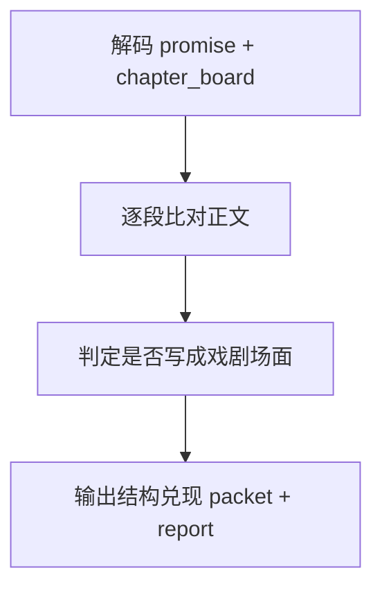

# 4-Validation / 结构兑现

## Context Loading Contract

- 每次调用本技能时，必须同时加载同目录 `CONTEXT.md`。
- 必须回读父层 `4-Validation/SKILL.md`、`../_shared/validation-root-contract.md`、`../_shared/validation-child-output-contract.md`。
- 正式审查前，必须读取锁定后的 `validation_fact_pack` 与当前 `第N集.md`。

## Invocation Modes

- `drafting_inline`
  - 被 `3-Drafting` 在 registry 指定 step 写回后立即调用，只判断当前快照是否允许继续下一步。
- `final_acceptance`
  - 被 `4-Validation` 父层在章节末端并发调用，参与最终 `validation_status` 聚合。

## Parent Positioning

本 child 负责：

- 检查 `promise_slice` 与 `chapter_board` 的结构义务是否被正文兑现
- 检查关键事件、冲突、任务、线索、伏笔回收是否落地
- 检查“结构是否已经写成戏，而不是摘要/提纲/说明”

它不负责：

- 上一集衔接连续性
- 角色行为一致性细化
- 时间锚精确排序
- 世界规则与对象状态的严密因果核查

## Canonical Sources

- `../SKILL.md`
- `../CONTEXT.md`
- `../_shared/validation-root-contract.md`
- `../_shared/validation-child-output-contract.md`
- `../_shared/validation-fact-pack-spec.md`
- `../_shared/checker-output-schema.md`
- `../../_shared/core-constraints.md`

## Business Requirement Analysis Contract

| analysis_slot | 当前结论 |
| --- | --- |
| `business_goal` | 判断正文是否真的兑现了这集该发生的事，而不是只“提到过”或“总结过”。 |
| `business_object` | `validation_fact_pack.promise_slice`、`chapter_board`、当前 `第N集.md`。 |
| `constraint_profile` | 先看 board 义务，再看正文戏剧化落点；结构未兑现不能靠其他维度补救。 |
| `success_criteria` | 能明确回答“这一集 promised 什么、planned 什么、正文到底有没有完成”。 |
| `topology_fit` | `obligation decode -> manuscript compare -> dramatization gate -> report packet` |

## Total Input Contract

- 必需输入：
  - `validation_fact_pack.promise_slice`
  - `validation_fact_pack.chapter_board`
  - 当前 `第N集.md`
- 硬规则：
  - 先锁“必须发生什么”，再判正文是否实现。
  - 只出现摘要式复述、不形成戏剧场面，也视为未充分兑现。

## Output Contract

- `role_id`:
  - `structure-validator`
- `dimension_packet`:
  - 至少包含 `required_events_hit`、`missed_obligations`、`promise_breaks`、`undramatized_exposition_hits`、`anti_ai_force_check`
- `dimension_report_ref`:
  - `4-Validation/第N集/结构兑现.md`
- 默认返工节点：
  - `1-单集叙事起盘`
  - `6-追读力强化`

## Visual Map

## Thinking-Action Network

| node_id | field_id | objective | actions | evidence | route_out | gate |
| --- | --- | --- | --- | --- | --- | --- |
| `N1-OBLIGATION-DECODE` | `FIELD-ST-01` | 锁定本集必须兑现的结构义务 | 抽取事件、冲突、任务、线索、伏笔债务 | `obligation_note` | -> `N2` | obligation 清楚 |
| `N2-MANUSCRIPT-COMPARE` | `FIELD-ST-02` | 对照正文逐项核验 | 标记命中、漏项、弱兑现 | `compare_note` | -> `N3` | 义务对齐 |
| `N3-DRAMATIZATION-GATE` | `FIELD-ST-03` | 判定是否只是摘要而非戏 | 检查说明腔、硬总结、无场面兑现 | `dramatization_note` | -> `N4` | 戏剧化成立 |
| `N4-PACKET-WRITE` | `FIELD-ST-04` | 输出结构维度结论 | 生成 `dimension_packet + report_ref` | `packet_note` | done | 只写本维度 |

## Lite Field Contract

| field_id | output_slot | pass_standard | fail_code | rework_entry |
| --- | --- | --- | --- | --- |
| `FIELD-ST-01` | obligation set | 本集必须兑现的结构义务已锁定 | `FAIL-ST-01` | `N1` |
| `FIELD-ST-02` | compare matrix | 每项义务都能找到正文证据或明确缺失 | `FAIL-ST-02` | `N2` |
| `FIELD-ST-03` | dramatization verdict | 不是提纲腔或总结腔式“假兑现” | `FAIL-ST-03` | `N3` |
| `FIELD-ST-04` | dimension packet | 结构维度报告完整、可聚合 | `FAIL-ST-04` | `N4` |

## Completion Contract

- 已明确列出本集结构兑现与未兑现项。
- 已区分“缺事件”与“只提到没演出来”。
- 报告已给出默认返工节点。
