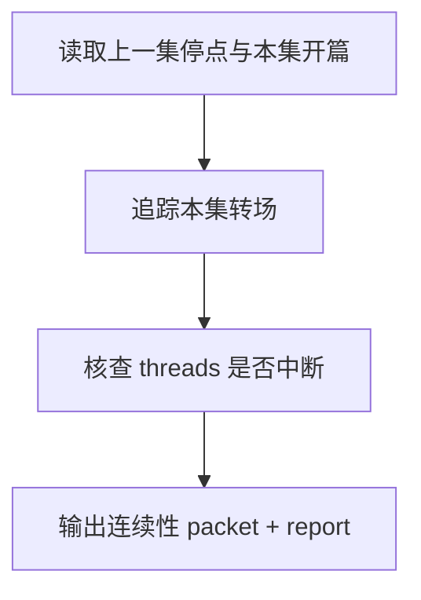

# 4-Validation / 连续性

## Context Loading Contract

- 每次调用本技能时，必须同时加载同目录 `CONTEXT.md`。
- 必须回读父层 `4-Validation/SKILL.md`、`../_shared/validation-root-contract.md`、`../_shared/validation-child-output-contract.md`。
- 审查前必须读取当前 `第N集.md`、写作日志，以及 `N > 1` 时的上一集终稿。

## Invocation Modes

- `drafting_inline`
  - 被 `3-Drafting` 在 registry 指定 step 写回后立即调用，用于阻断承接断带和转场失衡继续向后扩散。
- `final_acceptance`
  - 被 `4-Validation` 父层在章节末端并发调用，参与最终 `validation_status` 聚合。

## Parent Positioning

本 child 负责：

- 检查当前集如何接上上一集停点
- 检查本集内部场景切换、threads 承接与推进连续性
- 检查是否突然断掉读者仍在记账的压力线

它不负责：

- 结构义务是否本身成立
- 世界规则和卡片状态的深层逻辑
- 角色声口细部差异
- 时间锚精算

## Canonical Sources

- `../SKILL.md`
- `../CONTEXT.md`
- `../_shared/validation-root-contract.md`
- `../_shared/validation-child-output-contract.md`
- `../../_shared/context-loading-contract.md`
- `../_shared/validation-fact-pack-spec.md`
- `../_shared/checker-output-schema.md`

## Business Requirement Analysis Contract

| analysis_slot | 当前结论 |
| --- | --- |
| `business_goal` | 判断这集是不是从上一集真的长出来，并且本集内部推进没有断带。 |
| `business_object` | 上一集终稿、当前 `第N集.md`、写作日志、`chapter_board`。 |
| `constraint_profile` | 先看承接点，再看本集内部 transition；不能只靠“读起来还行”给通过。 |
| `success_criteria` | 能指出哪条线接得上、哪条线中途断了、哪个转场突兀。 |
| `topology_fit` | `carryover load -> transition trace -> thread continuity -> report packet` |

## Total Input Contract

- 必需输入：
  - 当前 `第N集.md`
  - `写作日志.yaml`
  - `validation_fact_pack.chapter_board`
- 条件必需输入：
  - `N > 1` 时的上一集终稿
- 硬规则：
  - 第 2 集及之后，缺上一集终稿则不能给高分连续性 verdict。
  - 连续性问题要指出“断在什么线”。

## Output Contract

- `role_id`:
  - `continuity-validator`
- `dimension_packet`:
  - 至少包含 `previous_episode_bridge`、`transition_breaks`、`thread_drop_count`、`carryover_gaps`
- `dimension_report_ref`:
  - `4-Validation/第N集/连续性.md`
- 默认返工节点：
  - `1-单集叙事起盘`
  - `2-节奏优化`

## Visual Map

## Thinking-Action Network

| node_id | field_id | objective | actions | evidence | route_out | gate |
| --- | --- | --- | --- | --- | --- | --- |
| `N1-CARRYOVER-LOAD` | `FIELD-CT-01` | 锁上一集停点与本集开篇关系 | 抽取情绪、动作、信息停点 | `carryover_note` | -> `N2` | 承接可读 |
| `N2-TRANSITION-TRACE` | `FIELD-CT-02` | 检查本集内转场与推进 | 标记突兀跳转、断层、硬切 | `transition_note` | -> `N3` | 转场清楚 |
| `N3-THREAD-CHECK` | `FIELD-CT-03` | 核查活跃 threads 是否中断 | 识别悬念线、任务线、关系线断带 | `thread_note` | -> `N4` | 线索不断带 |
| `N4-PACKET-WRITE` | `FIELD-CT-04` | 输出连续性结论 | 生成 `dimension_packet + report_ref` | `packet_note` | done | 只写本维度 |

## Lite Field Contract

| field_id | output_slot | pass_standard | fail_code | rework_entry |
| --- | --- | --- | --- | --- |
| `FIELD-CT-01` | carryover bridge | 能说清上一集如何接到本集 | `FAIL-CT-01` | `N1` |
| `FIELD-CT-02` | transition matrix | 关键转场没有硬断层 | `FAIL-CT-02` | `N2` |
| `FIELD-CT-03` | thread continuity | 活跃线索/任务/关系线未被莫名放掉 | `FAIL-CT-03` | `N3` |
| `FIELD-CT-04` | dimension packet | 报告可追溯且可聚合 | `FAIL-CT-04` | `N4` |

## Completion Contract

- 已明确指出承接点、转场点与断带点。
- 若失败，报告已定位返工应回到起盘还是节奏优化。
