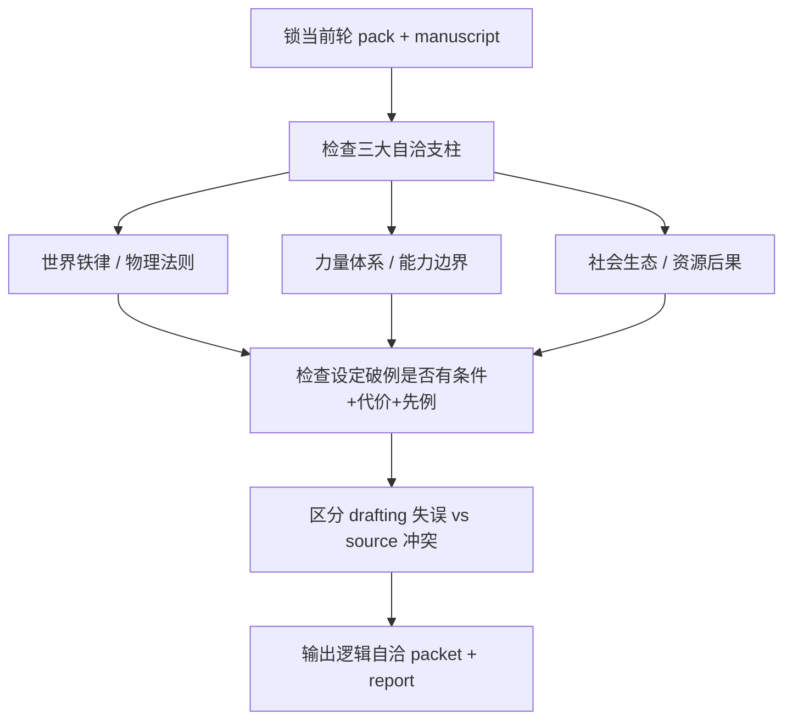
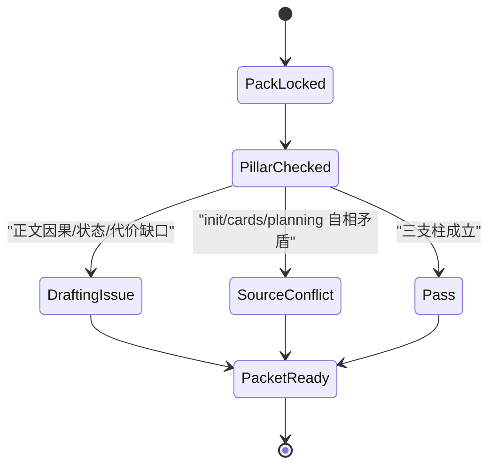
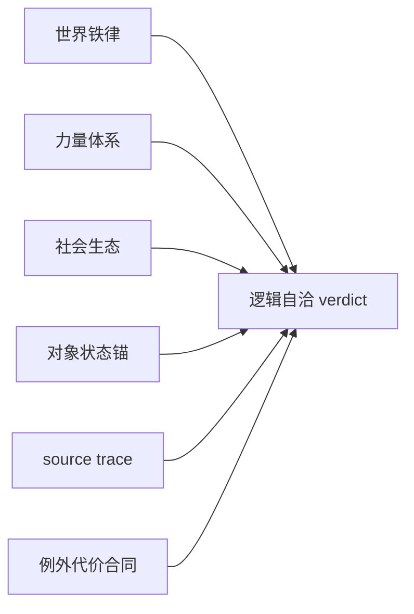

# 4-Validation / 逻辑自洽校验

## Context Loading Contract

- 每次调用本技能时，必须同时加载同目录 `CONTEXT.md`。
- 必须回读父层 `4-Validation/SKILL.md`、`../_shared/validation-root-contract.md`、`../_shared/validation-child-output-contract.md`、`./references/setting-self-consistency-framework.md`。
- 正式审查前，必须至少读取同一轮锁定后的 `validation_fact_pack.cards_state_history_slice`、`chapter_board` 与当前正文；若命中 source 冲突信号，再继续回指 pack 中的 `cards / init / planning truth`。

## Invocation Modes

- `drafting_inline`
  - 被 `3-Drafting` 在 registry 指定 step 写回后立即调用，用于尽早阻断“规则只为剧情服务”与 source truth 冲突。
- `final_acceptance`
  - 被 `4-Validation` 父层在章节末端并发调用，参与最终 `validation_status` 聚合。

## Parent Positioning

本 child 负责：

- 检查事件因果、对象状态、能力边界、世界铁律与例外代价是否自洽
- 检查力量体系是否漂移，社会生态与资源后果是否只在需要时才被启用
- 判断问题属于正文执行失误，还是 `0-Init / 1-Cards / 2-Planning` 的 source truth 自己冲突
- 产出 `contrivance_risk` 与设定自洽风险的核心维度证据

它不负责：

- 判定章节结构是否有戏
- 角色声口是否有辨识度
- 上一集到这一集的情绪承接
- 时间锚的精确排序与伏笔窗口越线

## Canonical Sources

- `../SKILL.md`
- `../CONTEXT.md`
- `../_shared/validation-root-contract.md`
- `../_shared/validation-child-output-contract.md`
- `../_shared/validation-fact-pack-spec.md`
- `../_shared/checker-output-schema.md`
- `../../_shared/entity-management-spec.md`
- `./references/setting-self-consistency-framework.md`
- `.agents/skills/story_backup/templates/worldbuilding/setting-consistency.md`

## Reference Loading Guide

- 先用 `setting-self-consistency-framework.md` 锁定本维度的 3 个主支柱：
  - 世界铁律 / 物理法则
  - 力量体系 / 能力边界
  - 社会生态 / 资源后果
- 如果正文存在“规则破例”，必须额外检查是否同时具备 `触发条件 + 代价 + 前置先例/解释`，否则直接计入 `exception_cost_gaps`。
- 若发现问题本质上是 pack 或上游真源互相打架，应立即切到 source trace，而不是继续给正文补借口。

## Business Requirement Analysis Contract

| analysis_slot | 当前结论 |
| --- | --- |
| `business_goal` | 判断正文是不是站在当前真源上自洽运转，而不是靠临场编借口、临时破例或规则失忆硬推过去。 |
| `business_object` | `cards_state_history_slice`、`chapter_board`、当前正文，以及必要时的 `init/cards/planning truth`。 |
| `constraint_profile` | 必须区分“正文逻辑错”与“source truth 自己冲突”；必须区分“合理例外”与“只为剧情开洞”；时间线问题要路由给 `时间线`，不要在本维度越权吞并。 |
| `success_criteria` | 能明确指出因果断点、状态冲突点、世界规则越界点、例外代价缺口、社会生态失衡点与 source owner。 |
| `non_goals` | 不评价文风好不好，不补写剧情，不代替 `时间线/连续性/结构兑现` 做它们的主维度裁决。 |
| `complexity_source` | 复杂度来自“幻想设定可大胆，但规则必须稳定”的多层检查：事件因果、能力上限、例外代价、社会后果、source owner 上溯。 |
| `topology_fit` | `pack lock -> three-pillar self-consistency check -> exception-cost gate -> source trace -> packet write` |
| `step_strategy` | 先问“这件事能否发生”，再问“它为什么会这样发生”，最后问“若不成立，究竟该打回 drafting 还是上溯 source contract”。 |

## Total Input Contract

- 必需输入：
  - `validation_fact_pack.cards_state_history_slice`
  - `validation_fact_pack.chapter_board`
  - 当前 `第N集.md`
- 条件必需输入：
  - 本轮 pack 中能解释世界规则、角色能力、资源约束的 `init/cards/planning truth`
- 硬规则：
  - 先问“按当前真源这件事能不能发生”，再问“写得是否顺滑”。
  - 每一个“设定破例”都必须补查 `触发条件 + 代价 + 先例/解释`；三者缺一，默认不成立。
  - 必须区分 `world_rule_conflicts`、`capability_conflicts`、`social_ecology_conflicts`、`state_conflicts`，不得把所有问题都压扁成“逻辑不通”。
  - 一旦识别到 source truth 自相矛盾，必须在 issue 中写明 `source_layer_owner`，并优先走 `back_to_source_contract`。
  - 若问题本质是时间顺序或静默窗口越线，必须转交 `时间线`，不得在本维度越权吞并。

## Output Contract

- `role_id`:
  - `logic-validator`
- `dimension_packet`:
  - 至少包含 `cause_effect_breaks`、`state_conflicts`、`capability_conflicts`、`world_rule_conflicts`、`exception_cost_gaps`、`social_ecology_conflicts`、`contrivance_risk`
- `dimension_report_ref`:
  - `4-Validation/第N集/逻辑自洽校验.md`
- 默认返工节点：
  - `1-单集叙事起盘`
- 可能上溯层：
  - `0-Init`
  - `1-Cards`
  - `2-Planning`

## Visual Maps

## Pillar Routing Matrix

| pillar_id | 核心问题 | 常见失效 | 默认证据 | 细则真源 |
| --- | --- | --- | --- | --- |
| `P1-WORLD-RULE` | 这个世界宣告过的铁律是否被偷偷打破？ | `world_rule_conflicts`、`state_conflicts` | `cards_state_history_slice`、当前正文 | `references/setting-self-consistency-framework.md#1-世界铁律--物理法则自洽` |
| `P2-POWER-SCALE` | 能力上限、越级条件、资源消耗是否前后一致？ | `capability_conflicts`、`exception_cost_gaps` | 正文事件链、能力说明、pack truth | `references/setting-self-consistency-framework.md#2-力量体系--能力边界自洽` |
| `P3-SOCIAL-ECOLOGY` | 规则带来的经济、组织、人口、风险后果是否稳定存在？ | `social_ecology_conflicts`、`contrivance_risk` | 正文场景后果、chapter board 任务环境 | `references/setting-self-consistency-framework.md#3-社会生态--资源后果自洽` |
| `P4-SOURCE-TRACE` | 这个洞是正文写错，还是 source truth 先打架？ | `source conflict routing miss` | issue source trace | `references/setting-self-consistency-framework.md#5-source-trace-矩阵` |

## Thinking-Action Network

| node_id | field_id | objective | actions | evidence | route_out | gate |
| --- | --- | --- | --- | --- | --- | --- |
| `N1-PACK-LOCK` | `FIELD-LSC-01` | 锁本轮事实边界 | 读取 `cards_state_history_slice + chapter_board + manuscript`，必要时补取 `init/cards/planning truth` | `pack_lock_note` | -> `N2` | 同轮事实边界清楚 |
| `N2-PILLAR-CHECK` | `FIELD-LSC-02` | 完成三支柱自洽核查 | 逐项检查世界铁律、力量体系、社会生态是否只在需要时生效 | `pillar_check_note` | -> `N3` | 已识别主失效类型 |
| `N3-EXCEPTION-COST-GATE` | `FIELD-LSC-03` | 检查设定破例是否合法 | 逐条核对“触发条件 / 代价 / 先例或解释” | `exception_gate_note` | -> `N4` | 破例不再裸奔 |
| `N4-SOURCE-TRACE` | `FIELD-LSC-04` | 区分正文问题与源层冲突 | 标记 `source_layer_owner`，决定回 drafting 还是上溯 source contract | `source_trace_note` | -> `N5` | 返工 owner 明确 |
| `N5-PACKET-WRITE` | `FIELD-LSC-05` | 输出逻辑自洽维度结论 | 生成 `dimension_packet + report_ref`，只写本维度 verdict | `packet_note` | done | 报告完整可聚合 |

## Lite Field Contract

| field_id | output_slot | pass_standard | fail_code | rework_entry |
| --- | --- | --- | --- | --- |
| `FIELD-LSC-01` | truth boundary | 当前轮事实边界已锁定，未混入旧 pack 或模糊设定 | `FAIL-LSC-01` | `N1` |
| `FIELD-LSC-02` | pillar verdict | 三支柱问题被准确分类，而不是笼统写“逻辑怪” | `FAIL-LSC-02` | `N2` |
| `FIELD-LSC-03` | exception gate | 所有破例都有条件、代价与解释，否则已记入 issue | `FAIL-LSC-03` | `N3` |
| `FIELD-LSC-04` | source trace | drafting 与 source owner 已区分，未误把上游冲突打回正文 | `FAIL-LSC-04` | `N4` |
| `FIELD-LSC-05` | dimension packet | 报告完整、可聚合、可直接支撑 `contrivance_risk` 与 source route | `FAIL-LSC-05` | `N5` |

## Completion Contract

- 已列出逻辑自洽问题及其 `source_layer_owner`。
- 已明确区分世界规则、能力边界、社会生态与对象状态层的问题。
- `contrivance_risk` 与设定破例风险已可被父层直接消费。
- 若命中 source 冲突，报告已阻止误打回 drafting。
