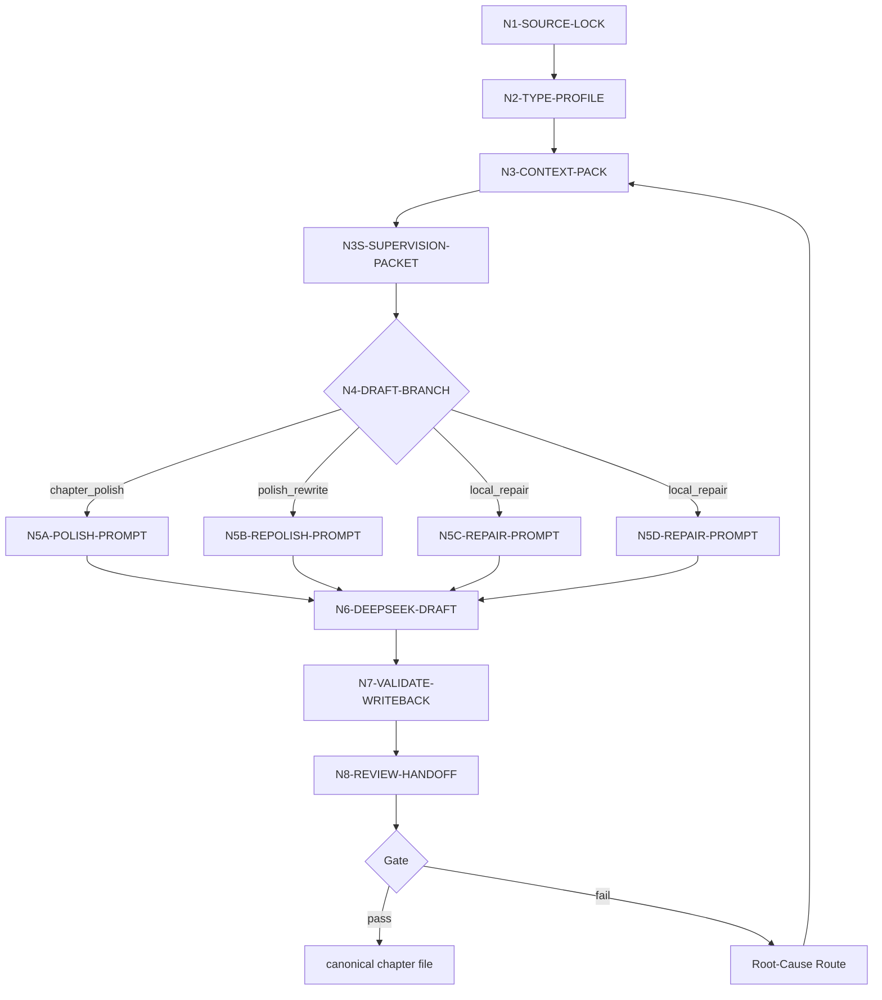

# Chapter Polishing Workflow

本文件承载 `story-polishing-deepseek` 的思行网络。节点必须同时表达判断、动作、证据、路由和 gate。

## Topology

当前技能采用 hybrid 拓扑：前段串行锁源与判型，中段先启动 team supervision subagents，再按起草/续写/重写/修复分支汇流到 DeepSeek provider，后段接 writeback 与卷级 review handoff。

## Node Network

| node_id | objective | inputs | actions | evidence | route_out | gate |
| --- | --- | --- | --- | --- | --- | --- |
| `N1-SOURCE-LOCK` | 锁定唯一项目根、卷号、章号与输出路径 | 用户请求、项目根、chapter 参数 | 定位 `projects/story/<项目名>/` 与 `第N卷/第N章.md` | `source_lock_note`、canonical output path | `N2-TYPE-PROFILE` | 项目根与卷章唯一 |
| `N2-TYPE-PROFILE` | 判定起草、续写、重写、修复或 dry-run | 目标章是否存在、用户意图、`types/polishing-type-map.md` | 生成 `type_profile` | `type_profile` | `N3-CONTEXT-PACK` | mode 唯一且不冲突 |
| `N3-CONTEXT-PACK` | 组装写作上下文包 | 三层 planning、global/style cards、`north_star`、`MEMORY.md`、项目 `CONTEXT/`、上一章 | 读取并压缩为 provider 可消费上下文；上一章存在时生成连续性桥 | messages pack、context refs、continuity bridge | `N3S-SUPERVISION-PACKET` | 必需输入齐备；上一章存在时必须有桥接约束 |
| `N3S-SUPERVISION-PACKET` | 启动 GPT 监制组 | messages pack、`team/SKILL.md + CONTEXT.md`、被选 team 成员技能 | 真实启动 subagents，汇流 narrative/structure/character/style/continuity 约束 | supervision packet、roster refs 或降级报告 | `N4-DRAFT-BRANCH` | 有真实 subagent 证据；被上层阻断时有降级说明 |
| `N4-DRAFT-BRANCH` | 按类型选择 prompt 约束 | `type_profile`、现稿状态、用户约束 | 路由到新章、重写、续写或修复分支 | branch decision | `N5A/B/C/D` | 分支与用户请求一致 |
| `N5A-POLISH-PROMPT` | 为新章起稿生成 provider prompt | context pack、输出模板 | 保持 planning 义务，生成完整章请求 | prompt section | `N6-DEEPSEEK-DRAFT` | 没有依赖现稿 |
| `N5B-REPOLISH-PROMPT` | 为重写生成 provider prompt | context pack、现有正文、用户重写约束 | 保留成立事实，重构正文 | prompt section | `N6-DEEPSEEK-DRAFT` | 已回读现稿 |
| `N5C-REPAIR-PROMPT` | 为续写/补全生成 provider prompt | context pack、现有正文、章末目标 | 延续既有文气并补足未完成义务 | prompt section | `N6-DEEPSEEK-DRAFT` | 承接点明确 |
| `N5D-REPAIR-PROMPT` | 为局部修复生成 provider prompt | review finding、现稿、源层约束 | 定位问题层并限制修复范围 | rework route note | `N6-DEEPSEEK-DRAFT` | 不越权改 planning |
| `N6-DEEPSEEK-DRAFT` | 通过 DeepSeek 生成完整润色章节文件 | provider prompt、系统提示、输出模板、supervision packet | 调用 `polish_chapter_via_deepseek.py` 及 DeepSeek bridge | provider report、raw output | `N7-VALIDATE-WRITEBACK` | provider 真实命中 |
| `N7-VALIDATE-WRITEBACK` | 校验并写回 canonical 章节 | provider output、frontmatter contract、heading contract | 校验 YAML、必需字段、标题、正文完整度；写回目标路径 | final chapter file、sidecar refs | `N8-REVIEW-HANDOFF` 或 Root-Cause Route | 校验通过且路径正确 |
| `N8-REVIEW-HANDOFF` | 准备卷级审计与返工闭环 | 当前卷章节集合、写作日志、sidecars、review 触发条件 | 卷完成时调用 `review/final_acceptance`，并汇流 `code-reviewer` findings；未满卷时记录 candidate 状态 | review handoff note | done | 不把单章 candidate 宣称为 validated final |

## Failure Routing

| fail_code | symptom | rework_entry |
| --- | --- | --- |
| `FAIL-DSD-SOURCE` | 项目根、卷章或输出路径不唯一 | `N1-SOURCE-LOCK` |
| `FAIL-DSD-TYPE` | 起草/续写/重写/修复误判 | `N2-TYPE-PROFILE` |
| `FAIL-DSD-CONTEXT` | planning、cards、`north_star`、项目记忆或上下文缺失 | `N3-CONTEXT-PACK` |
| `FAIL-DSD-SUPERVISION` | subagents 未真实启动、未说明降级，或监制包未进入 provider messages | `N3S-SUPERVISION-PACKET` |
| `FAIL-DSD-CONTINUITY` | 上一章存在但本章开篇像重新开局、漏接事实/位置/情绪/悬念 | `N3-CONTEXT-PACK`、`N5*` |
| `FAIL-DSD-PROMPT` | prompt 未对齐分支或照搬 planning 语言 | `N4-DRAFT-BRANCH`、`N5*` |
| `FAIL-DSD-PROVIDER` | DeepSeek 调用失败或返回无效 | `N6-DEEPSEEK-DRAFT` |
| `FAIL-DSD-WRITEBACK` | frontmatter、标题或输出路径不合规 | `N7-VALIDATE-WRITEBACK` |
| `FAIL-DSD-REVIEW-HANDOFF` | 卷完成后未进入 `review`、`code-reviewer` findings 未汇流或返工目标缺失 | `N8-REVIEW-HANDOFF` |

## Evidence Gate

- dry-run 至少应产生 messages pack 与上下文引用摘要。
- 正式创作至少应产生 messages pack、supervision packet 或降级报告、provider output、provider report 或等价 sidecar，以及 canonical chapter file。
- 卷完成时必须产生 `review` handoff 或 aggregate 引用；未满卷时必须标记为 candidate draft。
- 任何没有 DeepSeek provider 证据链的正文不得宣称按 `C-Deepseek流` 完成。
