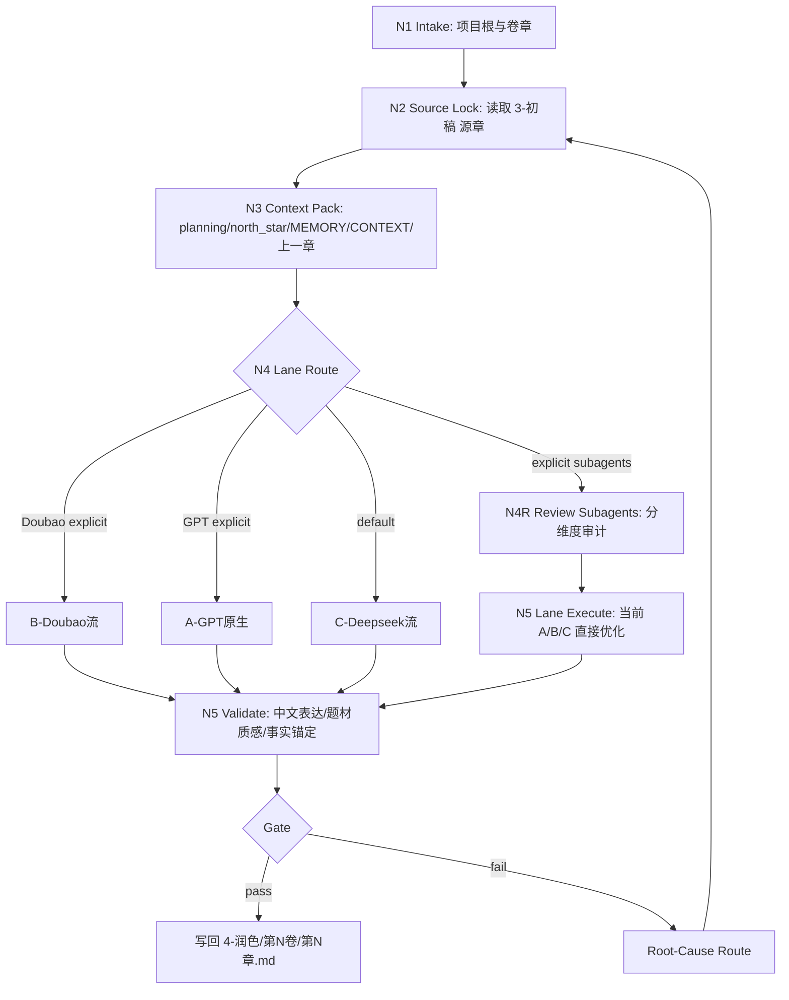

# 4-润色

## Context Loading Contract

- 每次调用本技能时，必须同时加载同目录 `CONTEXT.md`。
- 必须回读 story 根层 `../SKILL.md` 与 `../CONTEXT.md`，先锁定 `story2026` 总线边界，再进入本阶段。
- 若当前任务绑定 `projects/story/<项目名>/`，必须先加载项目根 `MEMORY.md`，再按当前卷/章相关性加载项目根 `CONTEXT/`。
- 必须读取当前章 `projects/story/<项目名>/3-初稿/第N卷/第N章.md` 作为润色主输入；若缺失，禁止凭 planning、摘要或记忆直接生成润色稿。
- 当前章 planning、`north_star.yaml` 与项目上下文只用于校准义务、风格和题材质感，不得取代 `3-初稿` 成为润色主文本。
- `CONTEXT.md` 只承载经验层 Type Map、Repair Playbook 与 Reusable Heuristics，不得重定义本入口合同。

## Purpose

`4-润色` 是 `story2026` 在 `3-初稿` 之后的章节级最小局部修补阶段。它承接 `3-初稿` 的正文真源，在不改写核心剧情事实、不替代 planning/cards/north_star、不默认整章重排的前提下，只修明显坏处，输出保留初稿句群骨架、文本分布和人物气口的中文小说章节。

它拥有：

- 当前章润色稿写权：`projects/story/<项目名>/4-润色/第N卷/第N章.md`
- 当前章润色稿写权仅限：`projects/story/<项目名>/4-润色/第N卷/第N章.md`
- 只对本次被调度 lane 的有效输出做父级聚合与最终落盘的裁决权

它不拥有：

- `0-初始化`、`1-设定`、`2-卷章` 的真源改写权
- `3-初稿` 原始正文覆盖权
- `review` 的 PASS/FAIL 判定权
- 未被本轮实际调度 lane 的占位输出、空字段或理论补丁生成权

## Mode Selection

| lane | 默认状态 | 触发信号 | 子技能 |
| --- | --- | --- | --- |
| `C-Deepseek流` | default active | 用户未点名 provider、要求润色、去 AI 检测规整化风险、最小局部修补、长思维链二次调优 | `C-Deepseek流/SKILL.md` |
| `B-Doubao流` | explicit | 用户点名豆包、Doubao，或明确要求中文口语/网文气口再生成一版润色稿 | `B-Doubao流/SKILL.md` |
| `A-GPT原生` | explicit | 用户点名 GPT 原生、当前会话直接修补、或需要本地人工式小修和落盘校验 | `A-GPT原生/SKILL.md` |

## Task Modes

| mode | 触发信号 | 父级动作 | 子流动作 |
| --- | --- | --- | --- |
| `chapter_polish` | `4-润色` 目标章不存在 | 锁定源初稿、选择 lane、生成第一版最小局部修补稿 | 从 `3-初稿` 生成保留初稿骨架的 `4-润色` |
| `polish_rewrite` | `4-润色` 目标章已存在，且用户明确要求重润、覆盖、重新润色或整章重写 | 回读源初稿与既有润色稿；要求显式覆盖确认 | 仅在显式授权下重新生成完整润色稿 |
| `local_repair` | 用户或 review 指出局部表达、质感、连续性、事实漂移、AI 检测规整化风险 | 把 finding 路由到最小有效修复范围 | 局部修复，不扩大为整章重写，除非 finding 指向全章结构失效且用户确认 |
| `subagent_review_optimize` | 用户显式要求启用 subagents、并行审计、分维度审查后直接优化 | 先按 `.agents/skills/story/review` registry 将审计点映射到维度子技能，再把 findings 回灌到所选 A/B/C lane | 每个审计点由对应 review 子技能审计；同轮必须直接执行最小优化并写回或给出阻断 |
| `dry_run` | 用户或脚本只要求装配上下文 | 只返回 stdout 摘要，不写正文真源 | 不调用 provider 或不落盘正文 |

## Input Contract

### Required Input

- 项目根：`projects/story/<项目名>/`
- 当前卷章定位：`volume_num / chapter_num`，或可由 `chapter_num` 推导卷号。
- 初稿正文：`projects/story/<项目名>/3-初稿/第N卷/第N章.md`
- 规划参考：`projects/story/<项目名>/2-卷章/整体规划.md`
- 规划参考：`projects/story/<项目名>/2-卷章/第N卷/卷规划.md`
- 规划参考：`projects/story/<项目名>/2-卷章/第N卷/第N章.md`
- 风格/题材参考：`projects/story/<项目名>/0-初始化/north_star.yaml`

### Conditional Input

- `projects/story/<项目名>/MEMORY.md`：项目存在时必须加载。
- `projects/story/<项目名>/CONTEXT/**/*.md`：存在时按当前章相关性加载。
- 既有 `projects/story/<项目名>/4-润色/第N卷/第N章.md`：存在时必须回读，覆盖需显式 force 或等价确认。
- 上一章初稿或润色稿：存在时作为连续性、文气和章间节奏参考。
- review finding / 用户局部问题描述：进入 `local_repair` 时必须加载。

### Reject Or Block

- 缺少当前章 `3-初稿` 正文。
- 用户要求润色阶段凭 planning 从零写正文。
- 用户要求润色时静默改动核心事件、人物关系、世界观事实或章级任务结果。
- 用户要求把润色结果写回 `3-初稿/`、`正文/`、平铺章节文件或临时 sibling 文件。
- 目标章已存在但用户没有明确允许覆盖，且当前不是 `dry_run` / `no_writeback`。

## Base Polishing Rules

1. 润色默认是最小局部修补，不是整章重写：保留初稿段落顺序、事件顺序、句群骨架、长短不齐、局部粗粝和人物原声，只修明显坏处。
2. 更符合中文表达风格：去掉翻译腔、说明腔、AI 腔和公式化解释，但不得把全文压成平均短句、整齐分段或通用顺滑文本。
3. 更符合题材的写作质感：读取 `north_star.yaml.genre_contract` 与风格约束，让场景密度、情绪颗粒、对白锋利度、心理节奏和段落推进服务当前题材，但只在必要处微调。
4. 初稿事实优先：保留初稿已成立的事件顺序、人物动机、信息揭示、章末牵引；只在用户明确要求时做结构级重写。
5. 润色不是摘要：输出必须是完整章节 prose，不得变成点评、建议、改写说明或段落清单。
6. 润色不是审查结论：发现源层问题时生成 repair finding 或阻断报告，不把下游润色伪装成上游真源修复。
7. 润色不是同义词替换，也不是大面积洗稿：优先处理公式句、重复解释、局部对白同质、动作逻辑硬说明、事实漂移和连续性断点。
8. 润色不是清洗风格：不得把作者口味、项目长期偏好、题材锋芒和人物声音修成通用顺滑文本。
9. 章末与场景收束可使用意象回扣：优先从当前场景已有的天象、光影、声音、物件和人物动作中取材，把情绪余韵、题材质感和下一章牵引压进景物；不得新增剧情事实，不得用空泛风景替代冲突钩子，也不得把所有结尾公式化为月夜、冷风或远灯。
10. AI 腔必须拆成可定位的坏点处理，而不是用“去 AI 味”泛化重写：优先检查过量因果连接词、均匀段落长度、异常完整主谓句、情绪标签直贴、解释性插入语、流程化总结句和角色共用作者口吻。
11. 场景密度与信息节奏必须被保护：不得以“去冗余”为由删掉承载空间、物件、身体反应、关系压力或悬念延迟的感知颗粒；不得把需要由行动、对白或感官呈现的信息压平成高度概括的说明句。
12. 初稿节奏意图必须被保护：不得以“提升可读性”为由，把有意的长复合句、意识流碎片、断裂句、省略句或长短不齐的句群全部改成中等长度均衡句。

## Polishing Quality Gates

| gate_id | gate | pass condition |
| --- | --- | --- |
| `G1-SOURCE-ANCHOR` | 初稿锚定 | 润色稿的核心事件、人物动机、信息揭示和章末牵引可追溯到 `3-初稿` |
| `G2-MINIMAL-REPAIR` | 最小修补 | 默认保留初稿骨架和大部分句群，不出现无授权整章重排、短句化清洗或通用顺滑化 |
| `G3-CHINESE-PROSE` | 中文语感 | 没有明显翻译腔、说明腔、AI 腔、公式化解释；AI 腔问题已定位到具体坏点；句长和段落分布不能明显机械收缩 |
| `G4-GENRE-TEXTURE` | 题材质感 | `north_star.yaml.genre_contract` 能落实到场景压力、情绪颗粒、对白和节奏 |
| `G5-CONTINUITY` | 连续性 | 与上一章、当前章 planning、项目记忆不冲突 |
| `G6-OUTPUT-SHAPE` | 输出形态 | 完整 Markdown 章节；frontmatter 至少包含 `润色模型`、`初稿来源` 与 `字数` |
| `G7-PATH` | 路径 | 写入 `4-润色/第N卷/第N章.md` |
| `G8-DENSITY-RHYTHM-PRESERVATION` | 密度与节奏保护 | 感知密度、信息揭示节奏、人物声口和初稿句群起伏没有被压平成说明文或均衡模板 |

## Subagent Review-Optimize Contract

当用户在 `4-润色`、`A-GPT原生`、`B-Doubao流` 或 `C-Deepseek流` 中显式要求启用 subagents 模式时，默认进入 `subagent_review_optimize`，不再只产出泛化监制意见或单一 checklist。

执行模式固定为：

1. 先加载 `.agents/skills/story/review/SKILL.md + CONTEXT.md`、`_shared/validation-dimension-registry.yaml`，并按审计点加载对应维度子技能自己的 `SKILL.md + CONTEXT.md`。
2. 按审计点拆分 subagents；一个审计点归属一个 review 维度子技能，不得用同一个泛化 reviewer 代替全部维度。
3. 每个维度只输出自己的 `dimension_packet`、问题定位、source owner 和建议的 `rework_target`；父级 `4-润色` 不把 child sidecar 当最终 PASS/FAIL。
4. 审计结果必须在同轮回灌到当前选中的 A/B/C lane，并由该 lane 执行 `local_repair`、`chapter_polish` 或显式 `polish_rewrite`；只写审计报告但不优化，不能宣称完成 subagents 模式。
5. B/C provider lane 中，review subagents 只产出维度审计包和 repair brief；最终正文优化仍必须由 Doubao/DeepSeek provider 执行。A lane 中，审计 subagents 必须与 GPT 主写作上下文隔离。
6. 若上层策略阻断真实 subagents，必须报告阻断层级、原计划 review 子技能 roster、实际降级路径、未真实启动的维度，并说明是否仍能执行本地最小优化。

审计点默认映射：

| 审计点 | review 子技能 | 优化回灌 |
| --- | --- | --- |
| planning 承诺、结构义务、伏笔兑现 | `.agents/skills/story/review/结构兑现` | 当前 lane 的结构/段落局部修复；若问题属于 planning 源层则阻断并路由上游 |
| 章间承接、线程、压力线不断带 | `.agents/skills/story/review/连续性` | 当前 lane 的连续性桥、开章承接和必要过渡修复 |
| 因果链、设定规则、能力边界、source truth 冲突 | `.agents/skills/story/review/逻辑自洽校验` | 当前 lane 只修正文表达层逻辑断点；source truth 冲突不得由润色硬改 |
| 人物行为、动机、关系压力、对白声口 | `.agents/skills/story/review/人物一致性` | 当前 lane 的人物反应、对白、心理和声口局部修复 |
| 时间锚、事件顺序、持续时长、伏笔窗口 | `.agents/skills/story/review/时间线` | 当前 lane 的时序提示、过渡句和窗口修复；源层错位则路由上游 |
| 主从任务、支线去向、开放保留 | `.agents/skills/story/review/任务汇聚` | 当前 lane 的章末牵引、任务收束或开放声明局部修复 |
| 中文 prose、现场感、句群节奏、AI 腔、模板脸色和对白潜台词 | `.agents/skills/story/review/文体读感` | 当前 lane 的文体读感最小修补；不得把初稿活气清洗成整齐说明文 |

## Reference Loading Guide

| 场景 | 读取文件 |
| --- | --- |
| GPT 原生润色 | `A-GPT原生/SKILL.md` + `A-GPT原生/CONTEXT.md` |
| Doubao provider 润色 | `B-Doubao流/SKILL.md` + `B-Doubao流/CONTEXT.md` |
| DeepSeek provider 润色 | `C-Deepseek流/SKILL.md` + `C-Deepseek流/CONTEXT.md` |
| 需要 lane 级细则 | 对应 lane 的 `references/chapter-polishing-contract.md` |
| 需要执行拓扑 | 对应 lane 的 `steps/chapter-polishing-workflow.md` |
| 需要判定 mode | 对应 lane 的 `types/polishing-type-map.md` |
| 需要质量门禁 | 对应 lane 的 `review/review-contract.md` |
| 显式 subagents 分维度审计并直接优化 | `.agents/skills/story/review/SKILL.md + CONTEXT.md`、`.agents/skills/story/review/_shared/validation-dimension-registry.yaml`、命中的 review 维度子技能 `SKILL.md + CONTEXT.md` |
| 需要输出骨架或系统提示 | 对应 lane 的 `templates/` |
| 需要机械辅助 | 对应 lane 的 `scripts/polish_chapter_*.py` |
| 父级导引最小结构 | 本父级导引 skill 只要求同目录 `SKILL.md + CONTEXT.md`；润色模板、类型包、provider bridge 和质量 gate 归 A/B/C 子路径 |

## Execution Topology

## Root-Cause Execution Contract

失败追溯链固定为：

`Symptom -> Direct Cause -> Section Owner -> Source Contract -> Meta Rule Source`

| symptom | direct owner | rework target |
| --- | --- | --- |
| 缺少 `3-初稿` 仍尝试润色 | 输入合同层 | `SKILL.md` Input Contract |
| 润色稿改动核心剧情事实 | 源文本锚定层 | `Base Polishing Rules` + 对应 lane prompt |
| 语言顺但没有中文小说手感 | 中文语感层 | `Polishing Quality Gates` + `CONTEXT.md` Type Map |
| 题材味被磨平 | 题材质感层 | `north_star.yaml.genre_contract` + `CONTEXT.md` Type Map |
| 输出成点评、摘要或差异说明 | 输出形态层 | `Output Contract` + lane template |
| 覆盖既有润色稿没有确认或 backup | 写回安全层 | 对应 lane script + review gate |
| 输出无法追溯源初稿或 provider/GPT 执行 | 证据链层 | lane script + `Output Contract` |
| 子流没有加载同目录 `CONTEXT.md` | Skill 2.0 加载层 | lane `Context Loading Contract` |
| 显式 subagents 模式只产出审计意见但未直接优化 | review-optimize 汇流层 | `Subagent Review-Optimize Contract` + lane `local_repair` |

## Field Mapping

### Directory Ownership Table

| field_id | directory_or_file | owner_role | must_contain | fail_code |
| --- | --- | --- | --- | --- |
| `FIELD-POLISH-01` | `SKILL.md` | 父级入口与路由裁决层 | loading、mode/lane、input/output、base rules、quality gates | `FAIL-POLISH-ENTRY` |
| `FIELD-POLISH-02` | `CONTEXT.md` | 父级经验层 | Type Map、Repair Playbook、Reusable Heuristics | `FAIL-POLISH-CONTEXT` |
| `FIELD-POLISH-03` | `A-GPT原生/` | GPT 原生 lane | GPT-native 润色合同、模板、脚本、证据链 | `FAIL-POLISH-GPT-LANE` |
| `FIELD-POLISH-04` | `B-Doubao流/` | 显式 Doubao lane | Doubao 润色合同、模板、脚本、provider evidence | `FAIL-POLISH-DOUBAO-LANE` |
| `FIELD-POLISH-05` | `C-Deepseek流/` | 默认 DeepSeek 最小局部修补 lane | DeepSeek 润色合同、模板、脚本、provider evidence、最小修补约束 | `FAIL-POLISH-DEEPSEEK-LANE` |
| `FIELD-POLISH-06` | lane `templates/` | 输出模板层 | frontmatter、heading、正文骨架、Output Contract Alignment | `FAIL-POLISH-TEMPLATE` |
| `FIELD-POLISH-07` | lane `scripts/` | 自动化辅助层 | context pack、provider bridge、校验、writeback、backup | `FAIL-POLISH-SCRIPT` |

### Node Handoff Table

| node_id | input | action | output | next_gate |
| --- | --- | --- | --- | --- |
| `N1-INTAKE` | 用户请求、项目根、卷章 | 判定 `chapter_polish / polish_rewrite / local_repair / dry_run` | `polish_task_profile` | `N2-SOURCE-LOCK` |
| `N2-SOURCE-LOCK` | `polish_task_profile` | 锁定并读取 `3-初稿` 源章与目标 `4-润色` 路径 | `source_lock` | `N3-CONTEXT-PACK` |
| `N3-CONTEXT-PACK` | 源章、planning、north_star、MEMORY、CONTEXT、上一章 | 组装 lane 可消费上下文 | `context_pack` | `N4-LANE-ROUTE` |
| `N4-LANE-ROUTE` | 用户 provider 意图与上下文 | 选择 A/B/C lane；显式 subagents 模式下先进入 review 子技能审计 | `lane_selection` | `N4R-REVIEW-SUBAGENTS` 或 `N5-LANE-EXECUTE` |
| `N4R-REVIEW-SUBAGENTS` | `lane_selection`、审计点、`context_pack`、源章或既有润色稿 | 显式 subagents 模式下按 `.agents/skills/story/review` 维度子技能并行审计，并生成可执行 repair brief | `dimension_packets`、`review_repair_brief` | `N5-LANE-EXECUTE` |
| `N5-LANE-EXECUTE` | `context_pack`、lane 合同 | 由 LLM/provider 完成最小局部修补；显式重写请求才允许整章重排 | `polished_markdown` | `N6-QUALITY-GATE` |
| `N6-QUALITY-GATE` | 润色稿、源章 | 校验事实锚定、最小修补、中文语感、题材质感、路径与 frontmatter | `gate_result` | `N7-WRITEBACK` |
| `N7-WRITEBACK` | `gate_result=pass` | 写入 canonical path | `4-润色/第N卷/第N章.md` | `N8-STATE-HOOK` |
| `N8-STATE-HOOK` | 写回结果、gate_result、产物路径 | 调用 `workflow_manager.py record-skill-completion` | `STATE.json#workflow_runtime.execution_state.stage_progress` | done |

## Output Contract

| field | contract |
| --- | --- |
| Required output | 当前章完整中文最小局部修补稿 Markdown 文件。 |
| Output format | YAML frontmatter、空行、`# 第N章｜章标题`、章节润色稿；frontmatter 至少包含 `润色模型`、`初稿来源` 与 `字数`，其中 `字数` 按正文去除 frontmatter 与章节标题后的非空白字符数统计，格式为 `XXX字`。 |
| Output path | 业务真源固定写入 `projects/story/<项目名>/4-润色/第N卷/第N章.md`。 |
| Naming convention | 卷目录 `第N卷`，章节文件 `第N章.md`。 |
| Completion gate | 已真实读取 `3-初稿` 源章；已执行所选 lane 的最小局部修补主创；显式 subagents 模式下已按 review 子技能完成分维度审计并把 findings 直接优化进当前 lane 输出；最小修补、中文表达与题材质感门禁通过；输出写回 canonical path。 |
| State gate | 父技能使用 `--skill-id story-polishing`；lane 单独调用时分别使用 `story-polishing-gpt-native / story-polishing-doubao / story-polishing-deepseek`，并在 `--chapter`、`--volume` 与 `--artifacts` 中记录当前章、当前卷、源初稿与润色稿路径。 |
