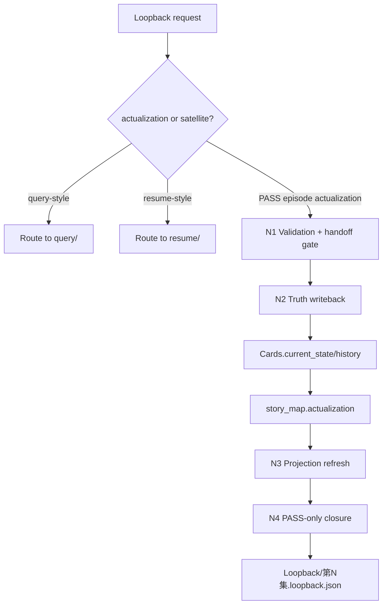
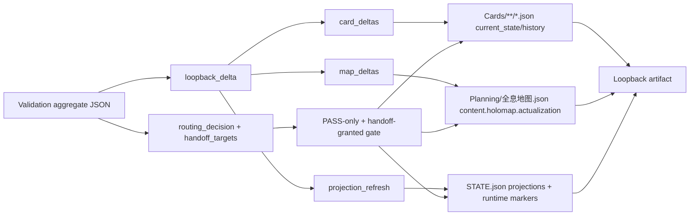
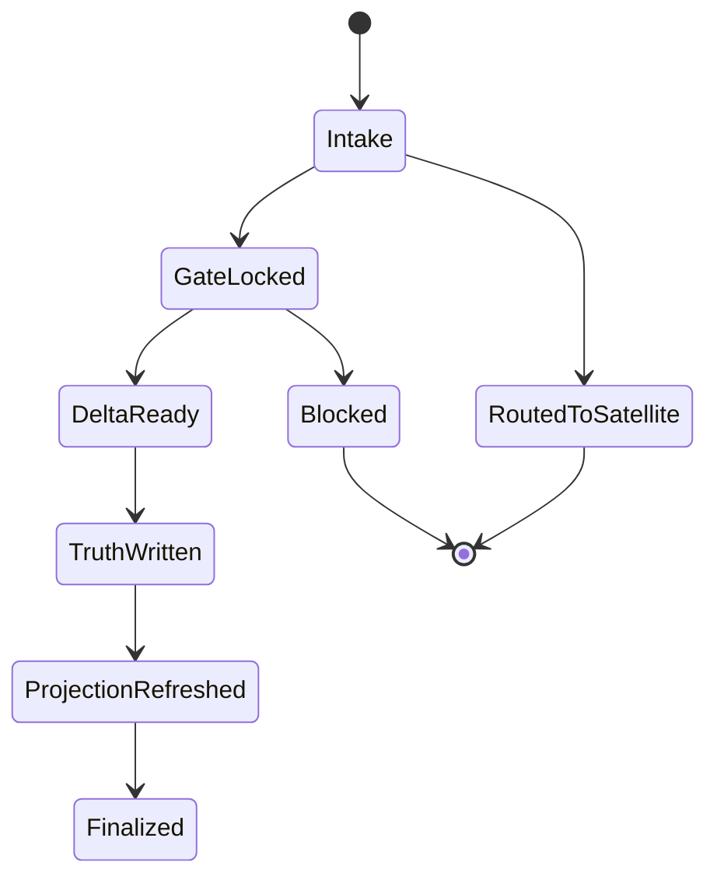
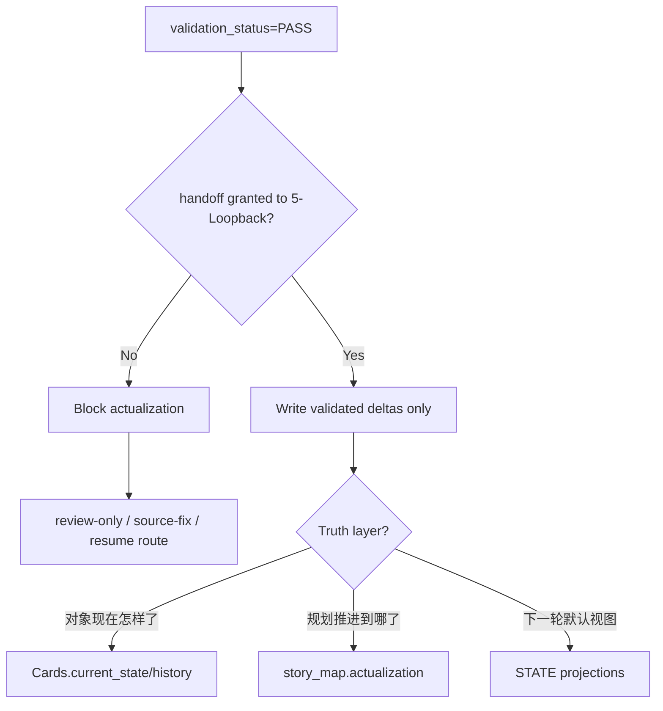

# 5-Loopback

## Context Loading Contract

- 每次调用本技能时，必须同时加载同目录 `CONTEXT.md`。
- `CONTEXT.md` 只沉淀 actualization 经验、写回陷阱、workflow 对齐启发与 projection 修复 heuristics，不得覆盖本 `SKILL.md` 的 PASS-only + handoff-granted 写回合同。
- 若 `CONTEXT.md`、`templates/loopback.json`、`../scripts/loopback_manager.py`、`../scripts/workflow_manager.py` 与本合同冲突，先修这些源层载体，再修单次 artifact。

## Overview

`5-Loopback` 现在是 `story2026` 的 validated actualization 父技能。

它不再是“通过后顺手收尾”的说明页，而是正式负责以下收束链：

1. 只消费 `4-Validation` 的聚合 JSON。
2. 同时检查：
   - `validation_status == PASS`
   - `routing_decision` 允许 loopback
   - `handoff_targets` 明确授予 `5-Loopback`
3. 提纯统一 `loopback_delta`。
4. 串行写回：
   - `Cards.current_state/history`
   - `Planning/全息地图.json.content.holomap.actualization`
5. 刷新 `STATE.json` 中下一轮要消费的 projection 与 runtime markers。
6. 生成唯一正式产物 `Loopback/第N集.loopback.json`。

补充定位：

- `4-Validation`
  - 拥有 `validation_status / routing_decision / handoff_targets` 判定权。
- `review/`
  - 拥有报告持久化与审查交接摘要权。
- `5-Loopback`
  - 只拥有 validated truth writeback / actualization 权。
- `query/`、`resume/`
  - 仍是 `5-Loopback` 侧挂卫星技能，不得冒充 actualization 主流程。

一句话裁决：

- `PASS` 不是唯一 gate。
- 只有 `PASS + handoff granted` 才能进入 actualization。

## Parent Positioning

### 父层拥有

- `PASS-only + handoff-granted` intake gate
- `loopback_delta` 提纯与边界裁决
- `Cards` 与 `story_map.actualization` 的 truth split
- projection refresh 与 runtime marker 刷新
- `Loopback/第N集.loopback.json` 唯一正式 artifact
- `query/`、`resume/` 的卫星路由裁决
- workflow step 与 skill step 的对齐责任

### 父层不拥有

- 重写 `validation_status`
- 重写 `routing_decision / handoff_targets`
- 代替 `review/` 产出正式审查报告
- 代替 `3-Drafting` 修改正文
- 覆盖 `Cards.core`
- 覆盖 `Planning/全息地图.json` 内的 `planned_*` 规划理由层

## Shared Canonical Sources

- `.agents/skills/story/SKILL.md + CONTEXT.md`
- 当前 `SKILL.md + CONTEXT.md`
- `../4-Validation/SKILL.md`
- `../review/SKILL.md`
- `../query/SKILL.md`
- `../resume/SKILL.md`
- `../4-Validation/_shared/checker-output-schema.md`
- `../_shared/entity-management-spec.md`
- `./_shared/loopback-actualization-spec.md`
- `../scripts/workflow_manager.py`
- `templates/loopback.json`
- `../scripts/loopback_manager.py`
- `../scripts/story.py`
- `../scripts/workflow_manager.py`

真源分工固定为：

- `4-Validation` 聚合 JSON
  - 判定当前 episode 是否被允许进入 actualization。
- `5-Loopback/SKILL.md`
  - 裁定 actualization 总流程、truth split、卫星路由与完成 gate。
- `templates/loopback.json`
  - `Loopback/第N集.loopback.json` 的唯一结构模板。
- `loopback_manager.py`
  - 当前阶段的脚本执行入口与写回实现。

## Business Requirement Analysis Contract

| analysis_slot | 当前结论 |
| --- | --- |
| `business_goal` | 把已经通过终验且被明确交接给 loopback 的 episode 变化，稳定写回未来会继续被消费的 truth 层。 |
| `business_object` | `Validation/第N集.validation.json`、`Cards/**/*.json`、`Planning/全息地图.json`、`STATE.json`、`Loopback/第N集.loopback.json`、workflow governance refs。 |
| `constraint_profile` | 必须同时满足 `PASS` 与 `handoff_to_review_and_loopback` 语义；不得覆盖 `planned_*`；不得改 `Cards.core`；不得把 query/resume 诉求混入 actualization 主流程。 |
| `success_criteria` | 只在合法 handoff 下写回 truth；Cards 与 MAP 没有互相串层；projection 已刷新；loopback artifact 能回指 validation 与 governance evidence。 |
| `non_goals` | 不做审查报告；不重跑 validation；不把历史复核 PASS 直接写回；不生成第二张执行 MAP；不把单集文面技巧写成长期对象态。 |
| `complexity_source` | 复杂度来自 gate 双判定、三层 truth split、workflow runtime 对齐、以及 satellite routing 与 actualization 主流程的边界。 |
| `topology_fit` | `validation/handoff gate -> delta extract -> truth writeback -> projection refresh -> closure artifact`，并在入口处先判是否该改走卫星技能。 |
| `step_strategy` | 主干固定 4 步，且与 `workflow_manager.py` 的 loopback tracked steps 对齐；卡回写与 MAP 实绩回写作为 Step 2 内部串行子动作。 |

## Visual Maps









## Context Preload

1. 根 `AGENTS.md`
2. `.agents/skills/story/SKILL.md + CONTEXT.md`
3. 当前 `SKILL.md + CONTEXT.md`
4. `../4-Validation/SKILL.md`
5. `../review/SKILL.md`
6. `../query/SKILL.md`
7. `../resume/SKILL.md`
8. `../4-Validation/_shared/checker-output-schema.md`
9. `../_shared/entity-management-spec.md`
10. `./_shared/loopback-actualization-spec.md`
11. `../scripts/workflow_manager.py`
12. `templates/loopback.json`
13. `../scripts/loopback_manager.py`
14. `../scripts/workflow_manager.py`
15. `projects/story/<项目名>/Validation/第N集.validation.json`
16. `projects/story/<项目名>/3-Drafting/第N集.md`
17. `projects/story/<项目名>/Planning/全息地图.json`
18. `projects/story/<项目名>/STATE.json`
19. 本集涉及的 `Cards/**/*.json`
20. 若存在：当前 run 的 governance refs

## Total Input Contract

### 必需输入

- `project_root`
- `episode` 或等价的 `chapter`
- `manuscript_ref`
- `validation_ref`
- 当前轮 `4-Validation` 聚合 JSON
- `story_map_ref`，默认 `Planning/全息地图.json`
- `STATE.json`

### validation aggregate JSON 必需字段

- `validation_status`
- `routing_decision`
- `handoff_targets`
- `validation_ref`
- `issues`
- `severity_counts`
- `overall_score`

### 条件必需输入

- 若 `loopback_delta` 不直接挂在 validation aggregate 上，则必须提供显式 `loopback_delta`
- 若当前 run 受 tracked workflow 管理，则应附带：
  - `validation_report_ref`
  - `artifact_manifest_ref`
  - `mission_brief_ref`
- 若本集有跨集继承风险，需补 `carryover_context`

### 硬规则

1. 仅 `validation_status == PASS` 还不够；必须同时满足：
   - `routing_decision == handoff_to_review_and_loopback`
   - 或 `handoff_targets` 明确包含 `5-Loopback`
2. 若当前是 `handoff_to_review_only` 的历史复核 PASS，禁止 actualization 写回。
3. `loopback_delta` 只能包含 validated 结果，不得混入 drafting 猜测、review 主观建议或 source-fix 草案。
4. `Cards` 回写只允许落到 `current_state/history`，默认不改 `core`。
5. `story_map` 回写只允许落到 `actualization / actual_* / validated_*`，不得覆盖 `planned_*`。
6. 若当前诉求其实是查询、恢复或源层修复，必须改走 `query/`、`resume/` 或 upstream source fix，而不是强行 actualize。

## Dispatch Order Contract

### 固定 tracked steps

1. `N1-VALIDATION-AND-DELTA`
   - 对齐 `workflow_manager.py -> story-loopback -> Step 1`
   - 负责 intake、gate、delta normalize
2. `N2-TRUTH-WRITEBACK`
   - 对齐 `workflow_manager.py -> story-loopback -> Step 2`
   - 负责卡回写与 MAP 实绩回写
3. `N3-PROJECTION-REFRESH`
   - 对齐 `workflow_manager.py -> story-loopback -> Step 3`
   - 负责刷新 projection 与 runtime markers
4. `N4-PASS-ONLY-CLOSURE`
   - 对齐 `workflow_manager.py -> story-loopback -> Step 4`
   - 负责 artifact 收束、writeback summary、completion gate

### Step 2 内部串行子动作

1. 先回写 `Cards.current_state/history`
2. 再回写 `story_map.actualization`

原因：

- 两者共享同一份 `loopback_delta`
- 但对象态与规划实绩态分属不同 truth layer
- 保持串行更利于 resume、审计与 writeback summary 收束

### 并发规则

- 正式写回：禁止并发
- 允许并发的仅有：
  - delta extraction 内部候选比较
  - 风险摘要整理
  - sidecar evidence 读取

### Delta Normalization 规则

统一提纯为：

```json
{
  "card_deltas": [],
  "map_deltas": [],
  "projection_refresh": [],
  "evidence_refs": []
}
```

说明：

- `card_deltas`
  - 只写对象态变化
- `map_deltas`
  - 只写规划兑现态变化
- `projection_refresh`
  - 只写下一轮默认读取视图
- `evidence_refs`
  - 必须能回指正文、validation、draft packet 或现有 truth layers

## Satellite Routing Contract

当当前请求不是 “PASS + handoff-granted episode actualization” 时，固定路由如下：

| request shape | route target | hard rule |
| --- | --- | --- |
| 询问“现在是什么状态 / 哪集兑现了” | `query/` | 不改任何 truth |
| 中断恢复、续跑、清理 | `resume/` | 不冒充 actualization |
| 发现 gate/schema/path/source drift | upstream source fix | 先修源层，再决定是否重跑 loopback |
| `PASS` 但只授予 `review/` | `review/` | 禁止 loopback 写回 |

禁止事项：

- 禁止把 `query/` 或 `resume/` 的输出伪装成 `Loopback/第N集.loopback.json`
- 禁止把 `review_handoff_summary` 当成 actualization 主产物

## Output Contract

### Canonical runtime

- `projects/story/<项目名>/Loopback/第N集.loopback.json`
- `projects/story/<项目名>/Cards/**/*.json`
- `projects/story/<项目名>/Planning/全息地图.json`
- `projects/story/<项目名>/STATE.json`

### One-shot canonical final output

`5-Loopback` 最终只向运行时与下游交付 1 个 canonical JSON artifact，并在其中收束：

- `meta`
- `inputs`
- `content.loopback_delta`
- `content.writeback_summary`
- `gate_summary`
- `execution_notes`

最少必须包含：

- `loopback_ref`
- `episode_ref`
- `validation_ref`
- `validation_status`
- `routing_decision`
- `handoff_targets`
- `card_deltas`
- `map_deltas`
- `projection_refresh`
- `evidence_refs`
- `written_card_refs`
- `written_map_refs`
- `refreshed_projection_refs`

### JSON-first 约束

生成前必须动态读取 `templates/loopback.json`。

最终输出只能是一个 JSON 对象，不得同时再长出第二份 Markdown 主报告。

## Thinking-Action Network

| node_id | objective | inputs | actions | evidence | fail_code | next_if_pass |
| --- | --- | --- | --- | --- | --- | --- |
| `N1-VALIDATION-AND-DELTA` | 锁定 PASS 与 handoff gate，并提纯 delta | validation aggregate、manuscript_ref、story_map_ref | 校验 `validation_status / routing_decision / handoff_targets`，规范化 `loopback_delta` | `gate_note`、`delta_payload` | `FAIL-LOOP-GATE-01`、`FAIL-LOOP-DELTA-02` | `N2` |
| `N2-TRUTH-WRITEBACK` | 把 validated 变化分别写回 Cards 与 MAP | `card_deltas`、`map_deltas`、现有 Cards、story_map | 先写 `Cards.current_state/history`，再写 `story_map.actualization` | `written_card_refs`、`written_map_refs` | `FAIL-LOOP-CARD-03`、`FAIL-LOOP-MAP-04` | `N3` |
| `N3-PROJECTION-REFRESH` | 刷新下一轮默认上下文 | `projection_refresh`、`STATE.json` | 更新 writer/query/planning projection 与 runtime marker | `refreshed_projection_refs` | `FAIL-LOOP-CTX-05` | `N4` |
| `N4-PASS-ONLY-CLOSURE` | 收束 artifact 与 governance 回指 | loopback template、validation ref、governance refs、writeback summary | 生成 `Loopback/第N集.loopback.json`，校验 closure | `loopback_ref`、`closure_note` | `FAIL-LOOP-CLOSE-06` | done |

## Field Master

| field_id | output_slot | 内容要求 | default_step | quality_dimension | fail_code |
| --- | --- | --- | --- | --- | --- |
| `FIELD-LOOP-01` | validation gate packet | `PASS + handoff granted` 已锁定 | `N1` | gate correctness | `FAIL-LOOP-GATE-01` |
| `FIELD-LOOP-02` | loopback delta | `card_deltas / map_deltas / projection_refresh / evidence_refs` 齐备 | `N1` | delta integrity | `FAIL-LOOP-DELTA-02` |
| `FIELD-LOOP-03` | card writeback summary | 只写白名单 card 状态层并记录 refs | `N2` | card boundary hygiene | `FAIL-LOOP-CARD-03` |
| `FIELD-LOOP-04` | map actualization summary | 只写 `actualization / actual_* / validated_*` | `N2` | planning-vs-actual split | `FAIL-LOOP-MAP-04` |
| `FIELD-LOOP-05` | projection refresh summary | 下一轮 projections 与 runtime markers 已刷新 | `N3` | runtime readiness | `FAIL-LOOP-CTX-05` |
| `FIELD-LOOP-06` | loopback artifact | artifact 已落盘且可回指 validation / governance evidence | `N4` | closure traceability | `FAIL-LOOP-CLOSE-06` |

## Step To Field Mapping

| step_id | field_id | intent | rework_entry |
| --- | --- | --- | --- |
| `N1` | `FIELD-LOOP-01` | 锁定 PASS 与 handoff gate | 回到 validation aggregate intake |
| `N1` | `FIELD-LOOP-02` | 统一提纯 validated delta | 回到 delta normalize |
| `N2` | `FIELD-LOOP-03` | 写回 card 状态层 | 回到 card whitelist / history append |
| `N2` | `FIELD-LOOP-04` | 写回 MAP 实绩层 | 回到 `actualization` boundary |
| `N3` | `FIELD-LOOP-05` | 刷新下一轮 projection | 回到 projection refresh |
| `N4` | `FIELD-LOOP-06` | 收束 artifact 与 governance 回指 | 回到 closure / template / summary |

## Field To Quality Mapping

| field_id | pass_standard | fail_code | rework_entry |
| --- | --- | --- | --- |
| `FIELD-LOOP-01` | 当前 packet 既 `PASS` 又被明确交给 `5-Loopback` | `FAIL-LOOP-GATE-01` | `N1` |
| `FIELD-LOOP-02` | 所有 delta 都来自 validated 结果且边界清晰 | `FAIL-LOOP-DELTA-02` | `N1` |
| `FIELD-LOOP-03` | `Cards` 仅改 `current_state/history`，无 `core` 漂移 | `FAIL-LOOP-CARD-03` | `N2` |
| `FIELD-LOOP-04` | `story_map` 仅补执行态，无 `planned_*` 覆盖 | `FAIL-LOOP-MAP-04` | `N2` |
| `FIELD-LOOP-05` | 下游读取 projection 时无需猜测本集后默认态 | `FAIL-LOOP-CTX-05` | `N3` |
| `FIELD-LOOP-06` | `Loopback/第N集.loopback.json` 能追溯 validation 与治理证据 | `FAIL-LOOP-CLOSE-06` | `N4` |

## Root-Cause 执行合同

- 若出现“历史复核 PASS 被误 actualize”“对象状态与 planning 进度混写”“workflow resume 看不懂 loopback 当前停在哪一步”等问题，必须按 `Symptom -> Direct Cause -> Rule Source -> Meta Rule Source` 上溯。
- 本 skill 的 `Rule Source` 默认优先检查：
  - 当前 `5-Loopback/SKILL.md`
  - `../4-Validation/SKILL.md`
  - `../4-Validation/_shared/checker-output-schema.md`
  - `./_shared/loopback-actualization-spec.md`
  - `templates/loopback.json`
  - `../scripts/loopback_manager.py`
  - `../scripts/workflow_manager.py`
- `Meta Rule Source` 默认上溯到仓库 `AGENTS.md` 与相关 meta skills。
- 修复顺序必须是：
  1. 先修 gate、handoff、workflow step 对齐与 truth split
  2. 再修 template / script / tests
  3. 最后才修单次 card、map 或 loopback artifact

## Completion Gate

- 当前 intake 已同时满足：
  - `validation_status == PASS`
  - `routing_decision == handoff_to_review_and_loopback` 或 `handoff_targets` 包含 `5-Loopback`
- 已生成 `Loopback/第N集.loopback.json`
- 已明确区分：
  - `Cards.current_state/history`
  - `story_map.actualization`
  - `STATE.json projections`
- Cards 没有重写 `core`
- `story_map` 没有覆盖 `planned_*`
- projection 已显式刷新，下一轮无需靠 query/resume 猜当前默认态
- 若本轮来自 tracked workflow，artifact 已保留 validation 与 governance refs
- 若实际命中的是卫星路由，则没有发生任何 truth writeback
