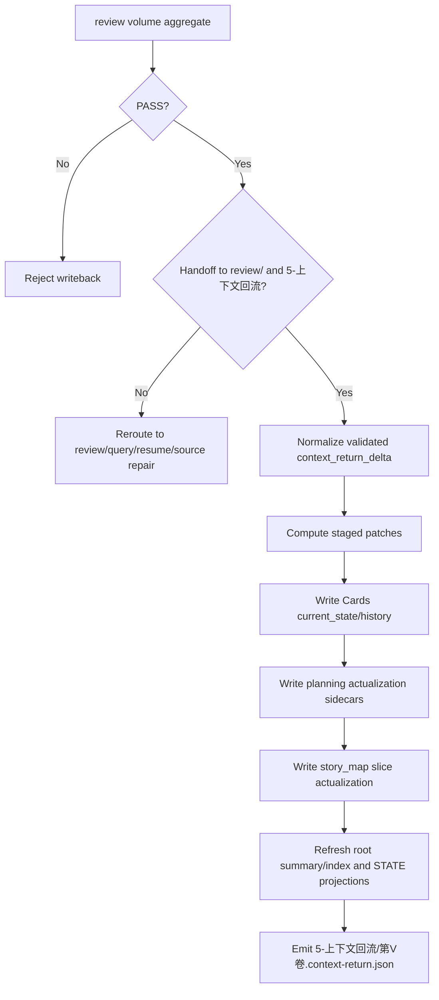
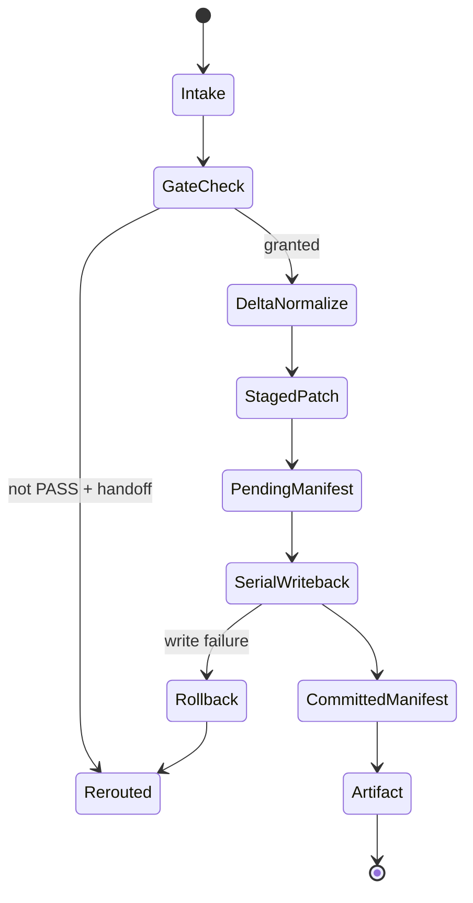

# 5-上下文回流

`5-上下文回流` is the validated actualization and project-context carryover stage for the `story2026` mainline. It only writes truth after `review` has produced a volume-level PASS aggregate and explicitly granted handoff to both `review/` and `5-上下文回流`.

It does **not** rewrite planning Markdown. Its job is to distinguish `planned` from `validated_actual`, then make the validated actual readable and reusable for the next drafting or explicit replan run.

## Context Loading Contract

- Every invocation must load this `SKILL.md`; 必须同时加载同目录 `CONTEXT.md`.
- 每次调用本技能时，必须同时识别并加载同目录 `types/` 中选中的类型包（单选或多选）。
- If the task is bound to `projects/story/<项目名>/`, load project `MEMORY.md` and relevant files under project `CONTEXT/` before execution.
- If `SKILL.md`, `CONTEXT.md`, `references/`, `steps/`, `review/`, `types/`, `templates/`, `scripts/`, `knowledge-base/`, `agents/openai.yaml`, `../scripts/context_return_manager.py`, or `../scripts/workflow_manager.py` conflict, repair the source-layer contract first, then repair single-run artifacts.
- Conflict priority: user request > repo `AGENTS.md` > `.agents/skills/story/SKILL.md` > this `SKILL.md` > declared references and steps > `agents/openai.yaml` > project memory/context > this `CONTEXT.md`.

## Input Contract

### Accepted Input

- A request to actualize a PASS-validated volume into runtime truth.
- A `project_root` under `projects/story/<项目名>/`.
- A volume-level validation aggregate from `review/第V卷.validation.json`.
- A context-return-shaped request that must be routed to `query/`, `resume/`, or upstream source repair instead of actualization.

### Required Input

- `project_root`
- `volume` or `volume_ref`
- `chapter_refs`
- `validation_ref`
- current `review/第V卷.validation.json`
- `book_plan_ref`, default `2-卷章规划/整体规划.md`
- `volume_plan_ref`, default `2-卷章规划/第V卷/卷规划.md`
- `chapter_plan_refs`, default matching `2-卷章规划/第V卷/第N章.md`
- `story_map_ref`, default `2-卷章规划/全息地图.json`
- `story_map_slice_ref`
- `STATE.json`

### Validation Aggregate Required Fields

- `validation_status`
- `routing_decision`
- `handoff_targets`
- `validation_ref`
- `issues`
- `severity_counts`
- `overall_score`
- `volume_ref`
- `chapter_refs`

### Reject Or Reroute When

- `validation_status != PASS`
- `routing_decision != handoff_to_review_and_context_return`
- `handoff_targets` does not contain both `review/` and `5-上下文回流`
- the request is a query, resume, cleanup, diagnosis, or source repair request
- the provided delta mixes drafting guesses, subjective review advice, or unvalidated source-fix drafts
- the run would overwrite `Cards.core`, `planned_*`, or planning markdown bodies

One-line gate: `PASS` is necessary but not sufficient; only `PASS + handoff granted` can enter volume-level actualization.

## Mode Selection

| mode | trigger | route |
| --- | --- | --- |
| `actualize_volume` | PASS aggregate explicitly grants `review/` and `5-上下文回流` handoff | run `steps/context-return-workflow.md` |
| `query_route` | user asks what happened, what is current, or where evidence lives | route to `../query/SKILL.md` |
| `resume_route` | user asks to continue, detect interruption, cleanup, or rerun | route to `../resume/SKILL.md` |
| `source_repair_route` | upstream planning, drafting, card, or validation source is broken | route to the owning upstream stage |
| `contract_repair` | Context Return spec, template, scripts, or metadata are inconsistent | repair this Skill 2.0 package and shared script references |

## Reference Loading Guide

| scenario | load |
| --- | --- |
| Core gate, target truth layers, delta whitelist, revision guardrail, commit discipline | `references/context-return-spec.md` |
| Truth ownership and parent/satellite boundaries | `references/truth-ownership.md` |
| Query/resume/upstream rerouting | `references/satellite-routing.md` |
| Execution node network, serial writeback, staged patch rules, rollback route | `steps/context-return-workflow.md` |
| Input request classification and aggregate field strategy | `types/type-map.md` |
| Completion gate, semantic review, provider/subagent review rules | `review/review-contract.md` |
| Stable heuristics and common failure prevention | `knowledge-base/context-return-heuristics.md` and `CONTEXT.md` |
| Canonical artifact shape | `templates/context-return.json` and `templates/output-template.md` |
| Mechanical script boundary and command hints | `scripts/README.md`, `../scripts/context_return_manager.py`, `../scripts/workflow_manager.py` |
| Product-side metadata | `agents/openai.yaml` |

## Visual Maps

## Core Execution Contract

- Formal writeback is serial. Only staged patch preparation and risk analysis may run in parallel.
- `context_return_delta` only contains validated actualization derived from the accepted aggregate and evidence.
- Truth writeback order is fixed: `Cards -> Planning sidecars -> MAP -> project CONTEXT -> STATE -> context-return artifact`.
- Planning sidecars are fixed as `book -> volume -> chapter`; planning markdown bodies stay planning-only.
- `Cards` writeback is limited to `current_state/history` unless the user and upstream card contract explicitly authorize a separate source repair.
- `story_map` details go to the matched volume slice actualization; root `全息地图.json` only receives summary/index actualization and must not become a second detail store.
- Project `CONTEXT/validated-actuals/第V卷.md` records the validated facts of the accepted volume.
- Project `CONTEXT/carryover/第V卷-to-第V+1卷.md` gives the next drafting/replan run a readable carryover packet.
- `STATE.json` receives projection refresh, runtime markers, pending manifest, and committed manifest updates.

## Root-Cause Execution Contract

When 上下文回流 fails, trace:

`Symptom -> Direct Technical Cause -> Section Owner -> Source Contract -> Meta Rule Source`

| symptom | likely owner | rework target |
| --- | --- | --- |
| PASS-only request writes without handoff | gate contract | `references/context-return-spec.md` + `review/review-contract.md` |
| query/resume becomes context-return artifact | satellite routing | `references/satellite-routing.md` |
| workflow leaves half-written truth | commit discipline | `steps/context-return-workflow.md` + `../scripts/context_return_manager.py` |
| planning markdown receives actualized state | truth ownership | `references/truth-ownership.md` |
| template and artifact fields diverge | output template | `templates/context-return.json` + `templates/output-template.md` |
| script behavior diverges from contract | script boundary | `scripts/README.md` + `../scripts/context_return_manager.py` |

## Field Mapping

| field_id | owner | must contain | fail_code |
| --- | --- | --- | --- |
| `FIELD-CONTEXT-RETURN-01` | `SKILL.md` | intake, routing, gate summary, dynamic references, Output Contract | `FAIL-ENTRY-DRIFT` |
| `FIELD-CONTEXT-RETURN-02` | `CONTEXT.md` | Type Map, Repair Playbook, Reusable Heuristics | `FAIL-CONTEXT-BASELINE` |
| `FIELD-CONTEXT-RETURN-03` | `references/` | gate, truth ownership, delta whitelist, satellite routing | `FAIL-REFERENCE-GAP` |
| `FIELD-CONTEXT-RETURN-04` | `steps/` | node network, serial writeback, staged patch, rollback | `FAIL-STEPS-GAP` |
| `FIELD-CONTEXT-RETURN-05` | `review/` | completion gate, semantic findings, provider/subagent review route | `FAIL-REVIEW-GAP` |
| `FIELD-CONTEXT-RETURN-06` | `types/` | input profile and request routing matrix | `FAIL-TYPE-GAP` |
| `FIELD-CONTEXT-RETURN-07` | `knowledge-base/` | stable heuristics and prevention patterns | `FAIL-KB-GAP` |
| `FIELD-CONTEXT-RETURN-08` | `templates/` | `context-return.json` and Output Contract alignment | `FAIL-TEMPLATE-GAP` |
| `FIELD-CONTEXT-RETURN-09` | `scripts/` | mechanical helper notes, no creative/truth overreach | `FAIL-SCRIPT-GAP` |
| `FIELD-CONTEXT-RETURN-10` | `agents/openai.yaml` | display name, short description, default prompt mentioning `$story-context-return` | `FAIL-AGENT-METADATA` |

## Output Contract

- Required output: one canonical validated actualization artifact for the accepted volume, project `CONTEXT/` carryover notes, plus the ordered truth writebacks it records.
- Output format: JSON artifact following `templates/context-return.json`, including `volume_ref`, `chapter_refs`, `validation_ref`, `context_return_delta`, `writeback_summary`, `gate_summary`, and `execution_notes`.
- Output path: `projects/story/<项目名>/5-上下文回流/第V卷.context-return.json`.
- Naming convention: use `第V卷.context-return.json` for volume-level runs; references and summaries must preserve the same `volume_ref` and `validation_ref`.
- Completion gate: aggregate gate confirmed; validated deltas written in serial order; pending marker resolved into committed manifest; artifact can point back to validation and governance evidence; `review/review-contract.md` returns `pass` or an explicitly accepted `pass_with_followups`.
