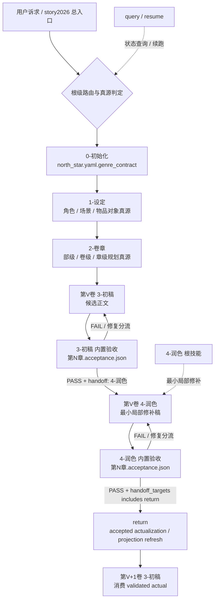

# story2026

## Context Loading Contract

- 每次调用本技能时，必须同时加载同目录 `CONTEXT.md`。
- `CONTEXT.md` 只承载跨阶段经验层，不得覆盖本 `SKILL.md` 的总线路由与真源边界。
- 若 `CONTEXT.md` 与当前目录结构不一致，先修根级真源，再继续下游阶段。

## Overview

`story2026` 根级 skill 是整条小说流水线的总入口与总线合同。

它只统一回答四件事：

1. 当前诉求应该路由到哪个阶段 skill。
2. 哪一层才是这类问题的 canonical truth。
3. 根级 `_shared`、`scripts`、`templates` 分别承担什么共享职责。
4. 题材方向盘如何通过 `0-初始化/north_star.yaml.genre_contract` 进入 planning / drafting / polishing / built-in acceptance / return。

硬边界：

- 根级 `story/SKILL.md` 只负责跨阶段拓扑、共享载体边界、总路由和根因追溯总则。
- 各阶段目录下的 `SKILL.md` 负责本阶段的严格执行合同。
- 正文阶段验收内置在 `3-初稿` 与 `4-润色` 阶段包内，任务执行时自动完成；根层不再保留独立 `story/review` 技能。
- `repair/SKILL.md` 负责局部修改牵动整体时的影响判型、source-first 修复计划、跨阶段分流和验收；根层只路由到 repair，不复制 repair 的类型化矩阵。
- 根级 `CONTEXT.md` 只沉淀跨阶段经验，不吞并阶段私有故障模式。

## Business Requirement Analysis Contract

| field | requirement | evidence | fail_code |
| --- | --- | --- | --- |
| `business_goal` | 为 story2026 小说项目提供跨阶段路由、truth owner 判定、共享载体边界和源层追因总入口。 | `target_stage`、`truth_role`、`canonical_owner` | `FAIL-SYS-ROUTING-01` |
| `business_object` | `.agents/skills/story/` 技能树、`projects/story/<项目名>/` 项目根、阶段 `SKILL.md + CONTEXT.md`、共享 `_shared/`、`scripts/` 与 `templates/`。 | `shared_refs_to_load`、`canonical_runtime_root` | `FAIL-SYS-CARRIER-02` |
| `constraint_profile` | 根层只裁决总线与 owner，不替阶段执行正文、设定、规划、润色、验收或 actualization。 | `non_owner_layers_to_avoid` | `FAIL-SYS-OWNER-04` |
| `success_criteria` | 任一泛化 story 请求都能落到唯一默认入口，且类型化场面强化不会形成独立主阶段或第三正文真源。 | `next_action`、`genre_scene_route.owner_stage` | `FAIL-SYS-CLOSURE-06` |
| `complexity_source` | 复杂度来自多阶段 truth ownership、项目记忆、共享载体、阶段内置验收和 return/handoff gate。 | `symptom`、`direct_cause`、`rule_source` | `FAIL-SYS-TRACE-05` |
| `topology_fit` | 父级 router 负责分流，阶段 full skill 负责执行，卫星技能负责 query/resume/repair/return。 | `target_stage`、`shared_refs_to_load` | `FAIL-SYS-ROUTING-01` |

## Multi-Subskill Continuous Workflow

- 无序号技能如 `query`、`resume`、`repair`、`return` 默认是卫星或 checkpoint，不自动并入 numbered 主链。
- 数字序号阶段按 `0-初始化 -> 1-设定 -> 2-卷章 -> 3-初稿 -> 4-润色` 的主线语义串行；正文阶段再按卷闭环进入 `return`。
- 英文序号若未来出现在同级子技能中，默认表示互斥候选，必须由父级路由或用户意图单选，不得全量并行改同一真源。
- 卫星技能默认不并入主链串行聚合：`query / resume / repair / return` 只在触发条件满足时进入，并按自身 `SKILL.md + CONTEXT.md` 执行。
- 每次路由到子阶段或卫星技能时，必须加载目标 `SKILL.md + CONTEXT.md`；绑定项目时还必须加载项目根 `MEMORY.md` 与相关 `CONTEXT/`。

## 类型机制

`story` 现在采用：

- 固定前置主链
- 卷级创作闭环
- 人工维护的 `north_star.yaml.genre_contract`
- 类型化场面强化横切合同
- 正文阶段根技能包
- 阶段内置自动验收

六层架构。

### 正文阶段根技能包

`3-初稿` 和 `4-润色` 的根目录就是完整技能包。正文生产只路由到阶段根 `SKILL.md`；阶段内的 `references/`、`review/`、`templates/`、`types/`、`guardrails/` 与 `knowledge-base/` 都是根技能授权模块，不再作为平行入口。

| stage | root skill | 默认职责 | 不承担 |
| --- | --- | --- | --- |
| `3-初稿` | `.agents/skills/story/3-初稿/SKILL.md` | 从 planning、north_star、cards、MEMORY/CONTEXT 和同卷前文生成 candidate draft，并自动产出初稿验收包 | 不改上游设定/规划，不授权 `return` actualization |
| `4-润色` | `.agents/skills/story/4-润色/SKILL.md` | 承接 `3-初稿` 源章做最小局部修补、中文表达校准、题材质感增强，并自动产出终稿验收包 | 不覆盖初稿，不凭 planning 从零起草 |

硬规则：

- 普通写章、续写、重写和局部创作修复进入 `3-初稿` 根技能。
- 普通润色、重润、局部表达修复和验收 finding 回灌进入 `4-润色` 根技能。
- 新初稿产物 frontmatter 默认使用 `创作阶段: 初稿` 与 `字数`；新润色产物默认使用 `修订阶段: 润色`、`初稿来源` 与 `字数`。
- 正式 `3-初稿` 写回必须同步生成 `3-初稿/第N卷/第N章.acceptance.json`；PASS 后只授权进入 `4-润色`。
- 正式 `4-润色` 写回必须同步生成 `4-润色/第N卷/第N章.acceptance.json`；PASS 且 `handoff_targets` 包含 `return` 后才授权上下文回流。
- 历史子目录、历史脚本和旧 frontmatter metadata 只允许作为兼容回读证据，不得继续驱动路由、返工归属或输出路径。

### 固定前置主链

前置主链固定不变：

1. `0-初始化`
2. `1-设定`
3. `2-卷章`

进入正文生产后，默认按卷执行创作闭环，而不是把全书多卷同时推进到同一阶段。

### 卷级创作闭环

每卷默认闭环固定为：

1. `3-初稿`
2. `3-初稿` 内置初稿验收
3. `4-润色`
4. `4-润色` 内置终稿验收
5. `return`
6. 下一卷 `3-初稿`

硬规则：

- `return` 不是全本润色后的线性终章；它是每卷最终验收后的 validated actualization checkpoint。
- `return` 不因“检验完成”自动触发，只能在 `4-润色/第N卷/第N章.acceptance.json` 或卷级汇总验收包同时满足 `acceptance_status == PASS`、`accepted_manuscript_stage == 4-润色`、`handoff_targets` 包含 `return` 时进入。
- 上下文回流必须消费“最终被接受的本卷实绩”。默认应以润色后内置终稿验收 PASS 的 `4-润色/第V卷/*` 为 accepted manuscript；若项目明确跳过润色，初稿验收包必须显式声明 `accepted_manuscript_stage = 3-初稿` 且 `handoff_targets` 包含 `return`，不得把仍可能被润色改动的初稿态直接 actualize。
- canonical 正文生产不建议多卷并发：第 V+1 卷正式起草前，应先让第 V 卷完成 PASS + 上下文回流，使下一卷消费 validated actual，而不是过期 planning。

### 人工题材契约

题材机制不再依赖旧的“系统自动题材装配”机制。

当前规则固定为：

- `0-初始化/north_star.yaml.genre_contract` 是唯一题材方向盘真源。
- `1-设定` 不再单独设置 `类型卡`。
- `2-卷章` 只导入 `story_promise / genre_corridor / navigation_rules`，不再二次猜题材。
- `3-初稿` 只消费人工题材承诺与 planning handoff，不再消费自动 step hook。
- `3-初稿` / `4-润色` 可按 `_shared/genre-scene-strengthening-contract.md` 建立 `project_genre_axis + scene_function_axis`，把武侠、言情、玄幻、恐怖、悬疑、现实等题材差异投影为当前场景的功能性强化；该合同不拥有独立正文写权。
- `3-初稿` 与 `4-润色` 内置验收继续覆盖结构/连续性/逻辑/人物/时间线/任务汇聚和文体读感，不再保留独立 `story/review` 阶段；必要时可用 `code-reviewer` 做辅助审计，再把 findings 回流到 owning stage。
- `4-润色` 可以沉淀反馈，但不得自动改写 `north_star.yaml.genre_contract`。
- `return` 只承接终稿 PASS 且明确 handoff 的 validated actualization，不回写规划正文。

硬规则：

- 通用基座必须能在没有任何题材包目录的情况下独立运行。
- 题材判断默认属于人工创作层，不得再被系统隐式反向硬绑。
- 类型化强化必须按“项目题材轴 + 场景功能轴”双轴判定；不得因为新增动作/武戏能力而把 story 默认变成武侠小说工作流。
- 题材化细节扩写中的动作、内心戏、氛围、科技、赛博、玄幻、言情等只是候选表现焦点；只有被项目题材、当前场景功能、源章坏点或用户 finding 命中时才进入 `4-润色` 专项包，不得把它们变成所有题材的固定评分清单。
- 类型化强化不得新增 `3.5-强化`、`5-类型强化` 或任何默认主链阶段；首写回到 `3-初稿`，源章局部修复回到 `4-润色`，跨阶段影响回到 `repair`。
- 若题材方向发生变化，优先修改 `north_star.yaml.genre_contract`，不要在 downstream 阶段静默偷改。

## When to Use

- 用户只说“用 story2026 做这件事”，但还没有明确该进哪一个阶段。
- 需要设计、选择或解释某个项目的题材方向盘。
- 需要判断某个问题应归 `0-初始化 / 1-设定 / 2-卷章 / 3-初稿 / 4-润色 / repair / return / query / resume` 中的哪一层。
- 需要修复跨阶段路由、共享 reference、共享脚本、真源分工、运行态数据流的源层问题。

## Input Contract

- Accepted input: 泛化 story2026 请求、跨阶段路由问题、真源归属判断、共享路径/脚本/模板修复、项目运行时定位问题。
- Required input: 用户诉求文本，或可定位的项目根 `projects/story/<项目名>/`，或需要审计/修复的 story 技能树路径。
- Optional input: 卷号、章号、目标阶段、错误日志、现有项目 `STATE.json`、`MEMORY.md`、`CONTEXT/` 与报告路径。
- Reject or reroute when: 影视/电影/视频项目初始化请求应路由到 `.agents/skills/aigc/0-初始化/SKILL.md`；阶段内部创作细则必须交给 owning stage。

## Module Loading Matrix

| module | load_when | authority | forbidden_use | rework_target |
| --- | --- | --- | --- | --- |
| `CONTEXT.md` | 每次调用 story 根 router | 提供跨阶段经验、失败模式和修复打法 | 不得重定义根 `SKILL.md` 的路由、owner 或输出合同 | 根级路由重判 |
| `_shared/` | 涉及跨阶段共享 schema、上下文加载、题材过滤或类型化场面强化 | 提供共享合同和跨阶段参考 | 不得替代阶段 `SKILL.md` 或成为正文真源 | 共享合同回读 |
| `scripts/` | 涉及项目定位、workflow 状态、共享校验或状态 hook | 执行机械检查、状态记录和路径解析 | 不得生成创作正文或审美判断 | 脚本 dry-run / smoke |
| `templates/` | 需要跨阶段报告、摘要或脚手架模板 | 提供输出骨架 | 不得另立阶段输出路径或完成门禁 | Output Contract |
| `0-初始化/` | 初始化、north_star、题材方向盘或项目起盘 | 拥有立项和 `north_star.yaml.genre_contract` 真源 | 不得替 `1/2/3/4` 阶段创作正文 | `0-初始化/SKILL.md + CONTEXT.md` |
| `1-设定/` | 对象卡、角色/场景/物品/技能真源 | 拥有对象真源 | 不得替规划或正文阶段写章节 | `1-设定/SKILL.md + CONTEXT.md` |
| `2-卷章/` | 部级、卷级、章级规划 | 拥有规划真源 | 不得直接写正文或润色稿 | `2-卷章/SKILL.md + CONTEXT.md` |
| `3-初稿/` | 写章、续写、重写、初稿验收、类型化场面首写 | 拥有 candidate draft 与初稿验收包 | 不得改上游 truth 或授权 return | `3-初稿/SKILL.md + CONTEXT.md` |
| `4-润色/` | 源章最小局部修补、终稿验收、类型化场面 affected-span repair | 拥有 polished manuscript 与终稿验收包 | 不得覆盖初稿或从 planning 从零起草 | `4-润色/SKILL.md + CONTEXT.md` |
| `repair/` | 局部修改牵动多层真源、影响图和 source-first 修复计划 | 拥有 impact map 与修复分流 | 不得直接冒充设定/规划/正文主创 | `repair/SKILL.md + CONTEXT.md` |
| `query/` / `resume/` / `return/` | 查询、续跑、validated actualization | 提供卫星查询、恢复和 PASS-gated 回流 | 不得绕过 owning stage gate | 对应卫星 `SKILL.md + CONTEXT.md` |

## System Topology

### Mainline Topology

前置主链固定为：

1. `0-初始化`
2. `1-设定`
3. `2-卷章`

正文生产从这里开始按卷循环：

`第V卷初稿 -> 初稿内置验收 -> 第V卷润色 -> 终稿内置验收 -> PASS + handoff -> return -> 第V+1卷初稿`

执行原则：

- 前置主链默认按阶段顺序串行，不得跳过上游真源直接伪造下游结论。
- 卷级正文生产默认一卷一卷推进；多卷并发只允许作为探索草稿、素材准备或非 canonical 支线，不得写成 validated final。
- 验收不再是独立 checkpoint skill；它是 `3-初稿` 和 `4-润色` 的自动节点，随任务执行完成并生成 `stage_acceptance_packet`。
- `4-润色` 只在初稿验收包 PASS 且 handoff 明确授予 `4-润色` 后承接候选初稿。
- `return` 只在终稿验收包明确授予 `return` 后执行；它不是“检验完自动执行”的默认副作用。

### Workflow Map



### Checkpoint And Satellite Skills

无序号 checkpoint / satellite 技能固定挂在主链侧，不单独冒充新的 numbered stage：

- `return`
- `query`
- `resume`
- `repair`

### Skill Completion State Hook

无论通过 workflow CLI 还是普通 skill / 子技能直接执行，只要本轮对 `projects/story/<项目名>/` 产生阶段性完成、失败或清理结果，都必须同步写入项目状态：

```bash
python3 .agents/skills/story/scripts/workflow_manager.py record-skill-completion \
  --project-root "projects/story/<项目名>" \
  --skill-id "<story skill id 或技能包路径>" \
  --status completed \
  --artifacts '{"outputs":["相对项目根的产物路径"]}'
```

硬规则：

- `record-skill-completion` 是普通 skill / 子技能执行的最小状态落点；不得只在对话里宣布完成。
- 子技能单独调用时也必须执行该 hook；脚本会把 `story-cards-*`、`story-plan-*`、`story-drafting`、`story-polishing` 或含 `1-设定 / 2-卷章 / 3-初稿 / 4-润色` 的技能路径归并到对应阶段。
- 状态写入目标固定为 `projects/story/<项目名>/STATE.json#workflow_runtime.execution_state.stage_progress`，并同步追加 `history`、`task_log` 与 `governance_index`。

## Root Truth Ownership Contract

| 层 | 拥有的真源 | 不拥有的真源 |
| --- | --- | --- |
| 根级 `story2026` | 跨阶段拓扑、总路由、共享载体边界、默认加载顺序 | 各阶段内部执行细则、局部 reference 专业判断 |
| `0-初始化` | 立项合同、`0-初始化/*.yaml`、初始 seeds | 对象真源、规划真源、validated actualization |
| `1-设定` | 类型/角色/场景/物品/技能等对象真源 | 章节编排真源、章节审查判断 |
| `2-卷章` | 以 `1-部级 -> 2-卷级 -> 3-章级` 的三层分形结构持有 `2-卷章/整体规划.md`、`2-卷章/第N卷/卷规划.md`、`2-卷章/第N卷/第N章.md` 这组规划真源；`全息地图.json / 卷分片/*.json` 仅作兼容投影 | 对象当前态、validated actualization |
| `3-初稿` | 以 `projects/story/<项目名>/3-初稿/第N卷/第N章.md` 作为章节正文唯一业务真源，由 `3-初稿` 根技能执行；同步拥有初稿内置验收包 `第N章.acceptance.json` 和 handoff 到 `4-润色` 的裁决权 | 上游设定/规划真源、`return` actualization 写回 |
| `4-润色` | 基于 `3-初稿/第N卷/第N章.md` 的最小局部修补稿、`4-润色/第N卷/第N章.md`、终稿内置验收包 `第N章.acceptance.json` 和 handoff 到 `return` 的裁决权 | `3-初稿` 原文覆盖权、planning/cards/north_star 真源、默认整章重写权、actualization 写回 |
| `repair` | 局部修改的 impact map、typed scope package selection、canonical owner 判定、source-first repair plan、跨阶段修复分流、阶段内置验收汇流 | 设定/规划/正文/润色的主创真源、return actualization 写回；repair 类型化矩阵不由根层复制 |
| `return` | 终稿 PASS-gated actualization artifact、accepted manuscript refs、Cards current_state/history、规划 actualization sidecar、story_map actualization、项目 `CONTEXT/` carryover notes、`STATE.json` projection refresh | 规划正文改写、验收判定、正文/润色正文创作、把未被终稿验收接受的初稿态 actualize |
| `query / resume` | 查询、恢复 | 主链 canonical truth 判定权 |

## Canonical Runtime Root

- 书项目正式业务根目录：`projects/story/<项目名>/`
- legacy `projects/aigc/<项目名>/` 仅允许作为兼容 fallback，不再是 canonical runtime。
- 根层项目入口文件固定写在：
  - `projects/story/<项目名>/STATE.json`
  - `projects/story/<项目名>/team.yaml`
  - `projects/story/<项目名>/MEMORY.md`
  - `projects/story/<项目名>/CHANGELOG.md`
  - `projects/story/<项目名>/CONTEXT/`

## Shared Carrier Contract

### 根级 `_shared/`

根级 `_shared/` 是当前 `story` 技能树的跨阶段共享真源层。

默认先读：

- `_shared/context-loading-contract.md`
- `_shared/core-constraints.md`

按需读取：

- `_shared/story_map.schema.json`
- `_shared/story_map_bootstrap.template.json`
- `_shared/entity-management-spec.md`
- `_shared/strand-weave-pattern.md`

可选增强材料：

- `_shared/genre-profiles.md`
- `_shared/reading-power-taxonomy.md`
- `_shared/cool-points-guide.md`
- `_shared/genre-trope-quality-filter.md`（起草阶段加载题材类型包时必须作为质量过滤层，防止机械爽点和低级套路覆盖项目风格）
- `_shared/genre-scene-strengthening-contract.md`（类型化场面强化横切合同；按项目题材轴与场景功能轴路由到 `3-初稿`、`4-润色` 或 `repair`，不得成为独立主阶段）
- `_shared/cross-volume-continuity-contract.md`（跨卷叙事一致性追踪合同；定义伏笔/人物/物件/能力四维追踪模型，由 `return` 生成卷级状态摘要，由 `3-初稿` 卷首章消费）
- `_shared/live-quality-brief-contract.md`（写前实时质量导向合同；在 N5/P4 创作前生成轻量质量简报，减少事后返工率）

### 根级 `scripts/`

根级 `scripts/` 是 story2026 的共享脚本入口层，负责：

- canonical path helper
- workflow / state / status 管理
- shared CLI entrypoint
- 多阶段共用的数据访问与校验

### 根级 `templates/`

根级 `templates/` 只放跨阶段或跨模块共享模板、共享 schema 载体。

## Routing Contract

| 用户诉求 / 问题形状 | 默认入口 |
| --- | --- |
| 设计/选择/解释题材方向盘 | 根级 `story2026`，必要时修订 `0-初始化/north_star.yaml.genre_contract` |
| 初始化小说、初始化网文、新建书、新建长篇故事、小说项目起盘 | `0-初始化` |
| 初始化影片、初始化电影、初始化影视、初始化视频项目 | 不进入 story；route to `.agents/skills/aigc/0-初始化/SKILL.md` |
| 新建项目、确定创作立项、初始化问卷/顾问团 | `0-初始化` |
| 角色卡/场景卡/物品卡生成、回写、覆盖率修复 | `1-设定` |
| 全局设定/整书风格/类型方向盘修订 | `0-初始化/north_star.yaml` |
| 长篇规划、MAP、章节编排、冲突/任务/线索/伏笔设计 | `2-卷章` |
| 写章节、章节级执行包、从 planning 直接产出正文 | `3-初稿` |
| 要求武戏、文戏、言情拉扯、玄幻能力兑现、恐怖悬疑、现实制度压力等类型化场面首写或重写进当前章 | `3-初稿`，加载 `_shared/genre-scene-strengthening-contract.md` 与阶段授权细则 |
| 承接已有 `3-初稿` 做最小局部修补、中文表达局部校准、题材质感微调，并输出到 `4-润色/第N卷/第N章.md` | `4-润色` |
| 针对已写章节做题材化细节扩写，例如在相关题材、当前场景功能、源章坏点或用户 finding 中命中的动作设计、内心戏、氛围表现、科技元素、赛博质感、玄幻能力表现或言情拉扯强化，且不改剧情结果、人物关系结果、能力规则或上游设定 | `4-润色`，按 source anchor 与 affected span 做题材化局部修补；未命中的焦点记为 N/A；若要求改结果、改规则或改设定，先进入 `repair` |
| 已有初稿中的类型化场面弱、乱、读不清、题材味被磨平或被误写成单一武侠/动作模板 | `4-润色`，只做 source-anchored affected-span repair |
| 明确要求“按章写正文”、输出到 `3-初稿/第N卷/第N章.md`、或要求 YAML 头携带 global/style/`north_star` 摘要 | `3-初稿` |
| 初稿质量验收、初稿 PASS/FAIL、初稿返工、初稿 handoff 到润色 | `3-初稿` 内置验收 |
| 终稿质量验收、终稿 PASS/FAIL、终稿返工、终稿 handoff 到 return | `4-润色` 内置验收 |
| 终稿验收包 `acceptance_status == PASS`、`accepted_manuscript_stage == 4-润色`、`handoff_targets` 包含 `return` 后的 actualization、truth writeback、projection refresh | `return` |
| 查询当前态、规划态、实绩态、质量态 | `query` |
| 查看断点、续跑、清理或重启任务 | `resume` |
| 指定局部修改但可能牵动设定、规划、前后章节、已产物、后续生成、阶段验收包或 return actualization 的一致性修复 | `repair`；进入后必须由 repair 加载 `types/type-map.md` 与 `references/impact-scope-contract.md#Universal Type Matrix` |
| 中文小说润色、去 AI 检测规整化风险、保留初稿骨架的最小局部修补 | `4-润色` |
| 明确要求整稿统修、整章重写、重润或指定当前会话执行润色 | `4-润色` 根技能 |

## Default Loading Order

1. 先读取根级 `SKILL.md`，锁定跨阶段拓扑与共享层边界。
2. 再读取根级 `CONTEXT.md`，避免重复踩跨阶段老坑。
3. 若当前任务已绑定 `projects/story/<项目名>/`，必须先读取 `projects/story/<项目名>/MEMORY.md`，再读取 `projects/story/<项目名>/CONTEXT/` 下与本轮相关的项目级上下文文件。
4. 若问题涉及共享合同，先读根级 `_shared/context-loading-contract.md` 与对应阶段的 `_shared/*`。
5. 若当前项目已锁定题材方向盘，优先读取 `0-初始化/north_star.yaml.genre_contract` 与 `2-卷章/整体规划.md`；如项目仍在兼容态，再回退到 `全息地图.json`。
6. 若当前诉求涉及终验或 actualization，继续读取：
   - `4-润色/SKILL.md` 与 `4-润色/review/review-contract.md`
   - `return/references/context-return-spec.md`
   - 并确认 `stage_acceptance_packet` 指向最终 accepted manuscript，默认是 `4-润色` 终稿。
7. 若路由到 `repair`，读取 `repair/SKILL.md + repair/CONTEXT.md`，再读取 `repair/types/type-map.md`、命中的 `repair/types/scope/*.md` 与 `repair/references/impact-scope-contract.md`；项目特例只从项目 `CONTEXT/` 或 `MEMORY.md` 追加。
8. 路由到目标阶段或卫星技能的 `SKILL.md`。
9. 读取目标阶段或卫星技能的 `CONTEXT.md`。

## Reference Loading Guide

| 场景 | 读取文件 |
| --- | --- |
| 根级共享合同 | `_shared/context-loading-contract.md`、`_shared/core-constraints.md` |
| 起草阶段加载题材类型包或网文题材细则 | `_shared/genre-trope-quality-filter.md` |
| 跨卷叙事一致性（伏笔/人物/物件/能力跨卷追踪） | `_shared/cross-volume-continuity-contract.md`；卷首章起草时加载 `CONTEXT/volume-状态摘要/`，actualization 后由 `return` 生成 |
| 类型化场面强化、武戏/文戏/言情/玄幻/恐怖/悬疑/现实等场景功能分流 | `_shared/genre-scene-strengthening-contract.md`；首写或重写继续加载 `3-初稿/SKILL.md + CONTEXT.md`，已有源章局部修复继续加载 `4-润色/SKILL.md + CONTEXT.md` |
| 跨阶段路由和执行拓扑 | 本文件 `System Topology` 与目标阶段 `SKILL.md + CONTEXT.md` |
| 局部修改牵动整体、repair 判型和影响图 | `repair/SKILL.md + repair/CONTEXT.md`、`repair/types/type-map.md`、命中的 `repair/types/scope/*.md`、`repair/references/impact-scope-contract.md` |
| 质量门禁和审计 | 目标阶段 `SKILL.md + CONTEXT.md` 与其内置 `review/review-contract.md` |
| 请求判型 | 本文件 `Routing Table`、目标阶段 `Mode Selection` 与 `CONTEXT.md` Type Map |
| 可复用经验 | `CONTEXT.md` |
| 输出摘要 | 对话或用户指定 `reports/` 路径 |
| 共享 CLI 和路径解析 | `scripts/story.py`、`scripts/project_locator.py` |
| 产品侧入口 | `.codex/registry/skills.yaml` 与 `.codex/registry/routes.yaml` |
| 父级导引最小结构 | 本父级导引 skill 只要求同目录 `SKILL.md + CONTEXT.md`；真实执行细则、模板、类型包和内置验收 gate 由被路由到的阶段 skill 持有 |

## Root-Cause Execution Contract (Mandatory)

当 `story2026` 出现跨阶段路由错误、真源分工混乱、共享 reference 漂移、共享脚本路径失配、根入口缺失或总线合同断裂时，必须按以下链路上溯：

1. `Symptom / Failure`
2. `Direct Technical Cause`
3. `Rule Source`
4. `Meta Rule Source`
5. `Fix Landing Points`

执行顺序硬约束：

- 先修总线真源，再修阶段投影。
- 若同一条规则需要在两个以上阶段重复改写，必须先判断是否缺少根级 canonical source。

## Lite Tier Field Mapping（Combined）

| field_id | step_id | intent | required_output | fail_code | rework_entry |
| --- | --- | --- | --- | --- | --- |
| FIELD-SYS-ROUTING-01 | Step 1 | 判定当前诉求属于哪个阶段与 truth role | `target_stage`、`truth_role` | FAIL-SYS-ROUTING-01 | 回到路由表，先判真源再判阶段 |
| FIELD-SYS-CARRIER-02 | Step 2 | 判断应读取哪些根级共享 carrier | `shared_refs_to_load`、`shared_scripts_needed` | FAIL-SYS-CARRIER-02 | 回到根级 `_shared/*.md` 与共享层边界合同 |
| FIELD-SYS-TYPECARD-03 | Step 3 | 判断当前项目的题材方向盘是否已被 `north_star.yaml.genre_contract` 正式承接 | `genre_contract_ref`、`story_promise_summary`、`genre_corridor_summary` | FAIL-SYS-TYPECARD-03 | 回到 `0-初始化/north_star.yaml` 与 `2-卷章` 导入链 |
| FIELD-SYS-OWNER-04 | Step 4 | 锁定该问题的 canonical owner | `canonical_owner`、`non_owner_layers_to_avoid` | FAIL-SYS-OWNER-04 | 回到真源分工表，禁止让下游冒充上游 |
| FIELD-SYS-TRACE-05 | Step 5 | 完成跨阶段 root-cause trace | `symptom`、`direct_cause`、`rule_source`、`meta_rule_source` | FAIL-SYS-TRACE-05 | 重新补全分层 trace，不能停在局部症状 |
| FIELD-SYS-CLOSURE-06 | Step 6 | 产出修复闭环与防回归结果 | `root_cause_location`、`immediate_fix`、`systemic_prevention_fix` | FAIL-SYS-CLOSURE-06 | 回到修复落点，优先改根级真源 |

## Output Contract

- Required output: `target_stage`、`truth_role`、`canonical_owner`、`shared_refs_to_load`、`next_action`，或跨阶段修复摘要。
- Output format: 简短路由报告、修复报告或 `templates/output-template.md` 对齐的结构化摘要。
- Output path: 默认输出到对话；用户要求保存时写入 `reports/story-router-YYYYMMDD.md` 或任务指定报告路径。
- Naming convention: 报告文件使用 kebab-case 与 `YYYYMMDD` 日期后缀；路径示例必须保持 ASCII 安全任务 ID。
- Completion gate: 请求已路由到唯一默认入口，canonical truth 与非 owner 层已区分，必要的 `SKILL.md + CONTEXT.md` 加载边界已说明。

## Completion Gate

- 已能明确把任一泛化 `story2026` 请求路由到唯一默认入口。
- 已能说明该请求应读的 canonical truth 与不该误读的非真源层。
- 已区分根级 `_shared`、`scripts/`、`templates/` 的共享职责。
- 已能说明当前项目的题材方向盘如何从 `north_star.yaml.genre_contract` 进入 planning / drafting / polishing / built-in acceptance。
- 已能说明类型化场面强化不会新建独立主阶段，而是按 owner 路由到 `3-初稿`、`4-润色` 或 `repair`。
- 已能指出 repo 级 `.codex/` 真源与项目级 `STATE.json.workflow_runtime` 内联工件链的分工。
- 已能说明 planning root/slice 的分工、`stage_acceptance_packet` 的 covenant，以及 上下文回流 的 PASS+handoff gate。
