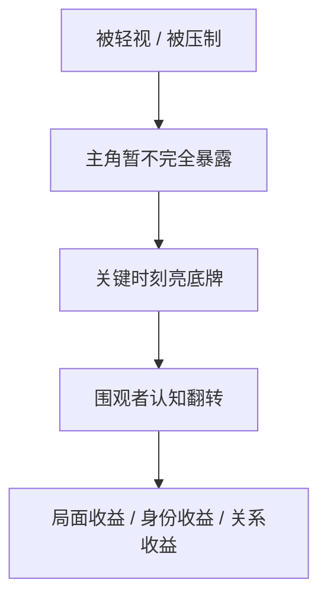

# Cool Points Guide

> 定位：`story` 活跃技能树的共享“爽点工程指南”真源。
>
> 边界：
>
> - `reading-power-taxonomy.md` 负责回答“爽点/钩子/微兑现是什么”。
> - 本文件负责回答“爽点如何编排、递进、叠加、防疲劳，以及如何与追读力协同”。
> - 本文件是指导性 guide，不是硬评分器；具体项目是否启用更高密度爽点，由人工 `类型卡` 与阶段合同裁决。

## Canonical Source Governance

- 共享 guide 真源固定落在 `story/_shared/`。
- 阶段技能与 review 引用本文件时，只消费其工程启发，不得各自复制一份“爽点设计指南”。
- 题材特化爽点素材若已被稳定采用，应优先沉到 `类型卡` 或当前 guide，而不是另建系统级题材包依赖。

## Core Model

爽点不是单个瞬间，而是一个最小闭环：

最常见失败不是“没有爆发”，而是：

- 没有铺垫就硬爆
- 爆完没有余波
- 只重复同一种爆法
- 爽点没有推动后续剧情

## Strength Ladder

> 以下为软梯度，不是死板打点公式。

| tier | typical_role | chapter_feel | examples |
| --- | --- | --- | --- |
| `S` | 大高潮 / 大阶段回报 | 改变局面、改变关系、改变势力版图 | 击杀大敌、身份总揭露、长期复仇兑现 |
| `A` | 中高潮 | 本章或本段主回报成立 | 越级赢、公开打脸、重大真相推进 |
| `B` | 小高潮 | 章内让读者觉得“这章没白看” | 小反杀、局部胜利、获得线索/资源 |
| `C` | 轻爽点 / 日常回报 | 维持连读惯性 | 一句话压制、轻反差、轻认可、轻暧昧 |

### Cadence Heuristics

- 长连载 / 网文高冲击：可维持 `C/B` 高频，`A` 周期出现，`S` 只留给真正阶段转折。
- 短篇 / 知乎短篇：每章最好至少有 `B` 或高质量 `C`，避免纯铺垫空章。
- 悬疑 / 现实题材：不一定叫“爽”，但仍应有“回报节点”，常以信息兑现、关系反转、规则反制代替战力爆发。

## Combo Patterns

### 标准连击

### 常用组合

| combo | best_use | warning |
| --- | --- | --- |
| `压制 -> 反转 -> 碾压` | 爽文、升级、都市翻盘 | 压制不能太水，反转要有因果 |
| `嘲笑 -> 震惊 -> 跪舔/后悔` | 身份落差、技能展示、公开场合 | 不要把配角写成纯工具人 |
| `虐点 -> 爽点` | 复仇、情绪爆发、长期压迫线 | 虐点必须尽快转化，不可长期空耗 |
| `爽点 -> 新债务` | 连载型 reader pull | 爽完必须打开下一轮期待 |
| `主爽点 + 副爽点` | 提升层次感，避免单轴重复 | 副爽点要服务主爽点，不抢戏 |

## Variety Axes

避免疲劳的关键，不只是换名字，而是换“爽点来源”。

| axis | question |
| --- | --- |
| `力量轴` | 这次是不是靠更强的战力/能力赢？ |
| `智谋轴` | 这次是不是靠规则利用、布局或信息差赢？ |
| `身份轴` | 这次是不是靠身份揭露、阶层反差、公众认知翻转赢？ |
| `关系轴` | 这次是不是靠情感推进、站队变化、守护兑现赢？ |
| `资源轴` | 这次是不是靠拿到关键物、地位、情报、援手赢？ |
| `价值轴` | 这次是不是靠证明自己、洗清冤屈、道德反杀赢？ |

### Anti-Fatigue Rule

连续 3 次爽点若都落在同一轴，极易同构疲劳。默认做法：

1. 先保留主轴。
2. 再叠加一个副轴。
3. 若主轴连续高频出现，则至少换：
   - 观众类型
   - 代价类型
   - 爆发场景
   - 余波结果

## Pain-Payoff Coupling

### Soft Ratio

- `爽点`: `~60-70%`
- `压力 / 虐点`: `~20-30%`
- `平缓 / 过渡`: `~10%`

这不是数学配比，而是提醒：

- 只有压制没有回报，会掉读者。
- 只有回报没有阻力，会失去重量。
- 平缓段必须服务下一次回报或下一次压力。

### Coupling Rules

- 虐点越强，后续爽点的兑现窗口越不能拖太久。
- 情绪型题材的“爽”常表现为说破、守护、翻身、认清，而不是纯打脸。
- 规则/悬疑型题材的“爽”常表现为破解、识破、反制、证据落锤。

## Step 7 Projection

`7-追读力强化` 默认这样消费本 guide：

1. 先用 taxonomy 选“是什么”：
   - 主钩
   - 主爽点
   - 微兑现
2. 再用本 guide 选“怎么排”：
   - 强度梯度
   - 主副爽点组合
   - 是否需要虐爽转换
   - 是否已出现同构疲劳
3. 最后写回正文时检查：
   - 爽点有没有铺垫
   - 爽点后有没有余波
   - 余波有没有带来新的 reader pull

## Chapter Checklist

- [ ] 本章是否至少有一个可感知回报，而不是纯拖行？
- [ ] 主爽点是否有铺垫，不是凭空发生？
- [ ] 爽点后是否带来了身份/关系/局面/情绪的变化？
- [ ] 章末是否把回报转化为下一轮期待？
- [ ] 本章爽点是否与近几章主爽点明显同构？
- [ ] 爽点是否符合人物能力边界和项目题材承诺？
- [ ] 爽点是否真的推动剧情，而不是只为了热闹？

## Promotion Candidates

以下内容适合以后继续从题材细分材料中上提：

- 各题材更细的“主爽点 -> 副爽点”推荐配对
- 长连载按卷期的 `S/A/B/C` 节奏模板
- 不同平台体量下的爽点密度建议
