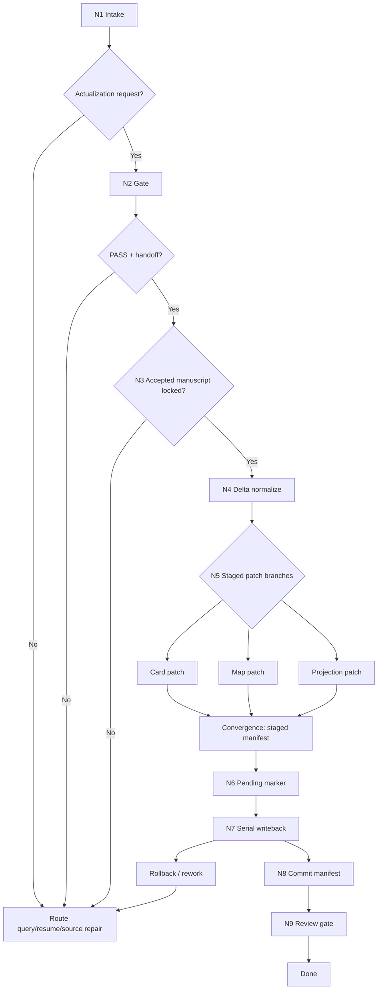

# Context Return Workflow

The workflow is a hybrid topology: intake and actual writeback are serial, while staged patch preparation and risk analysis may be computed in parallel before the commit phase.

## Business Requirement Analysis

| slot | value |
| --- | --- |
| `business_goal` | write validated volume outcomes back into future-consumed truth layers |
| `business_object` | validation aggregate, Cards, planning sidecars, story_map, STATE, context-return artifact |
| `constraint_profile` | gate correctness, truth ownership, serial commit discipline, revision guards |
| `success_criteria` | only PASS + handoff + accepted manuscript lock actualizes; all writes are traceable and reversible by manifest |
| `non_goals` | validation, review report authoring, manuscript editing, source repair |
| `complexity_source` | multi-target writeback and satellite rerouting |
| `topology_fit` | tree intake, mesh precompute, serial commit, review close |

## Node Network

| node_id | objective | inputs | actions | evidence | route_out | gate |
| --- | --- | --- | --- | --- | --- | --- |
| `N1-INTAKE` | determine whether this is actualization or reroute | user request, project root, aggregate ref | load required context and classify request | request profile | `N2-GATE` or satellite route | required refs exist or missing owner identified |
| `N2-GATE` | enforce PASS + handoff gate | validation aggregate | check `validation_status`, `routing_decision`, `handoff_targets` | gate summary | `N3-ACCEPTED-MANUSCRIPT` or reject/reroute | all three gate fields pass |
| `N3-ACCEPTED-MANUSCRIPT` | lock final accepted manuscript evidence | aggregate, manuscript refs | verify `accepted_manuscript_stage` and `accepted_manuscript_refs`; reject unaccepted draft state | accepted manuscript lock | `N4-DELTA` | default `4-润色`, or explicit skip-polish acceptance |
| `N4-DELTA` | normalize validated delta | aggregate, evidence refs, template | build `card_deltas`, `map_deltas`, `projection_refresh` | normalized `context_return_delta` | `N5-STAGE` | no non-whitelisted fields |
| `N5-STAGE` | precompute patches without writing truth | current truth files, revisions | compute staged card/map/state/artifact patches; risk analysis may run in parallel | staged patch manifest | `N6-PENDING` | expected revisions match |
| `N6-PENDING` | mark run as pending | `STATE.json` | write pending manifest | `context_return_pending` marker | `N7-WRITEBACK` | pending marker durable |
| `N7-WRITEBACK` | perform serial truth writeback | staged patches | write Cards, sidecars, map slice/root, STATE, artifact | written files and refs | `N8-COMMIT` or rollback | every write succeeds in order |
| `N8-COMMIT` | close pending marker into committed manifest | writeback summary | remove pending marker, persist committed manifest | committed manifest | `N9-REVIEW` | artifact points to validation evidence |
| `N9-REVIEW` | verify completion | artifact, files, review contract | run structural and semantic checks | verdict | done or rework | review verdict is `pass` or accepted `pass_with_followups` |

## Mermaid Topology

## Concurrency Rule

Allowed in parallel:

- staged patch calculation for card/map/projection
- risk analysis
- commit plan generation

Forbidden in parallel:

- actual truth writeback
- pending marker mutation
- final artifact write

## Rollback Route

If any write fails after `N5-PENDING`, preserve the pending manifest and report:

- failing target
- last successful target
- observed revisions
- rollback status
- recommended `resume/` route
