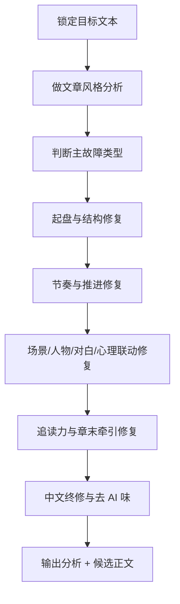
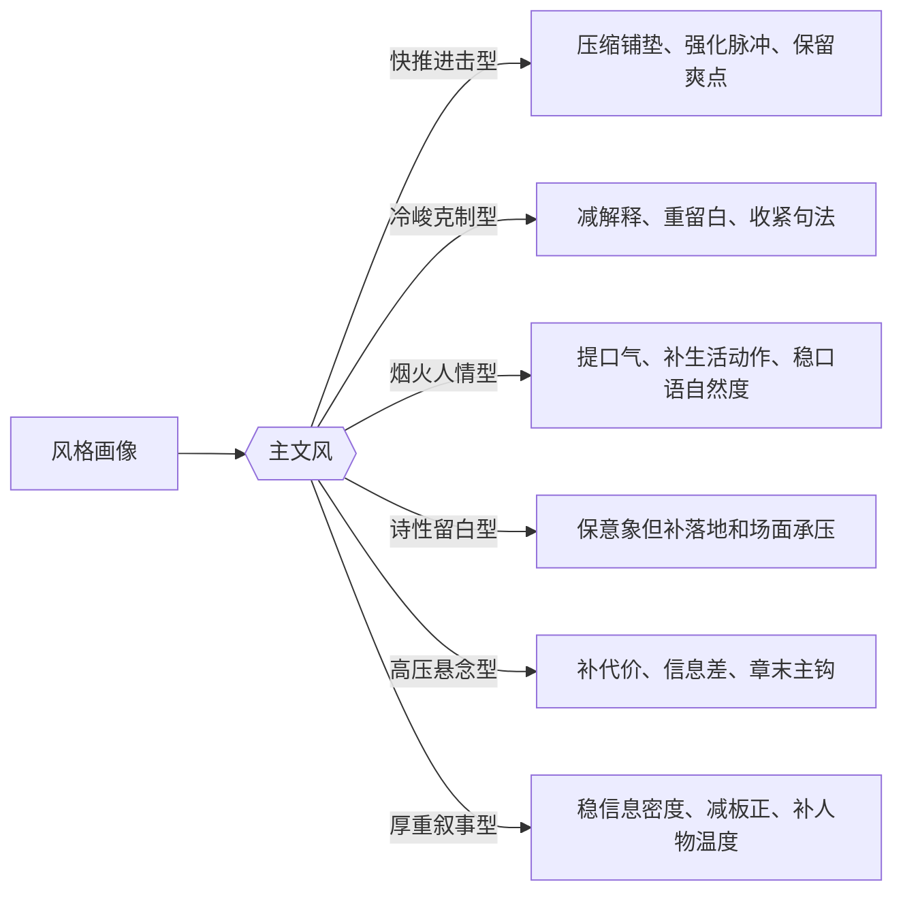
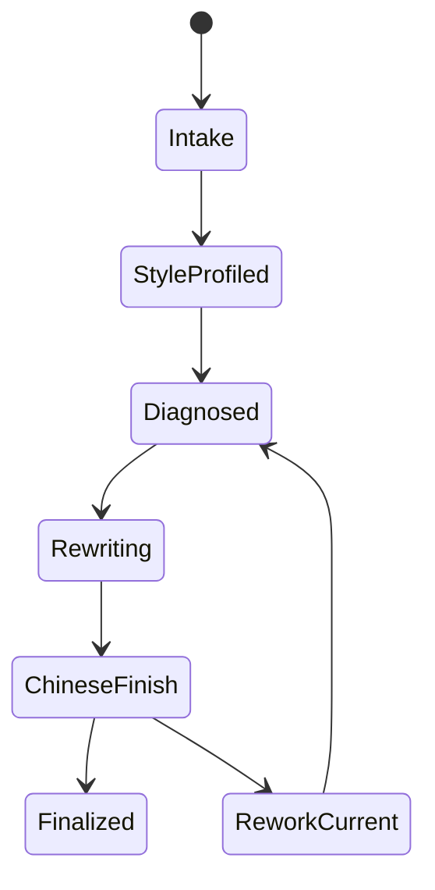

# story / doubao

## Context Loading Contract

- 每次调用本技能时，必须同时加载同目录 `CONTEXT.md`。
- 为了对齐 `story` 总线边界，必须回读 `../SKILL.md` 与 `../CONTEXT.md`。
- 若目标文本来自书项目，必须先确认 canonical runtime 仍是 `projects/story/<项目名>/`，并锁定真实目标文件；legacy `projects/aigc/<项目名>/` 只允许作为兼容 fallback，不再是 canonical source。
- 本技能执行时不再把 `3-Drafting` 的子技能树或 `references/` 作为运行期必读依赖；`3-Drafting` 的八步能力、`8-润色` 的局部细则，以及本文定义的判型/重写分流，统一收束到本 `SKILL.md`。
- 本技能默认输出 `思考过程 + 风格分析 + 问题诊断 + 润色策略 + 候选正文`；若用户明确要求直接改稿，可进一步覆写目标文本。

## Purpose

`doubao/` 是 `story` 体系下的中文小说润色与风格诊断旁路技能。

它面向两类场景：

1. 用户已经有一篇中文文章、章节正文或片段，想先分析风格，再做成稿级优化。
2. 用户希望用一个单技能包，直接吸收 `3-Drafting` 的八道工序能力，不再逐个 child skill 跳转。

它的固定能力组合为：

- 先分析文章风格，不先盲改。
- 在一个技能里统筹 `起盘 / 节奏 / 场景 / 人物 / 对白 / 心理 / 追读力 / 终修` 八类能力。
- 不走 `references/`，规则细则与类型处理细节全部内嵌在本文件。
- 额外强化中文表达，重点清理翻译腔、工业感、评论腔、镜头说明腔和机械重复。
- 默认适配豆包系中文模型的优势：中文语感、句群改写、细粒度修辞节奏、口语与书面语的自然切换。

## Stage Position

- `doubao/` 是 `story` 主链旁路技能，不单独冒充新的主阶段。
- 它与 `3-Drafting` 的语义关联最强，但不拥有 `Cards / Planning / validation_status / actualization` 的真源判定权。
- 它拥有：
  - 风格分析
  - 中文表达诊断
  - 单次整稿重写策略
  - 候选润色正文
  - 用户显式授权时的目标文本覆写
- 它不拥有：
  - 项目规划 truth
  - 角色/场景卡 truth
  - 终验 PASS 判定
  - loopback actualization 写回

## Mode Selection

| mode             | 进入信号                                    | 主输出                         | 默认写回策略         |
| ---------------- | ------------------------------------------- | ------------------------------ | -------------------- |
| `风格分析`     | 用户只要分析风格、拆文风、判断问题          | 风格画像 + 问题诊断 + 局部示例 | 不覆写               |
| `局部精修`     | 用户给片段、段落、对白、场景或局部章节      | 风格画像 + 局部重写 + 修改说明 | 不覆写               |
| `全文统稿`     | 用户要整章/整文润色、去 AI 味、统一中文表达 | 诊断摘要 + 候选全文            | 不覆写，除非明确要求 |
| `项目章节覆写` | 用户明确要直接修改项目正文文件              | 诊断摘要 + 覆写后的正式正文    | 可覆写目标文本       |

固定选择规则：

- 未说明是否改文件时，默认 `全文统稿`，只产出候选正文。
- 用户明确说“直接改这篇/这个文件”时，进入 `项目章节覆写`。
- 用户只问“这篇文风像什么、哪里不对劲”时，进入 `风格分析`。
- 用户只贴一小段重点问题文本时，进入 `局部精修`。

## Canonical Source Governance

本技能的源层治理口径固定如下：

- `story` 根技能只负责总路由与真源边界。
- 本技能只负责已有正文的分析、提纯与可选覆写。
- 本技能不再把 `3-Drafting/*` 的多子技能合同拆开运行，而是吸收为一个“思行合一”的单技能网络。
- 本技能内部不再建立第二套 `reference` 真源：
  - 风格判型在本文件
  - 问题类型在本文件
  - 中文表达强化规则在本文件
  - 终修清扫项在本文件
- 若后续要扩展更多判型，优先继续补本 `SKILL.md` 与同目录 `CONTEXT.md`，而不是回退到新的 `references/`。

## Business Requirement Analysis Contract

| analysis_slot          | 当前结论                                                                                             |
| ---------------------- | ---------------------------------------------------------------------------------------------------- |
| `business_goal`      | 对已有中文正文先做风格识别，再做一次结构到句法的一体化润色，输出更像真人小说写作而非 AI 平铺的成稿。 |
| `business_object`    | 用户提供的文章文本、章节文件或项目正文；若是项目章节，可按需补读上文承接与相关卡面约束。             |
| `constraint_profile` | 不得改坏原文核心事件与人设，不得把润色写成另起一篇，不得为了“更华丽”牺牲中文自然度。               |
| `success_criteria`   | 能清楚说出原文风格、主要故障、重写策略，并给出一版中文表达更稳、更准、更有呼吸感的候选正文。         |
| `non_goals`          | 不负责新增规划、发明设定、伪造 validation 通过、替代 loopback 写回。                                 |
| `complexity_source`  | 复杂度来自“既要保留原稿有效信息与气质，又要同时修结构、节奏、人物、对白、心理、追读力和中文句法”。 |
| `topology_fit`       | `输入锁定 -> 风格分析 -> 八维诊断 -> 一体化重写 -> 中文终修 -> 输出收束`                           |
| `step_strategy`      | 先分析文风与问题密度，再按八维次序重写，最后统一做中文表达强化与去 AI 味终修。                       |

## Total Input Contract

### 必需输入

- 一份明确目标文本：
  - 用户直接粘贴的文章/章节/片段，或
  - 本地目标文件路径

### 条件必需输入

- 若目标是 `projects/story/<项目名>/3-Drafting/第N卷/第N章.md`：
  - 必须先确认真实 `project_root`
  - 若 `N > 1` 且用户要求强连续性润色，可补读上一章终稿
- 若用户显式指定目标风格、题材气质或“别改坏某个角色口气”，必须把这些要求提升为硬约束

### 硬规则

1. 必须先读原文再判风格，禁止按题材名直接套模板。
2. 风格分析必须先于重写；没有风格画像就直接开改，视为流程失败。
3. 润色不是重写世界观或剧情主线；除非用户明确要求，否则不改主干事件顺序。
4. 中文表达强化优先做“更自然、更具体、更贴场面”，不是“更花、更重、更像名家”。
5. 不得把所有句子统一修成一个声调；人物差异、段落呼吸、强弱句节奏都要保留。
6. 若目标文本本身已经有鲜明风格，优先提纯而非换风格。
7. 若用户只要分析，不得偷偷输出大段覆写稿冒充分析结论。
8. 若用户要求改文件，必须只改目标文本，不得顺手回写 `Cards / Planning / Validation`。
9. 若原文存在明显影视分镜残留、工作流术语、提纲式问句、解释型总结句、翻译腔或工业重复，必须在终修阶段明确清扫。

## Output Contract

### 默认输出结构

1. `思考过程`
2. `文章风格分析`
3. `主要问题诊断`
4. `润色策略`
5. `润色正文`
6. `修改摘要`

### 字段要求

| output_slot      | 要求                                                                      |
| ---------------- | ------------------------------------------------------------------------- |
| `思考过程`     | 简明说明如何从风格判断进入重写路径，不写空洞自夸                          |
| `文章风格分析` | 至少覆盖叙事视角、句法密度、情绪温度、对白声口、感官层、读者牵引、AI 痕迹 |
| `主要问题诊断` | 必须指出问题类型，不得只写“可以更好”                                    |
| `润色策略`     | 必须写明保留什么、强化什么、删掉什么                                      |
| `润色正文`     | 要给出完成态候选文本，而不是零散建议                                      |
| `修改摘要`     | 用于复核本轮改动重点，便于继续追改                                        |

### 覆写模式补充

- 当 mode = `项目章节覆写` 时：
  - 正式业务真源仍是目标正文文件
  - 本技能只负责本次润色后的单点写回
  - 仍不得宣称已经完成 `4-Validation`

## Visual Map

## Style Analysis Matrix

| analysis_slot           | 要看什么                                 | 诊断提问                               |
| ----------------------- | ---------------------------------------- | -------------------------------------- |
| `narrative_view`      | 第一人称 / 第三人称 / 贴身 POV / 外视角  | 这篇文是谁在带读者感受？               |
| `syntax_density`      | 短句快推 / 中句均速 / 长句铺陈           | 句法是推进型还是铺叙型？               |
| `paragraph_breath`    | 段落长短、断句、留白、切换               | 文本有没有呼吸，还是一味匀速？         |
| `emotion_temperature` | 冷、热、压抑、暧昧、激烈、哀伤           | 情绪是怎么渗出来的？                   |
| `scene_grounding`     | 场景、感官、空间阻力、身体反应           | 场面是活的，还是只有概念氛围？         |
| `character_presence`  | 人物动作、习惯、选择、应激反应           | 人物能不能一眼分开？                   |
| `dialogue_signature`  | 句长、称呼、攻防、潜台词                 | 不同角色开口像不像不同人？             |
| `inner_life_mode`     | 自我辩护、迟疑、身体化心理、说明式心理   | 心理活动像人物在经历，还是作者在讲解？ |
| `reader_pull`         | chapter promise、micro-payoff、exit hook | 读者为什么会继续看？                   |
| `ai_residue`          | 评论腔、镜头说明腔、重复、翻译腔、工业感 | 哪些地方一看就像模型写的？             |

## Style Archetype Routing

| archetype      | 识别信号                         | 保留重点                 | 强化重点                     | 严禁误改             |
| -------------- | -------------------------------- | ------------------------ | ---------------------------- | -------------------- |
| `快推进击型` | 事件密、转折快、读者预期强       | 速度感、直推感、爽点效率 | 脉冲、代价、局部兑现         | 改成抒情散文化       |
| `冷峻克制型` | 情绪不外露、句法收紧、留白多     | 克制、张力暗流           | 细节、停顿、未说出口的压力   | 乱加热闹解释句       |
| `烟火人情型` | 生活细节多、口语感强、人物温度高 | 日常质感、口气差异       | 身体动作、生活气、情境化对白 | 统一修成板正书面语   |
| `诗性留白型` | 意象、余韵、轻转场多             | 意象系统、气口           | 落地锚点、动作承压、关系温差 | 只剩空美和空灵       |
| `高压悬念型` | 信息差强、危机近、章末拉力大     | 压迫感、推进感           | 冲突轴、反应决策、单一主钩   | 用空问号和假悬念充数 |
| `厚重叙事型` | 时代/家族/历史信息密度高         | 信息重量、世界质感       | 人物温度、段落节奏、可读性   | 全部削平成轻薄爽文   |

## Eight-Dimension Integrated Rewrite Contract

### 1. 起盘与结构

- 先判断原文有没有明确的 `entry_hook / chapter_promise / conflict_axis / turn_or_reversal / micro_payoff / exit_hook`。
- 若开头迟迟不进局，不先解释世界背景，优先前移变化、风险、欲望或异常。
- 若全文只在走流程，没有清晰交易，要先把“这一章到底兑现什么”写清楚。
- 若尾部平收，优先补余波、未闭合期待、下一步代价，不用提纲式问句硬拽。

### 2. 节奏与推进

- 优先清理“长说明段 + 轻动作 + 再说明段”的平推结构。
- 把长段改成“信息 -> 动作/反应 -> 局面变化”的脉冲链。
- 不能只裁字制造速度感；要让读者实际感觉局面在变化。
- 至少保留一次局势改写、一次局部兑现和一个章末续推点。

### 3. 场景与氛围

- 每个关键场景至少回答四件事：
  - 空间怎样限制人
  - 主感官锚点是什么
  - 人物关系在空间里靠近还是疏离
  - 环境怎样影响行动或判断
- “压抑 / 暧昧 / 危险 / 冷清 / 旖旎”这类抽象词，必须落到光线、声音、温度、材质、气味、空间阻隔或身体反应。
- 环境要参与叙事，不做明信片式装饰。

### 4. 角色显影

- 焦点角色必须让读者看见：
  - 他此刻想要什么
  - 他害怕什么
  - 他怎么自保
  - 他和谁发生了什么位移
- 人物差异优先落在动作、节奏、应激反应、体面保护方式，而不是标签说明。
- 若两个人在同一压力下说话、动作、反应都能互换，视为失败。

### 5. 对白优化

- 关键对白先标 `dialogue_function`：
  - 自白/辩解
  - 试探/施压
  - 劝阻/诱导
  - 冲突对峙
  - 关系回暖
  - 信息遮掩
- 对白优化不能只靠口头禅，必须同时改：
  - 句长
  - 停顿
  - 称呼
  - 信息密度
  - 进攻/防守方式
  - 回避路径
- 对话必须服务叙事，不啰嗦、不生硬、不唐突。
- 语气口吻必须符合角色设定，也要符合真人说话习惯。
- 好的对话要鲜活，能让读者听见角色个性，而不是作者说明。
- 若一句对白删掉后只少了解释，不少关系推进和局势变化，这句大概率冗余。

### 6. 心理活动

- 禁止用“复杂、痛苦、震惊、委屈、难受”这类抽象词单独交差。
- 心理活动至少要落进以下一项：
  - 知觉
  - 身体反应
  - 联想
  - 迟疑
  - 欲言又止
  - 半显性自辩
- 心理层必须贴着当前场面长出来，不能变成作者总结。
- 若人物还没想明白，不能提前写出清醒结论。

### 7. 追读力

- 追读力不是喊得更大声，而是让读者持续得到：
  - 新风险
  - 小兑现
  - 单一主钩
  - 章末续推
- 章末优先做：
  - 危险逼近
  - 消息将到
  - 关系将破
  - 欲望将失控
  - 代价开始显形
- 不用“问题只剩一个”“接下来会怎样”这类提纲式发问。

### 8. 终修与中文表达强化

- 重点清扫五类 AI 痕迹：
  - 评论腔
  - 镜头说明腔
  - 重复用词/重复句式
  - 工业匀速感
  - 翻译腔/硬书面语
- 终修目标是“更稳、更准、更像中文小说”，不是“更像某个作家”。

## Chinese Expression Upgrade Matrix

| symptom            | 典型表现                               | 优先修法                                               |
| ------------------ | -------------------------------------- | ------------------------------------------------------ |
| `翻译腔`         | 句子语序僵硬、抽象名词过密、像外文直译 | 改回中文主语重心，拆抽象名词，增加动作与场面支点       |
| `工业均速`       | 每句都差不多长，段落没有呼吸           | 拉开长短句落差，保留停顿、断裂、留白                   |
| `解释过量`       | 叙述者替读者总结意义                   | 让意义回到动作、反应、物象和局面变化                   |
| `概念情绪词过多` | “压抑/痛苦/复杂/危险”反复出现        | 让情绪落到身体感、空间压力、声音或动作                 |
| `词汇重复`       | 同一动词、同一比喻、同一路表达反复出现 | 依据人物身份、情境压力和场景差异换路径，不机械找同义词 |
| `书面话过硬`     | 所有人都说一种板正书面语               | 给对白和叙述分别恢复口气与场景感                       |
| `镜头说明腔`     | 镜头一转、画面骤碎、切回、拉远         | 改成物象、动作、声音、感知的自然过渡                   |
| `提纲式结尾`     | 问题只剩一个、接下来会怎样             | 改成临界失控、未平余波、将至代价                       |

## Integrated Failure Taxonomy

| failure_type   | 识别信号                     | 主修维度     |
| -------------- | ---------------------------- | ------------ |
| `结构起盘弱` | 开头没局面、没交易、没风险   | 起盘与结构   |
| `节奏平推`   | 全文均速、没有价值变化       | 节奏与推进   |
| `场景空美`   | 只有漂亮气氛，没有承压场面   | 场景与氛围   |
| `人物同脸`   | 不同人物反应可互换           | 角色显影     |
| `对白同声`   | 所有人开口像一个人           | 对白优化   |
| `心理代答`   | 作者替角色解释感受           | 心理活动     |
| `钩子假响`   | 只有拉扯，没有兑现           | 追读力       |
| `中文发硬`   | 语序僵、措辞假、匀速感重     | 中文表达强化 |
| `AI 味外露`  | 评论腔、镜头腔、重复、模板化 | 终修清扫     |

## Thinking-Action Network

| node_id                          | field_id        | objective              | actions                                          | evidence             | route_out | gate             |
| -------------------------------- | --------------- | ---------------------- | ------------------------------------------------ | -------------------- | --------- | ---------------- |
| `N1-INTAKE`                    | `FIELD-DB-01` | 锁定目标文本与 mode    | 读取文本、确认是否覆写、记录用户硬约束           | `input_note`       | ->`N2`  | 目标明确         |
| `N2-STYLE-PROFILE`             | `FIELD-DB-02` | 做文章风格分析         | 产出风格画像、主文风、AI 痕迹与中文表达画像      | `style_profile`    | ->`N3`  | 风格已识别       |
| `N3-STRUCTURE-DIAGNOSIS`       | `FIELD-DB-03` | 判断起盘与结构是否成立 | 检查 hook、promise、conflict、turn、payoff、exit | `structure_note`   | ->`N4`  | 结构问题定位清楚 |
| `N4-PACING-REWRITE`            | `FIELD-DB-04` | 重写节奏脉冲           | 压缩平推、重排脉冲、补局部兑现与章末续推         | `pacing_note`      | ->`N5`  | 推进感成立       |
| `N5-SCENE-BINDING`             | `FIELD-DB-05` | 让场景参与叙事         | 补感官锚点、空间阻力、关系温差与身体场感         | `scene_note`       | ->`N6`  | 场景不空         |
| `N6-CHARACTER-DIFFERENTIATION` | `FIELD-DB-06` | 让角色具体可分         | 强化动作、选择、防御、自保与关系位移             | `character_note`   | ->`N7`  | 人物可区分       |
| `N7-DIALOGUE-ROUTING`          | `FIELD-DB-07` | 按对白功能重写对手戏   | 先分类对白功能，再改句长、潜台词、声口与攻防     | `dialogue_note`    | ->`N8`  | 对白像角色本人   |
| `N8-INNER-LIFE`                | `FIELD-DB-08` | 把心理活动身体化       | 把抽象情绪改成知觉、反应、迟疑与半显性自辩       | `inner_life_note`  | ->`N9`  | 心理不代答       |
| `N9-READER-PULL`               | `FIELD-DB-09` | 强化追读力             | 补压力、微兑现、单一主钩与章末拉力               | `reader_pull_note` | ->`N10` | 有续读冲动       |
| `N10-CHINESE-FINISH`           | `FIELD-DB-10` | 做中文终修             | 清扫评论腔、镜头腔、重复、工业感、翻译腔         | `finish_note`      | ->`N11` | 中文自然         |
| `N11-FINALIZE`                 | `FIELD-DB-11` | 收束输出               | 汇总思考过程、分析、策略、候选正文与修改摘要     | `final_note`       | done      | 单一输出成立     |

## Full Field Contract

| field_id        | output_slot     | pass_standard                                        | fail_code      | rework_entry |
| --------------- | --------------- | ---------------------------------------------------- | -------------- | ------------ |
| `FIELD-DB-01` | 目标文本与 mode | 已锁定文本范围、写回边界与用户硬约束                 | `FAIL-DB-01` | `N1`       |
| `FIELD-DB-02` | 风格画像        | 已识别主文风、句法气质、AI 痕迹与中文表达状态        | `FAIL-DB-02` | `N2`       |
| `FIELD-DB-03` | 结构诊断        | 能说明 hook/promise/conflict/turn/payoff/exit 的缺口 | `FAIL-DB-03` | `N3`       |
| `FIELD-DB-04` | 节奏优化稿      | 全文不再平推，至少有推进、改向、兑现或续推变化       | `FAIL-DB-04` | `N4`       |
| `FIELD-DB-05` | 场景强化稿      | 关键场景已有感官、空间、关系与环境叙事作用           | `FAIL-DB-05` | `N5`       |
| `FIELD-DB-06` | 人物强化稿      | 焦点角色不可轻易互换，行动与自保方式可感             | `FAIL-DB-06` | `N6`       |
| `FIELD-DB-07` | 对白强化稿      | 对白已完成功能分流且声口可辨                         | `FAIL-DB-07` | `N7`       |
| `FIELD-DB-08` | 心理强化稿      | 心理活动贴场面、可感知、无明显作者代答               | `FAIL-DB-08` | `N8`       |
| `FIELD-DB-09` | 追读力强化稿    | 本文存在局部兑现与单一主牵引，结尾不提纲化           | `FAIL-DB-09` | `N9`       |
| `FIELD-DB-10` | 中文终修稿      | 评论腔、镜头腔、重复、工业感、翻译腔显著下降         | `FAIL-DB-10` | `N10`      |
| `FIELD-DB-11` | 最终输出包      | 已收束为单一候选正文与结构化分析，不留散乱半成品     | `FAIL-DB-11` | `N11`      |

## Root-Cause Execution Contract

当本技能出现“越润越像另一篇文”“中文变花但不自然”“只改句面没改结构”“去 AI 味失败”等问题时，必须上溯：

`Symptom/Failure -> Direct Technical Cause -> Rule Source -> Meta Rule Source -> Fix Landing Points`

优先检查：

1. 是否跳过了 `N2-STYLE-PROFILE`，直接盲改。
2. 是否只做了 `N10-CHINESE-FINISH`，没有真正经过八维重写。
3. 是否误把“中文更漂亮”当成“中文更自然”。
4. 是否把提纯原风格写成了替换原风格。
5. 是否在未获授权时直接覆写业务正文。

## Completion Contract

- 已先完成风格分析，再进入重写。
- 已按单技能网络吸收 `3-Drafting` 八维能力，而不是分散依赖多个 child skill。
- 已额外完成中文表达强化。
- 已输出单一口径的候选正文；若用户要求改文件，已明确覆写边界。

## Type Map

| symptom                                      | root_cause_layer        | immediate_fix                        | systemic_prevention                             | verification                 |
| -------------------------------------------- | ----------------------- | ------------------------------------ | ----------------------------------------------- | ---------------------------- |
| 一上来就改稿，最后整体风格漂移               | style profiling gate    | 先补 `文章风格分析`，再决定怎么改  | 在 `SKILL.md` 固定“风格分析先于重写”        | 输出里能看到完整风格画像     |
| 文本更花了，但中文反而更假                   | chinese-finish policy   | 把“修辞升级”收回到“自然度升级”   | 固定“中文表达强化 = 更自然更准确，不是更华丽” | 润色后读起来不端着、不翻译腔 |
| 只修句子，不修结构和平推问题                 | integrated rewrite path | 回到 `结构/节奏/追读力` 三层重写   | 固定八维一体化网络，不允许只跑终修              | 读感上出现真实推进变化       |
| 所有人说话越来越像一个人                     | dialogue routing        | 先给对白标功能，再分角色声口         | 在主合同写死 `dialogue_function` 分流         | 关键角色开口能区分           |
| 心理活动更顺了，但像作者在讲解               | inner-life embodiment   | 把抽象心理改成知觉、动作、迟疑、自辩 | 固定“心理必须身体化、贴场面”                  | 心理句不再抢走人物感受权     |
| 章末被修成提纲式问句或鸡尾酒钩子             | reader-pull discipline  | 改回单一主钩和戏内余波               | 固定“章末先让麻烦走近，不用外部提问”          | 结尾有拉力但不出戏           |
| 大量感官和氛围被补进去，但场景还是空的       | scene-binding layer     | 把环境和动作、关系、判断重新绑在一起 | 固定“环境必须参与叙事”                        | 场景不再只是漂亮背景         |
| 去 AI 味只停在删重复，没有清理评论腔和镜头腔 | ai-residue taxonomy     | 把 AI 痕迹拆成多类分别清扫           | 在主合同固定五类 AI 痕迹                        | 输出里评论腔/镜头腔明显下降  |

## Repair Playbook

1. 先确认这次失败是“风格识别错了”还是“执行维度漏了”。
2. 若整体气质被改坏，先回滚到原风格保留策略，再局部补强。
3. 若中文味道不对，优先看翻译腔、评论腔、工业匀速感，不要先堆辞藻。
4. 若人物、对白、心理三者纠缠不清，先拆“谁在做动作、谁在开口、谁在感受”。
5. 若追读力不足，不要只加感叹句或悬念词，先找真正未闭合的代价或欲望。

## Reusable Heuristics

- 豆包系中文润色最稳的起点不是“怎么改得漂亮”，而是“这篇原来怎么说话”。
- 真正的中文表达强化，往往是把抽象词还给动作、把解释还给场面、把情绪还给身体。
- 一篇文若只有句子问题，读者通常不会强烈感到“AI 味”；真正扎眼的往往是结构平推、人物同脸、对白同声和评论腔代答。
- 去 AI 味不是全面去工整，而是恢复必要的起伏、停顿、留白和不完全对称。
- 若原文已经有有效气质，润色的重点应是提纯，不是换作者。
- “像小说”最稳定的判断标准不是辞藻多少，而是场面、人物、关系、代价有没有真的活起来。
