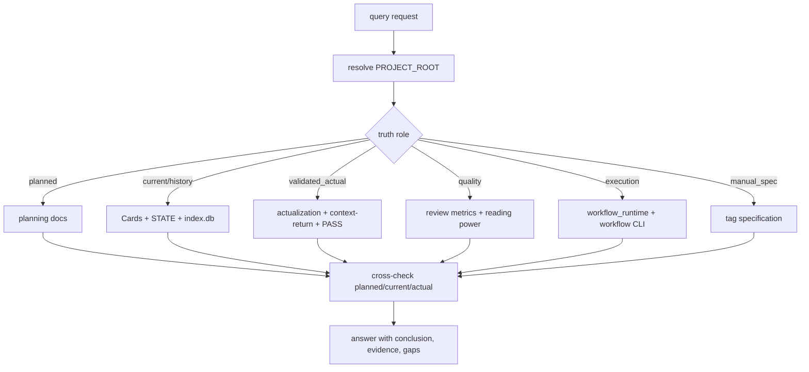

# story2026 Query

`query/` 是 `story2026` 的事实查询卫星技能。它先判定用户问的是哪一种 truth role，再读取 `projects/story/<项目名>/` 的真实载体；它不生成正文、不改写规划、不回写卡片、不替代 `resume/`、`review/` 或 `5-上下文回流` 的主流程。

## Context Loading Contract

- 每次调用 `$story-query` 时，必须同时加载同目录 `CONTEXT.md`。
- 每次调用本技能时，必须同时识别并加载同目录 `types/` 中选中的类型包（单选或多选）。
- 若任务绑定 `projects/story/<项目名>/`，必须先加载项目根 `MEMORY.md`，再按需读取项目根 `CONTEXT/` 中与当前查询相关的事实材料。
- 查询必须先确认真实 `PROJECT_ROOT`；禁止把仓库根、`.agents/skills/story/query` 或其他技能目录当成书项目业务数据根。
- 冲突优先级：用户显式请求 > 根 `AGENTS.md` / meta 规则 > `.agents/skills/story/SKILL.md` > 本 `SKILL.md` > `references/` / `steps/` / `types/` / `review/` / `templates/` > `agents/openai.yaml` > 项目 `MEMORY.md` > 项目 `CONTEXT/` > 本 `CONTEXT.md`。
- 新的稳定真源选路失败模式先沉淀到 `CONTEXT.md`；稳定为强制规则后再晋升到本 `SKILL.md` 或对应分区。

## Purpose

一句话裁决：

- `Planning` 回答“原计划如何编排”。
- `Cards` 回答“对象长期是什么、当前怎样、经历如何演化”；对主角，还回答 `技能 / 心路 / 情感` 三轴成长现在走到哪。
- `STATE.json + index.db` 回答“当前运行态、索引证据和状态变化是什么”。
- `workflow_runtime` 回答“当前跑到哪、最近哪个 run 卡住、恢复点在哪里”。
- `actualization + 5-上下文回流` 回答“哪些计划已经被 PASS 后正式兑现”。
- `review_metrics` 回答“质量、阅读力和风险最近怎样”。

固定禁区：

- 不得把 `planned_state` 当成 `validated_actual`。
- 不得把 `Cards.core` 当成当前默认有效状态。
- 不得把 `STATE.json` 当成唯一真源。
- 不得把 XML 标签规范当成普通故事查询的主入口。
- 不得把“文件存在”直接说成“已通过 / 已兑现”。

## Input Contract

Accepted input:

- 用户询问小说项目的规划态、当前态、已验证实绩、角色/关系/地点/物品状态、成长历程、伏笔紧急度、质量趋势或 workflow 执行态。
- 用户询问某个计划是否已经发生、某个对象现在怎样、某段关系如何演化、某个 run 卡在哪里、某个证据应从哪里取。
- 用户询问 XML 手动补标规范；此类只加载标签参考，不进入普通剧情查询路径。

Required input:

- 可解析的项目名、项目根路径，或足够唯一的 `projects/story/<项目名>/` 候选。
- 查询目标的类型信号，例如规划、当前、实绩、质量、执行态、关系、标签规范或冲突诊断。

Optional input:

- 卷号、章号、角色/场景/物品名称、实体 ID、别名、run_id、阶段名、时间窗或用户要求的输出精度。
- 用户指定的兼容读取范围，例如旧 `全息地图.json`、`卷分片/*.json` 或 legacy planning。

Reject or clarify when:

- 无法唯一定位 `PROJECT_ROOT`，且仓库内存在多个候选项目。
- 用户要求查询技能直接写正文、修规划、回写卡片、执行 actualization 或清理中断任务；应回接对应阶段、`resume/`、`review/` 或 `5-上下文回流`。
- 用户要求用计划、快照或正文猜测“已经发生”，但缺少 actualization / PASS / context-return 证据。

## Mode Selection

| mode | 触发信号 | 输出 |
| --- | --- | --- |
| `planned` | 原计划、安排、落在哪章、章节编排 | 规划结论、三层 planning 证据、兼容投影说明 |
| `current` | 现在、当前、默认状态、持有、地点、境界 | Cards.current_state 结论、STATE/index 辅证 |
| `history` | 怎么变成、经历、成长、关系演化 | timeline/history/state_changes 组合证据 |
| `validated_actual` | 已经发生、实际兑现、最终推进到哪 | actualization sidecar、context-return、validation 证据或缺口 |
| `quality` | 质量、阅读力、评分、风险、节奏 | review_metrics / reading_power / status 证据 |
| `execution` | run、执行态、卡住、断点、恢复点、task log | workflow status/list-runs/detect 证据 |
| `manual_spec` | XML 标签、手动补标规范 | tag specification 答复 |
| `conflict_diagnosis` | 来源互相矛盾、计划与实绩不一致 | truth-layer 裁决、冲突表、回修入口 |

## Reference Loading Guide

| 场景 | 读取文件 |
| --- | --- |
| 任意查询 | `references/system-data-flow.md` |
| 旧 `SKILL.md` 语义迁移或结构升级追溯 | `references/legacy-migration-matrix.md` |
| 伏笔紧急度、静默区、回收窗口 | `references/advanced/foreshadowing.md` |
| Strand / 节奏结构 / 章节织线 | `../_shared/strand-weave-pattern.md` |
| 手动标签 / XML 兼容查询 | `references/tag-specification.md` |
| 执行查询步骤、冲突汇流 | `steps/query-workflow.md` |
| 判定 truth role 与读取主真源 | `types/query-type-map.md` |
| 查询质量门禁和降级审查 | `review/review-contract.md` |
| 输出样板 | `templates/output-template.md` |
| 机械命令边界 | `scripts/README.md` |
| 可复用经验 | `knowledge-base/query-heuristics.md` |
| 产品入口元数据 | `agents/openai.yaml` |

## Visual Maps

## Execution Contract

1. 读取本 `SKILL.md + CONTEXT.md`，再按任务绑定加载项目 `MEMORY.md` 与相关项目 `CONTEXT/`。
2. 按 `steps/query-workflow.md` 解析 `PROJECT_ROOT` 并完成 preflight；若无法唯一定位，停止并要求用户给出项目名或路径。
3. 按 `types/query-type-map.md` 判定 truth role；一句话命中多类时先回答主问题，再补次要问题。
4. 按 `references/system-data-flow.md` 读取 canonical carrier；仅在用户或证据需要时读取 legacy / compat 路径。
5. 若问题涉及“已经发生 / 已兑现 / 通过”，必须检查 actualization sidecar、`5-上下文回流/*.context-return.json` 与 validation evidence；缺失时只能回答“尚无 validated actual evidence”。
6. 若问题涉及“当前跑到哪 / 最近哪个 run 卡住”，优先使用 `workflow status --format json`、`workflow list-runs --format json` 与 `workflow detect`。
7. 按 `review/review-contract.md` 做最小质量门禁，再使用 `templates/output-template.md` 的结构返回结论、证据、边界与冲突。

## Field Mapping

| field_id | 输出/证据 | 内容要求 | 失败码 |
| --- | --- | --- | --- |
| `FIELD-QRY-ROOT-01` | project root lock | 真实 `projects/story/<项目名>/`，不是仓库根或技能目录 | `FAIL-QRY-ROOT` |
| `FIELD-QRY-ROLE-02` | truth role | 查询类型唯一或主次明确 | `FAIL-QRY-ROLE` |
| `FIELD-QRY-SOURCE-03` | canonical carrier | 读取当前主真源，compat 只作回读并标注 | `FAIL-QRY-SOURCE` |
| `FIELD-QRY-CHECK-04` | truth-layer cross-check | 明确区分 `planned / current / validated_actual` | `FAIL-QRY-CHECK` |
| `FIELD-QRY-ANSWER-05` | output shape | 结论、证据、边界/冲突齐全 | `FAIL-QRY-ANSWER` |

## Root-Cause Execution Contract

当 `query/` 出现以下问题时，必须修源层合同，而不是只修一次回答：

- 把仓库根或技能目录误判为项目根。
- 把 `planned_state` 当成已经发生。
- 把 `Cards.core` 当成当前态。
- 把 `STATE.json` 当成唯一真源。
- 把 XML 标签规范当成普通剧情查询入口。
- 用文件存在冒充 validation PASS 或 actualization。

必经链路：

`Symptom -> Direct Cause -> query Section Owner -> story truth carrier -> AGENTS.md / skill-工作车间`

优先回修落点：

1. truth role 或 carrier 选错：`types/query-type-map.md`、`references/system-data-flow.md`。
2. 执行步骤漏证据：`steps/query-workflow.md`。
3. 输出把计划、当前、已验证实绩混淆：`review/review-contract.md`、`templates/output-template.md`。
4. 路径漂移或旧结构残留：`references/legacy-migration-matrix.md` 与 story 根路由。
5. 可复用失败模式：`CONTEXT.md`、`knowledge-base/query-heuristics.md`。

## Output Contract

### Required output

1. 查询结论：直接回答用户主问题，标明 truth role、置信度和是否存在证据缺口。
2. 证据路径：列出实际读取或可复核的 canonical 文件、字段、CLI 输出或 index 查询。
3. 边界与冲突：区分 planned、current、validated_actual、quality、execution 与 manual spec。
4. 下一入口：若用户下一步要执行，给出唯一推荐入口，例如具体阶段、`resume/`、`review/` 或 `5-上下文回流`。

### Output format

Markdown 结构化答复；复杂查询使用 `templates/output-template.md` 的四段式结构。

### Output path

默认只输出到当前对话，不改写项目文件。若用户要求保存查询报告，写入 `projects/story/<项目名>/reports/query-report-YYYYMMDD.md`。

### Naming convention

- 查询报告命名为 `query-report-YYYYMMDD.md`。
- 不创建 `status.md`、`result.txt`、`query.json` 等平行真源。

### Completion gate

- 已加载本 `SKILL.md + CONTEXT.md`。
- 已确认 `PROJECT_ROOT` 或明确报告无法唯一定位。
- 已判定 truth role 并读取对应 canonical carrier。
- 已区分 `planned / current / validated_actual`，并对质量、执行态、标签规范单独标注。
- 输出包含结论、证据、边界/冲突和下一入口。
