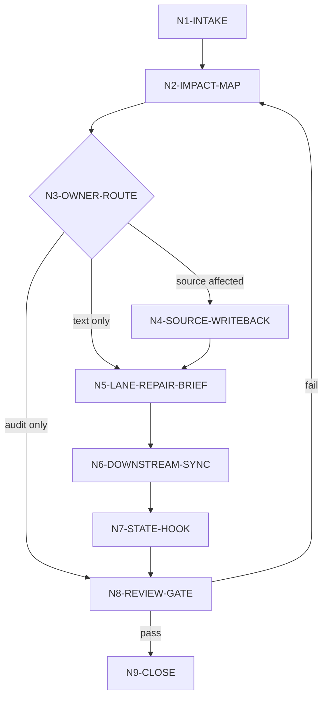

# Repair Workflow

## Topology

`story-repair` 采用混合拓扑：先串行判定，再并行取证，最后按源层优先级串行写回并汇流验收。

## Node Table

| node_id | objective | inputs | actions | evidence | route_out | gate |
| --- | --- | --- | --- | --- | --- | --- |
| `N1-INTAKE` | 锁定项目、局部、意图和权限 | 用户请求、项目根、目标路径 | 定位 target locality，确认 writeback mode | intake summary | `N2-IMPACT-MAP` | 项目和目标可定位 |
| `N2-IMPACT-MAP` | 建立全身影响图 | `impact-scope-contract.md`、`types/scope/*`、`rg` 命中、项目上下文 | 先按 Universal Type Matrix 判型，再查旧/新口径分布，列 upstream/sibling/downstream/future | impact map | `N3-OWNER-ROUTE` | 至少能判定 owner 或 unknown，且已加载命中的 typed scope 包 |
| `N3-OWNER-ROUTE` | 决定 canonical owner 和修复路径 | impact map、source ledger | 生成 writeback_order 和 stage_routes | repair plan | `N4` / `N5` / `N8` | 不允许 downstream 先改源层错误 |
| `N4-SOURCE-WRITEBACK` | 修复源层真源 | cards/planning/north_star/MEMORY | 按用户授权更新源层和投影 | changed source files | `N5-LANE-REPAIR-BRIEF` | 旧源层口径已失效或解释为 legacy |
| `N5-LANE-REPAIR-BRIEF` | 把正文改动交给 owning lane | original lane、stage skill、repair plan | 生成 provider-ready repair brief，路由 A/B/C | repair brief or provider sidecar | `N6-DOWNSTREAM-SYNC` | 创作权归属清楚 |
| `N6-DOWNSTREAM-SYNC` | 同步已产出和后续约束 | draft/polish/review/return/state | 更新、失效、重验或添加 guardrail | changed downstream refs | `N7-STATE-HOOK` | 无已知消费者仍引用旧口径 |
| `N7-STATE-HOOK` | 写入运行态证据 | changed files、stage result | 调用或记录 `workflow_manager.py record-skill-completion` 需求 | status note | `N8-REVIEW-GATE` | 执行型任务有状态落点或阻断说明 |
| `N8-REVIEW-GATE` | 审计修复完整性 | review contract、code-reviewer checklist | 检查旧口径残留、前后因果、provider evidence | audit result | `N9-CLOSE` 或 `N2` | PASS 或有明确返工项 |
| `N9-CLOSE` | 交付闭环 | audit result、changed files | 输出 repair packet、风险和后续约束 | final report | done | 输出合同齐全 |

## Failure Loops

| fail_code | symptom | rework_entry |
| --- | --- | --- |
| `FAIL-REPAIR-SCOPE` | 只列当前文件，没有全身影响图 | `N2-IMPACT-MAP` |
| `FAIL-REPAIR-TYPE-MATRIX` | 修改对象已命中类型矩阵但未加载对应 scope 包 | `N2-IMPACT-MAP` |
| `FAIL-REPAIR-OWNER` | 下游改动早于源层裁决 | `N3-OWNER-ROUTE` |
| `FAIL-REPAIR-AUTHORSHIP` | B/C 正文被非 provider 直接改写 | `N5-LANE-REPAIR-BRIEF` |
| `FAIL-REPAIR-AUDIT` | 旧口径仍在 source 或 accepted actualization 命中 | `N8-REVIEW-GATE` |
