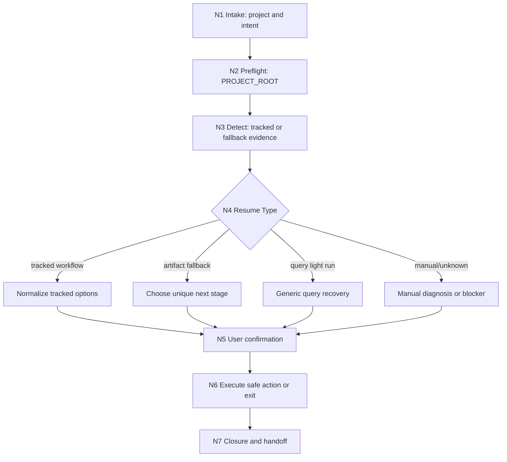

# Story Resume

`story-resume` 是 `.agents/skills/story/` 下的恢复卫星技能。它负责定位可证明的中断点、归一化安全恢复选项、过滤危险动作，并把任务回接到 `3-初稿`、`review/`、`5-上下文回流`、`query/` 或其他唯一 owner。它不生成正文、不改写规划、不执行 actualization，也不拥有任何阶段业务真源。

本包按 Skill 2.0 工作车间结构维护：入口、触发、模式路由、动态引用、关键门禁和输出合同保留在 `SKILL.md`；恢复协议在 `references/`，思行节点在 `steps/`，恢复类型在 `types/`，质量门禁在 `review/`，经验知识库在 `knowledge-base/`，输出样板在 `templates/`，机械辅助边界在 `scripts/`，产品侧元数据在 `agents/`。

## Context Loading Contract

- 每次调用 `$story-resume` 时，必须同时加载同目录 `CONTEXT.md`。
- 每次调用本技能时，必须同时识别并加载同目录 `types/` 中选中的类型包（单选或多选）。
- 若任务已绑定 `projects/story/<项目名>/`，先加载项目根 `MEMORY.md`，再按需加载项目根 `CONTEXT/` 中与恢复判断相关的上下文文件。
- 冲突优先级：用户显式请求 > 根 `AGENTS.md` / meta 规则 > 本 `SKILL.md` > `references/`、`steps/`、`types/`、`review/`、`templates/` > `agents/openai.yaml` > 项目 `MEMORY.md` > 项目 `CONTEXT/` > 同目录 `CONTEXT.md`。
- `CHANGELOG.md` 只用于追溯本技能包配置变更，不作为运行时自动上下文。
- 若恢复暴露新的可复用失败模式，优先沉淀到同目录 `CONTEXT.md`；稳定后再晋升到本入口合同或对应分区。

## When To Use

- 用户要求恢复、继续、清理或诊断一个被打断的 story2026 任务。
- 需要读取 `STATE.json.workflow_runtime.workflow_state`、`execution_state` 或 `task_log` 判断 tracked interruption。
- `workflow detect` 没有 tracked 中断，但项目工件链显示存在唯一下一入口，需要执行 artifact fallback 判定。
- 需要把 `story-write`、`story-validate`、`story-review`、`story-context-return`、`story-query` 等 run 的中断状态解释成人类可执行的恢复选项。
- 某阶段产物已存在，但需要判断应回到 drafting、review、context return、query、source contract repair，还是先停下人工诊断。

## When Not To Use

- 用户只是查询项目事实、文件位置或已有产物清单，应优先进入 `query/`。
- 用户要求对 PASS 集做正式 actualization，应进入 `5-上下文回流/`。
- 用户要求生成或修改正文，应回到 `3-初稿` 对应工序。
- 用户要求修复审查结论或做终验，应进入 `review/`。
- 用户要求破坏性 Git 操作、删除未备份正文、清空项目资产时，本技能只能提供风险说明和非破坏性检查路径，不得默认执行。

## Input Contract

`$story-resume` 必须先判断输入是否足够锁定真实项目根、恢复诉求和可证明中断证据；不足时停止猜测并请求最小缺口。

| input slot | required shape | detail owner |
| --- | --- | --- |
| `project_root` | 项目路径，或当前工作目录可由 `story.py where` 解析到包含 `STATE.json` 的真实书项目根 | `steps/resume-workflow.md` |
| `resume_intent` | 继续执行、只检测、清理现场、保留现场、重跑、退出恢复流程之一 | `types/resume-type-map.md` |
| `runtime_evidence` | `workflow detect` 输出，或能证明“没有 tracked interruption”的诊断结果 | `references/workflow-resume.md` |
| `stage_hint` | 可选；章节号、卷号、当前正文路径、review/report 路径或失败症状 | `references/system-data-flow.md` |
| `risk_profile` | 是否涉及删除正文、清理 workflow state、继续生成或人工保留现场 | `review/resume-review-gate.md` |

Accepted input:

- 明确项目路径或当前目录可解析到 `STATE.json`，并要求恢复、检测、清理或继续任务。
- 已有 `workflow detect` 输出，需要转成人类可执行恢复方案。
- 没有 tracked 中断，但存在 `review/*.validation.json`、`review/*章审查报告.md`、`3-初稿/第V卷.写作日志.yaml` 或 `5-上下文回流/*.context-return.json` 等业务证据链。

Reject or reroute:

- 项目根无法唯一定位 -> 先询问项目路径或要求运行 preflight。
- 明确只是查询事实 -> `query/`。
- 明确要求 PASS actualization -> `5-上下文回流/`。
- 明确要求写正文或修正文稿质量 -> `3-初稿` / `review/`。
- 请求默认执行 `git reset --hard`、未备份删除正文、清空资产 -> block，并只给非破坏性恢复路径。

## Mode Selection

| mode | trigger | default action |
| --- | --- | --- |
| `tracked_workflow_resume` | `workflow detect` 返回 tracked JSON 中断 | 读取 command、current_step、completed_steps、artifacts，归一化恢复选项 |
| `artifact_fallback_resume` | 无 tracked 中断，但业务工件链证明唯一下一入口 | 列出证据链，并回接到唯一 stage |
| `query_light_resume` | tracked command 是 `story-query` | 只给 generic continue / rerun / diagnosis，不进入章节 cleanup |
| `write_cleanup_resume` | `story-write` Step 2-8 中断且用户倾向重跑 | 先 preview cleanup，再等待确认，不自动删除 |
| `review_decision_resume` | `story-review` 在人工裁决或后段中断 | 重新确认输入和关键问题处理策略 |
| `manual_diagnosis` | 手工 Bash、未注册命令或证据冲突 | 保留现场，输出人工诊断路线 |
| `blocked_safety_stop` | 项目根缺失、证据不足、用户请求危险动作 | 停止恢复裁决，输出 blocker 和最小补充信息 |

## Reference Loading Guide

按恢复节点动态加载，不要一次性读取所有分区。

| scenario | load |
| --- | --- |
| 恢复协议、安全边界、artifact fallback、step 语义 | `references/workflow-resume.md` |
| canonical runtime、规划/正文/review/context return 真源 | `references/system-data-flow.md` |
| 旧长 `SKILL.md` 到 Skill 2.0 分区的迁移追踪 | `references/legacy-migration-matrix.md` |
| 项目根预检、detect、选项归一化、确认、执行、closure | `steps/resume-workflow.md` |
| 恢复模式、命令类型、风险等级与 stage 回接策略 | `types/resume-type-map.md` |
| 交付前安全 gate、provider 降级、本地 review checklist | `review/resume-review-gate.md` |
| 可复用恢复经验与避坑策略 | `knowledge-base/resume-heuristics.md` |
| 用户-facing 恢复裁决包模板 | `templates/output-template.md` |
| 机械辅助命令边界与统一 CLI 入口 | `scripts/README.md` |
| 产品侧入口元数据 | `agents/openai.yaml` |

## Core Workflow Index

Detailed node fields, evidence requirements, branch gates, and failure loops live in `steps/resume-workflow.md`.

## Mandatory Gates

- 必须先解析真实 `PROJECT_ROOT`，且它必须包含 `STATE.json`；否则不得推断断点。
- 恢复判断必须先执行或消费 `workflow detect` 结果，不能只凭聊天记忆。
- `workflow detect` 无 tracked 中断时，必须继续检查 artifact fallback，而不是直接宣布无事可做。
- `story-query` 只能做轻量 generic 恢复，不套用章节 cleanup 模板。
- 涉及正文删除时必须先 preview，再等待用户确认；真正删除前必须由脚本自动备份。
- 不得默认执行 `git reset --hard`，不得假定存在章节 tag/commit。
- 恢复后继续写作/查询时，默认重新接回 `2-卷章规划/整体规划.md + 第N卷/卷规划.md + 第N卷/第N章.md`。
- 输出必须说明下一跳回哪个 stage；若无法唯一裁决，输出 blocker 和最小补充信息。

## Root-Cause Execution Contract

恢复类失败必须沿以下链路上溯：

`Symptom -> Direct Technical Cause -> Section Owner -> Rule Source -> Meta Rule Source -> Fix Landing Points`

优先修复路径：

1. 项目根误判：修 `steps/resume-workflow.md` 与 `scripts/README.md`。
2. 断点凭空猜测：修 `references/workflow-resume.md`、`steps/resume-workflow.md` 与 `review/resume-review-gate.md`。
3. artifact fallback 缺失或误判：修 `references/workflow-resume.md` 与 `types/resume-type-map.md`。
4. 危险恢复建议泄漏：修 `review/resume-review-gate.md`、`references/workflow-resume.md` 与 `scripts/workflow_manager.py`。
5. stage 边界混淆：修本 `SKILL.md`、`references/system-data-flow.md` 与对应阶段技能。
6. 输出缺少唯一下一入口：修 `templates/output-template.md` 与 `review/resume-review-gate.md`。

## Field Mapping

| field_id | owner | must contain | fail code |
| --- | --- | --- | --- |
| `RESUME-FIELD-01` | `SKILL.md` | 入口边界、Input Contract、Mode Selection、Reference Loading Guide、Mandatory Gates、Output Contract | `FAIL-RESUME-ENTRY` |
| `RESUME-FIELD-02` | `CONTEXT.md` | Type Map、Repair Playbook、Reusable Heuristics | `FAIL-RESUME-CONTEXT` |
| `RESUME-FIELD-03` | `references/workflow-resume.md` | 恢复证据链、artifact fallback、step 语义、安全禁令 | `FAIL-RESUME-EVIDENCE` |
| `RESUME-FIELD-04` | `references/system-data-flow.md` | canonical runtime 和权威 data-flow 重定向 | `FAIL-RESUME-RUNTIME` |
| `RESUME-FIELD-05` | `steps/resume-workflow.md` | 判断-动作-证据一体化节点、分支、失败回路 | `FAIL-RESUME-STEPS` |
| `RESUME-FIELD-06` | `types/resume-type-map.md` | 恢复类型、风险等级、command/stage 映射 | `FAIL-RESUME-TYPES` |
| `RESUME-FIELD-07` | `review/resume-review-gate.md` | 安全 gate、provider 降级、verdict 模型 | `FAIL-RESUME-REVIEW` |
| `RESUME-FIELD-08` | `templates/output-template.md` | 恢复裁决包模板与 Output Contract Alignment | `FAIL-RESUME-TEMPLATE` |
| `RESUME-FIELD-09` | `scripts/README.md` | 统一 CLI 入口、只读/破坏性命令边界 | `FAIL-RESUME-SCRIPTS` |
| `RESUME-FIELD-10` | `agents/openai.yaml` | display name、short description、默认唤起提示 | `FAIL-RESUME-METADATA` |

## Output Contract

### Required output

一次恢复裁决包：真实 `project_root`、tracked command 或 artifact fallback 证据、current step、已完成/未完成状态、归一化恢复选项、推荐选项、用户确认选项、已执行命令、下一 stage handoff；若无法恢复，输出 blocker 和最小补充信息。

### Output format

默认是 Markdown 用户-facing 恢复报告；如由脚本消费，可附 YAML/JSON 结构片段，但不得把 `resume/` 输出写成阶段业务真源。

### Output path

默认不落盘、不改写业务真源。若用户明确要求生成恢复报告，写入 `projects/story/<项目名>/resume/resume-report-YYYYMMDD.md`；若执行 cleanup / clear / fail-task，只能通过 `scripts/story.py` 统一 CLI 修改 workflow runtime。

### Naming convention

恢复报告使用 `resume-report-YYYYMMDD.md`；恢复模式使用本 `Mode Selection` 表中的 ASCII-safe 值；下一入口必须写成一个明确 skill、命令或项目 runtime 路径，不输出无序候选。

### Completion gate

完成前必须通过 `review/resume-review-gate.md`：项目根已锁定、detect 或 fallback 证据可复核、风险等级已标注、危险动作已过滤、用户确认要求已满足、唯一下一入口已给出；若无法唯一裁决，必须返回 blocker 和最小补充信息。
