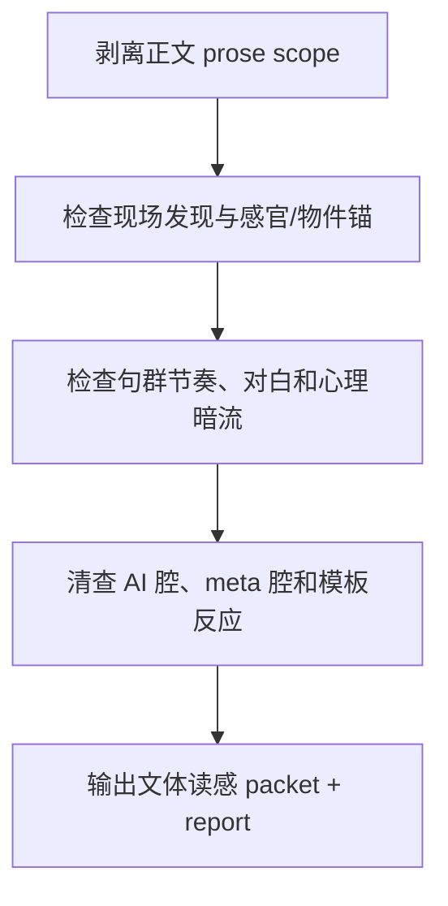

# Validation Flow

| node | action | gate |
| --- | --- | --- |
| `A` | 去除 frontmatter、标题和流程材料 | 审查对象只剩小说正文 |
| `B` | 查物件、声音、气味、身体、空间、环境反作用 | 场景不是空口解释 |
| `C` | 查句群平均化、解释对白、心理标签 | 文本有中文小说呼吸 |
| `D` | 查总结腔、分镜腔、模板脸色和 meta 术语 | 无明显破沉浸 artifact |
| `E` | 写 packet 与 sidecar | 可被父层聚合 |
