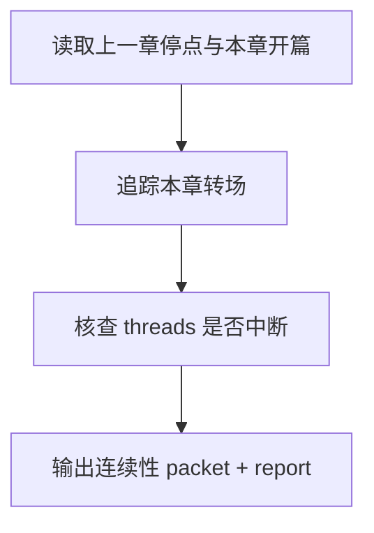

# review / 连续性

## Context Loading Contract

- 每次调用本技能时，必须同时加载同目录 `CONTEXT.md`。
- 每次调用本技能时，必须同时识别并加载同目录 `types/` 中选中的类型包（单选或多选）。
- 必须回读父层 `review/SKILL.md`、`../_shared/validation-root-contract.md`、`../_shared/validation-child-output-contract.md`。
- 审查前必须读取卷级 `validation_fact_pack`、当前卷正文集合、卷级写作日志，以及可用的前序章节快照。

## Invocation Modes

- `drafting_inline`
  - 被 `3-初稿` 在 registry 指定 step 写回后立即调用，用于阻断承接断带和转场失衡继续向后扩散。
- `final_acceptance`
  - 被 `review` 父层在卷级终验中并发调用，参与最终 `validation_status` 聚合。

## Parent Positioning

本 child 负责：

- 检查当前章如何接上上一章停点
- 检查本章内部场景切换、threads 承接与推进连续性
- 检查是否突然断掉读者仍在记账的压力线

它不负责：

- 结构义务是否本身成立
- 世界规则和卡片状态的深层逻辑
- 角色声口细部差异
- 时间锚精算

## Canonical Sources

- `../SKILL.md`
- `../CONTEXT.md`
- `../_shared/validation-root-contract.md`
- `../_shared/validation-child-output-contract.md`
- `../../_shared/context-loading-contract.md`
- `../_shared/validation-fact-pack-spec.md`
- `../_shared/checker-output-schema.md`

## Business Requirement Analysis Contract

| analysis_slot | 当前结论 |
| --- | --- |
| `business_goal` | 判断这卷是不是按卷地图 continuity pack 长出来，卷内各章承接与线程推进没有断带。 |
| `business_object` | 卷级 continuity matrix、当前卷正文集合、卷级写作日志、`chapter_planning_packets`。 |
| `constraint_profile` | 先看卷级 entry/exit 关系，再看卷内相邻章节 transition；不能只靠“读起来还行”给通过。 |
| `success_criteria` | 能指出哪条线接得上、哪一章中途断了、哪个转场突兀、哪个卷内 carryover 漂移。 |
| `topology_fit` | `carryover load -> transition trace -> thread continuity -> report packet` |

## Total Input Contract

- 必需输入：
  - 当前卷正文集合
  - `第V卷.写作日志.yaml`
  - `validation_fact_pack.cross_chapter_continuity_matrix`
- 条件必需输入：
  - 当前卷内已完成前序章节的正文快照
- 硬规则：
  - 缺卷级 continuity matrix 时直接降为 `FAIL-COVENANT`。
  - 前序章节终稿是增强输入，不再是卷级终验的绝对硬门槛。
  - 连续性问题要指出“断在第几章、断在什么线”。

## Output Contract

- `role_id`:
  - `continuity-validator`
- `dimension_packet`:
  - 至少包含 `previous_episode_bridge`、`transition_breaks`、`thread_drop_count`、`carryover_gaps`
- `dimension_report_ref`:
  - `review/第V卷/连续性.md`
- 默认返工节点：
  - `1-单章叙事起盘`
  - `Step 2 / 2-节奏优化`

## Visual Map

## Thinking-Action Network

| node_id | field_id | objective | actions | evidence | route_out | gate |
| --- | --- | --- | --- | --- | --- | --- |
| `N1-CARRYOVER-LOAD` | `FIELD-CT-01` | 锁上一章停点与本章开篇关系 | 抽取情绪、动作、信息停点 | `carryover_note` | -> `N2` | 承接可读 |
| `N2-TRANSITION-TRACE` | `FIELD-CT-02` | 检查本章内转场与推进 | 标记突兀跳转、断层、硬切 | `transition_note` | -> `N3` | 转场清楚 |
| `N3-THREAD-CHECK` | `FIELD-CT-03` | 核查活跃 threads 是否中断 | 识别悬念线、任务线、关系线断带 | `thread_note` | -> `N4` | 线索不断带 |
| `N4-PACKET-WRITE` | `FIELD-CT-04` | 输出连续性结论 | 生成 `dimension_packet + report_ref` | `packet_note` | done | 只写本维度 |

## Lite Field Contract

| field_id | output_slot | pass_standard | fail_code | rework_entry |
| --- | --- | --- | --- | --- |
| `FIELD-CT-01` | carryover bridge | 能说清上一章如何接到本章 | `FAIL-CT-01` | `N1` |
| `FIELD-CT-02` | transition matrix | 关键转场没有硬断层 | `FAIL-CT-02` | `N2` |
| `FIELD-CT-03` | thread continuity | 活跃线索/任务/关系线未被莫名放掉 | `FAIL-CT-03` | `N3` |
| `FIELD-CT-04` | dimension packet | 报告可追溯且可聚合 | `FAIL-CT-04` | `N4` |

## Completion Contract

- 已明确指出承接点、转场点与断带点。
- 若失败，报告已定位返工应回到起盘还是 `Step 2 / 2-节奏优化`。

## Reference Loading Guide

| 场景 | 读取文件 |
| --- | --- |
| 维度审查入口与父层边界 | `../SKILL.md`、`../references/root-runtime-contract.md` |
| 连续性步骤网络 | `steps/validation-flow.md` |
| 维度判据与共享字段 | `references/README.md`、`../_shared/validation-child-output-contract.md` |
| 质量门禁与 reviewer 汇流 | `review/review-gate.md` |
| 类型化输入画像 | `types/type-map.md` |
| 输出样式 | `templates/output-template.md` |
| 脚本边界 | `scripts/README.md` |
| 可复用经验 | `knowledge-base/heuristics.md` 与 `CONTEXT.md` |
| 产品侧入口 | `agents/openai.yaml` |

## Root-Cause Execution Contract

`Symptom -> Direct Cause -> Section Owner -> Source Contract -> Meta Rule Source`

若承接断带没有明确断在哪条线，回到 `N1-CARRYOVER-LOAD` 与 `N3-THREAD-CHECK`；若缺 continuity matrix，直接 route `FAIL-COVENANT`。

## Field Mapping

| field_id | owner | required_output | fail_code |
| --- | --- | --- | --- |
| `FIELD-CT-ENTRY` | `SKILL.md` | 输入、边界、维度 verdict 与父层回接 | `FAIL-CT-ENTRY` |
| `FIELD-CT-STEPS` | `steps/` | 承接、转场、线程连续性检查 | `FAIL-CT-STEPS` |
| `FIELD-CT-REVIEW` | `review/` | 维度门禁与 packet 可聚合性 | `FAIL-CT-REVIEW` |

## Skill 2.0 Output Contract

- Required output: 连续性 `dimension_packet` 与 `dimension_report_ref`。
- Output format: Markdown 维度报告 + 父层可聚合结构化 packet。
- Output path: `projects/story/<项目名>/review/第V卷/连续性.md`。
- Naming convention: report filename 以父层 registry 的 `report_filename` 为准。
- Completion gate: 断带位置、影响章节和返工 step 均可追溯。
