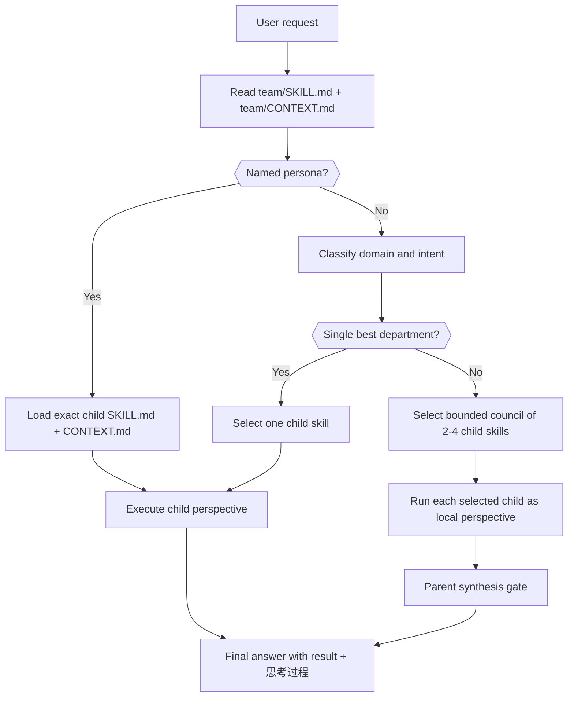
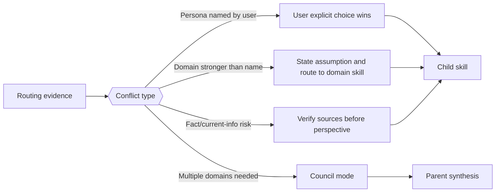
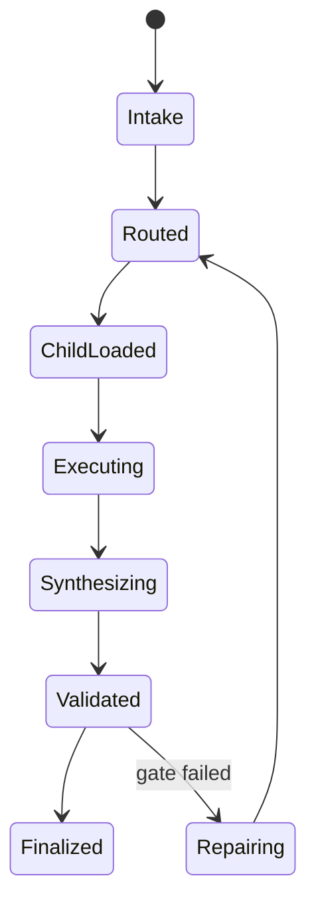

# Team Perspective Root

技能包 ID: `team`

本文件是 `.agents/skills/team/` 的根目录规范。它只治理团队视角技能树的分类、路由、加载顺序、共享输出门禁和源层修复规则；具体人物、创作者、作品或部门视角的事实材料、心智模型、语气和工作流，仍由各子目录自己的 `SKILL.md` 与 `CONTEXT.md` 持有。

## Scope And Truth Ownership

| 层级 | 真源职责 | 不拥有的内容 |
| --- | --- | --- |
| `team/SKILL.md` | 部门 taxonomy、路由策略、加载顺序、跨子技能汇流、根因追踪和治理门槛 | 具体人物视角、研究证据、局部口吻、单人物工作流 |
| `team/CONTEXT.md` | 跨部门/跨人物的复用经验、失败类型、路由启发、根层 Playbook | 单人物案例流水、未验证的研究事实、子技能本地经验 |
| `team/<分类>/<条目>/SKILL.md` | 该人物、作品或条目的触发条件、事实边界、心智模型、回答工作流 | 团队根 taxonomy、跨条目聚合合同 |
| `team/<分类>/<条目>/CONTEXT.md` | 该条目技能的局部启发、陷阱、修复模式 | team 根层的跨技能经验 |

根合同不得把子技能内容复制成第二真源。若共享规则需要影响多个人物技能，先落在本根合同或根 `CONTEXT.md`，再由子技能显式继承或局部特化。

## Context Loading Contract

- 每次调用本根技能时，必须同时加载同目录 `CONTEXT.md` 作为预加载上下文。
- 若同目录 `CONTEXT.md` 缺失，应先补齐最小知识库骨架，或向用户明确报告阻塞；不得在未检查该上下文的情况下执行技能。
- 若任务命中特定人物或部门子技能，必须继续加载该子技能自己的 `SKILL.md`；进入执行前再加载其同目录 `CONTEXT.md`。
- 冲突优先级：用户显式请求 > 仓库/全局 `AGENTS.md` > 本根 `SKILL.md` > 命中子技能 `SKILL.md` > 本根 `CONTEXT.md` > 命中子技能 `CONTEXT.md`。

## Trigger And Non-Goals

使用本根技能的场景：

- 用户要求“用某某视角”“导演组/编剧组/演员组怎么看”“让团队顾问会诊”等跨部门或人物视角任务。
- 用户明确点名某部作品，希望“像《2046》那样处理”“用某作品做镜片”“拆某部作品的方法”。
- 用户没有指定人物，但任务明显需要在导演、编剧、演员、摄影、设计、动作、美学之间选择最合适的视角。
- 用户要求维护、审计、批量补齐或修复 `.agents/skills/team/` 下的共享规范。
- 子技能之间出现触发冲突、事实边界冲突、输出结构漂移或经验沉淀位置不清。

不使用本根技能直接替代的场景：

- 用户明确点名某个具体人物技能，且无需跨技能路由或根规范判断时，直接进入对应子技能。
- 任务只是普通事实问答、影评、百科介绍，且没有要求人物视角、创作顾问或团队诊断。
- 需要生成图片、视频、漫画或 AIGC 阶段产物时，先由对应 AIGC / media / API 技能接管，team 技能只作为创作视角 side input。

## Department Taxonomy

命名兼容规则：

- `aigc/编剧组/` 是当前影视写作工艺向的实际落点与显示名。
- `小说组` 作为旧称保留输入兼容；凡命中旧称，若用户要的是影视结构/场景/对白工艺，默认等价路由到 `编剧组/`；若用户明确点名文学作者或要借作家方法论，则优先判断应进 `study/文学系/` 还是 `story/`。
- `study/` 用于学者型、思想型、文学方法论型镜片；当前下含 `文学系/`、`建筑系/`、`历史系/`、`哲学系/` 等子树。
- `story/` 用于类型小说家与长篇叙事镜片，优先承接武侠、历史传奇、类型长篇、章节推进、读者拉力和题材气口等问题。

| department_id | 目录 | 主要问题 | 默认交付 |
| --- | --- | --- | --- |
| `director` | `导演组/` | 剧本方向、场面调度、类型策略、制作判断 | 导演诊断、分镜/调度建议、制作取舍 |
| `screenwriter` | `aigc/编剧组/` | 结构、人物、叙事、母题、改编、场景与对白工艺 | 剧作诊断、结构重写方向、段落钩子、场景/对白修复 |
| `actor` | `演员组/` | 表演、角色气质、身体、镜头关系 | 表演方案、角色处理、镜头表演建议 |
| `cinematography` | `摄影组/` | 光线、镜头、色彩、质感、影像组织 | 摄影诊断、镜头/光色策略 |
| `design` | `设计组/` | 空间、服装、美术、材料、建筑/场景 | 设计诊断、视觉系统、提示词字段 |
| `action` | `武术组/` | 打戏、动作路线、身体风险、威亚/实拍 | 动作设计、拍摄安全、节奏方案 |
| `aesthetic` | `美学组/` | 整体美学、东方视觉、舞台/展览/装置 | 美学框架、视觉统合、概念校准 |
| `work_dimension` | `作品维度/` | 单部作品语法、结构迁移、互文续写、作品拆解 | 作品维度诊断、迁移规则、结构/场面方案 |
| `story` | `story/` | 类型小说家方法论、小说体裁、长篇/连载叙事、章节推进、作者化文体与世界观组织 | 小说诊断、类型结构建议、人物/章节/关系策略、叙事执行与写法迁移 |
| `study` | `study/` | 学者方法论、跨学科思想镜片、公共知识判断 | 学者视角诊断、方法迁移、概念框架与论证路径 |

## Auto-Selection Fast Path

本根技能同时承担 `.agents/skills/aigc/0-初始化/` 等上游自动选人入口的“快路径真源”。

硬规则：

1. 自动组队或自动路由若把候选范围锁定为 `.agents/skills/team/`，必须先读取本文件和同目录 `CONTEXT.md`，不得直接对整个 team 树做无差别深读。
2. 根层只负责提供 `部门 -> 成员 -> 适配场景` 的直接可读索引，用于 shortlist；具体人物事实、语气、工作流与边界仍以子技能 `SKILL.md + CONTEXT.md` 为准。
3. 自动选择的推荐流程固定为：根层索引初筛 -> required/optional departments 缩圈 -> shortlist deep-read -> 最终 lineup 裁决。
4. 对必选部门，shortlist 默认缩到 `1-3` 个候选；对可选部门，默认缩到 `0-2` 个候选。只有在题材明显跨域或用户明确要求时，才扩大深读范围。
5. 只要 `team/` 树新增、删除或明显重定位成员，本根 `SKILL.md` 与 `CONTEXT.md` 必须同轮同步；否则视为自动编组真源失配。

### Selector Packet Fields

| field_id | owner | purpose | hard_rule |
| --- | --- | --- | --- |
| `required_departments` | root | 必须覆盖的部门集合 | 默认由任务对象与上游合同裁定，不得靠名气堆人 |
| `optional_departments` | root | 可按题材触发的补位部门集合 | 仅在题材/媒介/制作难点触发时纳入 |
| `scenario_tags` | root | 从用户 brief 中提炼的题材、情绪、结构、媒介标签 | 先匹配场景，再匹配人名 |
| `candidate_shortlist` | root | 供上游深读的候选子技能集合 | 必须来源于本根成员索引，不得跳过根层直接全树扫描 |
| `deep_read_set` | child | 真正进入子技能深读的集合 | 只允许读取 shortlist 命中的子技能 |
| `lineup_rationale` | root + child | 说明为何选这些人、不选另一些人 | 必须能回溯到部门覆盖与场景适配 |

### Supervision Runtime Packet Fields

本节供 AIGC 项目 `team.yaml.roles.supervision.stage_profiles` 初始化或修复时使用。它只描述监制载入字段，不替代具体阶段技能的 `Advisor Consultation Mechanism`。

| field_id | owner | purpose | hard_rule |
| --- | --- | --- | --- |
| `supervision_stage` | root + AIGC stage | 锁定当前消费监制的阶段，如 `2-编剧`、`3-导演`、`4-表演`、`5-摄影`、`7-设计` | 必须使用项目 runtime 阶段名，不得写成模糊的 production |
| `stage_profile` | `team.yaml` | 保存该阶段的 `members/members_ref`、`preferred_departments`、`focus_tags`、`question_binding` 与 `dispatch_policy` | 阶段专属 profile 优先于通用 `roles.supervision.members` |
| `roster_resolution_order` | shared AIGC contract | 说明从阶段 profile 到旧字段的回退顺序 | 不得跳过 `team/SKILL.md + CONTEXT.md` 直接全树扫描 |
| `advisor_focus_tags` | root + stage | 将成员能力转成阶段问题焦点 | 必须服务阶段节点判断，不写泛风格标签 |
| `node_binding` | stage | 说明顾问问题绑定 `node_id / pass_id / gate_id` 还是 leaf 节点 | 不得退化为固定字段问卷 |
| `dispatch_policy` | stage | 区分 `stage-front-advisor`、`leaf-advisor`、`review-advisor` 或禁用 | 顾问与复核流程 只给顾问意见，不拥有 canonical 写回权 |
| `local_checklist_policy` | stage | 定义顾问与复核流程不可用时的本地 checklist 边界 | 不得把主 agent 本地顺序综合写成外部 provider 调度 |

推荐字段形态：

```yaml
roles:
  supervision:
    stage_profiles:
      "5-摄影":
        enabled: true
        members_ref: "roles.planning.members"
        members: []
        preferred_departments: ["摄影组", "导演组", "设计组", "美学组"]
        focus_tags: ["shot-design", "continuity", "ai-video-stability"]
        question_binding: "pass_node_gate"
        dispatch_policy: "stage-front-advisor"
```

若旧项目只有 `roles.production`、`roles.supervising` 或平铺 `team_setup.shared_agents`，可作为兼容回退读取；新初始化和重构时必须写入 `roles.supervision.stage_profiles`，让各阶段不再自行猜测监制载入含义。

## Member And Scenario Index

本节是 team 根目录的直接可读成员索引，供自动配队先做粗筛。

### 导演组

| 成员 | 适配场景 |
| --- | --- |
| `黑泽明` | 人道主义、行动伦理、史诗调度、历史/动作题材 |
| `希区柯克` | 悬念控制、观看伦理、心理惊悚 |
| `李安` | 压抑情感、跨文化改编、亲密关系 |
| `张艺谋` | 色彩场面、仪式群像、主流类型片 |
| `王家卫` | 暧昧错过、城市记忆、音乐与时间 |
| `徐克` | 武侠奇幻、动作奇观、经典改编 |
| `姜文` | 态度幽默、历史寓言、强对白表达 |
| `侯孝贤` | 生活流现实、历史家庭、长镜头距离 |
| `贾樟柯` | 时代切片、县城现实、纪实/虚构混写 |
| `杜琪峰` | 空间调度、宿命江湖、枪战群像 |
| `北野武` | 冷面黑色幽默、极简暴力、空白节奏 |
| `奉俊昊` | 阶级空间、类型混血、怪物/制度寓言 |
| `朴赞郁` | 欲望罪责、改编机关、情色惊悚 |
| `大卫·芬奇` | 犯罪程序、媒体科技、冷峻悬疑 |
| `丹尼斯·维伦纽瓦` | 大体量科幻、沉默叙事、声音世界 |
| `克里斯托弗·诺兰` | 时间结构、实拍奇观、科学/历史大片 |
| `昆汀·塔伦蒂诺` | 长对白、类型拼贴、反事实复仇 |
| `铃木清顺` | 色彩暴力、荒诞类型、制片厂反叛 |
| `深作欣二` | 实录暴力、反权威、青年互杀 |
| `寺山修司` | 地下剧场、诗性迷宫、青春出走 |
| `岩井俊二` | 青春书信、校园创伤、音乐叙事 |
| `三池崇史` | 邪典类型、暴力禁忌、漫改/游戏改编 |
| `关锦鹏` | 女性/酷儿视角、旧时代记忆、演员导向 |

### 编剧组

| 成员 | 适配场景 |
| --- | --- |
| `罗伯特·麦基` | 结构诊断、场景设计、价值转变、人物选择、对白动作、控制性观点 |
| `查理·考夫曼` | 身份断裂、递归结构、元叙事、主观现实、反公式编剧 |

补充说明：
- `查理·考夫曼` 当前本地技能落点位于 `.agents/skills/team/aigc/编剧组/查理·考夫曼/`，用于兼容用户仍按“编剧组”投放新成员的路径习惯。

### Story / 武侠类

| 成员 | 适配场景 |
| --- | --- |
| `吉川英治` | 武侠历史长篇、英雄求道成长、国民文学可读性、章回推进、史料缝隙推理、历史群像通俗化 |

### 演员组

| 成员 | 适配场景 |
| --- | --- |
| `张国荣` | 镜头魅力、性别流动、亲密戏 |
| `张曼玉` | 留白克制、优雅造型、跨语言角色 |
| `林青霞` | 冷艳传奇、雌雄同体、武侠女性 |
| `梁家辉` | 类型切换、权力人物、喜剧变形 |
| `梁朝伟` | 眼神沉默、卧底心理、克制情欲 |
| `梅艳芳` | 舞台人格、强又伤、喜剧/悲剧切换 |

### 摄影组

| 成员 | 适配场景 |
| --- | --- |
| `杜可风` | 身体化手持、城市霓虹、现场即兴 |
| `夏永康` | 明星肖像、情绪摄影、平面延展 |
| `杉本博司` | 时间凝视、海景/剧场、极简失焦 |
| `鲍德熹` | 角色镜头、动作场面、工业实拍 |

### 设计组

| 成员 | 适配场景 |
| --- | --- |
| `和田惠美` | 历史再发明、全衣装世界观、群像造型 |
| `张叔平` | 造型/美术/剪接一体、年代感、角色形象 |
| `安藤忠雄` | 光与混凝土、冥想空间、路径仪式 |
| `隈研吾` | 反物体、材料粒子、柔软边界 |
| `伊东丰雄` | 流动公共空间、自然与城市、结构皮肤 |
| `扎哈哈迪德` | 流体建筑、非正交空间、未来公共体量 |

### 武术组

| 成员 | 适配场景 |
| --- | --- |
| `程小东` | 威亚诗性、神怪武侠、剑舞轻功 |
| `袁和平` | 真打实拍、功夫训练、环境动作 |

### 美学组

| 成员 | 适配场景 |
| --- | --- |
| `叶锦添` | 新东方主义、时间容量、服装/场景/美术统合 |
| `周国平` | 精神生活、阅读气质、孤独与关系、人文审美与克制文字 |
| `王国维` | 境界说、有我/无我、古雅、悲剧美感、古典文本改编与诗性影像 |

### 动漫组

| 成员 | 适配场景 |
| --- | --- |
| `伊藤润二` | 图像恐怖、身体变形、小镇诅咒 |
| `川尻善昭` | 成人黑色动作、忍者怪物、90s OVA |
| `兽兵卫忍风帖` | 作品维度条目（按用户指定落点存于动漫组）：孤狼忍者行旅、骗术对决、怪物身体、毒性亲密、90s 成人动作动画 |
| `空山基` | 金属身体、机械情色、反射透明 |
| `荻野真` | 密教传奇、妖怪动作、黑暗娱乐 |
| `蔡志忠` | 经典转漫画、极简哲思、教育传播 |
| `马荣成` | 写实港漫、武侠神话、电影分镜 |
| `井上雄彦` | 体育漫画、身体运动、视点重写、痛感与复原、青年成长、墨笔大画面、漫画改动画/电影 |

补充说明：
- `兽兵卫忍风帖` 当前物理落点位于 `.agents/skills/team/aigc/动漫组/兽兵卫忍风帖/`，但语义上按“作品维度镜片”治理：先分析单部作品语法，再按需叠加 `川尻善昭` 作为创作者 side input，不得误当成人物 skill。

### 作品维度

| 条目 | 适配场景 |
| --- | --- |
| `2046` | 记忆迷宫、房号/列车、未完成爱情 |
| `攻壳机动队` | 赛博身份、信息海、身体接口 |
| `繁花` | 城市商业、时代群像、饮食方言 |
| `色·戒` | 欲望污染任务、卧底侵蚀、历史压迫 |
| `银翼杀手2049` | 未来考古、记忆真假、巨构孤独 |

### Study / 文学系

| 成员 | 适配场景 |
| --- | --- |
| `芥川龙之介` | 多证词结构、艺术伦理、旧典新解 |
| `太宰治` | 失败者自白、羞耻叙事、轻喜壳绝望 |
| `川端康成` | 物哀、留白、冷感关系与静默场景 |
| `歌德` | 教养小说、成长变形、极性张力、诗性场景与世界文学 |
| `三岛由纪夫` | 假面、仪式、身体兑现与危险之美 |
| `李碧华` | 奇情、女性异端、鬼魅宿命与母题翻写 |
| `渡边淳一` | 熟年恋爱、医学观察、禁忌情欲 |
| `骆以军` | 离散家族史、故事迷宫、父辈残响、物件执念与巴洛克长篇 |
| `刘慈欣` | 硬科幻、文明危机、技术与宇宙尺度 |

### Story / 武侠类

| 成员 | 适配场景 |
| --- | --- |
| `金庸` | 门派/朝廷秩序、群像武侠、家国与情义冲突、历史压力、武学人格化、英雄神话反讽 |
| `古龙` | 武侠悬疑、江湖群像、朋友义气、人性裂缝、短句刀法、类型创新 |

### Study / 建筑系

| 成员 | 适配场景 |
| --- | --- |
| `安藤忠雄` | 光、墙、混凝土、路径与公共性 |
| `隈研吾` | 反物体、材料粒子、柔软边界与五感建筑 |
| `伊东丰雄` | 反网格、自然关系、结构与空间一体 |
| `扎哈哈迪德` | 流体建筑、非正交空间、未来公共体量 |

### Study / 哲学系

| 成员 | 适配场景 |
| --- | --- |
| `叔本华` | 欲望结构、痛苦与无聊、虚荣与名望、动机分析、同情伦理、审美停火、反乐观主义判断 |
| `尼采` | 价值重估、虚无主义诊断、自我超克、权力与怨恨结构、现代性批判、教育与文化症候分析 |
| `维特根斯坦` | 概念澄清、语言游戏、家族相似、私人语言、规则/实践、怀疑与确定性背景 |

### Study / 历史系

| 成员 | 适配场景 |
| --- | --- |
| `易中天` | 历史问题意识、制度与人性、公共叙事转译、古今结构映照 |

## Thinking-Action Network







## Execution Contract

### Step 1. Intake And Constraint Lock

先锁定用户真正要解决的问题：

- `task_goal`: 要诊断、改写、设计、会诊、审查还是维护规范。
- `target_object`: 剧本、分镜、角色、场景、空间、镜头、动作、项目策略或技能文件。
- `persona_signal`: 用户是否点名人物、作品、部门、风格或方法论。
- `fact_risk`: 是否涉及新近事实、具体引用、奖项、项目近况或历史争议。
- `output_shape`: 最终需要建议、改写稿、提示词、报告、表格还是源层补丁。

### Step 2. Route Decision

路由必须使用证据，而不是只凭关键词联想：

1. 用户明确点名人物时，优先进入对应人物子技能。
2. 用户明确点名作品时，优先进入 `作品维度/` 下对应条目，而不是强行改路由到导演组或编剧组。
3. 用户只给部门时，在该部门内选择最贴合任务对象的人物技能；若无法确定，先说明选择假设。
4. 用户给创作症状时，按主问题路由：影视结构、场景、对白工艺先进编剧组（兼容旧称“小说组”），调度进导演组，表演进演员组，影像进摄影组，空间/服装/美术进设计组，打戏进武术组，整体视觉气质进美学组；若症状明显是在索取文学家、哲学家、历史学者或其他 study 镜片，则进 `study/` 对应子树；若是在索取类型小说家、长篇连载、武侠历史题材或小说章节推进镜片，则进 `story/`；若是在索取单部作品的结构镜片或风格迁移，则进 `作品维度/`。
5. 需要多视角时使用 council mode，但默认只选 `2-4` 个必要视角；不得全量调度所有人物技能。
6. 事实依赖问题必须先核验再进入人物或作品视角；不得伪造本人言论、私人记忆或未公开立场。

### Step 3. Child Skill Entry

进入子技能后：

- 先读子技能 `SKILL.md`，再读子技能同目录 `CONTEXT.md`。
- 子技能的身份、语气、事实边界、输出结构和退出角色规则由子技能自己决定。
- 根技能只提供路由和汇流，不得覆盖子技能的本地心智模型。
- 若子技能缺少 `CONTEXT.md`、`Context Loading Contract`、`governance_tier` 或 Root-Cause 合同，按根因修复流程处理，不静默绕过。

### Step 4. Council Synthesis

当多个子技能共同参与时：

- 每个子技能只输出局部观点或 patch，不生成平行总稿。
- 根技能负责合并共识、冲突和取舍，形成单一可消费结论。
- 未被调度的子技能不得被补空字段、占位段或默认观点。
- 若不同视角冲突，优先按用户目标、制作可行性、事实边界和当前任务对象裁决。

### Step 5. One-Shot Output

最终输出必须收束为一个结果，而不是过程材料堆叠。默认结构：

1. `最终建议/产物`: 用户可直接使用的诊断、改写、方案或源层补丁摘要。
2. `思考过程`: 说明为何选这些视角、关键判断依据、分支或汇流理由。
3. `关键依据`: 已加载的子技能、事实核验或文件证据。
4. `风险/例外`: 未核验事实、角色扮演边界、制作成本或不适用条件。
5. `下一步`: 仅在确有后续动作时给出。

## Root-Cause Execution Contract

当 team 技能树出现触发错配、人物视角空泛、事实越界、子技能输出漂移、经验沉淀错位或根目录规范缺失时，必须先做源层诊断，再修本地产物。

固定追踪链：

`Symptom/Failure -> Direct Technical Cause -> Rule Source -> Meta Rule Source -> Fix Landing Points`

| trace_layer | 检查对象 | 修复原则 |
| --- | --- | --- |
| Symptom/Failure | 用户指出的问题、失败输出、审计失败、路由冲突 | 先复现症状，避免只改表面文案 |
| Direct Technical Cause | 路由表、触发词、加载顺序、输出结构、事实核验缺口 | 找到直接造成失败的字段或步骤 |
| Rule Source | 本根 `SKILL.md`、本根 `CONTEXT.md`、命中子技能 `SKILL.md` / `CONTEXT.md` | 优先修正最高杠杆源层 |
| Meta Rule Source | 仓库根 `AGENTS.md`、技能组成语义、Root-Cause 学习回路、Canonical Source Governance | 若是跨技能问题，向上对齐仓库规范 |
| Fix Landing Points | 根/子 `SKILL.md`、根/子 `CONTEXT.md`、必要时 `CHANGELOG.md` 或 `reports/` | 稳定规则进 `SKILL.md`，经验进 `CONTEXT.md`，长过程外置 |

闭环要求：

- 立即修复：修正当前错误路由、输出或源文件缺口。
- 系统预防：在根或子 `CONTEXT.md` 的 Type Map / Playbook / Reusable Heuristics 中沉淀复用规则；若稳定且跨子技能，晋升到根 `SKILL.md`。
- 用户结尾：说明根因位置、立即修复、系统预防修复，并给出追踪链。

## Canonical Source Governance

共享结构只允许有一个真源：

- 部门分类、路由原则、council 汇流、跨技能沉淀规则：本根 `SKILL.md`。
- 跨人物经验、反复失败模式、路由启发：本根 `CONTEXT.md`。
- 单人物/单作品视角、事实材料、心智模型、回答工作流：子技能 `SKILL.md`。
- 单人物/单作品运行经验和修复模式：子技能 `CONTEXT.md`。

若同一规则需要改动 `2+` 个子技能，先判断是否应上收为根级共享规则；不得在多个兄弟子技能里静默复制演化。

## Field Master

| field_id | canonical_owner | purpose | quality_gate |
| --- | --- | --- | --- |
| `task_goal` | root | 判断任务是创作诊断、会诊、改写、事实核验还是源层维护 | 目标能决定输出形态 |
| `target_object` | root | 锁定剧本、分镜、角色、镜头、空间、动作或技能文件 | 对象能决定部门路由 |
| `persona_signal` | root + child | 捕捉用户点名的人物、部门、作品或风格线索 | 不误触、不漏触 |
| `department_route` | root | 选择部门与子技能候选 | 有证据和假设说明 |
| `fact_risk` | root + child | 判断是否需要检索或核验 | 不伪造事实或引用 |
| `child_contract` | child | 执行具体人物视角 | 尊重子技能边界 |
| `synthesis_result` | root | 汇流多个子技能观点 | 单一结论，冲突可解释 |
| `learning_deposition` | root + child | 决定经验沉淀位置 | 最窄有效作用域优先 |

## Thought Pass Map

| step_id | field_id | thought_action | evidence | route_out |
| --- | --- | --- | --- | --- |
| `intake-lock` | `task_goal`, `target_object` | 判断用户要解决的创作或治理问题，并锁定非目标 | 用户请求、目标文件、上下文 | 进入 `route-select` |
| `route-select` | `persona_signal`, `department_route` | 选择单人物、单部门或 council mode | 子目录 taxonomy、触发词、任务对象 | 进入 `child-load` 或 `council-plan` |
| `child-load` | `child_contract`, `fact_risk` | 加载命中子技能并检查事实风险 | 子技能 `SKILL.md` / `CONTEXT.md` | 进入 `execute-perspective` |
| `council-plan` | `department_route` | 限定必要子技能集合与汇流方式 | 用户目标、领域覆盖、冲突风险 | 进入 `execute-perspective` |
| `execute-perspective` | `child_contract` | 让子技能输出局部观点、诊断或 patch | 子技能输出、事实证据 | 进入 `synthesis-gate` |
| `synthesis-gate` | `synthesis_result` | 合并、裁决、去重并形成唯一交付口径 | 子技能局部结果、用户目标 | 进入 `final-output` 或返工 |
| `learning-close` | `learning_deposition` | 对非平凡失败或成功沉淀经验 | 修复证据、验证结果 | 更新根/子 `CONTEXT.md` |

## Pass Table

| pass_id | pass_goal | fail_code | failure_signal | rework_entry |
| --- | --- | --- | --- | --- |
| `P1-intake` | 目标和对象清楚 | `TEAM-INTAKE-MISSING` | 回答开始套人物风格，但没解决用户目标 | 回到 `intake-lock` |
| `P2-route` | 路由可解释 | `TEAM-ROUTE-DRIFT` | 只因关键词误选人物，或漏掉用户点名 | 回到 `route-select` |
| `P3-load` | 加载顺序完整 | `TEAM-CONTEXT-SKIP` | 未读根/子 `CONTEXT.md` 或忽略子技能边界 | 回到 `child-load` |
| `P4-fact` | 事实边界安全 | `TEAM-FACT-UNVERIFIED` | 编造引用、近况或本人立场 | 先核验事实，再执行子技能 |
| `P5-synthesis` | 汇流为单一结论 | `TEAM-SYNTHESIS-SPLIT` | 多个视角并排堆叠，缺少裁决 | 回到 `synthesis-gate` |
| `P6-learning` | 经验落到正确层级 | `TEAM-LEARNING-MISPLACED` | 根层经验写进子技能，或单人物经验写进根层 | 回到 `learning-close` |
