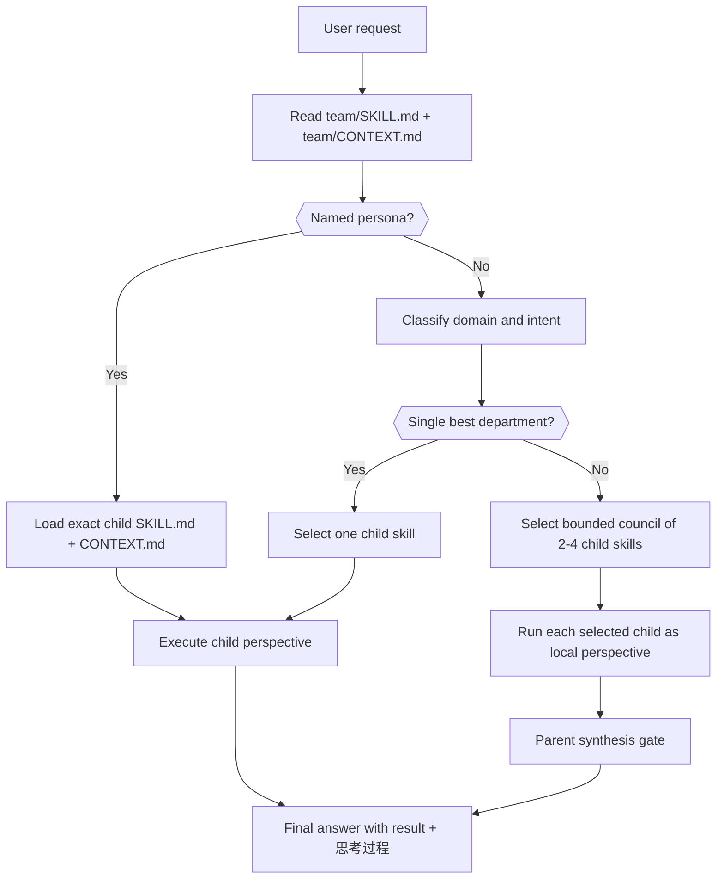
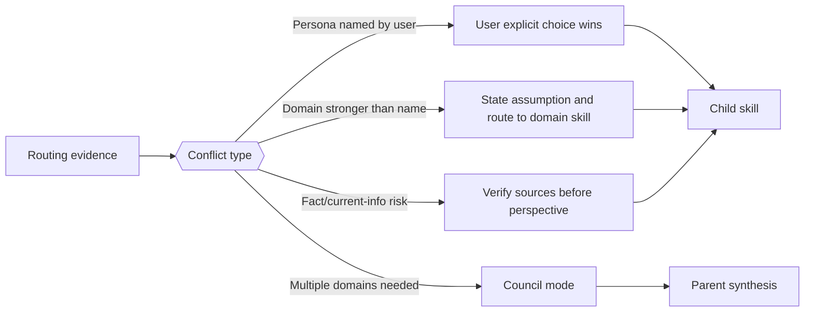
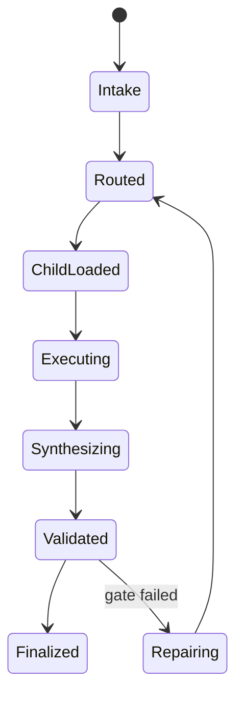

# Team Perspective Root

技能包 ID: `team`

本文件是 `.agents/skills/team/` 的根目录规范。它只治理团队视角技能树的分类、路由、加载顺序、共享输出门禁和源层修复规则；具体人物、创作者或部门视角的事实材料、心智模型、语气和工作流，仍由各子目录自己的 `SKILL.md` 与 `CONTEXT.md` 持有。

## Scope And Truth Ownership

| 层级 | 真源职责 | 不拥有的内容 |
| --- | --- | --- |
| `team/SKILL.md` | 部门 taxonomy、路由策略、加载顺序、跨子技能汇流、根因追踪和治理门槛 | 具体人物视角、研究证据、局部口吻、单人物工作流 |
| `team/CONTEXT.md` | 跨部门/跨人物的复用经验、失败类型、路由启发、根层 Playbook | 单人物案例流水、未验证的研究事实、子技能本地经验 |
| `team/<部门>/<人物>/SKILL.md` | 该人物/角色的触发条件、事实边界、心智模型、回答工作流 | 团队根 taxonomy、跨人物聚合合同 |
| `team/<部门>/<人物>/CONTEXT.md` | 该人物技能的局部启发、陷阱、修复模式 | team 根层的跨技能经验 |

根合同不得把子技能内容复制成第二真源。若共享规则需要影响多个人物技能，先落在本根合同或根 `CONTEXT.md`，再由子技能显式继承或局部特化。

## Context Loading Contract

- 每次调用本根技能时，必须同时加载同目录 `CONTEXT.md` 作为预加载上下文。
- 若同目录 `CONTEXT.md` 缺失，应先补齐最小知识库骨架，或向用户明确报告阻塞；不得在未检查该上下文的情况下执行技能。
- 若任务命中特定人物或部门子技能，必须继续加载该子技能自己的 `SKILL.md`；进入执行前再加载其同目录 `CONTEXT.md`。
- 冲突优先级：用户显式请求 > 仓库/全局 `AGENTS.md` > 本根 `SKILL.md` > 命中子技能 `SKILL.md` > 本根 `CONTEXT.md` > 命中子技能 `CONTEXT.md`。

## Trigger And Non-Goals

使用本根技能的场景：

- 用户要求“用某某视角”“导演组/编剧组/演员组怎么看”“让团队顾问会诊”等跨部门或人物视角任务。
- 用户没有指定人物，但任务明显需要在导演、编剧、演员、摄影、设计、动作、美学之间选择最合适的视角。
- 用户要求维护、审计、批量补齐或修复 `.agents/skills/team/` 下的共享规范。
- 子技能之间出现触发冲突、事实边界冲突、输出结构漂移或经验沉淀位置不清。

不使用本根技能直接替代的场景：

- 用户明确点名某个具体人物技能，且无需跨技能路由或根规范判断时，直接进入对应子技能。
- 任务只是普通事实问答、影评、百科介绍，且没有要求人物视角、创作顾问或团队诊断。
- 需要生成图片、视频、漫画或 AIGC 阶段产物时，先由对应 AIGC / media / API 技能接管，team 技能只作为创作视角 side input。

## Department Taxonomy

| department_id | 目录 | 主要问题 | 默认交付 |
| --- | --- | --- | --- |
| `director` | `导演组/` | 剧本方向、场面调度、类型策略、制作判断 | 导演诊断、分镜/调度建议、制作取舍 |
| `screenwriter` | `编剧组/` | 结构、人物、叙事、母题、改编 | 剧作诊断、结构重写方向、段落钩子 |
| `actor` | `演员组/` | 表演、角色气质、身体、镜头关系 | 表演方案、角色处理、镜头表演建议 |
| `cinematography` | `摄影组/` | 光线、镜头、色彩、质感、影像组织 | 摄影诊断、镜头/光色策略 |
| `design` | `设计组/` | 空间、服装、美术、材料、建筑/场景 | 设计诊断、视觉系统、提示词字段 |
| `action` | `武术组/` | 打戏、动作路线、身体风险、威亚/实拍 | 动作设计、拍摄安全、节奏方案 |
| `aesthetic` | `美学组/` | 整体美学、东方视觉、舞台/展览/装置 | 美学框架、视觉统合、概念校准 |

## Thinking-Action Network

## Execution Contract

### Step 1. Intake And Constraint Lock

先锁定用户真正要解决的问题：

- `task_goal`: 要诊断、改写、设计、会诊、审查还是维护规范。
- `target_object`: 剧本、分镜、角色、场景、空间、镜头、动作、项目策略或技能文件。
- `persona_signal`: 用户是否点名人物、作品、部门、风格或方法论。
- `fact_risk`: 是否涉及新近事实、具体引用、奖项、项目近况或历史争议。
- `output_shape`: 最终需要建议、改写稿、提示词、报告、表格还是源层补丁。

### Step 2. Route Decision

路由必须使用证据，而不是只凭关键词联想：

1. 用户明确点名人物时，优先进入对应人物子技能。
2. 用户只给部门时，在该部门内选择最贴合任务对象的人物技能；若无法确定，先说明选择假设。
3. 用户给创作症状时，按主问题路由：结构进编剧组，调度进导演组，表演进演员组，影像进摄影组，空间/服装/美术进设计组，打戏进武术组，整体视觉气质进美学组。
4. 需要多视角时使用 council mode，但默认只选 `2-4` 个必要视角；不得全量调度所有人物技能。
5. 事实依赖问题必须先核验再进入人物视角；不得伪造本人言论、私人记忆或未公开立场。

### Step 3. Child Skill Entry

进入子技能后：

- 先读子技能 `SKILL.md`，再读子技能同目录 `CONTEXT.md`。
- 子技能的身份、语气、事实边界、输出结构和退出角色规则由子技能自己决定。
- 根技能只提供路由和汇流，不得覆盖子技能的本地心智模型。
- 若子技能缺少 `CONTEXT.md`、`Context Loading Contract`、`governance_tier` 或 Root-Cause 合同，按根因修复流程处理，不静默绕过。

### Step 4. Council Synthesis

当多个子技能共同参与时：

- 每个子技能只输出局部观点或 patch，不生成平行总稿。
- 根技能负责合并共识、冲突和取舍，形成单一可消费结论。
- 未被调度的子技能不得被补空字段、占位段或默认观点。
- 若不同视角冲突，优先按用户目标、制作可行性、事实边界和当前任务对象裁决。

### Step 5. One-Shot Output

最终输出必须收束为一个结果，而不是过程材料堆叠。默认结构：

1. `最终建议/产物`: 用户可直接使用的诊断、改写、方案或源层补丁摘要。
2. `思考过程`: 说明为何选这些视角、关键判断依据、分支或汇流理由。
3. `关键依据`: 已加载的子技能、事实核验或文件证据。
4. `风险/例外`: 未核验事实、角色扮演边界、制作成本或不适用条件。
5. `下一步`: 仅在确有后续动作时给出。

## Root-Cause Execution Contract

当 team 技能树出现触发错配、人物视角空泛、事实越界、子技能输出漂移、经验沉淀错位或根目录规范缺失时，必须先做源层诊断，再修本地产物。

固定追踪链：

`Symptom/Failure -> Direct Technical Cause -> Rule Source -> Meta Rule Source -> Fix Landing Points`

| trace_layer | 检查对象 | 修复原则 |
| --- | --- | --- |
| Symptom/Failure | 用户指出的问题、失败输出、审计失败、路由冲突 | 先复现症状，避免只改表面文案 |
| Direct Technical Cause | 路由表、触发词、加载顺序、输出结构、事实核验缺口 | 找到直接造成失败的字段或步骤 |
| Rule Source | 本根 `SKILL.md`、本根 `CONTEXT.md`、命中子技能 `SKILL.md` / `CONTEXT.md` | 优先修正最高杠杆源层 |
| Meta Rule Source | 仓库根 `AGENTS.md`、技能组成语义、Root-Cause 学习回路、Canonical Source Governance | 若是跨技能问题，向上对齐仓库规范 |
| Fix Landing Points | 根/子 `SKILL.md`、根/子 `CONTEXT.md`、必要时 `CHANGELOG.md` 或 `reports/` | 稳定规则进 `SKILL.md`，经验进 `CONTEXT.md`，长过程外置 |

闭环要求：

- 立即修复：修正当前错误路由、输出或源文件缺口。
- 系统预防：在根或子 `CONTEXT.md` 的 Type Map / Playbook / Reusable Heuristics 中沉淀复用规则；若稳定且跨子技能，晋升到根 `SKILL.md`。
- 用户结尾：说明根因位置、立即修复、系统预防修复，并给出追踪链。

## Canonical Source Governance

共享结构只允许有一个真源：

- 部门分类、路由原则、council 汇流、跨技能沉淀规则：本根 `SKILL.md`。
- 跨人物经验、反复失败模式、路由启发：本根 `CONTEXT.md`。
- 单人物视角、事实材料、心智模型、回答工作流：子技能 `SKILL.md`。
- 单人物运行经验和修复模式：子技能 `CONTEXT.md`。

若同一规则需要改动 `2+` 个子技能，先判断是否应上收为根级共享规则；不得在多个兄弟子技能里静默复制演化。

## Field Master

| field_id | canonical_owner | purpose | quality_gate |
| --- | --- | --- | --- |
| `task_goal` | root | 判断任务是创作诊断、会诊、改写、事实核验还是源层维护 | 目标能决定输出形态 |
| `target_object` | root | 锁定剧本、分镜、角色、镜头、空间、动作或技能文件 | 对象能决定部门路由 |
| `persona_signal` | root + child | 捕捉用户点名的人物、部门、作品或风格线索 | 不误触、不漏触 |
| `department_route` | root | 选择部门与子技能候选 | 有证据和假设说明 |
| `fact_risk` | root + child | 判断是否需要检索或核验 | 不伪造事实或引用 |
| `child_contract` | child | 执行具体人物视角 | 尊重子技能边界 |
| `synthesis_result` | root | 汇流多个子技能观点 | 单一结论，冲突可解释 |
| `learning_deposition` | root + child | 决定经验沉淀位置 | 最窄有效作用域优先 |

## Thought Pass Map

| step_id | field_id | thought_action | evidence | route_out |
| --- | --- | --- | --- | --- |
| `intake-lock` | `task_goal`, `target_object` | 判断用户要解决的创作或治理问题，并锁定非目标 | 用户请求、目标文件、上下文 | 进入 `route-select` |
| `route-select` | `persona_signal`, `department_route` | 选择单人物、单部门或 council mode | 子目录 taxonomy、触发词、任务对象 | 进入 `child-load` 或 `council-plan` |
| `child-load` | `child_contract`, `fact_risk` | 加载命中子技能并检查事实风险 | 子技能 `SKILL.md` / `CONTEXT.md` | 进入 `execute-perspective` |
| `council-plan` | `department_route` | 限定必要子技能集合与汇流方式 | 用户目标、领域覆盖、冲突风险 | 进入 `execute-perspective` |
| `execute-perspective` | `child_contract` | 让子技能输出局部观点、诊断或 patch | 子技能输出、事实证据 | 进入 `synthesis-gate` |
| `synthesis-gate` | `synthesis_result` | 合并、裁决、去重并形成唯一交付口径 | 子技能局部结果、用户目标 | 进入 `final-output` 或返工 |
| `learning-close` | `learning_deposition` | 对非平凡失败或成功沉淀经验 | 修复证据、验证结果 | 更新根/子 `CONTEXT.md` |

## Pass Table

| pass_id | pass_goal | fail_code | failure_signal | rework_entry |
| --- | --- | --- | --- | --- |
| `P1-intake` | 目标和对象清楚 | `TEAM-INTAKE-MISSING` | 回答开始套人物风格，但没解决用户目标 | 回到 `intake-lock` |
| `P2-route` | 路由可解释 | `TEAM-ROUTE-DRIFT` | 只因关键词误选人物，或漏掉用户点名 | 回到 `route-select` |
| `P3-load` | 加载顺序完整 | `TEAM-CONTEXT-SKIP` | 未读根/子 `CONTEXT.md` 或忽略子技能边界 | 回到 `child-load` |
| `P4-fact` | 事实边界安全 | `TEAM-FACT-UNVERIFIED` | 编造引用、近况或本人立场 | 先核验事实，再执行子技能 |
| `P5-synthesis` | 汇流为单一结论 | `TEAM-SYNTHESIS-SPLIT` | 多个视角并排堆叠，缺少裁决 | 回到 `synthesis-gate` |
| `P6-learning` | 经验落到正确层级 | `TEAM-LEARNING-MISPLACED` | 根层经验写进子技能，或单人物经验写进根层 | 回到 `learning-close` |
