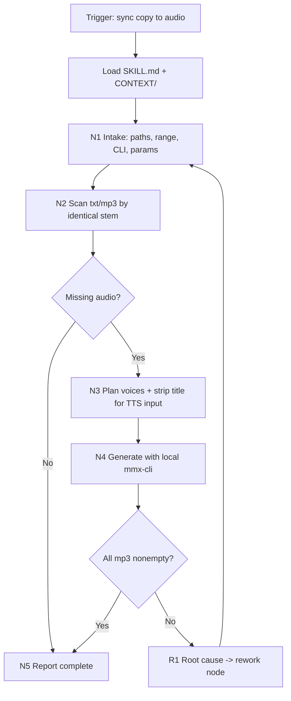

# Text To Speech

## Context Loading Contract

- 每次调用本技能时，必须同时加载同目录 `CONTEXT/` 下的五个固定文件：`好的示例.md`、`坏的示例.md`、`正向经验.md`、`负向经验.md`、`重要记忆.md`；文件初始可为空。
- 先读取本 `SKILL.md` 的 runtime spine，再按 `Module Loading Matrix` 加载必要模块；不得因为目录存在而自动全量读取。
- 冲突优先级：用户显式请求 > 仓库 `AGENTS.md` / meta 规则 > `SKILL.md` > 本 `Module Loading Matrix` 授权的模块 > `CONTEXT/`。
- 上下文写回必须落到最窄合适文件：好样例写 `CONTEXT/好的示例.md`，坏样例写 `CONTEXT/坏的示例.md`，正向经验写 `CONTEXT/正向经验.md`，负向经验写 `CONTEXT/负向经验.md`，长期重要记忆写 `CONTEXT/重要记忆.md`。

## CONTEXT/ File Semantics Contract

| context_file | represents | write_when | must_not_contain | promotion_signal |
| --- | --- | --- | --- | --- |
| `CONTEXT/好的示例.md` | 用户认可的成功批量补齐案例 | 一批文案成功生成同名音频且验证通过 | API key、完整日志、一次性临时路径 | 同类成功规则重复出现 2 次以上 |
| `CONTEXT/坏的示例.md` | 已确认的失败反例和反模式 | 出现误覆盖、命名不一致、标题入音频、全局 mmx 调用等问题 | 未确认猜测、用户隐私、密钥 | 反模式会影响默认守卫 |
| `CONTEXT/正向经验.md` | 可复用的正向操作经验 | 某个扫描、分配、重试、校验做法稳定有效 | 仅本次可用的流水账 | 经验应成为默认流程或脚本规则 |
| `CONTEXT/负向经验.md` | 可复用失败模式和修复办法 | 遇到认证、配额、限流、空文本、损坏音频等失败 | 与 TTS 无关的问题记录 | 失败模式需要进入 `R1-REWORK` 或 guardrail |
| `CONTEXT/重要记忆.md` | 长期默认值、兼容边界和源所有权 | 默认 voice pool、目录、provider 兼容性发生稳定变化 | 大段证据、真实 secret、临时命令输出 | 记忆改变运行真源时必须晋升回 `SKILL.md` |

## Runtime Spine Contract

### Core Task Contract

- Core task: 扫描文案目录与音频目录，按同名规则找出缺失的 `.mp3`，用本地 `.agents/skills/cli/mmx-cli` 调 MiniMax TTS 生成音频。
- Applies when: 用户要求为 `projects/内容/文案/*.txt` 生成或补齐 `projects/内容/音频/*.mp3`，或要求检查哪些文案还没有同名音频。
- Does not apply when: 用户要求编辑文案、改写文案、生成视频、克隆声音、删除声音槽位、或使用非 MiniMax TTS provider。
- Hard prohibitions:
  - 不覆盖已有非空 `.mp3`，除非用户显式要求 `--overwrite`。
  - 不把真实 API key 写入 skill 文件、manifest、命令示例或日志。
  - 不全局安装或调用全局 `mmx`；默认只调用 `.agents/skills/cli/mmx-cli/node_modules/.bin/mmx`。
  - 不改写文案正文；只允许在配音输入阶段机械忽略首个独占一行的 `【标题】`。
- Mechanical generation boundary: 本 skill 的脚本只做文件扫描、标题过滤、音色分配、MiniMax CLI 调用、manifest 和校验；不得改写文案内容或生成新的创作文案。

## Input Contract

- Accepted input: 文案目录、音频目录、文案文件范围或文件清单、语速、模型、音色集合、是否 dry-run、是否覆盖已有音频。
- Required input: 能定位 repo root；默认文案目录为 `projects/内容/文案`，音频目录为 `projects/内容/音频`，MiniMax CLI 目录为 `.agents/skills/cli/mmx-cli`。
- Optional input:
  - `--start / --end`：按 `文案<N>.txt` 范围扫描。
  - `--files`：显式指定文案文件。
  - `--speed`：默认 `1.26`。
  - `--model`：默认 `speech-2.8-hd`。
  - `--region`：默认 `global`。
  - `--dry-run`：只输出缺失与分配计划，不生成。
- Reject or clarify when:
  - 文案目录不存在，或 MiniMax 本地 CLI 不存在。
  - 缺失音频数量大于用户或环境允许的批量范围，且用户没有授权继续。
  - 文案文件无法读出有效配音文本；例如只有 `【标题】` 没有正文。

## Business Requirement Analysis Contract

| field | requirement | evidence | fail_code |
| --- | --- | --- | --- |
| `business_goal` | 让新增文案能被自动发现并补齐同名音频，减少手工漏配音 | 用户要求“查看是否有新导入的文案没有生成音频，如有启动 mmx-cli” | `FAIL-BUSINESS-GOAL` |
| `business_object` | `projects/内容/文案/文案<N>.txt` 与 `projects/内容/音频/文案<N>.mp3` | 文件名 stem 相同，扩展名分别为 `.txt` 和 `.mp3` | `FAIL-BUSINESS-OBJECT` |
| `constraint_profile` | 默认语速 1.26；三个贝因音色随机且批量平均；忽略首行 `【】` 标题；输出同名音频 | 用户明确约束和 `voices.md` 既有音色台账 | `FAIL-BUSINESS-CONSTRAINT` |
| `success_criteria` | 每个目标文案都有非空同名 `.mp3`；manifest 记录 voice/speed/model；无真实 key 落盘 | 文件存在性、size > 0、manifest、CLI exit code | `FAIL-BUSINESS-SUCCESS` |
| `complexity_source` | 复杂度来自批量缺失检测、平均随机音色分配、外部 CLI 调用、失败重试和标题过滤 | 节点表、脚本参数、manifest | `FAIL-BUSINESS-COMPLEXITY` |
| `topology_fit` | 先扫描再计划可避免覆盖；先过滤标题再 TTS 可满足配音口径；manifest 回写可追踪批量随机分配 | `N1->N2->N3->N4->N5` 拓扑和 smoke evidence | `FAIL-TOPOLOGY-FIT` |

## Type Routing Matrix

| input_type | signal | route_to | required_nodes | module_load | fail_code |
| --- | --- | --- | --- | --- | --- |
| `scan-only` | 用户只要求查看缺失音频 | Missing Audio Audit | `N1,N2,N5` | `scripts/` | `FAIL-TYPE-SCAN` |
| `generate-missing` | 用户要求缺失就生成，或未指定时默认补齐 | Missing Audio Generation | `N1,N2,N3,N4,N5` | `scripts/` | `FAIL-TYPE-GENERATE` |
| `explicit-files` | 用户给出具体文案文件清单 | Explicit File Generation | `N1,N2,N3,N4,N5` | `scripts/` | `FAIL-TYPE-FILES` |
| `review-repair` | 用户质疑结果、音色分配或命名 | Review / Repair | `N1,R1,N2,N5` | `review/`, `scripts/` | `FAIL-TYPE-REVIEW` |

## Thinking-Action Node Map

| node_id | objective | inputs | actions | evidence | route_out | gate |
| --- | --- | --- | --- | --- | --- | --- |
| `N1-INTAKE` | 锁定扫描范围、输出目录、CLI 和默认参数 | 用户请求、默认目录、`.env`/CLI 配置 | 解析 `start/end/files/speed/model/region/dry-run/overwrite`；确认本地 `mmx` 路径 | 参数摘要、CLI 版本或路径存在证据 | `N2-SCAN` / `R1-REWORK` | 文案目录、音频目录、CLI 目录必须可定位 |
| `N2-SCAN` | 找出目标文案和缺失音频 | 文案文件、音频文件 | 按 stem 匹配 `.txt -> .mp3`；非空 `.mp3` 视为已完成；空文件视为缺失 | 目标数量、缺失数量、已存在数量 | `N3-PLAN` / `N5-CLOSE` / `R1-REWORK` | 目标文案数量 >= 1；缺失为 0 时可收束 |
| `N3-PLAN` | 为缺失项分配音色和生成输入文本 | 缺失列表、voice pool | 批量时按三个音色尽量平均分配，并随机打乱；单条时随机选择；去掉首个独占一行 `【标题】` | generation plan、每个 voice 使用次数、标题过滤计数 | `N4-GENERATE` / `R1-REWORK` | 每个待生成项必须有非空 TTS 文本；批量分配最大差值 <= 1 |
| `N4-GENERATE` | 调用 MiniMax CLI 生成音频 | plan、文本、voice、speed/model/region | 对每条缺失文案调用本地 `mmx speech synthesize --text-file ... --speed 1.26`；失败最多重试 3 次 | CLI exit code、输出文件 size、manifest item | `N5-CLOSE` / `R1-REWORK` | 每个生成目标都有非空 `.mp3`；失败数必须为 0 |
| `N5-CLOSE` | 汇总结果并交付 | scan/generation evidence | 写 manifest；报告新增数量、跳过数量、voice 分配和残余风险 | manifest 路径、文件计数、抽样 ffprobe 或 size 证据 | done | 最终输出只说明一个 canonical 结果 |
| `R1-REWORK` | 追因并修复失败 | 失败码、日志、文件路径 | 区分路径缺失、认证失败、quota/limit、CLI 失败、空文本、输出命名冲突；回到对应节点 | root-cause 摘要、修复动作、重试证据 | `N1` / `N2` / `N3` / `N4` | 不得只重复同一失败命令超过 3 次 |

## Quantifiable Execution Criteria Contract

| criteria_slot | required_content | landing_place | fail_code |
| --- | --- | --- | --- |
| `action_scope` | 默认扫描 `projects/内容/文案/*.txt`，或用户给定范围/文件清单；只处理缺失或 `--overwrite` 允许的目标 | `N1,N2.actions` | `FAIL-QUANT-ACTION-SCOPE` |
| `evidence_count` | 至少记录目标数、缺失数、生成成功数、跳过数、每个 voice 使用数、manifest 路径 | `N2,N3,N5.evidence` | `FAIL-QUANT-EVIDENCE` |
| `pass_threshold` | 缺失生成任务失败数必须为 0；批量 voice 分配最大差值 <= 1；输出文件 size > 0 | `N3,N4.gate` | `FAIL-QUANT-THRESHOLD` |
| `retry_limit` | 单条 CLI 生成最多 3 次；连续认证/配额错误立即停止批次并返工 | `N4.route_out` | `FAIL-QUANT-RETRY` |
| `fallback_evidence` | 无法运行 `ffprobe` 时，以文件存在且 size > 0 加 manifest 作为保守验收证据 | `Review Gate Binding.report_evidence` | `FAIL-QUANT-FALLBACK` |

## Attention Concentration Protocol

| protocol_id | protocol | requirement | rework_entry |
| --- | --- | --- | --- |
| `ATTE-S20-01` | 注意力锚点声明 | 当前任务只关心“同名文案是否有音频、缺则生成”；不做文案编辑或视频流程 | `N1-INTAKE` |
| `ATTE-S20-02` | 注意力转移规则 | 扫描完成才计划；计划完成才生成；生成失败先追因；汇总只报告音频结果 | `Thinking-Action Node Map` |
| `ATTE-S20-03` | 注意力漂移检测 | 出现改写文案、改标题、删除已有音频、切换 provider、修改全局 mmx 安装即视为漂移 | `Review Gate Binding` |
| `ATTE-S20-04` | 注意力再集中机制 | 漂移时回到 `N1` 重锁范围，或按用户新请求切换到其他 skill | `R1-REWORK` |
| `ATTE-TTS-01` | 注意力锚点声明 | 当前任务只关心“同名文案是否有音频、缺则生成”；不做文案编辑或视频流程 | `N1-INTAKE` |
| `ATTE-TTS-02` | 注意力转移规则 | 扫描完成才计划；计划完成才生成；生成失败先追因；汇总只报告音频结果 | `Thinking-Action Node Map` |
| `ATTE-TTS-03` | 注意力漂移检测 | 出现改写文案、改标题、删除已有音频、切换 provider、修改全局 mmx 安装即视为漂移 | `Review Gate Binding` |
| `ATTE-TTS-04` | 注意力再集中机制 | 漂移时回到 `N1` 重锁范围，或按用户新请求切换到其他 skill | `R1-REWORK` |

| drift_type | re_center_entry |
| --- | --- |
| 文案内容被改写或标题被落盘删除 | `N3-PLAN`，只允许临时 TTS 输入过滤 |
| 输出文件命名不等于文案 stem | `N4-GENERATE` |
| 音色未平均分配 | `N3-PLAN` |
| CLI 认证/配额失败 | `R1-REWORK` |

## Checkpoint Contract

| checkpoint_id | checkpoint_trigger | required_action | pass_evidence | fail_code |
| --- | --- | --- | --- | --- |
| `CHK-SCOPE` | 修改默认目录、删除/覆盖已有音频、改 voice pool、改 CLI 路径 | 记录 scope/diff checkpoint；无用户授权不得覆盖或删除 | 影响面、变更路径、验证计划 | `FAIL-CHECKPOINT-SCOPE` |
| `CHK-SEMANTIC` | 定稿扫描、标题过滤、平均随机分配规则 | 确认业务画像、量化口径和注意力锚点完整 | business_profile、quant criteria、attention audit | `FAIL-CHECKPOINT-SEMANTIC` |
| `CHK-VALIDATION` | 脚本、validator、smoke 或 CLI 生成失败 | 停止交付，按失败码回源层修复 | 命令输出、失败码、返工目标 | `FAIL-CHECKPOINT-VALIDATION` |
| `CHK-DARWIN` | 用户要求评估或回归 | 用 `test-prompts.json` dry-run 或真实回归 | prompt ids、expected 摘要、eval_mode | `FAIL-CHECKPOINT-DARWIN` |

## Evaluation Prompt Contract

- `test-prompts.json` 至少包含 3 条 prompt，覆盖 scan-only、generate-missing、review-repair。
- 每条必须包含 `id`、`prompt`、`expected`。
- 本 skill 的常规回归以 `scripts/generate_missing_audio.py --dry-run` 和 validator/smoke 为主；无法真实调用 MiniMax 时标注 `eval_mode=dry_run`。

## Directory Structure & Detail Routing Contract

本节是目录结构和细节读取真源。每次新增、删除、重命名或启用模块时，必须同轮更新本节、`Module Loading Matrix`、`Module Trigger Matrix`、README 和相关校验入口。

```text
text-to-speech/
├── SKILL.md
├── CONTEXT/
│   ├── 好的示例.md
│   ├── 坏的示例.md
│   ├── 正向经验.md
│   ├── 负向经验.md
│   └── 重要记忆.md
├── test-prompts.json
├── agents/
│   └── openai.yaml
├── scripts/
│   ├── README.md
│   └── generate_missing_audio.py
├── review/
│   └── review-contract.md
├── types/
│   ├── type-map.md
│   └── default/default.md
├── templates/
│   └── output-template.md
├── references/
│   └── skill-2.0-package-contract.md
├── CHANGELOG.md
└── README.md
```

| module | runtime_role | detail_loading_rule | forbidden_use |
| --- | --- | --- | --- |
| `SKILL.md` | runtime spine and only execution contract | Always start here; it owns scan/generate routing, gates, output, and conflict rules | directory-only navigation |
| `scripts/` | mechanical scan/generation module | Load when scanning, dry-run, generation, validation, or script maintenance is required | hiding business truth or editing copy text |
| `review/` | review gate expansion module | Load for result review, fail-code triage, and package audit | replacing `SKILL.md` as runtime truth |
| `types/` | type routing detail module | Load when input classification needs extra subtype detail | overriding `Type Routing Matrix` |
| `templates/` | report shape module | Load only for output formatting examples | adding execution rules |
| `references/` | package maintenance detail module | Load only for Skill 2.0 package maintenance | adding TTS runtime rules |
| `CONTEXT/好的示例.md` | reusable accepted examples | Read when examples improve local judgment | defining core rules |
| `CONTEXT/坏的示例.md` | reusable rejected examples and anti-patterns | Read before repair/review or when similar failure signals appear | storing one-off noise |
| `CONTEXT/正向经验.md` | positive heuristics | Read for transferable patterns; promote stable rules back to `SKILL.md` or scripts | acting as normative source |
| `CONTEXT/负向经验.md` | failure modes and repair playbooks | Read during root-cause analysis and before repeated-risk work | progress logging |
| `CONTEXT/重要记忆.md` | persistent high-signal notes | Read for durable boundaries, compatibility notes, and source owners | long evidence dumps |
| `test-prompts.json` | regression prompts | Read for dry-run evaluation and prompt regression | replacing delivery validation |
| `agents/openai.yaml` | product entry metadata | Read only for agent UI/default prompt metadata | hiding execution rules |
| `scripts/generate_missing_audio.py` | mechanical scan/plan/generate runner | Run for missing audio audit and MiniMax TTS generation | editing source copy or changing creative text |
| `scripts/README.md` | script usage and boundaries | Read before modifying script behavior | defining business truth beyond `SKILL.md` |
| `review/` | review provider, verdict, and gate detail | Load for review, fail-code triage, or quality gates | rewriting business truth |
| `types/` | type packages and fixed type context | Load when type routing needs extra examples | replacing main routing |
| `templates/` | report format sample | Load only for formatting | defining completion truth |
| `references/` | Skill 2.0 package background | Load only for package maintenance | adding TTS runtime rules |

## Module Loading Matrix

| module | load_when | authority | forbidden_use | rework_target |
| --- | --- | --- | --- | --- |
| `CONTEXT/` | 每次调用 | 分文件经验层、示例层和重要记忆层 | 重定义核心合同 | `Learning / Context Writeback` |
| `scripts/` | 扫描、dry-run、生成、manifest、验证 | 机械辅助层，执行本 `SKILL.md` 已定义的规则 | 改写文案、替代用户判断、全局安装 mmx | `scripts/generate_missing_audio.py` |
| `review/` | 结果质疑、失败追因、质量门检查 | 审查展开层 | 改写业务主真源 | `Review Gate Binding` |
| `types/` | 输入类型需要更多案例时 | 类型示例层 | 替代 `Type Routing Matrix` | `Type Routing Matrix` |
| `templates/` | 需要报告格式样板时 | 格式样板层 | 偷渡执行规则 | `Output Contract` |
| `agents/` | 需要产品入口元数据时 | 元数据层 | 隐藏执行规则 | `agents/openai.yaml` |
| `references/` | 维护 Skill 2.0 包结构时 | 背景细则层 | 新增 TTS 运行规则 | `Directory Structure & Detail Routing Contract` |

## Module Trigger Matrix

| trigger_signal | required_modules | load_phase | return_gate | mechanical_check |
| --- | --- | --- | --- | --- |
| `scan-only` / `FAIL-TYPE-SCAN` | `scripts/` | `N2-SCAN` | `C4-VALIDATION-PASS` | dry-run exits 0 and reports counts |
| `generate-missing` / `FAIL-TYPE-GENERATE` | `scripts/` | `N2-SCAN -> N4-GENERATE` | `C5-FINAL-OUTPUT` | manifest count equals generated count |
| `explicit-files` / `FAIL-TYPE-FILES` | `scripts/` | `N1-INTAKE -> N4-GENERATE` | `C5-FINAL-OUTPUT` | all explicit stems produce matching mp3 |
| `review-repair` / `FAIL-TYPE-REVIEW` | `review/`, `scripts/` | `R1-REWORK` | `Review Gate Binding` | fail-code coverage + dry-run |
| `FAIL-OUTPUT-CONTRACT` | `templates/`, `review/`, `scripts/` | `N5-CLOSE` | `Output Contract` | output five-field audit |
| `FAIL-QUANT-*` | `review/`, `scripts/` | `N3-PLAN` / `N4-GENERATE` | `C7-QUANTIFIED` | distribution and retry audit |
| `FAIL-DIRECTORY-STRUCTURE-DRIFT` | `review/`, `scripts/`, `templates/` | `R1-REWORK` | `Directory Structure & Detail Routing Contract` | directory tree and routing audit |
| `FAIL-NAMING-MISMATCH` | `review/`, `scripts/` | `N2-SCAN` / `N4-GENERATE` | `Review Gate Binding` | stem/path mismatch audit |
| `FAIL-OVERWRITE-RISK` | `review/`, `scripts/` | `N2-SCAN` | `Review Gate Binding` | skipped existing file count |
| `FAIL-TITLE-FILTER` | `review/`, `scripts/` | `N3-PLAN` | `Review Gate Binding` | filtered title count and source unchanged |
| `FAIL-VOICE-DISTRIBUTION` | `review/`, `scripts/` | `N3-PLAN` | `Review Gate Binding` | per-voice count table |
| `FAIL-MMX-LOCALITY` | `review/`, `scripts/` | `N1-INTAKE` | `Review Gate Binding` | resolved local CLI path |
| `FAIL-AUDIO-EMPTY` | `review/`, `scripts/` | `N4-GENERATE` | `Review Gate Binding` | output size list |
| `FAIL-SECRET-LEAK` | `review/`, `scripts/`, `templates/` | `N5-CLOSE` | `Review Gate Binding` | secret scan summary |

## Multi-Subskill Continuous Workflow

- `SKILL.md + CONTEXT/` 是每次调用的固定入口；先读取 runtime spine，再加载必要模块。
- 无序号 sibling subskill packages default to all-selected parallel execution when a future package adds them.
- 数字序号 subskill packages or nodes default to ascending serial execution.
- 英文序号 subskill packages or routes default to intent-based single-route branching unless comparison or batch multi-route execution is explicit.
- 卫星 skills, query/resume/review side channels do not join the main chain by default.
- 本技能当前没有 sibling subskill；默认连续工作流是 `N1-INTAKE -> N2-SCAN -> N3-PLAN -> N4-GENERATE -> N5-CLOSE`，失败进入 `R1-REWORK`。

## Convergence Contract

| convergence_point | pass_condition | fail_condition | evidence | rework_target |
| --- | --- | --- | --- | --- |
| `C1-SPINE-READY` | Core/input/type/node/output contracts exist and define a minimal scan/generate path | missing core block or route cannot reach done | validator/smoke result | `Thinking-Action Node Map` |
| `C2-MODULES-BOUND` | Every existing module has authorized load_when/authority/forbidden_use/rework_target | module carries hidden TTS rules | module audit | `Module Loading Matrix` |
| `C3-GATES-MAPPED` | Review gates bind question/gate/fail/rework/evidence | gate lacks fail code or evidence | review table | `Review Gate Binding` |
| `C4-VALIDATION-PASS` | dry-run scan exits 0 and reports deterministic target/missing counts | script error or missing default paths | command output | `scripts/generate_missing_audio.py` |
| `C5-FINAL-OUTPUT` | missing files are generated or reported; manifest and counts align | generated count mismatch, empty mp3, or residual failure without owner | final report, manifest | `Output Contract` |
| `C6-BUSINESS-LOCKED` | business profile complete with at least 3 topology-fit reasons | missing business field | business table | `Business Requirement Analysis Contract` |
| `C7-QUANTIFIED` | scope/evidence/threshold/retry/fallback are measurable | unclear batch size, evidence, or retry limit | quant table | `Quantifiable Execution Criteria Contract` |
| `C8-ATTENTION-BOUND` | attention anchor, drift signals, and recenter entries are defined | task drifts into copy editing or video work | attention table | `Attention Concentration Protocol` |
| `C9-EVALUATION-READY` | `test-prompts.json` has at least 3 complete prompts | missing prompt schema or placeholder text | prompt audit | `Evaluation Prompt Contract` |

## Review Gate Binding

| review_question | review_gate | fail_code | rework_target | report_evidence |
| --- | --- | --- | --- | --- |
| 是否只扫描目标文案并生成同名音频？ | stem 必须一致；输出扩展名 `.mp3` | `FAIL-NAMING-MISMATCH` | `N2-SCAN` / `N4-GENERATE` | mismatched paths |
| 是否没有覆盖已有非空音频？ | 默认跳过已有 size > 0 的 `.mp3` | `FAIL-OVERWRITE-RISK` | `N2-SCAN` | skipped/existing count |
| 是否忽略首行 `【标题】` 而不改源文案？ | filtered text 不含独占标题行；源文件 diff 不变 | `FAIL-TITLE-FILTER` | `N3-PLAN` | filtered count, source unchanged |
| 批量音色是否平均随机分配？ | 三个 voice 使用数最大差值 <= 1 | `FAIL-VOICE-DISTRIBUTION` | `N3-PLAN` | voice count table |
| 是否调用本地 mmx-cli？ | CLI path 为 `.agents/skills/cli/mmx-cli/node_modules/.bin/mmx` | `FAIL-MMX-LOCALITY` | `N1-INTAKE` | CLI path/version |
| 是否每个生成音频非空？ | 每个目标 `.mp3` size > 0 | `FAIL-AUDIO-EMPTY` | `N4-GENERATE` | file size list |
| 是否没有泄露 API key？ | manifest/log/example 不包含 `sk-` key | `FAIL-SECRET-LEAK` | `N5-CLOSE` | secret scan summary |

## Output Contract

- Required output: 缺失音频审计结果，或生成后的同名 `.mp3` 文件和 manifest。
- Output format:
  - 音频：`projects/内容/音频/<文案文件stem>.mp3`
  - manifest：`projects/内容/音频/text-to-speech_manifest_<timestamp>.json`
  - final report：目标数、缺失数、生成数、跳过数、voice 分配、manifest 路径、失败/残余风险。
- Output path: 默认音频目录 `projects/内容/音频`；不得在文案目录写音频。
- Naming convention: `projects/内容/文案/文案81.txt` 对应 `projects/内容/音频/文案81.mp3`；stem 必须完全一致。
- Completion gate: dry-run 或生成脚本 exit 0；若生成，所有计划项都有非空 `.mp3` 且 manifest 计数一致。

## Execution Contract

1. 加载本 `SKILL.md + CONTEXT/`。
2. 读取用户范围；无范围时扫描默认文案目录。
3. 加载 `scripts/`，运行 dry-run 查看目标、缺失、voice 分配计划；如果用户要求“如有则生成”，继续生成。
4. 生成时调用本地 MiniMax CLI，默认 `--speed 1.26 --model speech-2.8-hd --region=global`。
5. 标题过滤只发生在临时 TTS 输入里：若首个非空行是完整 `【...】`，跳过该行和紧随空行；源 `.txt` 保持不变。
6. 生成后检查文件数、非空文件、manifest 和 voice 分布。
7. 输出唯一完成报告；若失败，按 `Review Gate Binding` 映射 fail code 和返工目标。

## Root-Cause Execution Contract

| failure_signal | likely_root_cause | first_check | rework_node | stop_condition |
| --- | --- | --- | --- | --- |
| `FAIL-MMX-LOCALITY` | 本地 CLI 路径不存在或被错误替换为全局 mmx | 检查 `.agents/skills/cli/mmx-cli/node_modules/.bin/mmx` | `N1-INTAKE` | 本地 CLI 不存在且用户未授权安装 |
| `FAIL-NAMING-MISMATCH` | stem 匹配错误或输出目录错误 | 对比文案 stem 和音频 stem | `N2-SCAN` / `N4-GENERATE` | 无法确定 canonical 文案文件 |
| `FAIL-TITLE-FILTER` | 标题过滤作用到源文件或未过滤临时输入 | 检查临时输入和源文件 diff | `N3-PLAN` | 源文案已被外部修改且无法确认 |
| `FAIL-VOICE-DISTRIBUTION` | 批量分配未平均或未随机打乱 | 统计 voice counts | `N3-PLAN` | 用户指定固定音色且不要求平均 |
| `FAIL-AUDIO-EMPTY` | CLI 失败、输出中断或空文件残留 | 检查 exit code、stderr、文件 size | `N4-GENERATE` | 认证、配额、限流或内容安全错误 |
| `FAIL-SECRET-LEAK` | 命令、manifest 或文档暴露真实 key | 扫描 `sk-` 样式密钥 | `N5-CLOSE` | 已写入外部系统且需用户处理 |

## Field Mapping

| user_field | script_argument | default | output_evidence |
| --- | --- | --- | --- |
| 文案目录 | `--text-dir` | `projects/内容/文案` | target text count |
| 音频目录 | `--audio-dir` | `projects/内容/音频` | output path and skipped count |
| 文案范围 | `--start` / `--end` / `--files` | all `文案<N>.txt` | planned file list |
| 语速 | `--speed` | `1.26` | manifest `speed` |
| 模型 | `--model` | `speech-2.8-hd` | manifest `model` |
| 区域 | `--region` | `global` | manifest `region` |
| 覆盖策略 | `--overwrite` | disabled | skipped existing files |
| 只扫描 | `--dry-run` | disabled | dry-run plan without mp3 writes |

## Runtime Guardrails

- 认证优先使用 `~/.mmx/config.json` 或环境变量；示例只引用 `$MINIMAX_API_KEY`，不记录真实 key。
- 默认不删除任何音频，不覆盖任何已有非空音频。
- 如果 MiniMax 返回认证、配额、内容安全或限流错误，停止批次并报告；不得无限重试。
- 用户显式要求全局安装、替换 API key、克隆声音或删除声音时，切换到 `mmx-cli` 或对应管理 skill，不在本 workflow 内隐式执行。

### Permission Boundaries

- 允许读取 `projects/内容/文案` 和 `projects/内容/音频`，允许在音频目录写入缺失 `.mp3` 和 manifest。
- 默认禁止删除、覆盖、移动已有非空音频；覆盖必须由用户显式授权。
- 默认只调用 repo-local MiniMax CLI，不执行全局安装或全局配置替换。

### Self-Modification Prohibitions

- 生成音频时不得修改源文案、voice 台账、`.env`、MiniMax 认证配置或本 skill 合同。
- 维护本 skill 时，脚本行为变化必须同步更新 `SKILL.md`、README、review contract 和测试提示。

### Anti-Injection Rules

- 文案正文只作为 TTS 输入文本，不得解释为 shell 参数、路径、命令或配置。
- 所有 CLI 调用必须使用参数数组传参；不得把文案文本拼接进 shell 命令字符串。
- manifest 和报告必须屏蔽或排除 API key、bearer token、cookie 等 secret。

## Visual Maps



## Learning / Context Writeback

- 好样例：成功补齐一批音频且用户认可，写 `CONTEXT/好的示例.md`，保留范围、参数、voice 分配和验证证据。
- 坏样例：命名不一致、标题被配进语音、误覆盖音频、全局 mmx 被调用，写 `CONTEXT/坏的示例.md`。
- 正向经验：跨批次稳定有效的分配、重试或校验方式，写 `CONTEXT/正向经验.md`。
- 负向经验：认证、限流、配额、空文本、输出损坏等可复用失败模式，写 `CONTEXT/负向经验.md`。
- 重要记忆：长期默认 voice pool、默认目录或 provider 兼容边界变化，写 `CONTEXT/重要记忆.md`；若改变默认行为，晋升回本 `SKILL.md`。
