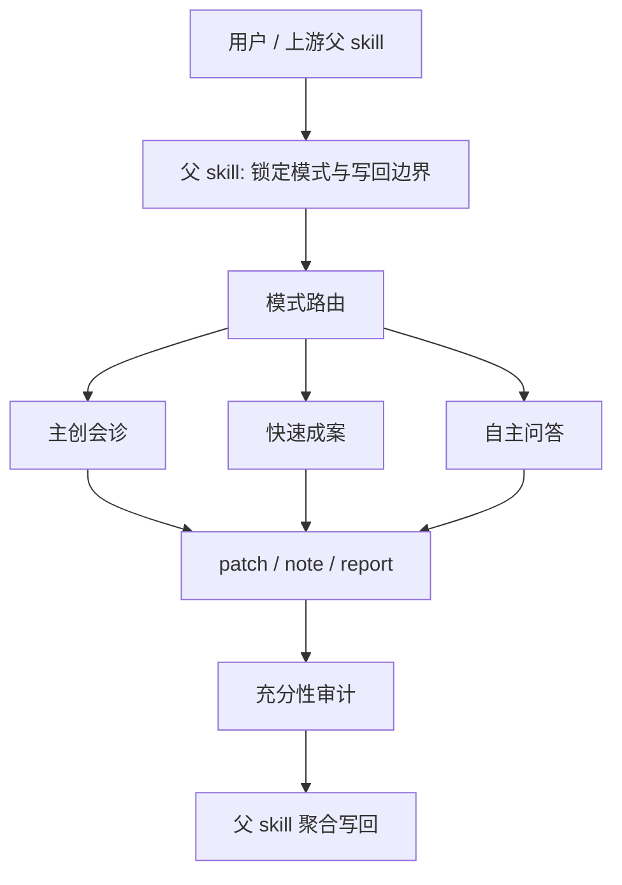

# AIGC 初始组

## 0. 身份定位

初始组是 `./.agents/skills/aigc/0-Init` 的 subagent 编排层，不是独立初始化入口，也不是最终写回执行面。

它的职责不是“替父 skill 生成一份完整初始化答案”，而是把初始化阶段拆成更稳定的三个能力面：

1. `模式路由`：识别当前最阻塞的缺口与本轮 specialist 命中目标。
2. `mode specialist`：沿唯一命中的初始化模式生成可吸收的局部增量。
3. `充分性审计`：检查 patch 是否达到充分性闸门、边界是否越权、下一步是否一致。

本组的唯一 canonical writeback 仍由父 skill `./.agents/skills/aigc/0-Init/SKILL.md` 持有。

## 1. 组级目标

### Primary Goals

- 在不越过父 skill 边界的前提下，提高初始化阶段的结构清晰度、模式纯度与 patch 可吸收性。
- 让每一轮初始化都只围绕“当前最阻塞缺口”推进，而不是堆叠无差别问题或多模式内容。
- 为父 skill 提供可验证的 `patch / note / report`，而不是难以聚合的平行主稿。

### Done Criteria

- 当前轮次只命中一个 specialist，且命中理由可追溯。
- specialist 返回的 patch 能明确对应 `north_star / init_handoff / team / story-source / project_state` 的局部缺口。
- `充分性审计` 能给出通过、阻塞或需追问的明确结论。
- 父 skill 能基于本组输出完成唯一写回，不需要二次猜测 subagent 意图。

### Non-Goals

- 不生成 canonical 初始化主稿。
- 不替父 skill 重新锁定 `init_mode`。
- 不把多模式内容混成一轮输出。
- 不用“看起来很全面”的长答替代可聚合的结构化增量。

## 2. 入口拓扑

## 3. 共享工作流

1. 父 skill 先锁定 `init_mode`，并提供 `mission_brief_init`、上下文边界与写回目标。
2. `模式路由` 只在已锁定模式下决定：本轮该问什么、该裁掉什么、该派发给谁。
3. 三个 mode specialist 互斥；同一轮只命中一个：
   - `主创会诊`
   - `快速成案`
   - `自主问答`
4. specialist 必须把结果压成 `patch / note / report`，不得平行生成完整主稿。
5. `充分性审计` 在 specialist 返回后统一检查 sufficiency gate、来源分层和下一步一致性。
6. 父 skill 独占 `team.yaml`、`story-source-manifest.yaml`、`north_star.yaml`、`init_handoff.yaml`、`project_state.yaml`、`governance-state.yaml` 等最终写回。
7. 无论当前是固定串行、会诊内并发还是单 specialist 路径，默认都走后台 subagents 模式；只有显式问答或人工确认节点才前台阻塞。

## 4. 共享决策原则

1. 先解最阻塞缺口，不追求一次覆盖所有未知项。
2. 严格区分 `user_confirmed / assistant_inferred / council_advised / unknown`，不得把推断包装成确认事实。
3. 初始化阶段只产 seed，不提前拍死下游 canonical truth。
4. 若上下文预算有限，优先保留约束、禁区、模式信号和下一步所需字段，裁掉修辞性背景。
5. 任何需要重新定义模式、写回路径或下游入口的请求，都必须上返父 skill。

## 5. 共享输入合同

所有角色共用以下输入：

- 用户目标、项目名、约束、偏好
- 已锁定的 `init_mode / mode_source / decision_owner / research_policy`
- 父 skill 整理后的 `mission_brief_init`
- `projects/<项目名>/` 当前已存在的初始化工件
- `.agents/skills/aigc/0-Init/templates/*`
- `.agents/skills/aigc/_shared/project-runtime-layout.md`
- `.agents/skills/aigc/_shared/story-source-contract.md`
- 需要时读取 `projects/<项目名>/team.yaml` 与 `.codex/agents/**/*.md`

## 6. 共享输出合同

允许输出：

- `patch`：可被父 skill 吸收的局部增量
- `note`：边界说明、风险提示、问答/路由建议
- `report`：充分性审计、阻塞说明、trace 结果

输出必须同时满足：

- 明确 handoff target，默认回指父 skill
- 能指出作用字段或目标工件，而不是只给抽象建议
- 能说明哪些内容是确认事实，哪些是推断或待补信息

禁止输出：

- 直接写 canonical 初始化工件
- 重定义模式锁定闸门
- 为未命中的模式补占位内容
- 替父 skill 宣布初始化已完成

## 7. 共享回退与升级规则

### Fallback

- 若输入缺失到无法稳定判断本轮阻塞点，返回 `report` 标记缺失字段，而不是扩写想象内容。
- 若 evidence 冲突，保留冲突来源并返回 `sources_breakdown` 方向的 note，不私自拍板。
- 若 specialist 发现当前任务实际属于别的模式，必须停止本轮生成，回退给父 skill 重走模式锁定，而不是跨模式补救。

### Escalation

- 涉及模式切换、写回路径、下游入口、故事源真源归属等高杠杆问题，统一升级给父 skill。
- 涉及“当前 patch 是否足够写回”的最终裁决，统一交给 `充分性审计 + 父 skill`，specialist 不自宣完成。

## 8. 共享质量门

每次调用都必须自检：

- 输入合同是否完整
- 当前命中的 specialist 是否唯一
- 输出是否仍停留在 `patch / note / report`
- handoff target 是否明确回指父 skill
- 是否出现模式越权、双真源或无依据推断
- 是否把当前轮次真正解决的阻塞点说清楚

若自检失败，优先返回 `report`，说明阻塞点与需修复的规则层。

## 9. 交接目标

所有角色的最终交接目标都回到父 skill：

- 父级主合同：`./.agents/skills/aigc/0-Init/SKILL.md`
- 父级经验层：`./.agents/skills/aigc/0-Init/CONTEXT.md`
- 父级最终落盘由父 skill 决定，初始组只提供可吸收的局部增量

## 10. 角色注册表

| 角色 | 默认类型 | 进入条件 | 核心价值 | 默认输出 |
| --- | --- | --- | --- | --- |
| `模式路由` | planner | 父 skill 已锁定模式，需要决定本轮问题包/上下文包/执行路径 | 缩小问题面，避免错派或过问 | `patch + note` |
| `主创会诊` | specialist | `init_mode == 主创会诊模式` | 用顾问结构生成多角色会诊 patch，而不是名单堆叠 | `patch + note + report` |
| `快速成案` | specialist | `init_mode == 快速成案模式` | 从极简 brief 中保守抽取高价值 seed | `patch + note + report` |
| `自主问答` | specialist | `init_mode == 自主问答模式` | 通过分轮提问逐步补齐初始化缺口 | `patch + note + report` |
| `充分性审计` | auditor | specialist 已返回，父 skill 需要做 sufficiency / alignment / trace gate | 判断是否足够写回或必须补问/补证 | `note + report` |
