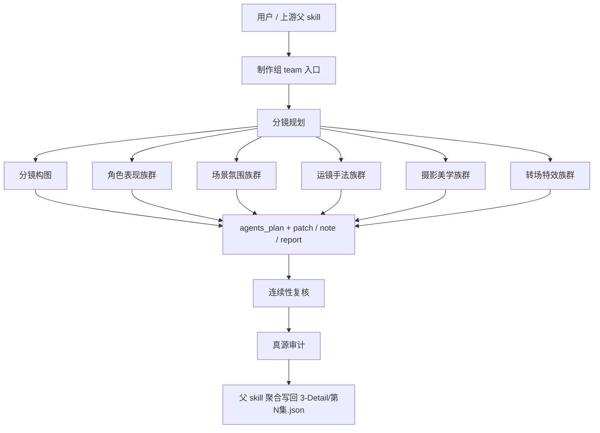

# AIGC 制作组

## 0. 目的

制作组是 `./.agents/skills/aigc/3-Detail` 的 subagents 编排面，负责把组级导演意图拆成 shot-level 的专门角色工作面，让父 skill 能聚合 `agents_plan + patch / note / report`，但不拥有最终写回权。

本组的唯一 canonical writeback 仍由父 skill `./.agents/skills/aigc/3-Detail/SKILL.md` 持有。

## 1. 入口拓扑

### 默认路由

1. 父 skill 先判断本轮命中的 `组ID / 分镜ID` 与是否需要 bootstrap。
2. `分镜规划` 先把当前组拆成稳定的 shot skeleton。
3. 专业角色按 tranche 并行提供字段 patch：
   - `分镜构图`
   - `角色表现` 族群
   - `场景氛围` 族群
   - `运镜手法` 族群
   - `摄影美学` 族群
   - `转场特效` 族群
4. `叙事派` 是默认运镜主路由；`炫技派` 只有在显式需要时作为挑战者参与。
5. `连续性复核` 与 `真源审计` 在合成 draft 后介入，负责 veto / rework，而不是重写业务字段。
6. 单点直达时，只命中对应角色，不补空路径。
7. 无论当前是 tranche 串并混合还是单点直达，默认都走后台 subagents 模式；只有显式组/镜共创或前台补料节点才阻塞父 skill。

## 2. 共享输入合同

所有角色共用以下输入：

- 用户目标、项目名、当前集数、约束、偏好
- `projects/<项目名>/0-Init/north_star.yaml`
- `projects/<项目名>/0-Init/init_handoff.yaml`
- `projects/<项目名>/0-Init/story-source-manifest.yaml`（若存在）
- `projects/<项目名>/1-Planning/3-分组/第N集.md`
- `projects/<项目名>/1-Planning/3-分组/执行报告.md`（若存在）
- `projects/<项目名>/2-Global/全局风格.md`
- `projects/<项目名>/2-Global/类型指导.md`
- `projects/<项目名>/2-Global/导演意图.md`
- `projects/<项目名>/3-Detail/第N集.json`（若已存在）

### 共享记忆与假设边界

- 共享提示真源：`./.codex/agents/aigc/制作组/_shared/PROMPT_STABILITY_CONTRACT.md`
- 所有角色都只允许基于当前轮显式提供的真源与当前合同回指的上游文件工作。
- 未在输入中确认的剧情、空间、动作、设计锚点默认视为未证实，不得静默脑补。
- 会影响镜序、锁轴、主叙事任务或字段归属的缺口，一律不得用最小假设越过，必须升级为 `report`。

## 2.1 共享提示工程合同

所有命中的制作组角色都必须继承：

- 共享提示稳定性真源：`./.codex/agents/aigc/制作组/_shared/PROMPT_STABILITY_CONTRACT.md`
- 共享创作方法真源：`./.codex/agents/aigc/制作组/_shared/CREATIVE_QUALITY_PLAYBOOK.md`

固定执行顺序：

1. `classify-task`
2. `lock-evidence`
3. `lock-owned-fields`
4. `decide-output-mode`
5. `compose-minimal-delta`
6. `run-compatibility-gate`
7. `assemble-handoff`

共享回退规则：

1. 子角色默认不前台追问用户，缺证据时向父 skill 返回 `report`。
2. 多方案但证据不足时，优先选择更节制、更稳定、更易下游消费的方案。
3. 与 shot skeleton、`2-Global` 或父级 writeback 边界冲突时，服从高层真源并给出返工入口。

## 3. 共享输出合同

允许输出：

- `agents_plan`
- `patch`
- `note`
- `report`

禁止输出：

- 直接写 canonical 产物文件
- 替父 skill 宣布阶段完成
- 为未命中的角色补占位内容
- 越权改写 `2-Global/*.md`、`4-Design / 5-Image / 6-Video` 产物

共享装配要求：

- `patch` 只写 owned fields 的局部变更。
- `note` 至少交代选择方向、上游锚点、备选路线或风险边界中的三项。
- `report` 必须包含 `verdict`、证据缺口、直接原因、返工入口与保守处理建议。

## 4. 共享创作质量合同

所有制作组角色都必须强制遵守：

- 共享方法真源：`./.codex/agents/aigc/制作组/_shared/CREATIVE_QUALITY_PLAYBOOK.md`
- 共享提示稳定性真源：`./.codex/agents/aigc/制作组/_shared/PROMPT_STABILITY_CONTRACT.md`
- 先回答本镜叙事任务，再做风格表达
- `patch` 只能写可见、可拍、可 merge 的字段内容
- `note` 不能只做审美辩护，至少要包含选择依据、被放弃方案或风险边界
- 证据不足、锁轴冲突、风格冲突时必须触发 `report`，不能靠空话补齐

共享门禁：

1. 是否服务当前镜头任务，而不是自我表演。
2. 是否有可见锚点，而不是抽象修辞。
3. 是否与 shot skeleton、`2-Global` 和同轮 patch 兼容。
4. 是否保持节制，没有无依据加戏。
5. 是否给出可执行返工入口。

## 5. 共享越权禁令

1. 任何角色都不得直接写回 `projects/<项目名>/3-Detail/第N集.json`。
2. 任何角色都不得把自己的局部判断升级成最终结论。
3. 任何角色都不得重定义父 skill 的阶段边界、落点或验收口径。
4. 任何角色都不得把未执行的子角色写成“理论已完成”。
5. reviewer / auditor 只能给 PASS/返工与证据链，不能自己补业务字段。

## 6. 共享审计要求

每次调用都必须自检：

- 输入合同是否完整
- 当前命中的角色是否唯一可解释
- 当前输出是否满足共享创作质量手册的六项门禁
- 输出是否仍停留在 `agents_plan + patch / note / report`
- handoff target 是否明确回指父 skill
- 是否存在字段冲突、越权写回或第二真源
- 是否遵守了共享提示稳定性合同中的决策顺序、回退协议与最小评测

## 7. 交接目标

所有角色的最终交接目标都回到父 skill：

- 父级主合同：`./.agents/skills/aigc/3-Detail/SKILL.md`
- 父级经验层：`./.agents/skills/aigc/3-Detail/CONTEXT.md`
- 父级 field-slot 真源：`./.agents/skills/aigc/3-Detail/_shared/IO_CONTRACT.md`
- 共享创作方法真源：`./.codex/agents/aigc/制作组/_shared/CREATIVE_QUALITY_PLAYBOOK.md`
- 共享提示稳定性真源：`./.codex/agents/aigc/制作组/_shared/PROMPT_STABILITY_CONTRACT.md`

## 8. 角色注册表

| 角色 | 默认类型 | 进入条件 | 质量焦点 | 默认输出 |
| --- | --- | --- | --- | --- |
| `分镜规划` | planner | 根文件缺失、shot skeleton 不稳或需重做拆镜 | 拆镜稳定性、任务分配、coverage 节制 | `agents_plan + patch + note + report` |
| `分镜构图` | specialist | 需要镜头内构图、景别、主体位置与观看路径 | 观看重心、可读性、几何关系 | `agents_plan + patch + note + report` |
| `内心戏指导` | specialist | 内心波动、潜台词、心理压迫是本镜重点 | 情绪可见性、潜台词落地、微表演 | `agents_plan + patch + note + report` |
| `动作戏指导` | specialist | 动作推进、力量感、追逐、打斗或肢体因果突出 | 动作因果、身体节奏、可拍性 | `agents_plan + patch + note + report` |
| `对手戏指导` | specialist | 多角色关系张力、对峙、对话与互动是重点 | 关系轴、攻守节奏、站位互动 | `agents_plan + patch + note + report` |
| `叙事派` | specialist | 默认运镜主路由，需要先服务叙事清晰度 | 信息递送、情绪推进、必要运动 | `agents_plan + patch + note + report` |
| `炫技派` | specialist | 用户显式要求或需要挑战方案时做对照 | 表达上限、风险披露、风格边界 | `agents_plan + patch + note + report` |
| `景观设计` | specialist | 需要空间结构、环境元素、地景层次与道具底座 | 空间锚点、环境功能、景深层次 | `agents_plan + patch + note + report` |
| `氛围设计` | specialist | 需要时间感、空气感、温度感与情绪气候 | 气候来源、情绪空气、体感一致性 | `agents_plan + patch + note + report` |
| `摄影师` | specialist | 需要摄影总协调、镜头语言与 final look | 视觉控制线、风格统一、可消费性 | `agents_plan + patch + note + report` |
| `光影美学大师` | specialist | 需要主辅光、阴影层次与光照戏剧性 | 光源逻辑、明暗层次、戏剧功能 | `agents_plan + patch + note + report` |
| `色彩美学大师` | specialist | 需要色板、色温与情绪色逻辑 | 色板结构、色温关系、情绪功能 | `agents_plan + patch + note + report` |
| `转场设计` | specialist | 需要场内/组间视觉过渡与叙事衔接 | 段落衔接、时空过桥、节制使用 | `agents_plan + patch + note + report` |
| `特效设计` | specialist | 需要必要特效或视觉桥接，但不能喧宾夺主 | 必要性、世界观一致性、克制 | `agents_plan + patch + note + report` |
| `连续性复核` | reviewer | 多字段合成后，需要检查可读性、一致性与断裂风险 | 连续性、字段互撑、返工定位 | `agents_plan + note + report` |
| `真源审计` | auditor | 需要检查 schema、lineage、越权写回与第二真相风险 | 单一真源、schema 合规、越权拦截 | `agents_plan + report` |
