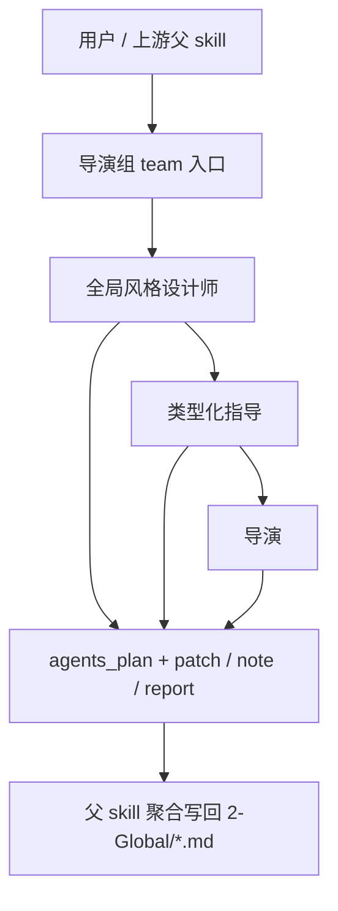

# AIGC 导演组

## 0. 目的

导演组队列是 `./.agents/skills/aigc/2-Global` 的 subagents 编排面，负责把导演前置阶段拆成三个稳定角色，让父 skill 能聚合 `agents_plan + patch / note / report`，但不拥有最终写回权。

本组的唯一 canonical writeback 仍由父 skill `./.agents/skills/aigc/2-Global/SKILL.md` 持有。

## 1. 入口拓扑

### 默认路由

1. 父 skill 先判断本轮是否需要刷新项目级风格底座。
2. 若风格底座缺失或变化明显，先进入 `全局风格设计师`。
3. `类型化指导` 默认消费风格底座和当前集证据，再形成项目级类型协议。
4. `导演` 最后读取当前集分组结果，只为 `导演意图.md` 生成 episode/group 级 patch。
5. 单点直达时，只命中对应角色，不补空路径。
6. 无论当前是顺序 tranche 还是单点直达，默认都走后台 subagents 模式；只有显式需要人工拍板风格候选或补前台证据时，父 skill 才前台阻塞。

## 2. 共享输入合同

所有角色共用以下输入：

- 用户目标、项目名、当前集数、约束、偏好
- `projects/<项目名>/0-Init/north_star.yaml`
- `projects/<项目名>/0-Init/init_handoff.yaml`
- `projects/<项目名>/1-Planning/3-分组/第N集.md`
- `projects/<项目名>/1-Planning/3-分组/执行报告.md`（若存在）
- `projects/<项目名>/2-Global/*.md`（若已存在）
- `.codex/agents/aigc/导演组/_shared/CREATIVE_METHOD.md`

## 3. 共享创作方法真源

导演组的高质量创作方法统一收口到：

- `.codex/agents/aigc/导演组/_shared/CREATIVE_METHOD.md`

硬规则：

1. 三个角色都必须先按共享方法合同完成证据分层、决策顺序与质量门禁，再返回自己的 `agents_plan + patch / note / report`。
2. 角色文档只写 role delta，不再各自平行复制完整创作方法。
3. 若共享方法合同与单个角色文档发生冲突，以共享方法真源优先，再由父 skill 裁决。

## 4. 共享输出合同

允许输出：

- `agents_plan`
- `patch`
- `note`
- `report`

禁止输出：

- 直接写 canonical 产物文件
- 替父 skill 宣布阶段完成
- 为未命中的角色补占位内容
- 越权创建 `projects/<项目名>/3-Detail/第N集.json`

## 5. 共享越权禁令

1. 任何角色都不得直接写回 `projects/<项目名>/2-Global/*.md`。
2. 任何角色都不得把自己的局部判断升级成最终结论。
3. 任何角色都不得重定义父 skill 的阶段边界、落点或验收口径。
4. 任何角色都不得把未执行的子角色写成“理论已完成”。

## 6. 共享审计要求

每次调用都必须自检：

- 输入合同是否完整
- 当前命中的角色是否唯一
- 输出是否仍停留在 `agents_plan + patch / note / report`
- handoff target 是否明确回指父 skill
- 是否存在项目级文档被 episode 内容污染
- 是否按共享方法合同完成证据优先级、质量门禁与退化判断

## 7. 交接目标

所有角色的最终交接目标都回到父 skill：

- 父级主合同：`./.agents/skills/aigc/2-Global/SKILL.md`
- 父级经验层：`./.agents/skills/aigc/2-Global/CONTEXT.md`
- 父级产物落盘由父 skill 决定，导演组只提供局部增量

## 8. 角色注册表

| 角色 | 默认类型 | 进入条件 | 默认输出 |
| --- | --- | --- | --- |
| `全局风格设计师` | specialist | 缺项目级风格底座，或风格约束有显著变化 | `agents_plan + patch + note + report` |
| `类型化指导` | specialist | 缺类型协议，或题材/风格定位有变化 | `agents_plan + patch + note + report` |
| `导演` | planner | 当前集分组已稳定，需要按组生成导演构思 | `agents_plan + patch + note + report` |
