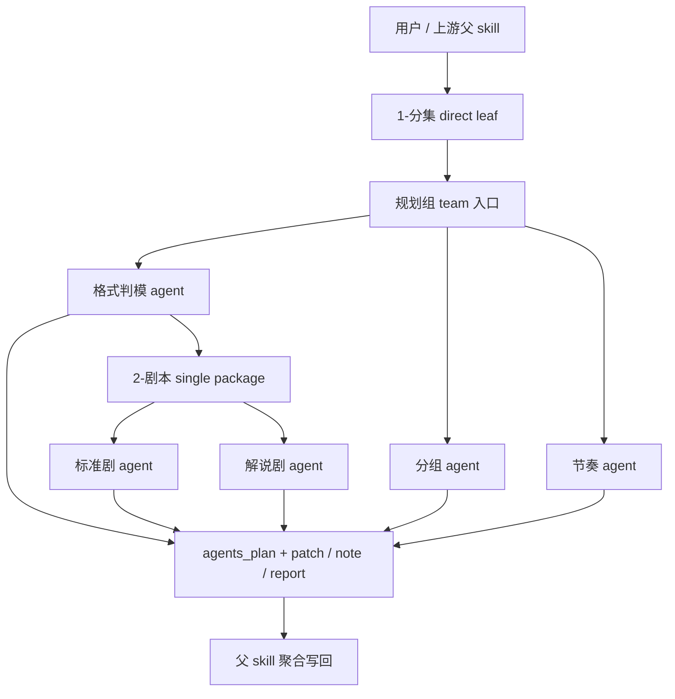

# AIGC 规划组

## 0. 身份定位

规划组是 `./.agents/skills/aigc/1-Planning` 的 subagent 编排层，不是第二个规划主稿入口，也不是阶段最终写回执行面。

它的价值不在于“每个角色都能各写一份规划”，而在于承接 `1-分集` 之后的高分叉判断单元，让父 skill 能按既定 tranche 聚合 `agents_plan + patch / note / report`，再统一写回 canonical 产物。

## 1. 组级目标

### Primary Goals

- 让 `1-分集 -> 格式判模 -> 2-剧本 -> 分组 -> 节奏` 这条链路中需要编排的高分叉判断都有明确角色承担，但不产生平行真相。
- 提高各角色输出的可聚合性、可解释性与抗漂移性，减少父 skill 二次猜测。
- 将格式判断、组边界、节奏建议等高分叉决策压成 `agents plan + 结构化 patch`，而不是松散长文。

### Done Criteria

- 当前轮次的 `selected_agents[]` 清楚且可追溯。
- 命中角色只解决本轮最需要的规划缺口，不补空路径、不越权扩写。
- 每个角色输出都能说明：解决了什么、没解决什么、交给父 skill 什么。
- 父 skill 能据此完成唯一写回，不需要把 agent 输出重新翻译一遍。

### Non-Goals

- 不让规划组 agents 各自写完整规划主稿。
- 不绕过父 skill 直接宣布 `1-Planning` 完成。
- 不把未命中角色的内容补成理论完整路径。
- 不把 sidecar、说明文或 reasoning 冒充 canonical 产物。

## 2. 入口拓扑

### 2.1 Shared Dispatch Plane Only (Mandatory)

本 `team.md` 是 `1-Planning` 的 shared dispatch plane，不是各个阶段子路径的第二份局部父合同。

硬规则：

1. `1-Planning` 父 skill 持有整条规划链的总拓扑与最终收束。
2. 各阶段子路径的 stage-local topology 只由对应 stage skill 持有。
3. 对 `3-分组` 来说：
   - 组边界量化规则真源在 `.agents/skills/aigc/1-Planning/3-分组/SKILL.md`
   - 完整方法论真源在 `3-分组/references/scene-order-duration-strategy.md`
   - 计算真源在 `3-分组/scripts/grouping_quantizer.py`
4. planning team 只负责共享 roster、共享 handoff matrix 与后台派发，不重复持有 stage-local 算法与 validator 规则。

## 3. 共享工作流

1. 父 skill 先判断本轮是全链规划还是单点直达。
2. 若是全链规划，默认顺序为 `1-分集(直达 leaf) -> 格式判模 -> 2-剧本 -> 分组`。
3. 命中 `格式判模` 后，进入 `.agents/skills/aigc/1-Planning/2-剧本/SKILL.md` 的单包收束层，再在 `标准剧` 与 `解说剧` 之间做互斥叶子路由；只有用户显式要求双案对照时，才允许并行产出双案 patch。
4. `节奏` 只有在用户显式要求、或 `original_adherence=false` 且分组已稳定时才进入。
5. 单点直达时，只命中对应 team 角色，不补空路径，不伪造全链完成。
6. 无论当前是全链串行、双案对照并行还是单点直达，默认都走后台 subagents 模式；只有显式补事实或人工裁决节点才前台阻塞。

## 4. 共享决策原则

1. 优先服务 canonical 写回最短路径，而不是服务“内容看起来饱满”。
2. 角色只处理自己拥有的判断类型，不跨层抢判。
3. 严格区分 `confirmed / inferred / source-bound / unknown`，不得把推断伪装成事实。
4. 涉及格式、分组、节奏等高分叉决策时，必须给出触发信号与放弃其他路径的理由。
5. 当输入不足以稳定推进时，优先返回阻塞与缺口，不靠文学化展开掩盖缺信息。

## 5. 共享输入合同

所有角色共用以下输入：

- 用户目标、项目名、约束、偏好
- `projects/<项目名>/0-Init/north_star.yaml`
- `projects/<项目名>/0-Init/init_handoff.yaml`
- `projects/<项目名>/Story/` 相关内容
- `projects/<项目名>/0-Init/story-source-manifest.yaml`（若存在）
- 命中 `2-剧本` 时，额外读取 `projects/<项目名>/1-Planning/1-分集/第N集.md` 与 `.agents/skills/aigc/1-Planning/2-剧本/SKILL.md`
- 父 skill 已产出的规划主稿或中间 patch
- 需要时读取 `projects/<项目名>/team.yaml` 与父级顾问团状态

## 6. 共享输出合同

允许输出：

- `agents_plan`：给父 skill 或 leaf skill 消费的代理思考计划、候选路径与裁决摘要
- `patch`：对父 skill 可直接吸收的局部增量
- `note`：判定理由、边界说明、返工提示
- `report`：审计结论、风险清单、handoff summary

输出必须同时满足：

- 明确 handoff target，默认回指父 skill
- 能指出作用文件、字段或阶段边界
- 能区分确认事实、结构化推断和待补证项
- 不以“完整长文”替代结构化增量
- `agents_plan` 只能作为思考/规划证据，不得冒充 canonical 产物

禁止输出：

- 直接写 canonical 产物文件
- 替父 skill 宣布阶段完成
- 为未命中的角色补占位内容
- 把 sidecar 伪装成主稿

### 6.1 Shared Handoff Matrix (Mandatory)

| 角色 | ingress_brief | minimum_return | canonical_owner |
| --- | --- | --- | --- |
| `格式判模` | `mission_brief + context_packet_format` | `agents_plan + patch + note + report` | 父 `1-Planning` 或命中的 stage skill |
| `标准剧 / 解说剧` | `subagent_brief_script_variant` | `agents_plan + patch + note` | `2-剧本` 父 skill |
| `分组` | `subagent_brief_grouping + context_packet_grouping` | `agents_plan + patch + note + report` | `3-分组` 父 skill |
| `节奏` | `subagent_brief_rhythm + evidence_context` | `agents_plan + patch + note + report` | 父 `1-Planning` 或命中的 stage skill |

附加约束：

- `分组` 角色的 authoritative 数值字段由 `3-分组` 父 skill 的 quantizer 生成，角色只返回边界建议、锁轴判断与风险说明。
- `节奏` 作为 reviewer 时只做 review / veto / note，不接管 `3-分组` 的 stage-local writeback。

## 7. 共享回退与升级

### Fallback

- 若输入不足以支撑稳定判断，返回 `report` 指出缺失字段、缺失文件或缺失上游步骤，而不是继续脑补。
- 若 evidence 冲突，保留冲突来源并返回 `note / report`，不私自拍板为唯一真相。
- 若角色发现当前任务实际依赖未完成的上游角色，必须停止本轮生成并上返父 skill。

### Escalation

- 涉及阶段边界、canonical 路径、validator 口径、双案是否并行等高杠杆问题，统一升级给父 skill。
- 涉及格式主变体、节奏重排授权等高分叉问题，若用户信号不足，必须显式留给父 skill 或用户裁决。

## 8. 共享质量门

每次调用都必须自检：

- 输入合同是否完整
- 当前命中的角色是否唯一
- 输出是否仍停留在 `agents_plan + patch / note / report`
- handoff target 是否明确回指父 skill
- 是否存在越权写回、重复真源、字段漂移或空占位
- 是否给出了清晰的停止条件、下一步或返工入口

若自检失败，优先返回 `report`，说明阻塞点与需修复的规则层。

## 9. 交接目标

所有角色的最终交接目标都回到父 skill：

- 父级主合同：`./.agents/skills/aigc/1-Planning/SKILL.md`
- 父级经验层：`./.agents/skills/aigc/1-Planning/CONTEXT.md`
- 父级产物落盘由父 skill 决定，规划组只提供可吸收的局部增量

## 10. 角色注册表

| 角色 | 默认类型 | 进入条件 | 核心价值 | 默认输出 |
| --- | --- | --- | --- | --- |
| `格式判模` | planner | 需要裁决格式变体、字段骨架与保真约束 | 决定主变体与字段骨架，防止下游格式漂移 | `agents_plan + patch + note + report` |
| `标准剧` | specialist | `格式判模` 终裁为 `标准剧` 或默认表演优先 | 产出表演优先、旁白克制的格式 patch | `agents_plan + patch + note` |
| `解说剧` | specialist | `格式判模` 终裁为 `解说剧` 或显式要求对照案 | 产出旁白主导、对白保真的格式 patch | `agents_plan + patch + note` |
| `分组` | specialist | 需要组级边界、锚点、依赖和量化摘要 | 把逐集主稿压成稳定组结构与 handoff | `agents_plan + patch + note + report` |
| `节奏` | reviewer | 用户显式追加节奏，且分组稳定、允许重排 | 评估节奏驱动、峰值与重排边界 | `agents_plan + patch + note + report` |
