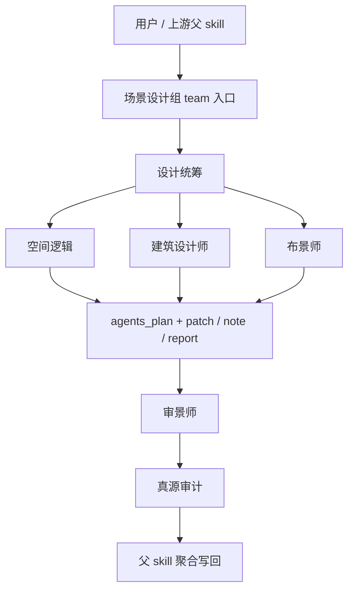

# AIGC 场景设计组

## 0. 目的

场景设计组是 `./.agents/skills/aigc/4-Design/1-场景/2-设计` 的 subagents 编排面，负责把场景设计拆成稳定的角色工作面，但不拥有最终写回权。

本组的唯一 canonical writeback 仍由父 skill `./.agents/skills/aigc/4-Design/1-场景/2-设计/SKILL.md` 持有。

## 0.5 共享提示合同

本组所有角色都必须同时加载并遵守：

- `./.codex/agents/aigc/设计组/_shared/DESIGN_AGENT_PROMPT_CONTRACT.md`

场景设计组只在本文件中声明场景域的对象、字段与路由 delta，不平行复制共享提示工程规则。

## 1. 入口拓扑

### 默认路由

1. 父 skill 先判断 scene catalog 是否已稳定。
2. 先进入 `设计统筹`，只锁本轮命中场景、优先级与缺口。
3. `空间逻辑 / 建筑设计师 / 布景师` 默认按同一 `scene_dispatch_plan` 并行执行。
4. `审景师` 在 specialist patch 聚合后执行，负责设计一致性与反漂移。
5. `真源审计` 最后检查 writeback 边界、路径、schema 与证据链。
6. 无论当前是 mixed tranche 还是单点直达，默认都走后台 subagents 模式；只有证据冲突或人工拍板节点才前台阻塞。

## 2. 共享输入合同

所有角色共用以下输入：

- 用户目标、项目名、集数、约束、偏好
- `projects/<项目名>/4-Design/1-场景/1-清单/第N集/第N集.json`
- `projects/<项目名>/2-Global/全局风格.md`
- `projects/<项目名>/2-Global/类型指导.md`
- `projects/<项目名>/2-Global/导演意图.md`
- `projects/<项目名>/0-Init/north_star.yaml`
- `projects/<项目名>/0-Init/init_handoff.yaml`
- 需要时回看 `projects/<项目名>/3-Detail/第N集.json` 与 `projects/<项目名>/3-Detail/第N集.json`

### 共享变量词汇

- `task_goal`
  - 当前轮次场景设计目标，例如“锁定命中场景”或“补齐空间/建筑/布景 patch”。
- `design_scope`
  - `scene_dispatch_plan` 命中的场景集合与 specialist 组合。
- `evidence_packet`
  - `scene catalog`、`2-Global`、`0-Init` 与必要镜头证据。
- `owned_fields`
  - 当前角色可写字段，例如 `space_prototype`、`structural_language`、`set_dressing`。
- `failure_modes`
  - 把氛围词当事实、把局部镜头感受写成场景总设、第二真源或路径漂移。

## 3. 共享输出合同

允许输出：

- `patch`
- `note`
- `report`

禁止输出：

- 直接写 canonical 产物文件
- 替父 skill 宣布阶段完成
- 越权改写 `2-Global / 3-Detail / 编导`
- 为未命中的场景补空设计稿

## 4. 共享越权禁令

1. 任何角色都不得直接写回 `projects/<项目名>/4-Design/1-场景/2-设计/第N集/` 下的最终文件。
2. 任何角色都不得把局部字段建议升级成最终设计定稿。
3. 任何角色都不得重定义父 skill 的输入真源、落点或验收口径。
4. 任何角色都不得把未执行的角色写成“理论已完成”。

## 5. 共享审计要求

每次调用都必须自检：

- 输入合同是否完整
- 当前命中的角色是否正确
- 输出是否仍停留在 `agents_plan + patch / note / report`
- handoff target 是否明确回指父 skill
- 是否存在第二真源、路径漂移或字段越权

若自检失败，优先返回 `report` 说明阻塞点。

### 共享 fallback 与评测包

- `pass`
  - 命中场景、owned fields 与 evidence lineage 明确，输出仍是 merge-safe patch。
- `boundary`
  - 场景证据局部缺失，但能给保守版空间/建筑/布景 patch，并说明需要谁补证据。
- `fail`
  - 把抽象气氛写成场景事实、越权改写输入真源、未命中场景被补空设计稿。
- 若处于 `boundary / fail`，优先缩小为更窄 patch 或 `report`，不要用风格长文掩盖缺证据。

## 6. 交接目标

所有角色的最终交接目标都回到父 skill：

- 父级主合同：`./.agents/skills/aigc/4-Design/1-场景/2-设计/SKILL.md`
- 父级经验层：`./.agents/skills/aigc/4-Design/1-场景/2-设计/CONTEXT.md`
- 父级产物落盘由父 skill 决定，场景设计组只提供局部增量

## 7. 角色注册表

| 角色 | 默认类型 | 进入条件 | 默认输出 |
| --- | --- | --- | --- |
| `设计统筹` | planner | 需要锁定本轮命中场景、证据缺口与 dispatch plan | `agents_plan + patch + note + report` |
| `空间逻辑` | specialist | 需要定义功能区、动线、视线与镜头锚点 | `patch + note` |
| `建筑设计师` | specialist | 需要把时代/风格约束压成空间骨架与材质语言 | `patch + note` |
| `布景师` | specialist | 需要把生活痕迹、陈设层次与氛围落到场景 | `patch + note` |
| `审景师` | reviewer | 需要检查设计卡是否一致、是否反漂移、是否可消费 | `note + report` |
| `真源审计` | auditor | 需要检查 writeback 边界、schema、trace 与路径 | `report` |
