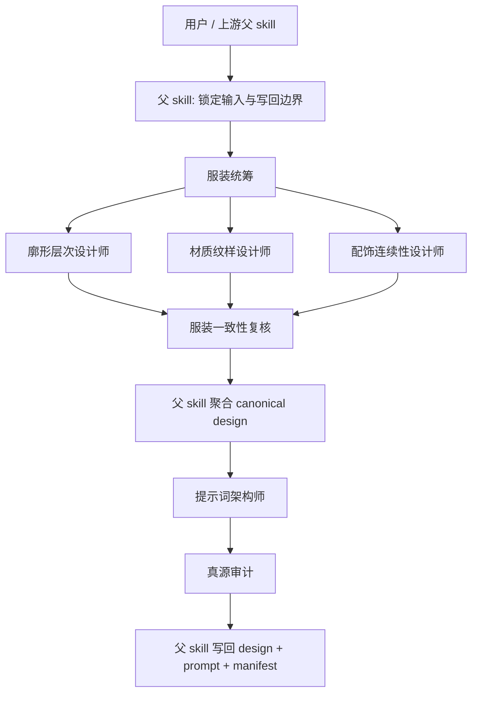

# AIGC 设计组 / 服装设计

## 0. 目的

服装设计组是 `./.agents/skills/aigc/4-Design/3-服装/2-设计` 的 subagents 编排面，负责把服装 bridge 收束成 design master、prompt sidecar 与审计结果，但不拥有最终写回权。

## 0.5 共享提示合同

本组所有角色都必须同时加载并遵守：

- `./.codex/agents/aigc/设计组/_shared/DESIGN_AGENT_PROMPT_CONTRACT.md`

服装设计组只在本文件中补充服装域 bridge、design master 与 prompt sidecar 的局部 delta。

## 1. 入口拓扑

## 2. 共享输入合同

所有角色共用以下输入：

- 用户目标、项目名、当前集数、约束、偏好
- 父 skill 整理后的 `mission_brief_costume_design`
- `projects/<项目名>/4-Design/3-服装/1-清单/第N集/costume_design_bridge.json`
- `projects/<项目名>/4-Design/3-服装/1-清单/第N集/服装研究.json`
- `projects/<项目名>/4-Design/3-服装/1-清单/第N集/服装清单.json`
- `projects/<项目名>/3-Detail/第N集.json`
- `projects/<项目名>/4-Design/2-角色/2-设计/第N集/character_design.json`（若存在）
- `projects/<项目名>/2-Global/全局风格.md`、`类型指导.md`

### 共享变量词汇

- `task_goal`
  - 当前轮次服装目标，例如“锁定命中 costume”或“将 canonical facts 翻译为 prompt sidecar”。
- `design_scope`
  - `selected_costumes[]`、命中的 specialist 与 prompt architect 进入条件。
- `evidence_packet`
  - bridge、研究、清单、角色设计与全局风格约束。
- `owned_fields`
  - 当前角色拥有的服装事实字段，或 sidecar 中的 prompt 字段。
- `truth_boundary`
  - `服装设计.json` 是 canonical truth，`costume_design_prompt.json` 是派生 sidecar。
- `failure_modes`
  - 角色主体被服装事实吞掉、prompt 倒灌、材质/廓形/配饰互相越权。

## 3. 共享输出合同

允许输出：

- `patch`
- `note`
- `report`

禁止输出：

- 直接写 canonical JSON 文件
- 改写 `1-清单`、`2-角色/2-设计` 或 `编导` 真源
- 把 prompt 文案写成 design facts
- 为未命中的服装补占位内容

## 4. 共享越权禁令

1. 任何角色都不得直接写回 `projects/<项目名>/4-Design/3-服装/2-设计/第N集/*.json`。
2. 任何角色都不得修改父 skill 的 path normalization 规则。
3. 任何角色都不得把自己的局部判断升级成最终真源。
4. 任何角色都不得把角色形象主体重新定义成服装事实。

## 5. 共享审计要求

每次调用都必须自检：

- 输入合同是否完整
- 输出是否仍停留在 `agents_plan + patch / note / report`
- handoff target 是否明确回指父 skill
- canonical truth 与 prompt sidecar 是否分层
- 是否出现错位路径、事实越权或 prompt 漂移

### 共享 fallback 与评测包

- `pass`
  - 命中 costume 明确，design facts 与 prompt sidecar 分层清楚，输出仍是 patch-safe。
- `boundary`
  - design facts 基本稳定，但个别字段证据不足；允许输出保守版 patch，并在 `note` 中写明压缩策略。
- `fail`
  - 把 prompt 文案写成服装事实、把未命中 costume 补全、改写父 skill 的路径或 truth boundary。
- prompt architect 若收到不稳定的 canonical facts，默认返回 `report` 或只写最小 sidecar patch，不得自行补世界观设定。

## 6. 交接目标

所有角色的最终交接目标都回到父 skill：

- 父级主合同：`./.agents/skills/aigc/4-Design/3-服装/2-设计/SKILL.md`
- 父级经验层：`./.agents/skills/aigc/4-Design/3-服装/2-设计/CONTEXT.md`

## 7. 角色注册表

| 角色 | 默认类型 | 进入条件 | 默认输出 |
| --- | --- | --- | --- |
| `服装统筹` | planner | 需要锁定本轮命中服装、证据缺口与 dispatch plan | `agents_plan + patch + note + report` |
| `廓形层次设计师` | specialist | 需要收束 silhouette、layering 与动作适配 | `agents_plan + patch + note + report` |
| `材质纹样设计师` | specialist | 需要收束 fabric、pattern、color script 与 finish | `agents_plan + patch + note + report` |
| `配饰连续性设计师` | specialist | 需要收束 accessory、continuity、负面禁区与场景/道具兼容 | `agents_plan + patch + note + report` |
| `提示词架构师` | specialist | canonical design facts 已稳定，需要生成 prompt sidecar | `agents_plan + patch + note + report` |
| `服装一致性复核` | reviewer | design sections 已生成，需要检查同一 costume identity 是否收束 | `note + report` |
| `真源审计` | auditor | design master 或 prompt sidecar 已生成，需要检查 coverage 与 drift | `report` |
