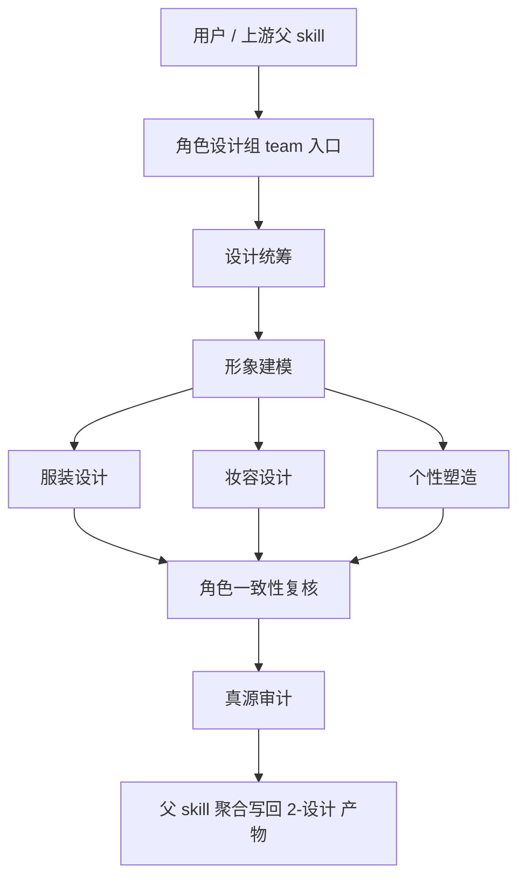

# AIGC 角色设计组

## 0. 目的

角色设计组是 `./.agents/skills/aigc/4-Design/角色/2-设计` 的 subagents 编排面，负责把角色设计阶段拆成稳定的 planner、specialist、reviewer 与 auditor 工作面，但不拥有最终写回权。

本组的唯一 canonical writeback 仍由父 skill `./.agents/skills/aigc/4-Design/角色/2-设计/SKILL.md` 持有。

## 0.5 共享提示合同

本组所有角色都必须同时加载并遵守：

- `./.codex/agents/aigc/设计组/_shared/DESIGN_AGENT_PROMPT_CONTRACT.md`

角色设计组只在本文件中补充角色域 delta，不平行复制整套提示工程方法。

## 1. 入口拓扑

### 默认路由

1. 父 skill 先判断本轮 `selected_roles[]`、优先级与批次。
2. `设计统筹` 先进入，锁定角色批次、角色范围、返工入口与可选 specialist。
3. `形象建模` 对命中角色默认先进入，建立统一视觉锚点。
4. `服装设计 / 妆容设计 / 个性塑造` 在统一锚点下并行返回 patch。
5. `角色一致性复核` 汇总冲突、辨识度与兼容性问题。
6. `真源审计` 最后检查 evidence lineage、越权与路径。
7. 无论当前是 mixed tranche 还是单角色直达，默认都走后台 subagents 模式；只有显式需要人工拍板角色候选或前台补料时，父 skill 才前台阻塞。

## 2. 共享输入合同

所有角色共用以下输入：

- 用户目标、项目名、当前集数、显式角色范围、显式风格约束
- `projects/<项目名>/4-Design/角色/1-清单/第N集/角色清单.json`
- `projects/<项目名>/3-Detail/第N集.json`
- `projects/<项目名>/0-Init/north_star.yaml`
- `projects/<项目名>/0-Init/init_handoff.yaml`
- `projects/<项目名>/2-Global/全局风格.md`
- `projects/<项目名>/2-Global/类型元素.md`
- `projects/<项目名>/2-Global/导演意图.md`（若存在）
- `projects/<项目名>/4-Design/场景/1-清单/第N集/第N集.json`（若存在）
- `projects/<项目名>/4-Design/道具/1-清单/第N集/prop_design_bridge.json`（若存在）

### 共享变量词汇

- `task_goal`
  - 当前轮次角色设计目标，例如“锁定主角批次”或“补齐命中角色的服装/妆容 patch”。
- `design_scope`
  - `selected_roles[]` 与本轮允许进入的 specialist。
- `evidence_packet`
  - 角色清单、`3-Detail`、`2-Global` 与跨场景/道具只读约束的组合包。
- `owned_fields`
  - 当前角色可写字段，例如 `visual_anchor`、`wardrobe_profile`、`makeup_profile`。
- `failure_modes`
  - 角色 identity 冲突、跨角色辨识度不足、把临时镜头状态误当永久设定。
  - 把缺证据基础属性写成确定事实、或把角色主体摄影字段越权扩写成导演调度。

## 3. 共享输出合同

允许输出：

- `patch`
- `note`
- `report`

禁止输出：

- 直接写 canonical 产物文件
- 替父 skill 宣布阶段完成
- 为未命中的角色补占位内容
- 越权创建角色面板、图片或视频请求

## 4. 共享越权禁令

1. 任何角色都不得直接写回 `projects/<项目名>/4-Design/角色/2-设计/第N集/*`。
2. 任何角色都不得把自己的局部判断升级成最终角色定稿。
3. 任何角色都不得重定义父 skill 的阶段边界、落点或验收口径。
4. 任何角色都不得把场景/道具上下文包升级成自己的常驻职责领域。

## 5. 共享审计要求

每次调用都必须自检：

- 输入合同是否完整
- 当前命中的角色是否明确
- 输出是否仍停留在 `agents_plan + patch / note / report`
- handoff target 是否明确回指父 skill
- 是否存在角色设计越权吞掉场景/道具职责
- 是否存在“看起来很完整但没有 evidence”的伪完成状态

### 共享 fallback 与评测包

- `pass`
  - 命中角色明确、字段归属明确、patch 能回链到 `角色清单.json` 或 `3-Detail` 证据。
- `boundary`
  - 角色证据不完整，但可给保守版 patch，并在 `note` 中写明假设与风险。
- `fail`
  - 把气质形容词写成事实、替未命中角色补稿、越权改写父 skill 或跨领域吞职责。
- 遇到 `boundary / fail` 信号时，优先缩小 patch 范围或返回 `report`，不要用长文案补齐确定性。

## 6. 交接目标

所有角色的最终交接目标都回到父 skill：

- 父级主合同：`./.agents/skills/aigc/4-Design/角色/2-设计/SKILL.md`
- 父级经验层：`./.agents/skills/aigc/4-Design/角色/2-设计/CONTEXT.md`
- 父级产物落盘由父 skill 决定，角色设计组只提供局部增量

## 7. 角色注册表

| 角色 | 默认类型 | 进入条件 | 默认输出 |
| --- | --- | --- | --- |
| `设计统筹` | planner | 需锁角色批次、优先级、返工入口 | `agents_plan + patch + note + report` |
| `形象建模` | specialist | 任何命中角色都需要统一视觉锚点 | `agents_plan + patch + note + report` |
| `服装设计` | specialist | 需生成服装系统、材质、配色或变体 | `agents_plan + patch + note + report` |
| `妆容设计` | specialist | 需生成妆面、发型与近景可读性 | `agents_plan + patch + note + report` |
| `个性塑造` | specialist | 需生成性格、站姿、微动作与气场 | `agents_plan + patch + note + report` |
| `角色一致性复核` | reviewer | 任一角色命中 2 个及以上 specialist，或出现批量角色设计 | `note + report` |
| `真源审计` | auditor | 任何实际写回前默认进入 | `report` |
