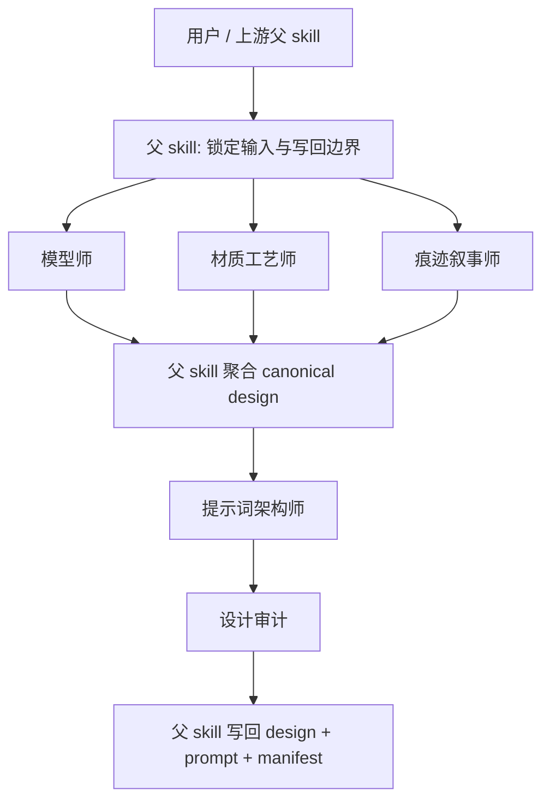

# AIGC 设计组 / 道具设计

## 0. 目的

道具设计组是 `./.agents/skills/aigc/4-Design/4-道具/2-设计` 的 subagents 编排面，负责把道具 bridge 收束成 design master、prompt sidecar 与审计结果，但不拥有最终写回权。

本组的唯一 canonical writeback 仍由父 skill `./.agents/skills/aigc/4-Design/4-道具/2-设计/SKILL.md` 持有。

## 0.5 共享提示合同

本组所有角色都必须同时加载并遵守：

- `./.codex/agents/aigc/设计组/_shared/DESIGN_AGENT_PROMPT_CONTRACT.md`

道具设计组只在本文件中补充道具域的 structure/material/wear/prompt delta，不平行复制共享提示方法。

## 1. 入口拓扑

### 默认路由

1. 父 skill 先校验 `bridge / research / detail` 是否完整。
2. `模型师`、`材质工艺师`、`痕迹叙事师` 默认在同一 tranche 并行执行。
3. 父 skill 先把三类 patch 聚合为 canonical `道具设计.json`。
4. `提示词架构师` 只能在 canonical design facts 已稳定后进入。
5. `设计审计` 最后检查 coverage、drift 和 path normalization。
6. 无论当前是并行 specialists 还是单点 prompt/audit，默认都走后台 subagents 模式；只有显式共创或 evidence 缺口需要人工补料时才前台阻塞。

## 2. 共享输入合同

所有角色共用以下输入：

- 用户目标、项目名、当前集数、约束、偏好
- 父 skill 整理后的 `mission_brief_prop_design`
- `projects/<项目名>/4-Design/4-道具/1-清单/第N集/prop_design_bridge.json`
- `projects/<项目名>/4-Design/4-道具/1-清单/第N集/道具研究.json`
- `projects/<项目名>/3-Detail/第N集.json`
- `projects/<项目名>/2-Global/全局风格.md`（若存在）
- `projects/<项目名>/2-Global/类型指导.md`（若存在）
- `projects/<项目名>/0-Init/north_star.yaml`、`init_handoff.yaml`（若存在）

### 共享变量词汇

- `task_goal`
  - 当前轮次道具目标，例如“收束结构/材质/痕迹 patch”或“生成 prompt sidecar”。
- `design_scope`
  - 当前命中的 props、specialists 与 prompt architect 进入条件。
- `evidence_packet`
  - bridge、研究、detail、全局风格与初始化约束。
- `owned_fields`
  - 当前角色可写的结构、材质、痕迹或 prompt 字段。
- `truth_boundary`
  - `道具设计.json` 是 canonical truth，`prop_design_prompt.json` 是派生 sidecar。
- `failure_modes`
  - 把抽象风格词或长 prompt 倒灌为事实、虚构复杂结构、路径未归一。

## 3. 共享输出合同

允许输出：

- `patch`
- `note`
- `report`

禁止输出：

- 直接写 canonical JSON 文件
- 改写 `1-清单` 或 `3-Detail` 真源
- 把 prompt 文案写成 design facts
- 为未命中的角色补占位内容

## 4. 共享越权禁令

1. 任何角色都不得直接写回 `projects/<项目名>/4-Design/4-道具/2-设计/第N集/*.json`。
2. 任何角色都不得修改父 skill 的 path normalization 规则。
3. 任何角色都不得把自己的局部判断升级成最终真源。
4. 任何角色都不得把长 prompt 反向当成设计事实。

## 5. 共享审计要求

每次调用都必须自检：

- 输入合同是否完整
- 输出是否仍停留在 `agents_plan + patch / note / report`
- handoff target 是否明确回指父 skill
- canonical truth 与 prompt sidecar 是否分层
- 是否出现错位路径未归一、事实越权或 prompt 漂移

### 共享 fallback 与评测包

- `pass`
  - 命中 prop 明确、字段归属明确、设计事实与 sidecar 分层稳定。
- `boundary`
  - 道具事实大体稳定，但局部证据不足；允许返回保守 patch，并说明哪些字段仍需补证据。
- `fail`
  - 把 prompt 结果写回 business truth、凭空补结构、未命中对象被补稿、路径归一失效。
- prompt architect 若收到仍会变动的 canonical design，必须停在最小 sidecar patch 或 `report`，不得擅自补完设定。

## 6. 交接目标

所有角色的最终交接目标都回到父 skill：

- 父级主合同：`./.agents/skills/aigc/4-Design/4-道具/2-设计/SKILL.md`
- 父级经验层：`./.agents/skills/aigc/4-Design/4-道具/2-设计/CONTEXT.md`

## 7. 角色注册表

| 角色 | 默认类型 | 进入条件 | 默认输出 |
| --- | --- | --- | --- |
| `模型师` | specialist | bridge 已存在，需要收束结构、轮廓、功能骨架 | `agents_plan + patch + note + report` |
| `材质工艺师` | specialist | bridge 已存在，需要收束材质、表面工艺与色板提示 | `agents_plan + patch + note + report` |
| `痕迹叙事师` | specialist | bridge 已存在，需要收束磨损、状态与 continuity rule | `agents_plan + patch + note + report` |
| `提示词架构师` | specialist | canonical design facts 已稳定，需要生成 prompt sidecar | `agents_plan + patch + note + report` |
| `设计审计` | auditor | design master 或 prompt sidecar 已生成，需要检查 coverage 与 drift | `note + report` |
