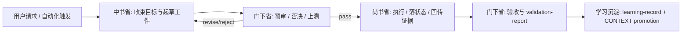

# Harness Office Governance Contract

本文件是 `中书省 / 门下省 / 尚书省` 共享的治理真源，用于承载跨 office 的统一约束、上溯链、移交流程与闭环格式。

## Purpose

- 统一三省对任务工件、状态面、验证闭环和上溯机制的理解。
- 防止 sibling agent 文档各自演化为第二真源。
- 让审计脚本可以校验“合同是否存在”，而不是只校验“文件是否存在”。

## Canonical Priority

1. 用户显式请求
2. 根 `AGENTS.md`
3. 本共享合同
4. office-specific agent 文档
5. `CONTEXT.md`、报告与任务态工件

## Canonical Carriers

| carrier | role | notes |
| --- | --- | --- |
| `AGENTS.md` | 宪章层治理与硬门槛 | 定义 Root-Cause First、真源治理、闭环格式 |
| `.codex/runbooks/task-lifecycle.md` | 生命周期真源 | 定义 `受命 -> 起草 -> 预审 -> 执行 -> 验收 -> 沉淀` |
| `.codex/registry/routes.yaml` | 路由真源 | 定义 owner chain、默认流转与 legacy mapping |
| `.codex/registry/skills.yaml` | 能力注册真源 | 新增 skill / workflow 时必须核对是否已注册 |
| `.codex/templates/harness/*.yaml|*.md` | 任务工件真源 | mandate / brief / route / verdict / validation / learning |
| `/Users/vincentlee/.codex/skills/meta/构建/技能/skill-2.0` | Skill 2.0 元技能真源 | 创建、升级、修复或审计长期维护 skill 时，按 runtime-spine 版 Skill 2.0 执行 |
| `projects/aigc/<项目名>/` | AIGC 项目运行时真源 | 对 `aigc` 项目工作流，任务工件、项目状态、验收与学习记录以此为准 |
| `.codex/state/tasks/<task_id>/` | 治理镜像 / 通用任务状态面 | 非项目任务的默认状态面；对 `aigc` 项目工作流仅作可选治理镜像，不覆盖 `projects/aigc/<项目名>/` |

## Shared Entry Gates

- 复杂任务：必须已有或即将产出 `mandate.yaml + mission-brief.yaml + route-plan.yaml`
- 高风险任务：不得跳过 `preflight-verdict.yaml`
- 任何任务：不得在没有 `validation-report.md` 时宣布完成
- 非平凡失败：不得绕过 `Symptom -> Direct Cause -> Rule Source -> Meta Rule Source`
- 新增 skill / workflow / 继承映射：不得绕过 `registry` 与 `state` 载体
- 新增、升级、修复或审计长期维护 skill：不得绕过 Skill 2.0 runtime-spine 基线；必须先检查 `SKILL.md` 主脊柱，再检查 `Type Routing Matrix.module_load`、`Module Loading Matrix`、`Convergence Contract` 与被授权模块是否可互相解析
- 若工作流已声明 canonical runtime，不得再用镜像状态面反向覆盖主真源

## Shared Workflow

## Layered Trace Contract

出现阻塞、失败、返工或高风险不确定性时，三省都必须使用以下同一条分层上溯链：

`Symptom/Failure -> Direct Technical Cause -> Rule Source -> Meta Rule Source -> Fix Landing Points`

最小要求：

- `Symptom/Failure`: 当前观察到的失败或阻塞现象
- `Direct Technical Cause`: 直接技术原因或流程缺口
- `Rule Source`: 触发该行为的局部规则源，例如 agent 文档、runbook、template、script gate
- `Meta Rule Source`: 更上层治理源，例如根 `AGENTS.md`
- `Fix Landing Points`: 立即修复点与系统性预防落点

## Shared Handoff Contract

| from | to | required handoff payload |
| --- | --- | --- |
| 中书省 | 门下省 | `mandate.yaml`、`mission-brief.yaml`、`route-plan.yaml`、风险与回退条件 |
| 门下省 | 尚书省 | `preflight-verdict.yaml`、批准范围、阻塞项、rollback watchpoints |
| 尚书省 | 门下省 | canonical runtime 路径、执行证据、产物索引、异常记录 |
| 门下省 | 学习沉淀层 | `validation-report.md`、`learning-record.md`、promotion 决策 |

## Closure Contract

每个 office 在结束自己的阶段前，都必须显式确认以下三项：

- `root cause location`
- `immediate fix`
- `systemic prevention fix`

若为正向沉淀，则替换为：

- `success pattern location`
- `extracted heuristic`
- `promotion scope`

## Anti-Drift Rules

- office-specific agent 文档只写本 office 的职责差异，不重复抄写共享总则。
- 共享结构若被 2 个以上 office 需要，优先回收至本文件或其他单一真源载体。
- 模板字段新增后，相关 office agent 文档与审计脚本必须同步更新。
- 审计脚本至少应验证共享真源引用和关键合同锚点存在。
- 若某工作流采用项目内 runtime（如 `projects/aigc/<项目名>/`），registry、runbook、audit 与根技能必须同步声明，不得只在 skill 文档单边出现。
